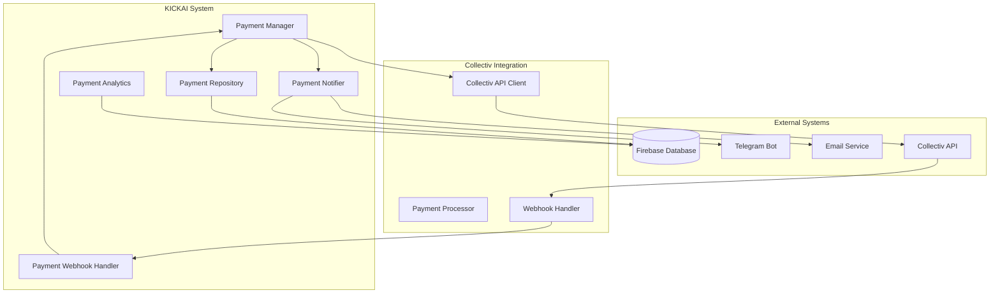
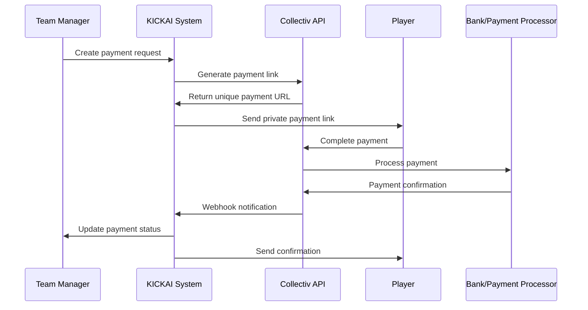
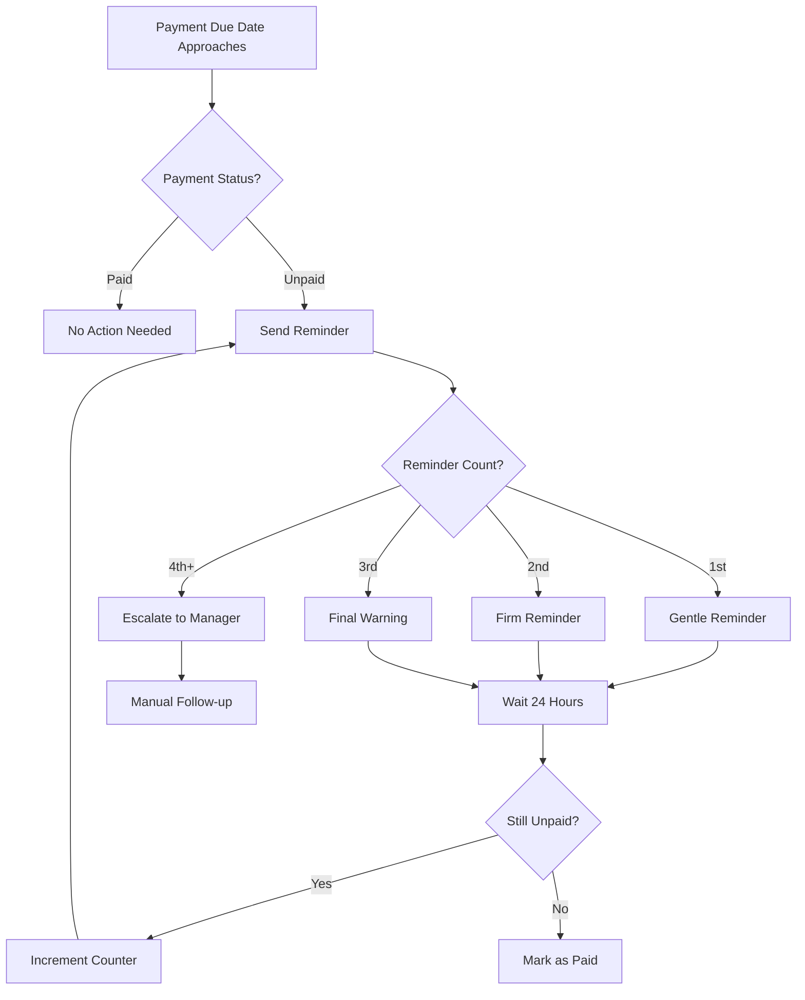

# Payment System - Collectiv Integration

## Overview

The KICKAI system integrates with the Collectiv payment platform to provide secure, automated payment processing for match fees, membership fees, fines, and miscellaneous items. This system ensures player privacy while maintaining team transparency and financial accountability.

## Payment System Architecture

### Core Components



### Payment Workflow



## Payment Types

### 1. Match Fees
- **Purpose**: Collect fees for specific matches
- **Amount**: Fixed amount per player
- **Timing**: Due before match date
- **Automation**: Linked to fixture creation

### 2. Membership Fees
- **Purpose**: Recurring team membership payments
- **Amount**: Monthly/seasonal fee
- **Timing**: Recurring on schedule
- **Automation**: Automated billing cycles

### 3. Fines
- **Purpose**: Penalty payments for rule violations
- **Amount**: Variable based on violation
- **Timing**: Due within specified period
- **Automation**: Manual creation by managers

### 4. Miscellaneous
- **Purpose**: One-off payments for various items
- **Amount**: Custom amount
- **Timing**: Flexible due dates
- **Automation**: Manual creation

## Database Schema

### Payment Requests
```sql
CREATE TABLE payment_requests (
    id UUID PRIMARY KEY,
    team_id UUID NOT NULL,
    created_by UUID NOT NULL,
    payment_type ENUM('match_fee', 'membership', 'fine', 'miscellaneous'),
    amount DECIMAL(10,2) NOT NULL,
    currency VARCHAR(3) DEFAULT 'GBP',
    description TEXT,
    due_date TIMESTAMP,
    fixture_id UUID,
    status ENUM('active', 'completed', 'cancelled'),
    created_at TIMESTAMP DEFAULT CURRENT_TIMESTAMP,
    updated_at TIMESTAMP DEFAULT CURRENT_TIMESTAMP
);
```

### Payment Links
```sql
CREATE TABLE payment_links (
    id UUID PRIMARY KEY,
    payment_request_id UUID NOT NULL,
    player_id UUID NOT NULL,
    collectiv_link_id VARCHAR(255) NOT NULL,
    payment_url TEXT NOT NULL,
    amount DECIMAL(10,2) NOT NULL,
    status ENUM('pending', 'paid', 'expired', 'cancelled'),
    paid_at TIMESTAMP,
    created_at TIMESTAMP DEFAULT CURRENT_TIMESTAMP,
    expires_at TIMESTAMP
);
```

### Payment Transactions
```sql
CREATE TABLE payment_transactions (
    id UUID PRIMARY KEY,
    payment_link_id UUID NOT NULL,
    collectiv_transaction_id VARCHAR(255) NOT NULL,
    amount DECIMAL(10,2) NOT NULL,
    currency VARCHAR(3) DEFAULT 'GBP',
    payment_method VARCHAR(50),
    status ENUM('pending', 'completed', 'failed', 'refunded'),
    transaction_data JSON,
    created_at TIMESTAMP DEFAULT CURRENT_TIMESTAMP
);
```

## API Integration

### Collectiv API Client
```python
class CollectivAPIClient:
    """Client for interacting with Collectiv payment API."""
    
    def __init__(self, api_key: str, base_url: str = "https://api.collectiv.com"):
        self.api_key = api_key
        self.base_url = base_url
        self.session = requests.Session()
        self.session.headers.update({
            'Authorization': f'Bearer {api_key}',
            'Content-Type': 'application/json'
        })
    
    async def create_payment_link(self, amount: float, currency: str, 
                                description: str, reference: str) -> Dict:
        """Create a new payment link."""
        payload = {
            'amount': amount,
            'currency': currency,
            'description': description,
            'reference': reference,
            'expires_in': 7 * 24 * 60 * 60,  # 7 days
            'webhook_url': f"{self.base_url}/webhooks/collectiv/payment"
        }
        
        response = await self.session.post(
            f"{self.base_url}/v1/payment-links",
            json=payload
        )
        response.raise_for_status()
        return response.json()
    
    async def get_payment_status(self, payment_link_id: str) -> Dict:
        """Get payment status for a link."""
        response = await self.session.get(
            f"{self.base_url}/v1/payment-links/{payment_link_id}"
        )
        response.raise_for_status()
        return response.json()
    
    async def refund_payment(self, transaction_id: str, amount: float = None) -> Dict:
        """Refund a payment."""
        payload = {'transaction_id': transaction_id}
        if amount:
            payload['amount'] = amount
        
        response = await self.session.post(
            f"{self.base_url}/v1/refunds",
            json=payload
        )
        response.raise_for_status()
        return response.json()
```

### Webhook Handler
```python
class CollectivWebhookHandler:
    """Handle webhooks from Collectiv payment system."""
    
    def __init__(self, payment_manager: PaymentManager):
        self.payment_manager = payment_manager
        self.webhook_secret = os.getenv('COLLECTIV_WEBHOOK_SECRET')
    
    async def handle_payment_webhook(self, payload: Dict, signature: str) -> bool:
        """Handle payment webhook from Collectiv."""
        try:
            # Verify webhook signature
            if not self.verify_signature(payload, signature):
                logger.error("Invalid webhook signature")
                return False
            
            event_type = payload.get('event_type')
            payment_data = payload.get('data', {})
            
            if event_type == 'payment.completed':
                await self.handle_payment_completed(payment_data)
            elif event_type == 'payment.failed':
                await self.handle_payment_failed(payment_data)
            elif event_type == 'payment.refunded':
                await self.handle_payment_refunded(payment_data)
            else:
                logger.warning(f"Unknown webhook event: {event_type}")
            
            return True
            
        except Exception as e:
            logger.error(f"Error handling webhook: {e}")
            return False
```

## Payment Manager Service

### Core Methods
```python
class PaymentManager:
    """Manages payment operations and integration with Collectiv."""
    
    def __init__(self, collectiv_client: CollectivAPIClient, 
                 payment_repository: PaymentRepository,
                 notification_service: NotificationService):
        self.collectiv_client = collectiv_client
        self.payment_repository = payment_repository
        self.notification_service = notification_service
    
    async def create_payment_request(self, payment_request: PaymentRequest) -> str:
        """Create a new payment request and generate payment links."""
        # Save payment request
        request_id = await self.payment_repository.create_payment_request(payment_request)
        
        # Generate payment links for each player
        for player_id in payment_request.players:
            await self.create_payment_link(request_id, player_id, payment_request.amount)
        
        # Send notifications
        await self.notification_service.send_payment_notifications(request_id)
        
        return request_id
    
    async def create_payment_link(self, request_id: str, player_id: str, amount: float) -> str:
        """Create a payment link for a specific player."""
        # Generate Collectiv payment link
        payment_data = await self.collectiv_client.create_payment_link(
            amount=amount,
            currency='GBP',
            description=f"Payment for {request_id}",
            reference=f"{request_id}_{player_id}"
        )
        
        # Save payment link
        link_id = await self.payment_repository.create_payment_link(
            request_id=request_id,
            player_id=player_id,
            collectiv_link_id=payment_data['id'],
            payment_url=payment_data['url'],
            amount=amount
        )
        
        return link_id
    
    async def mark_payment_completed(self, payment_link_id: str, 
                                   transaction_id: str, amount: float):
        """Mark a payment as completed."""
        # Update payment link status
        await self.payment_repository.update_payment_link_status(
            payment_link_id, 'paid', transaction_id, amount
        )
        
        # Create transaction record
        await self.payment_repository.create_transaction(
            payment_link_id=payment_link_id,
            collectiv_transaction_id=transaction_id,
            amount=amount,
            status='completed'
        )
        
        # Send confirmation notifications
        await self.notification_service.send_payment_confirmation(payment_link_id)
```

## Privacy and Security

### Privacy Controls
- **Individual Payment Links**: Each player receives a unique, private payment link
- **Payment Status Privacy**: Payment status not visible in group chats
- **Granular Permissions**: Different access levels for players, managers, and finance team
- **Data Minimization**: Only necessary payment data stored

### Security Measures
```python
class CollectivAPISecurity:
    def __init__(self):
        self.api_key = os.getenv('COLLECTIV_API_KEY')
        self.webhook_secret = os.getenv('COLLECTIV_WEBHOOK_SECRET')
        self.encryption_key = os.getenv('PAYMENT_ENCRYPTION_KEY')
    
    def verify_webhook_signature(self, payload: str, signature: str) -> bool:
        """Verify webhook signature from Collectiv"""
        expected_signature = hmac.new(
            self.webhook_secret.encode(),
            payload.encode(),
            hashlib.sha256
        ).hexdigest()
        return hmac.compare_digest(signature, expected_signature)
```

### Audit Trail
```python
class PaymentAuditLog:
    def log_payment_event(self, event_type: str, user_id: str, 
                         payment_id: str, details: Dict):
        log_entry = {
            'timestamp': datetime.now(),
            'event_type': event_type,
            'user_id': user_id,
            'payment_id': payment_id,
            'details': details,
            'ip_address': self.get_client_ip(),
            'user_agent': self.get_user_agent()
        }
        self.audit_logger.info(json.dumps(log_entry))
```

## User Experience

### Payment Request Creation
```python
class PaymentRequestForm:
    """Form for creating payment requests."""
    
    def create_match_fee_request(self, fixture_id: str, amount: float, 
                               players: List[str]) -> PaymentRequest:
        """Create a match fee payment request."""
        return PaymentRequest(
            payment_type='match_fee',
            amount=amount,
            description=f"Match fee for fixture {fixture_id}",
            fixture_id=fixture_id,
            players=players,
            due_date=self.get_fixture_date(fixture_id) - timedelta(days=1)
        )
```

### Payment Link Interface
```html
<!-- Payment Link Message Template -->
<div class="payment-notification">
    <h3>💰 Payment Request</h3>
    <p><strong>Type:</strong> {{ payment_type }}</p>
    <p><strong>Amount:</strong> £{{ amount }}</p>
    <p><strong>Due Date:</strong> {{ due_date }}</p>
    <p><strong>Description:</strong> {{ description }}</p>
    
    <div class="payment-actions">
        <a href="{{ payment_url }}" class="btn btn-primary">
            💳 Pay Now
        </a>
        <button class="btn btn-secondary" onclick="viewDetails()">
            📋 View Details
        </button>
    </div>
    
    <div class="payment-footer">
        <small>🔒 Secure payment powered by Collectiv</small>
        <small>⏰ Link expires in 7 days</small>
    </div>
</div>
```

### Payment Status Dashboard
```python
class PaymentDashboard:
    """Dashboard for viewing payment status."""
    
    def get_payment_summary(self, payment_request_id: str) -> Dict:
        """Get payment summary for a request."""
        payments = self.get_payment_links(payment_request_id)
        
        total_players = len(payments)
        paid_players = len([p for p in payments if p.status == 'paid'])
        unpaid_players = total_players - paid_players
        total_amount = sum(p.amount for p in payments)
        collected_amount = sum(p.amount for p in payments if p.status == 'paid')
        
        return {
            'total_players': total_players,
            'paid_players': paid_players,
            'unpaid_players': unpaid_players,
            'total_amount': total_amount,
            'collected_amount': collected_amount,
            'collection_rate': (paid_players / total_players) * 100 if total_players > 0 else 0
        }
```

## Reminder System

### Automated Reminders


### Reminder Implementation
```python
class PaymentReminderService:
    """Service for managing payment reminders."""
    
    async def send_payment_reminder(self, payment_link_id: str, reminder_count: int):
        """Send payment reminder to player."""
        payment_link = await self.payment_repository.get_payment_link(payment_link_id)
        player = await self.player_repository.get_player(payment_link.player_id)
        
        if reminder_count == 1:
            message = self.create_gentle_reminder(payment_link, player)
        elif reminder_count == 2:
            message = self.create_firm_reminder(payment_link, player)
        elif reminder_count == 3:
            message = self.create_final_warning(payment_link, player)
        else:
            message = self.create_escalation_notice(payment_link, player)
        
        await self.notification_service.send_private_message(
            player.telegram_id, message
        )
```

## Commands Integration

### Payment Commands
```python
class CreatePaymentCommand(Command):
    """Create a new payment request."""
    
    def __init__(self):
        super().__init__("/createpayment", "Create payment request", PermissionLevel.LEADERSHIP)
    
    async def execute(self, context: CommandContext) -> CommandResult:
        try:
            # Parse payment details from message
            payment_type = self.extract_payment_type(context.message_text)
            amount = self.extract_amount(context.message_text)
            players = self.extract_players(context.message_text)
            
            # Create payment request
            payment_request = PaymentRequest(
                payment_type=payment_type,
                amount=amount,
                players=players,
                team_id=context.team_id,
                created_by=context.user_id
            )
            
            request_id = await self.payment_manager.create_payment_request(payment_request)
            
            return CommandResult(
                success=True,
                message=f"✅ Payment request created successfully\nRequest ID: {request_id}"
            )
        except Exception as e:
            return CommandResult(
                success=False,
                message="❌ Error creating payment request",
                error=str(e)
            )

class PaymentStatusCommand(Command):
    """Check payment status."""
    
    def __init__(self):
        super().__init__("/paymentstatus", "Check payment status", PermissionLevel.LEADERSHIP)
    
    async def execute(self, context: CommandContext) -> CommandResult:
        try:
            request_id = self.extract_request_id(context.message_text)
            summary = await self.payment_dashboard.get_payment_summary(request_id)
            
            message = f"""💰 **Payment Status Summary**

📊 **Collection Rate**: {summary['collection_rate']:.1f}%
👥 **Players**: {summary['paid_players']}/{summary['total_players']} paid
💷 **Amount**: £{summary['collected_amount']:.2f}/{summary['total_amount']:.2f} collected

📋 **Details**:
• Paid: {summary['paid_players']} players
• Unpaid: {summary['unpaid_players']} players
• Total: £{summary['total_amount']:.2f}
• Collected: £{summary['collected_amount']:.2f}"""
            
            return CommandResult(
                success=True,
                message=message
            )
        except Exception as e:
            return CommandResult(
                success=False,
                message="❌ Error checking payment status",
                error=str(e)
            )
```

## Success Metrics

### Key Performance Indicators (KPIs)
- **Payment Collection Rate**: Target 95% within 7 days
- **Payment Processing Time**: Target < 2 minutes average
- **User Adoption Rate**: Target 80% within 30 days
- **Support Ticket Reduction**: Target 50% reduction

### Business Metrics
- **Financial Impact**: Reduced administrative overhead, faster collection
- **User Satisfaction**: Improved payment experience
- **Operational Efficiency**: Time saved on payment management

## Implementation Requirements

### For Payment Integration
1. **Set up Collectiv API**: Configure API credentials and webhooks
2. **Create Payment Services**: Implement PaymentManager and related services
3. **Add Database Schema**: Create payment-related tables
4. **Implement Commands**: Add payment commands to unified command system
5. **Add Notifications**: Integrate payment notifications with Telegram bot
6. **Add Reminders**: Implement automated reminder system
7. **Add Analytics**: Create payment dashboard and reporting

### For Security
1. **API Security**: Implement webhook signature verification
2. **Data Encryption**: Encrypt sensitive payment data
3. **Audit Logging**: Log all payment events
4. **Access Control**: Implement payment-specific permissions
5. **Compliance**: Ensure PCI DSS compliance

### For Testing
1. **Unit Tests**: Test payment services and API client
2. **Integration Tests**: Test Collectiv API integration
3. **Security Tests**: Test webhook verification and encryption
4. **User Acceptance Tests**: Test payment workflows
5. **Performance Tests**: Test payment processing performance 