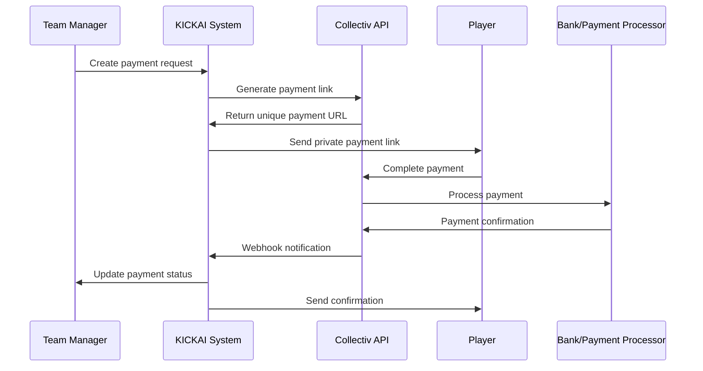
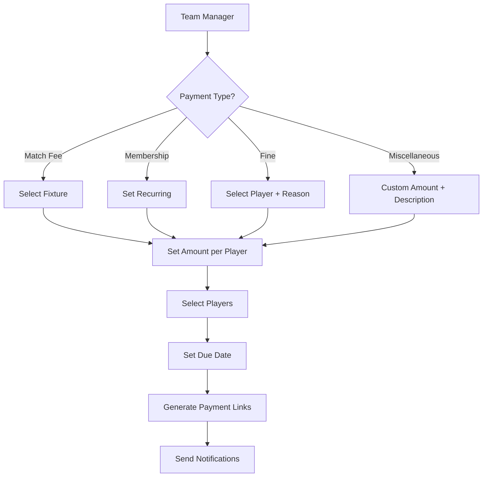
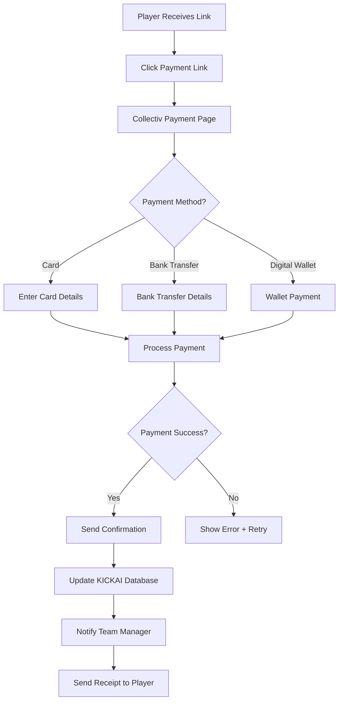
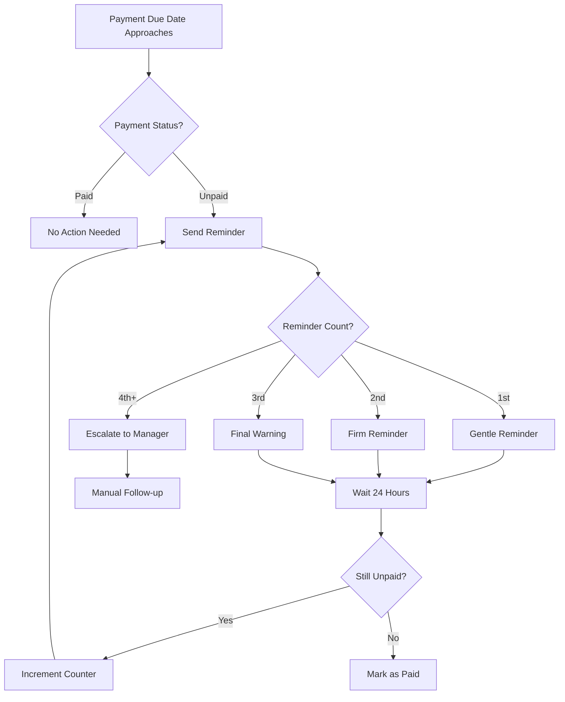
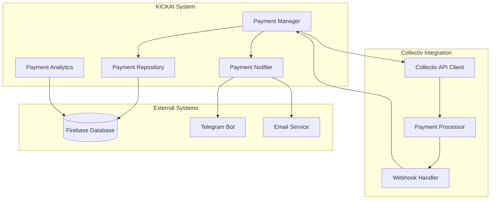

# Collectiv Payment System Integration PRD

**Product:** KICKAI Football Team Management System  
**Feature:** Collectiv Payment Integration  
**Version:** 1.0  
**Date:** December 2024  
**Author:** Product Manager  
**Stakeholders:** Team Managers, Players, Finance Team  

## Executive Summary

This PRD outlines the integration of the Collectiv payment system into KICKAI to streamline payment collection for match fees, membership fees, fines, and miscellaneous items. The system will provide secure, automated payment processing while maintaining player privacy and team transparency.

## Table of Contents

1. [Product Overview](#product-overview)
2. [User Stories](#user-stories)
3. [Payment Workflow Design](#payment-workflow-design)
4. [Privacy and Security Considerations](#privacy-and-security-considerations)
5. [Technical Architecture](#technical-architecture)
6. [API Integration](#api-integration)
7. [User Experience Design](#user-experience-design)
8. [Implementation Plan](#implementation-plan)
9. [Success Metrics](#success-metrics)
10. [Risk Assessment](#risk-assessment)

## Product Overview

### Problem Statement

Currently, KICKAI teams struggle with:
- Manual payment collection and tracking
- Inconsistent payment reminders
- Lack of transparency in payment status
- Difficulty managing multiple payment types
- Privacy concerns when discussing payments in group chats

### Solution

Integrate Collectiv payment system to provide:
- Automated payment link generation
- Real-time payment tracking
- Secure payment processing
- Privacy-conscious communication
- Comprehensive financial reporting

### Key Features

1. **Automated Payment Links**: Generate unique payment links for each player
2. **Multi-Payment Types**: Support match fees, membership, fines, and miscellaneous items
3. **Privacy Controls**: Individual payment links to avoid group chat exposure
4. **Real-time Tracking**: Instant payment status updates
5. **Automated Reminders**: Smart reminder system based on payment status
6. **Financial Reporting**: Comprehensive payment analytics and reports

## User Stories

### As a Team Manager
- I want to create payment requests for match fees so that players can pay easily
- I want to track payment status in real-time so I know who has paid
- I want to send automated reminders to unpaid players so I don't have to chase manually
- I want to generate financial reports so I can manage team finances effectively
- I want to set up recurring payments for membership fees so players don't forget

### As a Player
- I want to receive a private payment link so my payment status isn't visible to everyone
- I want to pay securely using my preferred payment method
- I want to receive confirmation when my payment is processed
- I want to view my payment history so I can track my financial obligations
- I want to set up automatic payments for recurring fees

### As a Finance Manager
- I want to see all payment transactions in one place
- I want to export payment data for accounting purposes
- I want to reconcile payments with match attendance
- I want to identify payment patterns and trends
- I want to manage refunds and adjustments when needed

## Payment Workflow Design

### High-Level Payment Flow



### Detailed Payment Workflow

#### 1. Payment Request Creation



#### 2. Payment Processing



#### 3. Reminder System



## Privacy and Security Considerations

### Privacy Concerns Addressed

#### 1. **Individual Payment Links**
- Each player receives a unique, private payment link
- Payment status not visible in group chat
- Only team managers can see full payment status

#### 2. **Granular Permissions**
```python
class PaymentPermissions:
    PLAYER_CAN_VIEW_OWN_PAYMENTS = "view_own_payments"
    PLAYER_CAN_VIEW_OWN_HISTORY = "view_own_history"
    MANAGER_CAN_VIEW_ALL_PAYMENTS = "view_all_payments"
    MANAGER_CAN_CREATE_PAYMENTS = "create_payments"
    MANAGER_CAN_REFUND_PAYMENTS = "refund_payments"
    FINANCE_CAN_EXPORT_DATA = "export_payment_data"
```

#### 3. **Data Minimization**
- Only necessary payment data stored
- Personal financial information not retained
- Anonymized reporting for analytics

### Security Measures

#### 1. **API Security**
```python
class CollectivAPISecurity:
    def __init__(self):
        self.api_key = os.getenv('COLLECTIV_API_KEY')
        self.webhook_secret = os.getenv('COLLECTIV_WEBHOOK_SECRET')
        self.encryption_key = os.getenv('PAYMENT_ENCRYPTION_KEY')
    
    def verify_webhook_signature(self, payload: str, signature: str) -> bool:
        """Verify webhook signature from Collectiv"""
        expected_signature = hmac.new(
            self.webhook_secret.encode(),
            payload.encode(),
            hashlib.sha256
        ).hexdigest()
        return hmac.compare_digest(signature, expected_signature)
```

#### 2. **Data Encryption**
- Payment data encrypted at rest
- Secure transmission using TLS 1.3
- API keys rotated regularly

#### 3. **Audit Trail**
```python
class PaymentAuditLog:
    def log_payment_event(self, event_type: str, user_id: str, 
                         payment_id: str, details: Dict):
        log_entry = {
            'timestamp': datetime.now(),
            'event_type': event_type,
            'user_id': user_id,
            'payment_id': payment_id,
            'details': details,
            'ip_address': self.get_client_ip(),
            'user_agent': self.get_user_agent()
        }
        self.audit_logger.info(json.dumps(log_entry))
```

## Technical Architecture

### System Components



### Database Schema

```sql
-- Payment Requests
CREATE TABLE payment_requests (
    id UUID PRIMARY KEY,
    team_id UUID NOT NULL,
    created_by UUID NOT NULL,
    payment_type ENUM('match_fee', 'membership', 'fine', 'miscellaneous'),
    amount DECIMAL(10,2) NOT NULL,
    currency VARCHAR(3) DEFAULT 'GBP',
    description TEXT,
    due_date TIMESTAMP,
    fixture_id UUID,
    status ENUM('active', 'completed', 'cancelled'),
    created_at TIMESTAMP DEFAULT CURRENT_TIMESTAMP,
    updated_at TIMESTAMP DEFAULT CURRENT_TIMESTAMP
);

-- Payment Links
CREATE TABLE payment_links (
    id UUID PRIMARY KEY,
    payment_request_id UUID NOT NULL,
    player_id UUID NOT NULL,
    collectiv_link_id VARCHAR(255) NOT NULL,
    payment_url TEXT NOT NULL,
    amount DECIMAL(10,2) NOT NULL,
    status ENUM('pending', 'paid', 'expired', 'cancelled'),
    paid_at TIMESTAMP,
    created_at TIMESTAMP DEFAULT CURRENT_TIMESTAMP,
    expires_at TIMESTAMP
);

-- Payment Transactions
CREATE TABLE payment_transactions (
    id UUID PRIMARY KEY,
    payment_link_id UUID NOT NULL,
    collectiv_transaction_id VARCHAR(255) NOT NULL,
    amount DECIMAL(10,2) NOT NULL,
    currency VARCHAR(3) DEFAULT 'GBP',
    payment_method VARCHAR(50),
    status ENUM('pending', 'completed', 'failed', 'refunded'),
    transaction_data JSON,
    created_at TIMESTAMP DEFAULT CURRENT_TIMESTAMP
);
```

## API Integration

### Collectiv API Client

```python
class CollectivAPIClient:
    """Client for interacting with Collectiv payment API."""
    
    def __init__(self, api_key: str, base_url: str = "https://api.collectiv.com"):
        self.api_key = api_key
        self.base_url = base_url
        self.session = requests.Session()
        self.session.headers.update({
            'Authorization': f'Bearer {api_key}',
            'Content-Type': 'application/json'
        })
    
    async def create_payment_link(self, amount: float, currency: str, 
                                description: str, reference: str) -> Dict:
        """Create a new payment link."""
        payload = {
            'amount': amount,
            'currency': currency,
            'description': description,
            'reference': reference,
            'expires_in': 7 * 24 * 60 * 60,  # 7 days
            'webhook_url': f"{self.base_url}/webhooks/collectiv/payment"
        }
        
        response = await self.session.post(
            f"{self.base_url}/v1/payment-links",
            json=payload
        )
        response.raise_for_status()
        return response.json()
    
    async def get_payment_status(self, payment_link_id: str) -> Dict:
        """Get payment status for a link."""
        response = await self.session.get(
            f"{self.base_url}/v1/payment-links/{payment_link_id}"
        )
        response.raise_for_status()
        return response.json()
    
    async def refund_payment(self, transaction_id: str, amount: float = None) -> Dict:
        """Refund a payment."""
        payload = {'transaction_id': transaction_id}
        if amount:
            payload['amount'] = amount
        
        response = await self.session.post(
            f"{self.base_url}/v1/refunds",
            json=payload
        )
        response.raise_for_status()
        return response.json()
```

### Webhook Handler

```python
class CollectivWebhookHandler:
    """Handle webhooks from Collectiv payment system."""
    
    def __init__(self, payment_manager: PaymentManager):
        self.payment_manager = payment_manager
        self.webhook_secret = os.getenv('COLLECTIV_WEBHOOK_SECRET')
    
    async def handle_payment_webhook(self, payload: Dict, signature: str) -> bool:
        """Handle payment webhook from Collectiv."""
        try:
            # Verify webhook signature
            if not self.verify_signature(payload, signature):
                logger.error("Invalid webhook signature")
                return False
            
            event_type = payload.get('event_type')
            payment_data = payload.get('data', {})
            
            if event_type == 'payment.completed':
                await self.handle_payment_completed(payment_data)
            elif event_type == 'payment.failed':
                await self.handle_payment_failed(payment_data)
            elif event_type == 'payment.refunded':
                await self.handle_payment_refunded(payment_data)
            else:
                logger.warning(f"Unknown webhook event: {event_type}")
            
            return True
            
        except Exception as e:
            logger.error(f"Error handling webhook: {e}")
            return False
    
    async def handle_payment_completed(self, payment_data: Dict):
        """Handle completed payment."""
        payment_link_id = payment_data.get('payment_link_id')
        transaction_id = payment_data.get('transaction_id')
        amount = payment_data.get('amount')
        
        await self.payment_manager.mark_payment_completed(
            payment_link_id, transaction_id, amount
        )
```

## User Experience Design

### Payment Request Creation

#### Team Manager Interface
```python
class PaymentRequestForm:
    """Form for creating payment requests."""
    
    def __init__(self):
        self.payment_types = [
            ('match_fee', 'Match Fee'),
            ('membership', 'Membership Fee'),
            ('fine', 'Fine'),
            ('miscellaneous', 'Miscellaneous')
        ]
    
    def create_match_fee_request(self, fixture_id: str, amount: float, 
                               players: List[str]) -> PaymentRequest:
        """Create a match fee payment request."""
        return PaymentRequest(
            payment_type='match_fee',
            amount=amount,
            description=f"Match fee for fixture {fixture_id}",
            fixture_id=fixture_id,
            players=players,
            due_date=self.get_fixture_date(fixture_id) - timedelta(days=1)
        )
```

### Player Payment Experience

#### Payment Link Interface
```html
<!-- Payment Link Message Template -->
<div class="payment-notification">
    <h3>💰 Payment Request</h3>
    <p><strong>Type:</strong> {{ payment_type }}</p>
    <p><strong>Amount:</strong> £{{ amount }}</p>
    <p><strong>Due Date:</strong> {{ due_date }}</p>
    <p><strong>Description:</strong> {{ description }}</p>
    
    <div class="payment-actions">
        <a href="{{ payment_url }}" class="btn btn-primary">
            💳 Pay Now
        </a>
        <button class="btn btn-secondary" onclick="viewDetails()">
            📋 View Details
        </button>
    </div>
    
    <div class="payment-footer">
        <small>🔒 Secure payment powered by Collectiv</small>
        <small>⏰ Link expires in 7 days</small>
    </div>
</div>
```

### Payment Status Dashboard

#### Team Manager View
```python
class PaymentDashboard:
    """Dashboard for viewing payment status."""
    
    def get_payment_summary(self, payment_request_id: str) -> Dict:
        """Get payment summary for a request."""
        payments = self.get_payment_links(payment_request_id)
        
        total_players = len(payments)
        paid_players = len([p for p in payments if p.status == 'paid'])
        unpaid_players = total_players - paid_players
        total_amount = sum(p.amount for p in payments)
        collected_amount = sum(p.amount for p in payments if p.status == 'paid')
        
        return {
            'total_players': total_players,
            'paid_players': paid_players,
            'unpaid_players': unpaid_players,
            'total_amount': total_amount,
            'collected_amount': collected_amount,
            'collection_rate': (paid_players / total_players) * 100 if total_players > 0 else 0
        }
```

## Implementation Plan

### Phase 1: Core Integration (Weeks 1-4)

#### Week 1: API Setup
- [ ] Set up Collectiv API credentials
- [ ] Create API client with basic functionality
- [ ] Implement webhook handler
- [ ] Set up database schema

#### Week 2: Payment Management
- [ ] Create PaymentManager service
- [ ] Implement payment request creation
- [ ] Add payment link generation
- [ ] Set up payment status tracking

#### Week 3: Notification System
- [ ] Integrate with Telegram bot
- [ ] Create payment notification templates
- [ ] Implement reminder system
- [ ] Add email notifications

#### Week 4: Testing & Security
- [ ] Comprehensive testing
- [ ] Security audit
- [ ] Performance optimization
- [ ] Documentation

### Phase 2: Advanced Features (Weeks 5-8)

#### Week 5: Analytics & Reporting
- [ ] Payment analytics dashboard
- [ ] Financial reporting
- [ ] Export functionality
- [ ] Payment trends analysis

#### Week 6: Automation
- [ ] Automated reminder system
- [ ] Recurring payment setup
- [ ] Payment deadline management
- [ ] Escalation workflows

#### Week 7: User Experience
- [ ] Payment history for players
- [ ] Payment preferences
- [ ] Mobile-optimized interface
- [ ] Accessibility improvements

#### Week 8: Launch Preparation
- [ ] User acceptance testing
- [ ] Training materials
- [ ] Go-live checklist
- [ ] Support documentation

### Phase 3: Optimization (Weeks 9-12)

#### Week 9-10: Performance & Monitoring
- [ ] Performance monitoring
- [ ] Error tracking
- [ ] Usage analytics
- [ ] System optimization

#### Week 11-12: Feedback & Iteration
- [ ] User feedback collection
- [ ] Feature improvements
- [ ] Bug fixes
- [ ] Documentation updates

## Success Metrics

### Key Performance Indicators (KPIs)

#### 1. **Payment Collection Rate**
- **Target:** 95% collection rate within 7 days
- **Measurement:** Percentage of payments collected by due date
- **Formula:** (Paid Amount / Total Amount) × 100

#### 2. **Payment Processing Time**
- **Target:** < 2 minutes average processing time
- **Measurement:** Time from payment initiation to confirmation
- **Formula:** Average(confirmation_time - initiation_time)

#### 3. **User Adoption Rate**
- **Target:** 80% of players use digital payments within 30 days
- **Measurement:** Percentage of players who complete at least one digital payment
- **Formula:** (Players with digital payments / Total players) × 100

#### 4. **Support Ticket Reduction**
- **Target:** 50% reduction in payment-related support tickets
- **Measurement:** Number of payment-related support tickets
- **Formula:** (Previous period tickets - Current period tickets) / Previous period tickets × 100

### Business Metrics

#### 1. **Financial Impact**
- Reduced administrative overhead
- Faster payment collection
- Improved cash flow
- Reduced payment disputes

#### 2. **User Satisfaction**
- Player satisfaction with payment process
- Team manager satisfaction with payment tracking
- Reduction in payment-related complaints

#### 3. **Operational Efficiency**
- Time saved on payment collection
- Reduced manual payment tracking
- Improved financial reporting accuracy

## Risk Assessment

### Technical Risks

#### 1. **API Integration Issues**
- **Risk:** Collectiv API changes or downtime
- **Impact:** High - Payment processing unavailable
- **Mitigation:** 
  - Implement API versioning
  - Set up monitoring and alerts
  - Have fallback payment methods

#### 2. **Security Vulnerabilities**
- **Risk:** Payment data breaches
- **Impact:** High - Loss of trust and legal issues
- **Mitigation:**
  - Regular security audits
  - Encryption of sensitive data
  - Compliance with PCI DSS

#### 3. **Performance Issues**
- **Risk:** Slow payment processing
- **Impact:** Medium - Poor user experience
- **Mitigation:**
  - Load testing
  - Performance monitoring
  - Scalable architecture

### Business Risks

#### 1. **User Adoption**
- **Risk:** Players resist digital payments
- **Impact:** Medium - Reduced effectiveness
- **Mitigation:**
  - User training and support
  - Gradual rollout
  - Incentives for adoption

#### 2. **Regulatory Compliance**
- **Risk:** Non-compliance with financial regulations
- **Impact:** High - Legal penalties
- **Mitigation:**
  - Legal review of implementation
  - Compliance monitoring
  - Regular audits

#### 3. **Data Privacy**
- **Risk:** Privacy violations
- **Impact:** High - Loss of trust
- **Mitigation:**
  - Privacy-by-design approach
  - Data minimization
  - Clear privacy policies

### Operational Risks

#### 1. **Support Load**
- **Risk:** Increased support requests during rollout
- **Impact:** Medium - Resource strain
- **Mitigation:**
  - Comprehensive documentation
  - Training for support team
  - Self-service resources

#### 2. **Integration Complexity**
- **Risk:** Difficult integration with existing systems
- **Impact:** Medium - Delayed implementation
- **Mitigation:**
  - Phased implementation
  - Thorough testing
  - Clear integration documentation

## Conclusion

The Collectiv payment system integration will significantly improve KICKAI's payment management capabilities while maintaining player privacy and team transparency. The phased implementation approach ensures smooth rollout with minimal disruption to existing operations.

### Next Steps

1. **Stakeholder Approval**: Review and approve this PRD
2. **Technical Planning**: Detailed technical design and architecture
3. **Resource Allocation**: Assign development and testing resources
4. **Timeline Confirmation**: Finalize implementation timeline
5. **Risk Mitigation**: Implement identified risk mitigation strategies

### Success Criteria

The integration will be considered successful if:
- 95% payment collection rate is achieved
- User adoption reaches 80% within 30 days
- Support tickets related to payments are reduced by 50%
- No security incidents occur during implementation
- All regulatory compliance requirements are met

This PRD provides a comprehensive roadmap for implementing a secure, efficient, and user-friendly payment system that will enhance the KICKAI platform's financial management capabilities. 