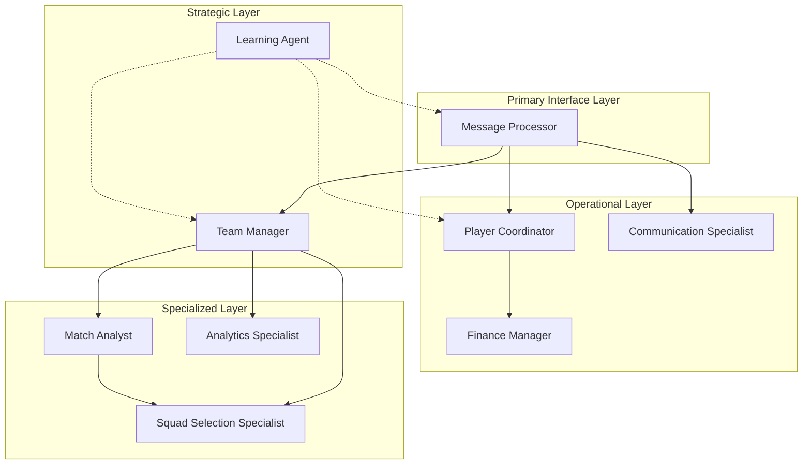
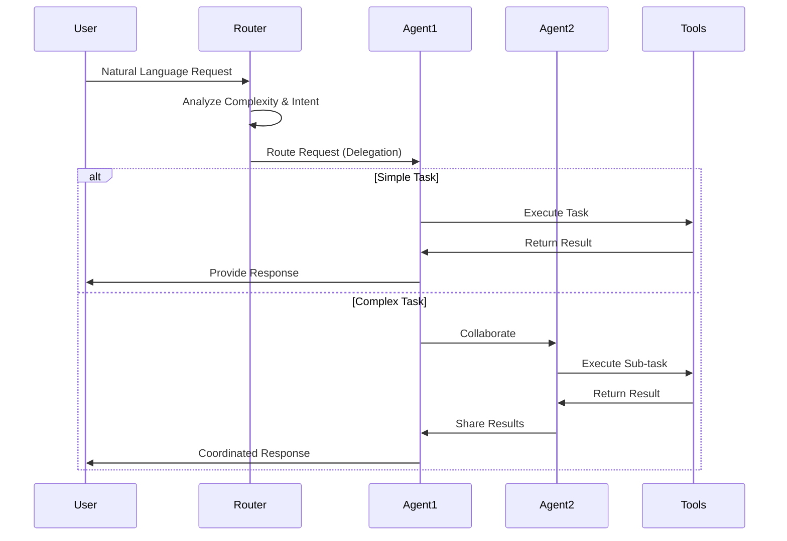
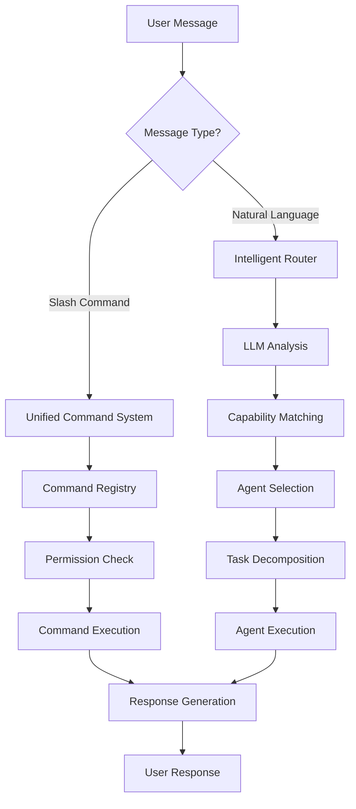
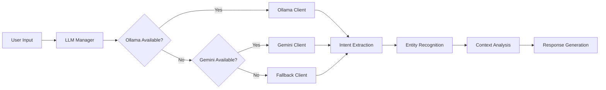
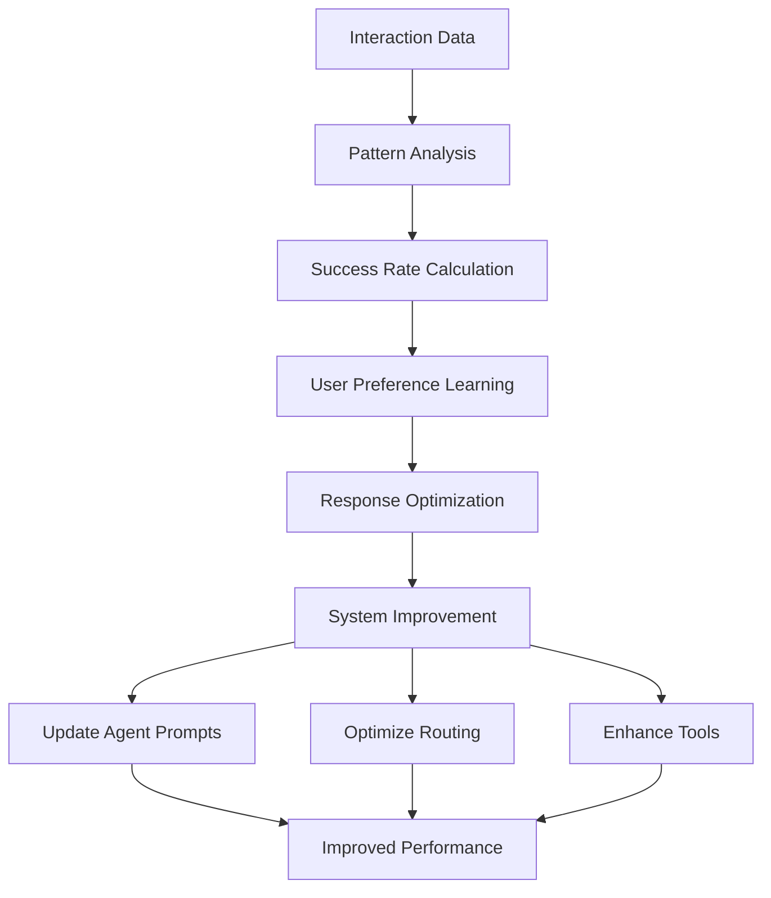
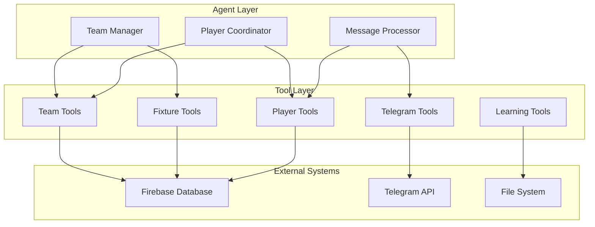
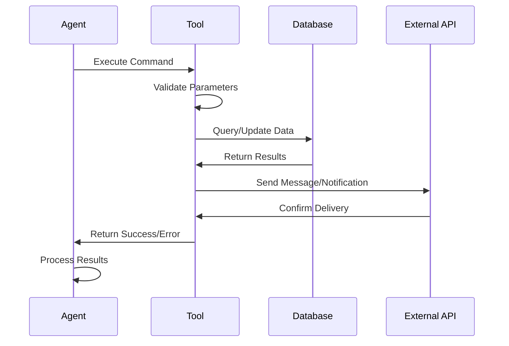
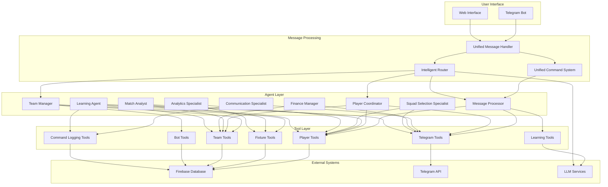
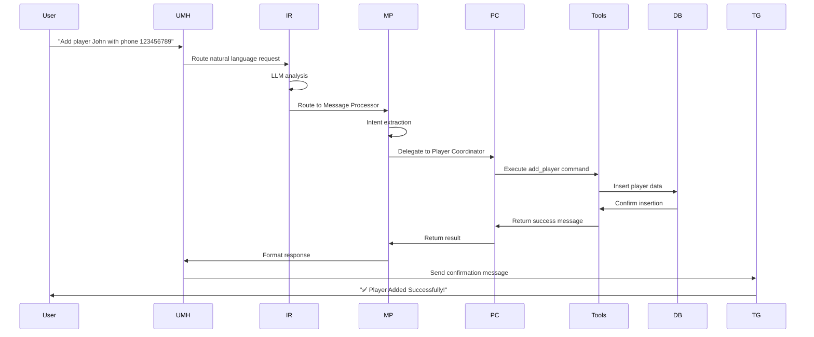
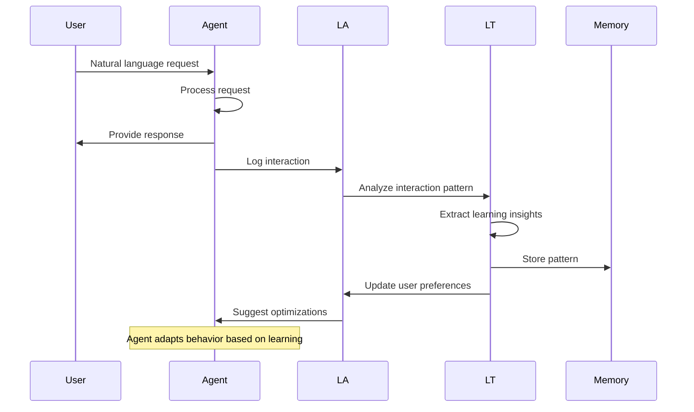

# KICKAI Agent Architecture: A Comprehensive Technical Analysis

**Author:** AI System Architect  
**Date:** December 2024  
**Audience:** Junior Engineers  
**Version:** 1.0

## Executive Summary

The KICKAI system implements a sophisticated multi-agent architecture designed for football team management. This paper provides a comprehensive analysis of how nine specialized agents interact, make decisions, learn from interactions, and complete complex tasks through natural language processing and tool utilization.

## Table of Contents

1. [System Overview](#system-overview)
2. [Agent Architecture](#agent-architecture)
3. [Agent Interactions and Communication](#agent-interactions-and-communication)
4. [Decision-Making Mechanisms](#decision-making-mechanisms)
5. [Natural Language Processing](#natural-language-processing)
6. [Learning and Adaptation](#learning-and-adaptation)
7. [Tool Integration and Task Completion](#tool-integration-and-task-completion)
8. [Performance Monitoring and Optimization](#performance-monitoring-and-optimization)
9. [Architecture Diagrams](#architecture-diagrams)
10. [Implementation Details](#implementation-details)

## System Overview

KICKAI employs a **CrewAI-based multi-agent system** with nine specialized agents, each possessing distinct capabilities and responsibilities. The system operates on a **team-per-instance model**, where each football team has its own isolated agent crew.

### Core Design Principles

- **Separation of Concerns**: Each agent has a specific domain of expertise
- **Intelligent Routing**: LLM-powered request routing based on capability analysis
- **Dynamic Task Decomposition**: Complex requests are broken down into manageable tasks
- **Learning and Adaptation**: Continuous improvement through interaction analysis
- **Tool-Based Execution**: Agents use specialized tools for database operations and external integrations

## Agent Architecture

### Agent Hierarchy and Roles



### Agent Capability Matrix

Each agent possesses specific capabilities with proficiency scores (0.0-1.0):

| Agent | Primary Capabilities | Proficiency | Delegation |
|-------|-------------------|-------------|------------|
| **Message Processor** | Intent Analysis, Context Management, Routing | 0.95 | ✅ |
| **Team Manager** | Strategic Planning, Coordination, Decision Making | 0.95 | ✅ |
| **Player Coordinator** | Player Management, Availability Tracking | 0.95 | ✅ |
| **Match Analyst** | Performance Analysis, Tactical Insights | 0.90 | ✅ |
| **Communication Specialist** | Messaging, Announcements, Polls | 0.90 | ❌ |
| **Finance Manager** | Payment Tracking, Financial Reporting | 0.85 | ❌ |
| **Squad Selection Specialist** | Squad Selection, Form Analysis | 0.85 | ❌ |
| **Analytics Specialist** | Trend Analysis, Performance Metrics | 0.85 | ❌ |
| **Learning Agent** | Pattern Learning, Response Optimization | 0.90 | ✅ |

## Agent Interactions and Communication

### Communication Protocols

The system implements five distinct communication protocols:



### Message Flow Architecture



### Agent Communication Patterns

#### 1. Delegation Pattern
```python
# Example: Message Processor delegates to Player Coordinator
async def handle_player_request(self, message: str):
    if "add player" in message.lower():
        return await self.player_coordinator.handle_add_player(message)
    elif "check availability" in message.lower():
        return await self.player_coordinator.check_availability(message)
```

#### 2. Collaboration Pattern
```python
# Example: Team Manager coordinates multiple agents
async def handle_match_preparation(self, fixture_id: str):
    # Get squad from Squad Selection Specialist
    squad = await self.squad_selection_specialist.select_squad(fixture_id)
    
    # Get tactical analysis from Match Analyst
    analysis = await self.match_analyst.analyze_opposition(fixture_id)
    
    # Coordinate communication
    await self.communication_specialist.announce_squad(squad, analysis)
```

#### 3. Consensus Pattern
```python
# Example: Multiple agents agree on squad selection
async def select_optimal_squad(self, fixture_id: str):
    squad_suggestions = []
    
    # Get suggestions from different agents
    squad_suggestions.append(await self.squad_selection_specialist.suggest_squad(fixture_id))
    squad_suggestions.append(await self.match_analyst.suggest_tactical_squad(fixture_id))
    squad_suggestions.append(await self.player_coordinator.suggest_available_squad(fixture_id))
    
    # Reach consensus
    return await self.team_manager.reach_consensus(squad_suggestions)
```

## Decision-Making Mechanisms

### Intelligent Routing System

The routing system uses LLM-powered analysis to determine the optimal agent(s) for handling requests:

```mermaid
flowchart TD
    A[Incoming Request] --> B[LLM Analysis]
    B --> C{Complexity Assessment}
    
    C -->|Low (1-3)| D[Single Agent]
    C -->|Medium (4-7)| E[Agent Pair]
    C -->|High (8-10)| F[Multi-Agent Crew]
    
    D --> G[Direct Execution]
    E --> H[Collaboration]
    F --> I[Task Decomposition]
    
    G --> J[Response Generation]
    H --> J
    I --> J
```

### Routing Decision Process

```python
async def route_request(self, message: str, context: TaskContext) -> List[Agent]:
    # Step 1: LLM Analysis
    analysis_prompt = f"""
    Analyze this request: "{message}"
    Context: User ID: {context.user_id}, Team ID: {context.team_id}
    
    Determine:
    1. Request complexity (1-10 scale)
    2. Required capabilities
    3. Optimal agent sequence
    4. Expected execution time
    
    Return JSON format:
    {{
        "complexity": 7,
        "required_capabilities": ["player_management", "communication"],
        "agent_sequence": ["player_coordinator", "communication_specialist"],
        "estimated_time": 30,
        "reasoning": "Request involves player operations and team communication"
    }}
    """
    
    response = await self.llm.ainvoke(analysis_prompt)
    routing_decision = json.loads(response)
    
    # Step 2: Agent Selection
    selected_agents = []
    for agent_name in routing_decision['agent_sequence']:
        if agent_name in self.agents:
            selected_agents.append(self.agents[agent_name])
    
    return selected_agents
```

### Capability-Based Selection

The system maintains a capability matrix that maps agents to their competencies:

```python
capability_matrix = {
    'message_processor': [
        'intent_analysis', 'context_management', 'routing', 
        'natural_language_understanding'
    ],
    'team_manager': [
        'strategic_planning', 'coordination', 'decision_making', 
        'high_level_operations'
    ],
    'player_coordinator': [
        'player_management', 'availability_tracking', 'communication', 
        'operational_tasks'
    ],
    # ... other agents
}
```

## Natural Language Processing

### Multi-Provider LLM Architecture

The system supports multiple LLM providers with automatic fallback:



### Intent Extraction Process

```python
async def extract_intent(self, message: str, context: str = "") -> IntentResult:
    prompt = f"""
    You are a helpful football team onboarding assistant. 
    Extract the intent and any relevant entities from the following player message. 
    Respond in JSON with 'intent', 'entities', and 'confidence' (0.0-1.0).
    
    Context: {context}
    Message: {message}
    
    Respond only with valid JSON.
    """
    
    response = await self.llm.ainvoke(prompt)
    result = json.loads(response)
    
    return IntentResult(
        intent=result.get('intent', 'unknown'),
        entities=result.get('entities', {}),
        confidence=result.get('confidence', 1.0),
        provider=self.provider
    )
```

### Context Management

The system maintains conversation context across interactions:

```python
class ConversationContext:
    def __init__(self, user_id: str, team_id: str):
        self.user_id = user_id
        self.team_id = team_id
        self.conversation_history = []
        self.current_topic = None
        self.user_preferences = {}
        self.session_start = datetime.now()
    
    def add_message(self, message: str, response: str, success: bool):
        self.conversation_history.append({
            'timestamp': datetime.now(),
            'message': message,
            'response': response,
            'success': success
        })
    
    def get_recent_context(self, limit: int = 3) -> str:
        recent = self.conversation_history[-limit:]
        return "\n".join([
            f"User: {msg['message']}\nAssistant: {msg['response']}"
            for msg in recent
        ])
```

## Learning and Adaptation

### Learning Agent Architecture

The Learning Agent continuously improves system performance through pattern recognition and optimization:



### Pattern Learning Mechanism

```python
class InteractionPattern:
    def __init__(self, pattern_type: str, trigger_conditions: List[str], 
                 response_pattern: str, success_rate: float):
        self.pattern_type = pattern_type
        self.trigger_conditions = trigger_conditions
        self.response_pattern = response_pattern
        self.success_rate = success_rate
        self.usage_count = 1
        self.last_used = datetime.now()
        self.confidence = 0.7

class LearningTools:
    def learn_pattern(self, pattern_type: str, trigger_conditions: List[str], 
                     response_pattern: str, success: bool) -> str:
        pattern_id = f"{pattern_type}_{len(self.interaction_patterns)}"
        
        pattern = InteractionPattern(
            pattern_type=pattern_type,
            trigger_conditions=trigger_conditions,
            response_pattern=response_pattern,
            success_rate=1.0 if success else 0.0
        )
        
        self.interaction_patterns[pattern_id] = pattern
        return f"Pattern learned: {pattern_id} (confidence: {pattern.confidence})"
```

### User Preference Learning

```python
class UserPreference:
    def __init__(self, user_id: str, preference_type: str, value: str, confidence: float):
        self.user_id = user_id
        self.preference_type = preference_type
        self.value = value
        self.confidence = confidence
        self.last_updated = datetime.now()
        self.usage_count = 1

class LearningTools:
    def update_user_preference(self, user_id: str, preference_type: str, 
                              value: str, confidence: float = 0.7) -> str:
        if user_id not in self.user_preferences:
            self.user_preferences[user_id] = {}
        
        preference = UserPreference(
            user_id=user_id,
            preference_type=preference_type,
            value=value,
            confidence=confidence
        )
        
        self.user_preferences[user_id][preference_type] = preference
        return f"Preference updated: {preference_type} = {value}"
```

### Response Optimization

```python
def optimize_response(self, original_response: str, user_id: str) -> str:
    user_prefs = self.user_preferences.get(user_id, {})
    optimized_response = original_response
    
    # Adjust response length based on preference
    length_pref = user_prefs.get('response_length', None)
    if length_pref:
        if length_pref.value == 'concise' and len(optimized_response) > 100:
            optimized_response = self._make_concise(optimized_response)
        elif length_pref.value == 'detailed' and len(optimized_response) < 50:
            optimized_response = self._add_detail(optimized_response)
    
    # Adjust communication style
    style_pref = user_prefs.get('communication_style', None)
    if style_pref:
        if style_pref.value == 'formal':
            optimized_response = self._make_formal(optimized_response)
        elif style_pref.value == 'casual':
            optimized_response = self._make_casual(optimized_response)
    
    return optimized_response
```

## Tool Integration and Task Completion

### Tool Architecture

Agents use specialized tools to interact with external systems:



### Tool Execution Flow



### Example Tool Implementation

```python
class PlayerTools(BaseTool):
    name = "Player Management Tool"
    description = "A tool to manage player data in the database"
    
    def __init__(self, team_id: str):
        super().__init__()
        self.team_id = team_id
    
    def _run(self, command: str, **kwargs) -> str:
        db = get_firebase_client()
        
        if command == 'add_player':
            return self._add_player(db, **kwargs)
        elif command == 'get_all_players':
            return self._get_all_players(db)
        elif command == 'get_player':
            return self._get_player(db, **kwargs)
        elif command == 'update_player':
            return self._update_player(db, **kwargs)
        elif command == 'deactivate_player':
            return self._deactivate_player(db, **kwargs)
        else:
            return "Error: Unknown command"
    
    def _add_player(self, db, name: str, phone_number: str) -> str:
        try:
            # Generate human-readable ID
            player_id = generate_player_id(name)
            
            player_data = {
                'name': name,
                'phone_number': phone_number,
                'player_id': player_id,
                'is_active': True,
                'team_id': self.team_id,
                'created_at': datetime_to_timestamp(None),
                'updated_at': datetime_to_timestamp(None)
            }
            
            doc_ref = db.collection('team_members').document(player_id)
            doc_ref.set(player_data)
            
            return f"✅ Player Added Successfully!\n\n👤 Name: {name}\n📱 Phone: {phone_number}\n🆔 ID: {player_id}"
        except Exception as e:
            return f"❌ Error adding player: {e}"
```

### Task Decomposition

Complex tasks are broken down into smaller, manageable subtasks:

```python
class DynamicTaskDecomposer:
    def __init__(self, llm):
        self.llm = llm
        self.task_templates = self._load_task_templates()
    
    async def decompose_request(self, message: str, selected_agents: List[Agent], 
                               context: TaskContext) -> List[Task]:
        decomposition_prompt = f"""
        Decompose this request into subtasks: "{message}"
        
        Available agents: {[agent.role for agent in selected_agents]}
        
        Return JSON with subtasks:
        {{
            "subtasks": [
                {{
                    "task_id": "task_1",
                    "description": "Analyze player availability",
                    "agent": "player_coordinator",
                    "dependencies": [],
                    "estimated_time": 5
                }}
            ]
        }}
        """
        
        response = await self.llm.ainvoke(decomposition_prompt)
        decomposition = json.loads(response)
        
        tasks = []
        for subtask in decomposition['subtasks']:
            task = Task(
                description=subtask['description'],
                expected_output="Task completion confirmation",
                agent=self._get_agent_by_role(subtask['agent'], selected_agents)
            )
            task.dependencies = subtask.get('dependencies', [])
            tasks.append(task)
        
        return tasks
```

## Performance Monitoring and Optimization

### Performance Metrics

The system tracks comprehensive performance metrics:

```python
class AgentPerformanceMonitor:
    def __init__(self):
        self.execution_times = defaultdict(list)
        self.success_rates = defaultdict(list)
        self.error_counts = defaultdict(int)
        self.agent_usage = defaultdict(int)
    
    def track_execution(self, agents: List[Agent], tasks: List[Task], 
                       execution_time: float, success: bool, context: TaskContext):
        for agent in agents:
            agent_name = agent.role
            self.execution_times[agent_name].append(execution_time)
            self.success_rates[agent_name].append(1.0 if success else 0.0)
            self.agent_usage[agent_name] += 1
            
            if not success:
                self.error_counts[agent_name] += 1
    
    def get_metrics(self) -> Dict:
        metrics = {}
        for agent_name in self.agent_usage.keys():
            avg_time = sum(self.execution_times[agent_name]) / len(self.execution_times[agent_name])
            success_rate = sum(self.success_rates[agent_name]) / len(self.success_rates[agent_name])
            
            metrics[agent_name] = {
                'avg_execution_time': avg_time,
                'success_rate': success_rate,
                'usage_count': self.agent_usage[agent_name],
                'error_count': self.error_counts[agent_name]
            }
        
        return metrics
```

### System Analytics

```python
def get_system_analytics(self) -> Dict:
    return {
        'routing_analytics': self.router.get_routing_analytics(),
        'performance_metrics': self.performance_monitor.get_metrics(),
        'memory_stats': {
            'short_term_users': len(self.memory_system.short_term_memory),
            'long_term_users': len(self.memory_system.long_term_memory),
            'episodic_entries': len(self.memory_system.episodic_memory),
            'semantic_patterns': len(self.memory_system.semantic_memory)
        },
        'communication_stats': {
            'total_communications': len(self.communication_protocol.communication_history),
            'successful_delegations': len([c for c in self.communication_protocol.communication_history 
                                         if c.get('type') == 'delegation' and c.get('success')]),
            'collaborations': len([c for c in self.communication_protocol.communication_history 
                                 if c.get('type') == 'collaboration'])
        }
    }
```

## Architecture Diagrams

### Complete System Architecture



### Request Processing Flow



### Learning and Adaptation Flow



## Implementation Details

### Agent Creation and Configuration

```python
def create_agents_for_team(llm, team_id: str):
    """Create CrewAI agents for a specific team."""
    
    # Initialize tools with team context
    player_tools = PlayerTools(team_id)
    fixture_tools = FixtureTools(team_id)
    team_tools = TeamTools(team_id)
    messaging_tools = get_messaging_tools(team_id)
    
    # Message Processing Specialist (Primary Interface)
    message_processor = Agent(
        role='Message Processing Specialist',
        goal='Interpret incoming messages, understand user intent, and route requests',
        backstory="""You are an expert at understanding human communication in the context 
        of football team management. You excel at interpreting natural language, understanding 
        context, and determining the best way to handle user requests.""",
        verbose=True,
        allow_delegation=True,
        tools=[player_tools, messaging_tools['message_tool']],
        llm=llm
    )
    
    # Team Manager (Strategic Coordination)
    team_manager = Agent(
        role='Team Manager',
        goal='Manage team operations, coordinate players, and ensure smooth functioning',
        backstory="""You are an experienced football team manager with years of experience 
        managing Sunday League teams. You understand player dynamics, team morale, and the 
        importance of clear communication.""",
        verbose=True,
        allow_delegation=True,
        tools=[player_tools, fixture_tools, team_tools, messaging_tools['message_tool']],
        llm=llm
    )
    
    # ... other agents
    
    return (message_processor, team_manager, player_coordinator, 
            match_analyst, communication_specialist, finance_manager,
            squad_selection_specialist, analytics_specialist, learning_agent)
```

### Crew Configuration

```python
def create_crew_for_team(agents):
    """Create a CrewAI crew with the specified agents."""
    
    message_processor, team_manager, player_coordinator, match_analyst, \
    communication_specialist, finance_manager, squad_selection_specialist, \
    analytics_specialist, learning_agent = agents
    
    crew = Crew(
        agents=[
            message_processor,      # Primary interface
            team_manager,           # Strategic coordination
            player_coordinator,     # Operational management
            match_analyst,          # Tactical analysis
            communication_specialist, # Broadcast management
            finance_manager,        # Financial management
            squad_selection_specialist, # Squad selection
            analytics_specialist,   # Performance analytics
            learning_agent          # Learning and optimization
        ],
        verbose=True,
        memory=True
    )
    
    return crew
```

### System Prompts and Instructions

Each agent uses carefully crafted system prompts:

```python
CREWAI_SYSTEM_PROMPT = '''
You are a helpful, precise, and format-strict AI agent for a football team management system.

**IMPORTANT:** You must ALWAYS respond in the following format, and never deviate from it:

```
Thought: <your reasoning here>
Final Answer: <your complete, direct answer here>
```

If you are asked to use tools, always return the format:
```
Thought: <your reasoning>
Action: <tool name>
Action Input: <JSON input for the tool>
Observation: <result from the tool>
```

Once all actions are complete, always return the final answer in the first format above.

**Available Tools and Commands:**
- Player Management Tool: add_player, get_all_players, get_player, update_player, deactivate_player
- Fixture Management Tool: add_fixture, get_all_fixtures, get_fixture, update_fixture, delete_fixture
- Team Management Tool: get_team_info, update_team_info
- Telegram Messaging Tools: send_telegram_message, send_telegram_poll, send_availability_poll

**Never use a command that is not listed above.**
'''
```

## Conclusion

The KICKAI agent architecture represents a sophisticated implementation of multi-agent systems for real-world applications. Key strengths include:

1. **Intelligent Routing**: LLM-powered request routing ensures optimal agent selection
2. **Learning and Adaptation**: Continuous improvement through pattern recognition and user preference learning
3. **Tool Integration**: Seamless integration with external systems through specialized tools
4. **Performance Monitoring**: Comprehensive analytics for system optimization
5. **Scalability**: Team-per-instance model allows for horizontal scaling

The architecture demonstrates how modern AI systems can be designed to handle complex, real-world tasks through intelligent agent collaboration, natural language processing, and continuous learning.

## Future Enhancements

1. **Multi-Model Support**: Support for multiple LLM providers per agent
2. **Advanced Learning**: Reinforcement learning for agent behavior optimization
3. **Predictive Analytics**: Proactive task suggestions based on historical patterns
4. **Enhanced Security**: Role-based access control and audit trails
5. **API Integration**: RESTful APIs for external system integration

This architecture provides a solid foundation for building intelligent, adaptive systems that can handle complex real-world scenarios while maintaining high performance and reliability. 