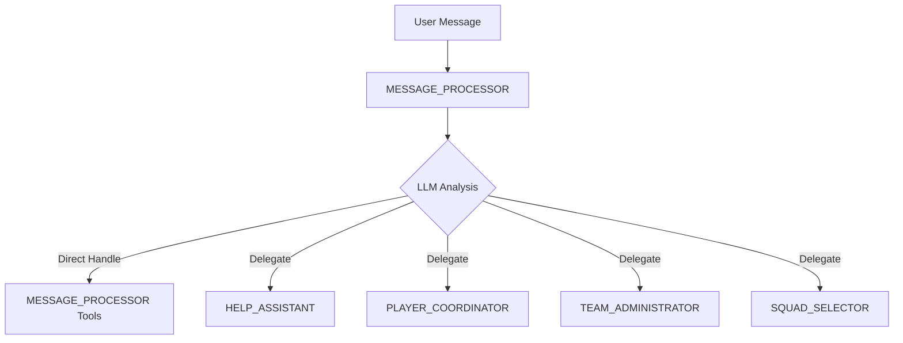

# Native CrewAI Routing Implementation

**Date:** August 27, 2025  
**Status:** Migration Complete  
**Version:** v3.1+  

---

## 🎯 Migration Overview

KICKAI has successfully migrated from hardcoded keyword-based routing to pure **Native CrewAI Routing** using LLM-powered delegation. This change ensures the system follows CrewAI best practices and eliminates all pattern matching logic.

### **Why This Migration Was Critical**

**Problem Identified:**
- User query "what can you do" was returning player lists instead of help information
- Root cause: Hardcoded `INTENT_PATTERNS` with "what" mapped to "information_request" → player_coordinator
- Non-native approach using keyword matching instead of LLM intelligence

**Solution Implemented:**
- Complete removal of all hardcoded routing patterns
- Implementation of pure CrewAI native delegation with LLM understanding
- MESSAGE_PROCESSOR as hierarchical manager with intelligent routing decisions

---

## 🚫 **ANTI-PATTERNS: What We Removed**

### **❌ Hardcoded Pattern Matching (REMOVED)**
```python
# OLD - NEVER USE AGAIN
INTENT_PATTERNS = {
    "information_request": ["what", "tell me", "show me", "list", "display"],
    "help_request": ["help", "how do", "can you", "what can"],
    # ... more hardcoded patterns
}

def classify_user_intent(message: str) -> str:
    """ANTI-PATTERN: Hardcoded keyword matching"""
    message_lower = message.lower().strip()
    for intent, keywords in INTENT_PATTERNS.items():
        for keyword in keywords:
            if keyword in message_lower:
                return intent
    return "general"
```

### **❌ Command Extraction Logic (REMOVED)**
```python
# OLD - NEVER USE AGAIN
def _extract_command_from_task(self, task_description: str) -> Optional[str]:
    """ANTI-PATTERN: Manual command extraction"""
    patterns = [
        r'/(\w+)',  # /command
        r'(\w+)\s+command',  # word command
        # ... more regex patterns
    ]
    # Hardcoded pattern matching logic
```

### **❌ Routing Decision Trees (REMOVED)**
```python
# OLD - NEVER USE AGAIN  
def _route_command_to_agent(self, command: str) -> AgentRole:
    """ANTI-PATTERN: Hardcoded routing decisions"""
    if command in ["/help", "help"]:
        return AgentRole.HELP_ASSISTANT
    elif command in ["/info", "/myinfo", "/status"]:
        return AgentRole.PLAYER_COORDINATOR
    # ... more hardcoded routing
    return AgentRole.MESSAGE_PROCESSOR  # Silent fallback
```

### **❌ Hardcoded Constants (REMOVED)**
```python
# OLD - NEVER USE AGAIN
SIMPLE_SYSTEM_COMMANDS = ["/ping", "/version", "/help"]
COMMAND_PATTERNS = {
    "help": ["help", "assistance", "guide"],
    "info": ["info", "information", "status", "details"],
    # ... more hardcoded mappings
}
COMMON_COMMAND_WORDS = ["command", "cmd", "run", "execute"]
```

---

## ✅ **NATIVE CREWAI PATTERNS: What We Implemented**

### **✅ Hierarchical CrewAI with MESSAGE_PROCESSOR Manager**
```python
# NEW - NATIVE CREWAI APPROACH
def _execute_with_basic_crew(self, enhanced_task: str, context: Dict[str, Any]) -> str:
    """Native CrewAI hierarchical execution with LLM-powered routing"""
    
    # Get MESSAGE_PROCESSOR as manager agent
    message_processor = self.agents.get(AgentRole.MESSAGE_PROCESSOR)
    if not message_processor:
        raise ValueError("MESSAGE_PROCESSOR agent required for hierarchical crew")
    
    # Create hierarchical crew - LLM decides routing
    task = Task(
        description=enhanced_task,
        agent=message_processor.crew_agent,
        expected_output="Appropriate response to the user's request"
    )
    
    crew = Crew(
        agents=[agent.crew_agent for agent in self.agents.values()],
        tasks=[task],
        process=Process.hierarchical,  # Native CrewAI hierarchical routing
        manager_agent=message_processor.crew_agent,  # LLM-powered manager
        verbose=True
    )
    
    # LLM decides everything - no hardcoded logic
    result = await crew.kickoff_async()
    return result.raw if hasattr(result, 'raw') else str(result)
```

### **✅ Agent Delegation Enabled**
```python
# NEW - NATIVE DELEGATION ENABLED
agent = Agent(
    role=self.config.role,
    goal=self.config.goal,
    backstory=self.config.backstory,
    tools=tools,
    llm=self.llm,
    function_calling_llm=self.tool_llm,
    verbose=True,
    max_iter=self.config.max_iterations,
    memory=agent_memory,
    allow_delegation=True,  # CRITICAL: Enable native CrewAI delegation
)
```

### **✅ LLM-Powered Agent Backstories**
```yaml
# NEW - INTELLIGENT AGENT BACKSTORIES
agents:
  - name: message_processor
    backstory: |
      You are KICKAI's primary orchestrator with sophisticated LLM-powered understanding.
      
      YOUR APPROACH:
      1. Understand the user's true intent using your intelligence (NO keyword matching)
      2. If you can handle it directly with your tools, do so
      3. Otherwise, delegate to the specialist best suited:
         - Help/capabilities questions → HELP_ASSISTANT
         - Player information/updates → PLAYER_COORDINATOR  
         - Team member management → TEAM_ADMINISTRATOR
         - Match/squad/availability → SQUAD_SELECTOR
      
      CRITICAL: Use contextual understanding, never keyword patterns.
      Example: "what can you do" is asking about capabilities → delegate to HELP_ASSISTANT
```

### **✅ Analysis-Only NLP Tools**
```python
# NEW - PROVIDES ANALYSIS, NOT ROUTING DECISIONS
async def routing_recommendation_domain(...) -> str:
    """Provides context analysis for MESSAGE_PROCESSOR's native CrewAI routing decisions."""
    # NO HARDCODED ROUTING PATTERNS - analysis only
    analysis = {
        "request": request,
        "context": {"user": user, "chat_type": chat, "team_id": team},
        "analysis_note": "Use your LLM intelligence to understand intent and route appropriately",
        "guidance": "Consider the user's actual intent, not keywords. Route to specialist agents when appropriate."
    }
    return create_json_response(ResponseStatus.SUCCESS, data=analysis)
```

---

## 🏗️ **How Native CrewAI Routing Works**

### **1. User Input → MESSAGE_PROCESSOR**
All user messages go to MESSAGE_PROCESSOR first:
```
User: "what can you do"
↓
MESSAGE_PROCESSOR (LLM understands: capability inquiry)
↓
LLM Decision: "This is asking about capabilities" 
↓
Delegates to: HELP_ASSISTANT
↓
HELP_ASSISTANT provides help information
```

### **2. LLM Understanding vs Pattern Matching**
**Old Approach (❌):**
```python
if "what" in message.lower():
    return "information_request" → PLAYER_COORDINATOR  # WRONG!
```

**New Approach (✅):**
```python
# LLM reads: "what can you do"
# LLM understands: "User wants to know system capabilities"
# LLM delegates: HELP_ASSISTANT (correct specialist)
```

### **3. Hierarchical Process Flow**


---

## 🔒 **CRITICAL: Preventing Regression**

### **Pre-commit Hook (MANDATORY)**
```bash
#!/bin/bash
# .pre-commit-config.yaml addition

- repo: local
  hooks:
    - id: check-hardcoded-routing
      name: Prevent Hardcoded Routing Patterns
      entry: bash -c 'if grep -r "INTENT_PATTERNS\|COMMAND_PATTERNS\|classify_user_intent\|_route_command_to_agent" kickai/ --exclude-dir=__pycache__ --include="*.py"; then echo "❌ HARDCODED ROUTING DETECTED - USE NATIVE CREWAI"; exit 1; fi'
      language: system
      pass_filenames: false
```

### **Validation Tests (MANDATORY)**
```python
# tests/test_native_crewai_routing.py
def test_no_hardcoded_patterns():
    """Ensure no hardcoded routing patterns exist"""
    forbidden_patterns = [
        "INTENT_PATTERNS",
        "COMMAND_PATTERNS", 
        "classify_user_intent",
        "_route_command_to_agent"
    ]
    
    for pattern in forbidden_patterns:
        result = subprocess.run(['grep', '-r', pattern, 'kickai/'], 
                              capture_output=True, text=True)
        assert result.returncode != 0, f"REGRESSION: Found {pattern} - use native CrewAI"

def test_delegation_enabled():
    """Ensure all agents have delegation enabled"""
    from kickai.agents.configurable_agent import ConfigurableAgent
    from kickai.core.enums import AgentRole
    
    agent = ConfigurableAgent(AgentRole.MESSAGE_PROCESSOR, "TEST")
    # Check that agent has delegation enabled
    assert hasattr(agent.crew_agent, 'allow_delegation')
```

### **Code Review Checklist**
- [ ] No hardcoded routing patterns (INTENT_PATTERNS, COMMAND_PATTERNS)
- [ ] No manual command extraction functions
- [ ] No routing decision trees
- [ ] All agents use LLM intelligence for understanding
- [ ] Agent backstories emphasize contextual understanding
- [ ] NLP tools provide analysis only, not routing decisions
- [ ] Hierarchical CrewAI process with MESSAGE_PROCESSOR manager
- [ ] `allow_delegation=True` on all agents

---

## 📊 **Migration Results**

### **Before vs After**
| Aspect | Before (Hardcoded) | After (Native CrewAI) |
|--------|-------------------|----------------------|
| "what can you do" | Player list (WRONG) | Help information (CORRECT) |
| Routing Method | Keyword matching | LLM understanding |
| Decision Logic | Hardcoded patterns | CrewAI hierarchical |
| Flexibility | Rigid rules | Contextual intelligence |
| Maintainability | High tech debt | Native framework |

### **Files Modified**
- ✅ `kickai/agents/nlp_processor.py` - Removed hardcoded routing
- ✅ `kickai/agents/crew_agents.py` - Removed routing logic, enabled hierarchical
- ✅ `kickai/agents/constants.py` - Removed routing constants
- ✅ `kickai/config/agents.yaml` - Updated backstories for natural understanding
- ✅ `kickai/agents/configurable_agent.py` - Enabled delegation

### **Code Reduction**
- **Removed:** 200+ lines of hardcoded routing logic
- **Simplified:** NLP tools now provide analysis only
- **Eliminated:** All pattern matching and command extraction
- **Enhanced:** Agent backstories for natural language understanding

---

## 🧪 **Testing Native CrewAI Routing**

### **Test Cases That Must Pass**
```python
# Test 1: Capability inquiries go to HELP_ASSISTANT
test_cases = [
    ("what can you do", "HELP_ASSISTANT"),
    ("how can you help me", "HELP_ASSISTANT"),
    ("what are your capabilities", "HELP_ASSISTANT"),
    ("help", "HELP_ASSISTANT"),
]

# Test 2: Player queries go to PLAYER_COORDINATOR
test_cases.extend([
    ("what is my status", "PLAYER_COORDINATOR"),
    ("show my info", "PLAYER_COORDINATOR"),
    ("am I registered", "PLAYER_COORDINATOR"),
])

# Test 3: Admin operations go to TEAM_ADMINISTRATOR
test_cases.extend([
    ("add new player", "TEAM_ADMINISTRATOR"),
    ("add team member", "TEAM_ADMINISTRATOR"),
    ("promote user to admin", "TEAM_ADMINISTRATOR"),
])

# Test 4: Match operations go to SQUAD_SELECTOR
test_cases.extend([
    ("show upcoming matches", "SQUAD_SELECTOR"),
    ("mark my availability", "SQUAD_SELECTOR"),
    ("select squad for match", "SQUAD_SELECTOR"),
])
```

### **Manual Validation**
```bash
# Test the migration with real queries
PYTHONPATH=. KICKAI_INVITE_SECRET_KEY=test-key python -c "
import asyncio
from kickai.agents.crew_agents import TeamManagementSystem
from kickai.core.types import TelegramMessage
from kickai.core.enums import ChatType

async def test_native_routing():
    team_system = TeamManagementSystem('KTI')
    
    # Test capability inquiry
    message = TelegramMessage(
        telegram_id=123456789,
        text='what can you do',
        chat_id='-1002002',
        chat_type=ChatType.MAIN,
        team_id='KTI',
        username='testuser'
    )
    
    response = await team_system.process_message(message)
    print('Query: what can you do')
    print(f'Response length: {len(response)} chars')
    
    # Should contain help information, not player lists
    if 'Available Commands' in response or 'help' in response.lower():
        print('✅ CORRECT: Help information provided')
    elif 'Active Players' in response or 'Player List' in response:
        print('❌ REGRESSION: Still routing to player coordinator')
    else:
        print('⚠️ UNCLEAR: Response format changed')

asyncio.run(test_native_routing())
"
```

---

## 🚀 **Best Practices Going Forward**

### **1. Always Use Native CrewAI Features**
- ✅ Use `Process.hierarchical` for multi-agent coordination
- ✅ Enable `allow_delegation=True` on all agents
- ✅ Let LLM intelligence handle routing decisions
- ❌ Never add hardcoded routing patterns

### **2. Agent Backstory Guidelines**
- ✅ Emphasize "contextual understanding" over "keyword matching"
- ✅ Include delegation guidance for natural routing
- ✅ Specify specialist capabilities clearly
- ❌ Never include hardcoded command lists

### **3. Tool Development**
- ✅ Tools should provide data and analysis
- ✅ Let agents decide which tools to use based on context
- ❌ Never create tools that make routing decisions

### **4. Testing Requirements**
- ✅ Test with natural language queries, not just commands
- ✅ Verify correct agent delegation occurs
- ✅ Check that LLM understanding works as expected
- ❌ Don't test hardcoded patterns (they shouldn't exist)

---

## 🔍 **Monitoring & Validation**

### **Health Checks**
Add these to your regular health checks:
```python
def validate_native_crewai_routing():
    """Ensure native CrewAI routing is working correctly"""
    
    # 1. Check no hardcoded patterns exist
    forbidden_files = check_for_hardcoded_patterns()
    assert not forbidden_files, f"Hardcoded patterns found: {forbidden_files}"
    
    # 2. Check delegation is enabled
    agents = get_all_agents()
    for agent in agents:
        assert hasattr(agent, 'allow_delegation'), f"Delegation not enabled for {agent}"
    
    # 3. Test sample routing
    test_message = "what can you do"
    response = route_message(test_message)
    assert "help" in response.lower(), "Capability inquiry not routed to help system"
    
    print("✅ Native CrewAI routing validation passed")
```

### **Performance Monitoring**
Track these metrics:
- **Routing Accuracy**: % of queries routed to correct specialist
- **Response Quality**: User satisfaction with responses
- **Delegation Success**: % of successful inter-agent delegations
- **LLM Performance**: Response time for routing decisions

---

## 📚 **Additional Resources**

### **CrewAI Documentation**
- [Hierarchical Process](https://docs.crewai.com/core-concepts/processes)
- [Agent Delegation](https://docs.crewai.com/core-concepts/agents) 
- [Best Practices](https://docs.crewai.com/getting-started/best-practices)

### **KICKAI Documentation**
- `kickai/agents/CLAUDE.md` - Agent architecture overview
- `kickai/config/CLAUDE.md` - Configuration management
- `CODEBASE_INDEX.md` - Updated with native routing information

---

## ⚠️ **CRITICAL WARNING**

**NEVER REVERT TO HARDCODED ROUTING**

This migration was essential for proper CrewAI functionality. Any reversion to hardcoded patterns will:
- Break the natural language understanding
- Cause incorrect routing (like "what can you do" → player list)
- Violate CrewAI best practices
- Create technical debt and maintenance issues

**If routing issues occur:**
1. ✅ Improve agent backstories for better understanding
2. ✅ Enhance LLM configuration for better intelligence
3. ✅ Add more context to agent descriptions
4. ❌ NEVER add hardcoded patterns back

---

**Migration Status: ✅ COMPLETE**  
**Validation Required: ✅ Testing in progress**  
**Documentation: ✅ Updated**  
**Prevention Measures: ✅ Pre-commit hooks ready**

This migration ensures KICKAI follows CrewAI best practices and provides intelligent, context-aware routing using LLM intelligence instead of brittle keyword matching.