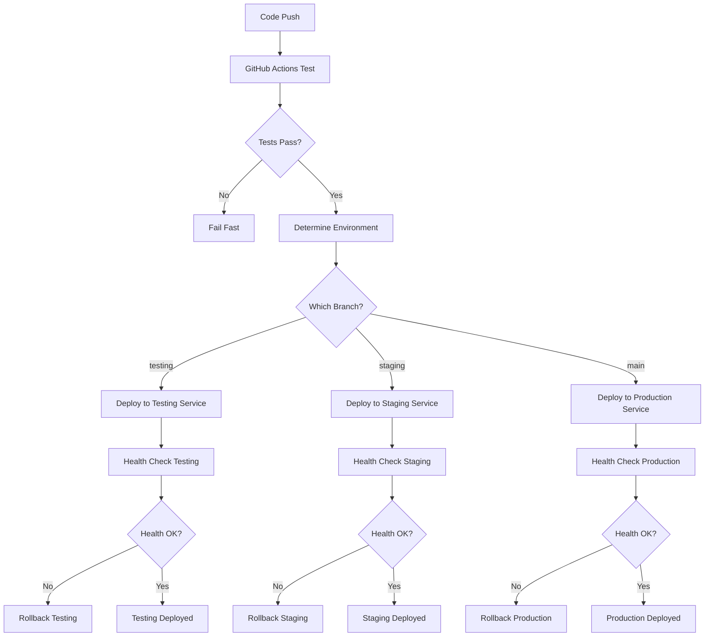

# KICKAI Single Project Multi-Service Deployment

## 🎯 **Overview**

This guide implements **Option 2: Single Railway Project, Multiple Services** for KICKAI deployment. This approach provides environment isolation while keeping costs low and setup simple.

## 🏗️ **Architecture**

### **Single Railway Project Structure**
```
kickai-project/
├── kickai-testing-service     # Testing environment
├── kickai-staging-service     # Staging environment  
└── kickai-production-service  # Production environment
```

### **Environment Configuration**

| Environment | Service Name | Branch | Database | AI Provider | Bot Tokens |
|-------------|-------------|--------|----------|-------------|------------|
| **Testing** | kickai-testing | `testing` | kickai-testing | Ollama | Test bots |
| **Staging** | kickai-staging | `staging` | kickai-staging | Google Gemini | Staging bots |
| **Production** | kickai-production | `main` | kickai-production | Google Gemini | Production bots |

## 🚀 **Setup Process**

### **Step 1: Create Single Railway Project**

```bash
# Login to Railway
railway login

# Create single project
railway init kickai-project
cd kickai-project

# Link to your GitHub repo
railway link
```

### **Step 2: Create Multiple Services**

```bash
# Create testing service
railway service create kickai-testing

# Create staging service  
railway service create kickai-staging

# Create production service
railway service create kickai-production
```

### **Step 3: Configure Environment Variables**

#### **Testing Service Variables**
```bash
railway variables set ENVIRONMENT=testing --service kickai-testing
railway variables set RAILWAY_ENVIRONMENT=testing --service kickai-testing
railway variables set AI_PROVIDER=ollama --service kickai-testing
railway variables set AI_MODEL_NAME=llama2 --service kickai-testing
railway variables set FIREBASE_PROJECT_ID=kickai-testing --service kickai-testing
railway variables set GOOGLE_API_KEY=dummy-key --service kickai-testing
railway variables set TELEGRAM_BOT_TOKEN=test-bot-token --service kickai-testing
railway variables set TELEGRAM_LEADERSHIP_BOT_TOKEN=test-leadership-bot-token --service kickai-testing
railway variables set LOG_LEVEL=DEBUG --service kickai-testing
```

#### **Staging Service Variables**
```bash
railway variables set ENVIRONMENT=staging --service kickai-staging
railway variables set RAILWAY_ENVIRONMENT=staging --service kickai-staging
railway variables set AI_PROVIDER=google_gemini --service kickai-staging
railway variables set AI_MODEL_NAME=gemini-pro --service kickai-staging
railway variables set FIREBASE_PROJECT_ID=kickai-staging --service kickai-staging
railway variables set GOOGLE_API_KEY=staging-google-key --service kickai-staging
railway variables set TELEGRAM_BOT_TOKEN=staging-bot-token --service kickai-staging
railway variables set TELEGRAM_LEADERSHIP_BOT_TOKEN=staging-leadership-bot-token --service kickai-staging
railway variables set LOG_LEVEL=INFO --service kickai-staging
```

#### **Production Service Variables**
```bash
railway variables set ENVIRONMENT=production --service kickai-production
railway variables set RAILWAY_ENVIRONMENT=production --service kickai-production
railway variables set AI_PROVIDER=google_gemini --service kickai-production
railway variables set AI_MODEL_NAME=gemini-pro --service kickai-production
railway variables set FIREBASE_PROJECT_ID=kickai-production --service kickai-production
railway variables set GOOGLE_API_KEY=production-google-key --service kickai-production
railway variables set TELEGRAM_BOT_TOKEN=production-bot-token --service kickai-production
railway variables set TELEGRAM_LEADERSHIP_BOT_TOKEN=production-leadership-bot-token --service kickai-production
railway variables set LOG_LEVEL=WARNING --service kickai-production
```

## 🔧 **Railway Configuration**

### **Single Project Configuration (`railway.json`)**
```json
{
  "$schema": "https://railway.app/railway.schema.json",
  "build": {
    "builder": "NIXPACKS"
  },
  "deploy": {
    "startCommand": "python railway_main.py",
    "healthcheckPath": "/health",
    "healthcheckTimeout": 300,
    "restartPolicyType": "ON_FAILURE",
    "restartPolicyMaxRetries": 5,
    "numReplicas": 1
  }
}
```

### **Service-Specific Overrides**

#### **Testing Service (`railway-testing.json`)**
```json
{
  "deploy": {
    "healthcheckTimeout": 180,
    "restartPolicyMaxRetries": 3,
    "numReplicas": 1
  }
}
```

#### **Staging Service (`railway-staging.json`)**
```json
{
  "deploy": {
    "healthcheckTimeout": 300,
    "restartPolicyMaxRetries": 5,
    "numReplicas": 1
  }
}
```

#### **Production Service (`railway-production.json`)**
```json
{
  "deploy": {
    "healthcheckTimeout": 600,
    "restartPolicyMaxRetries": 10,
    "numReplicas": 2
  }
}
```

## 🔄 **GitHub Actions Workflow**

### **Simplified Multi-Service Workflow**

```yaml
name: Deploy to Railway Services

on:
  push:
    branches: [main, staging, testing]
  pull_request:
    branches: [main]

env:
  PYTHON_VERSION: '3.11'

jobs:
  test:
    name: Run Tests
    runs-on: ubuntu-latest
    steps:
      - uses: actions/checkout@v4
      - uses: actions/setup-python@v4
        with:
          python-version: ${{ env.PYTHON_VERSION }}
      - run: |
          pip install -r requirements-local.txt
          pip install pytest pytest-cov
      - run: pytest tests/ --cov=src

  deploy:
    name: Deploy to Railway
    needs: test
    runs-on: ubuntu-latest
    strategy:
      matrix:
        include:
          - branch: testing
            service: kickai-testing
            environment: testing
          - branch: staging
            service: kickai-staging
            environment: staging
          - branch: main
            service: kickai-production
            environment: production
    if: github.ref == 'refs/heads/${{ matrix.branch }}'
    steps:
      - uses: actions/checkout@v4
      - name: Deploy to ${{ matrix.service }}
        uses: railway/deploy@v1
        with:
          service: ${{ matrix.service }}
          token: ${{ secrets.RAILWAY_TOKEN }}
      - name: Health check
        run: |
          sleep 30
          # Health check logic here
```

## 🤖 **Telegram Bot Setup**

### **Bot Creation Strategy**

#### **1. Testing Bots**
```bash
# Create via @BotFather
# /newbot - Test KICKAI Bot
# /newbot - Test KICKAI Leadership Bot

# Store tokens securely
TESTING_BOT_TOKEN=1234567890:ABCdefGHIjklMNOpqrsTUVwxyz
TESTING_LEADERSHIP_BOT_TOKEN=0987654321:ZYXwvuTSRqpONMlkjIHGfedCBA
```

#### **2. Staging Bots**
```bash
# Create via @BotFather
# /newbot - Staging KICKAI Bot
# /newbot - Staging KICKAI Leadership Bot

# Store tokens securely
STAGING_BOT_TOKEN=1122334455:DDDeeeFFFgggHHHiiiJJJkkkLLL
STAGING_LEADERSHIP_BOT_TOKEN=5544332211:LLLkkkJJJiiiHHHgggFFFeeeDDD
```

#### **3. Production Bots**
```bash
# Create via @BotFather
# /newbot - KICKAI Bot
# /newbot - KICKAI Leadership Bot

# Store tokens securely
PRODUCTION_BOT_TOKEN=your-production-bot-token
PRODUCTION_LEADERSHIP_BOT_TOKEN=your-production-leadership-bot-token
```

### **Bot Configuration Benefits**

| Environment | Bot Benefits |
|-------------|-------------|
| **Testing** | Safe testing, no real user impact, easy cleanup |
| **Staging** | Real data testing, isolated from production users |
| **Production** | Live service, proper user management, backup bots |

## 📊 **Monitoring and Health Checks**

### **Service-Specific Health Endpoints**

```python
@app.route('/health')
def health_check():
    """Enhanced health check with environment info."""
    try:
        environment = os.getenv('ENVIRONMENT', 'unknown')
        service_name = os.getenv('RAILWAY_SERVICE_NAME', 'unknown')
        
        # Environment-specific checks
        if environment == 'testing':
            # Basic checks for testing
            checks = {
                'firebase': check_firebase_basic(),
                'ai': check_ai_basic(),
                'telegram': check_telegram_basic()
            }
        elif environment == 'staging':
            # More thorough checks for staging
            checks = {
                'firebase': check_firebase_full(),
                'ai': check_ai_full(),
                'telegram': check_telegram_full(),
                'performance': check_performance()
            }
        else:  # production
            # Comprehensive checks for production
            checks = {
                'firebase': check_firebase_production(),
                'ai': check_ai_production(),
                'telegram': check_telegram_production(),
                'performance': check_performance_production(),
                'security': check_security()
            }
        
        overall_status = 'healthy' if all(c['status'] == 'ok' for c in checks.values()) else 'degraded'
        
        return jsonify({
            'status': overall_status,
            'environment': environment,
            'service': service_name,
            'timestamp': time.time(),
            'checks': checks
        })
    except Exception as e:
        return jsonify({
            'status': 'unhealthy',
            'error': str(e),
            'timestamp': time.time()
        }), 500
```

## 🔄 **Deployment Process**

### **Deployment Workflow**



### **Rollback Strategy**

```bash
# Rollback specific service
railway service rollback kickai-testing
railway service rollback kickai-staging
railway service rollback kickai-production

# Check service status
railway service status kickai-production

# View service logs
railway service logs kickai-production --follow
```

## 💰 **Cost Optimization**

### **Resource Allocation**

| Service | CPU | Memory | Replicas | Estimated Cost |
|---------|-----|--------|----------|----------------|
| Testing | 0.5 | 512MB | 1 | $5-10/month |
| Staging | 1.0 | 1GB | 1 | $10-20/month |
| Production | 2.0 | 2GB | 2 | $40-80/month |

### **Cost-Saving Tips**

1. **Auto-sleep for testing**: Configure testing service to sleep when not in use
2. **Resource limits**: Set appropriate CPU/memory limits per service
3. **Monitoring**: Use Railway's built-in monitoring to optimize resources
4. **Cleanup**: Regularly clean up unused data in testing/staging

## 🎯 **Success Metrics**

### **Deployment Metrics**
- **Success Rate**: >95% successful deployments
- **Deployment Time**: <3 minutes per service
- **Rollback Time**: <2 minutes for emergency rollbacks
- **Zero Downtime**: 100% uptime during deployments

### **Performance Metrics**
- **Response Time**: <2 seconds for most operations
- **Error Rate**: <1% error rate in production
- **Availability**: 99.9% uptime
- **Resource Usage**: <80% CPU and memory usage

## 🔧 **Implementation Checklist**

### **Setup Phase**
- [ ] Create single Railway project
- [ ] Create three services (testing, staging, production)
- [ ] Set up environment variables for each service
- [ ] Create separate Telegram bots for each environment
- [ ] Set up Firebase projects for each environment
- [ ] Configure GitHub Actions workflow

### **Deployment Phase**
- [ ] Test deployment to testing service
- [ ] Validate staging service deployment
- [ ] Deploy to production service
- [ ] Set up monitoring and alerting
- [ ] Test rollback procedures

### **Monitoring Phase**
- [ ] Set up health check monitoring for each service
- [ ] Configure alerting for service failures
- [ ] Implement performance metrics collection
- [ ] Set up log aggregation
- [ ] Create service dashboards

---

**Last Updated**: December 19, 2024  
**Version**: 1.0.0  
**Status**: 📋 **IMPLEMENTATION READY** 