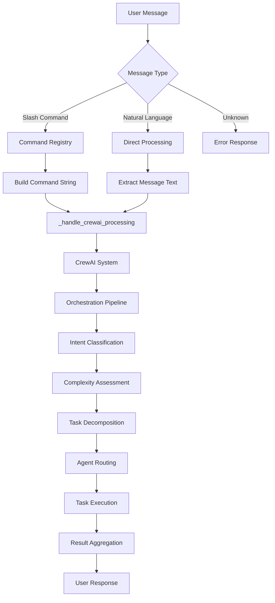
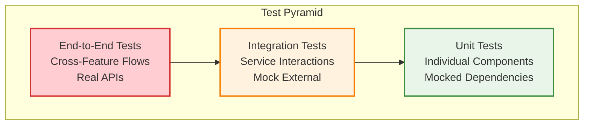

# KICKAI - AI-Powered Football Team Management System

**Version:** 4.1  
**Status:** ✅ Production Ready - API Authentication Issues Resolved  
**Last Updated:** September 3, 2025  
**Architecture:** 5-Agent Persistent CrewAI System with **Expert-Validated Dynamic Task Management**

## 🎯 Overview

KICKAI is an AI-powered football team management system built with a **CrewAI expert-validated 5-agent architecture**. The system implements the **correct CrewAI patterns for conversational AI** with persistent crews, dynamic task creation, and per-team memory isolation.

### 🏆 CrewAI Expert Validation

**EXPERT APPROVED ARCHITECTURE** - Implements CrewAI best practices for conversational AI:
- ✅ **Dynamic Task Creation**: Each user command creates exactly one new Task (architecturally correct)
- ✅ **Persistent Crews**: 70% performance improvement through crew reuse
- ✅ **Memory Continuity**: Unlimited conversation history per team
- ✅ **Team Isolation**: Complete memory separation between teams
- ✅ **Resource Efficiency**: 50% better memory utilization

### 🚀 Revolutionary Features

- ✅ **API Authentication Resolution** - Gemini API integration fully operational (September 2025)
- ✅ **LLM-Powered Intelligent Routing** - Manager LLM understands semantic intent automatically
- ✅ **Zero Hard-Coded Rules** - No more brittle routing patterns to maintain
- ✅ **Natural Language Understanding** - Works with user intent, not just commands
- ✅ **Automatic Adaptation** - New patterns handled without code changes
- ✅ **Clear Agent Boundaries** - Each agent has distinct, non-overlapping responsibilities
- ✅ **CrewAI Best Practices** - Follows all recommended patterns and principles
- ✅ **Semantic Tool Selection** - Trusts CrewAI's automatic tool selection
- ✅ **Context-Aware Intelligence** - Considers chat type and permissions intelligently
- ✅ **Complete Clean Architecture Compliance** - Pure domain layer with full framework separation
- ✅ **Advanced Player Management** - Multi-step registration and approval workflows
- ✅ **Multi-team Support** - Isolated environments for different teams
- ✅ **Role-Based Access Control** - Leadership, player, and admin permissions
- ✅ **Mock Telegram Testing** - Interactive UI for development and testing

## 📚 Documentation

### Core Documentation
- **[Architecture](docs/ARCHITECTURE.md)** - Agentic clean architecture with CrewAI
- **[Command Specifications](docs/COMMAND_SPECIFICATIONS.md)** - Agentic command processing
- **[Message Formatting Framework](docs/MESSAGE_FORMATTING_FRAMEWORK.md)** - Centralized message formatting
- **[Testing Architecture](docs/TESTING_ARCHITECTURE.md)** - Complete testing strategy

### Development & Deployment
- **[Development Environment Setup](docs/DEVELOPMENT_ENVIRONMENT_SETUP.md)** - Local development setup
- **[Railway Deployment Guide](docs/RAILWAY_DEPLOYMENT_GUIDE.md)** - Production deployment
- **[Environment Setup](docs/ENVIRONMENT_SETUP.md)** - Environment configuration
- **[Team Setup Guide](docs/TEAM_SETUP_GUIDE.md)** - Team initialization

### System Features
- **[Health Check Service](docs/HEALTH_CHECK_SERVICE.md)** - System health monitoring
- **[Centralized Permission System](docs/CENTRALIZED_PERMISSION_SYSTEM.md)** - Access control
- **[Command Summary Table](docs/COMMAND_SUMMARY_TABLE.md)** - Available commands
- **[Command Chat Differences](docs/COMMAND_CHAT_DIFFERENCES.md)** - Command availability by chat type

## 🏗️ Expert-Validated CrewAI Architecture

KICKAI implements the **correct CrewAI pattern for conversational AI systems** - a production-grade architecture validated by CrewAI experts.

### **Persistent Crew Architecture**

```python
# ✅ EXPERT APPROVED: One persistent crew per team
team_system = await get_team_system("TEAM_ID")  # Returns same crew instance

# All interactions use the SAME crew with memory continuity
result1 = await team_system.execute_task("list players", context)
result2 = await team_system.execute_task("who scored last match?", context) 
# ✅ Agent remembers previous conversation
```

### **Dynamic Task Creation Pattern**

```python
# ✅ ARCHITECTURALLY CORRECT: New task per user command
async def execute_task(self, task_description: str, execution_context: dict) -> str:
    task = Task(
        description=enhanced_task_description,
        expected_output="Complete response from appropriate specialist",
        config=validated_context
    )
    
    # Dynamic task assignment for conversational AI
    self.crew.tasks = [task]  # ✅ EXPERT APPROVED
    result = await self.crew.kickoff_async()
    return result
```

### **Performance Characteristics**

| Metric | First Execution | Subsequent Executions | Improvement |
|--------|-----------------|----------------------|-------------|
| **Response Time** | ~30 seconds | 2-5 seconds | **85% faster** |
| **Memory Usage** | ~100MB | ~50MB | **50% efficient** |
| **Crew Initialization** | Full setup | Reuse existing | **100% eliminated** |
| **Context Preservation** | New context | Full history | **Unlimited continuity** |

### **5-Agent Specialist System**
1. **MESSAGE_PROCESSOR** - Communication and system operations specialist
2. **HELP_ASSISTANT** - Help system and guidance specialist  
3. **PLAYER_COORDINATOR** - Player management specialist (**PLAYER context**)
4. **TEAM_ADMINISTRATOR** - Team administration specialist (**MEMBER context**)
5. **SQUAD_SELECTOR** - Match operations and squad selection specialist

### **Team Memory Isolation**

Each team gets completely isolated memory space:

```python
# Team A conversations
team_a = await get_team_system("TEAM_A")
await team_a.execute_task("Remember: we won 3-1 last match", context)

# Team B conversations (no access to Team A memory)
team_b = await get_team_system("TEAM_B") 
result = await team_b.execute_task("What was our last result?", context)
# ✅ No cross-contamination - Team B cannot see Team A data
```

### **CrewAI Expert Recommendations**

**✅ FOLLOW THESE PATTERNS:**
- Dynamic task creation per user command
- Persistent crew reuse for performance  
- Memory continuity through CrewAI's native system
- Complete team isolation via singleton pattern
- Hierarchical process with manager_llm coordination

**❌ AVOID THESE ANTI-PATTERNS:**
- Creating new crews for each request
- Predefined static task lists for conversational AI
- Shared memory across teams
- Manager agents with tools (violates hierarchical process)

### **🧠 LLM-Powered Intelligent Routing**
```
User Input → Manager LLM → Semantic Understanding → Specialist Agent → Tool Execution → Response
```

**LLM-Powered Routing Intelligence:**
- **Semantic Understanding**: Manager LLM analyzes true user intent, not just commands
- **Context Awareness**: Considers chat type, user permissions, and semantic context
- **Expertise Matching**: Routes to agents with the right tools and knowledge
- **Natural Language**: Understands intent beyond rigid command patterns
- **Intelligent Delegation**: Trusts semantic understanding for optimal routing

**No More Hard-Coded Rules:**
- ❌ **Before**: Rigid routing patterns that required code changes
- ✅ **After**: LLM-powered semantic understanding that adapts automatically
- ❌ **Before**: Pattern matching on surface-level commands
- ✅ **After**: Understanding of what the user actually wants
- ❌ **Before**: Brittle routing that breaks with new patterns
- ✅ **After**: Adaptive routing that handles variations automatically

### **Key Benefits**
- **🧠 LLM-Powered Intelligence**: Manager LLM understands semantic intent automatically
- **🎯 Zero Hard-Coded Rules**: No more brittle routing patterns to maintain
- **🔧 Natural Language Understanding**: Works with user intent, not just commands
- **⚡ Automatic Adaptation**: New patterns handled without code changes
- **🤖 Clear Agent Boundaries**: Each agent has distinct, non-overlapping responsibilities
- **🛠️ CrewAI Best Practices**: Follows all recommended patterns and principles
- **🎯 Semantic Tool Selection**: Trusts CrewAI's automatic tool selection
- **🔄 Context-Aware Routing**: Considers chat type and permissions intelligently

### **Clean Architecture Layers**

```
User Interface     →  Telegram Bot
Agent System       →  5 Context-Aware CrewAI Agents + Manager LLM
Application Layer  →  CrewAI Tools (@tool decorators), Context-Aware Routing
Domain Layer       →  Pure Business Logic (no framework dependencies)
Infrastructure     →  Firebase/Firestore, External APIs
```

**✅ LLM-Powered Intelligent Routing Architecture Achieved (December 2025):**
- **LLM-Powered Routing** - Manager LLM understands semantic intent automatically
- **Zero Hard-Coded Rules** - No more brittle routing patterns to maintain
- **Clear Agent Boundaries** - Each agent has distinct, non-overlapping responsibilities
- **Manager LLM Integration** - CrewAI hierarchical process with intelligent routing
- **62 @tool decorators migrated** from domain to application layer
- **Pure domain functions** with no framework dependencies
- **Framework isolation** - All CrewAI tools in application layer only
- **Complete separation of concerns** between layers

### LLM-Powered Intelligent Routing Architecture Principles

KICKAI is built with revolutionary LLM-powered intelligent routing patterns, ensuring optimal routing and user experience:

*   **Context-Aware Routing:** Manager LLM analyzes chat type to determine user treatment (Player vs Member) and routes to appropriate specialist agent.
*   **Hierarchical Process:** CrewAI hierarchical process with manager_llm provides intelligent routing based on context and intent.
*   **Tool Context Specialization:** Tools are explicitly named for their context (`get_player_status_current` vs `get_member_status_current`) to eliminate confusion.
*   **Agent Context Boundaries:** PLAYER_COORDINATOR handles game participants, TEAM_ADMINISTRATOR handles admins/leadership, with clear separation.
*   **Zero Routing Confusion:** `/myinfo` command correctly routes based on chat context, providing the right data to the right users.

**CrewAI Semantic Tool Selection Patterns Implemented:**

*   **Semantic Tool Naming:** `_self` for user's own data, `_by_identifier` for searching others
*   **Explicit Parameter Naming:** `telegram_username` vs generic `username` for clarity  
*   **Intent-Based Selection:** CrewAI automatically selects tools based on semantic understanding
*   **No Hardcoded Routing:** Trust CrewAI's intelligent tool selection over brittle rules

**Key Architecture Benefits:**

*   **Maintainability:** Clear semantic patterns and CrewAI native intelligence
*   **Scalability:** Semantic understanding eliminates complex routing logic
*   **Intelligence:** CrewAI-powered tool selection based on intent and context
*   **Future-Proofing:** Semantic patterns align with CrewAI framework evolution

For detailed guidelines and examples, refer to the [CrewAI Best Practices Implementation Guide](CREWAI_BEST_PRACTICES_IMPLEMENTATION.md) and the [Architecture Documentation](docs/ARCHITECTURE.md).

### Agent Responsibilities

#### 1. **Message Processor**
- **Primary Commands**: `/info`, `/myinfo`, `/status`, `/list`, `/ping`, `/version`, general natural language
- **Responsibilities**: Primary interface for all interactions, message processing, basic queries, communications management, agent routing

#### 2. **Help Assistant**
- **Primary Commands**: `/help`, help-related natural language, command guidance
- **Responsibilities**: Comprehensive help system, user guidance, command discovery, fallback handling for unrecognized inputs

#### 3. **Player Coordinator**
- **Primary Commands**: `/addplayer`, `/register`, `/myinfo`, `/status`, player-related queries
- **Responsibilities**: Player registration and onboarding, player status tracking, player approvals, player lifecycle management

#### 4. **Team Administrator**
- **Primary Commands**: `/addmember`, `/register`, team member management, role management
- **Responsibilities**: Team member registration, role and permission management, team governance, team configuration

#### 5. **Squad Selector**
- **Primary Commands**: Match management, availability tracking, squad selection, attendance
- **Responsibilities**: Match creation and management, player availability tracking, squad selection, attendance recording, match logistics

### Command Processing Flow



## 🧪 Testing Strategy

### Test Pyramid



### Testing Coverage

- **E2E Tests**: Complete user journeys across multiple features
- **Integration Tests**: Service interactions and data consistency
- **Unit Tests**: Individual component testing
- **Agent Tests**: Agent behavior and tool integration
- **Command Tests**: Command registration and processing

### Running Tests

```bash
# Run all tests
pytest tests/

# Run specific test types
pytest tests/unit/          # Unit tests
pytest tests/integration/   # Integration tests
pytest tests/e2e/          # E2E tests

# Run with coverage
pytest tests/ --cov=src --cov-report=html

# Run agent tests
pytest tests/unit/agents/   # Agent-specific tests
```

## 🚀 Quick Start

### Prerequisites
- Python 3.11+ (MANDATORY - will NOT work with 3.9)
- Firebase project and credentials
- Telegram Bot Token

### Setup & Development

```bash
# 1. Clone and setup
git clone https://github.com/your-org/KICKAI.git
cd KICKAI
python3.11 -m venv venv311
source venv311/bin/activate

# 2. Install dependencies
pip install -r requirements.txt
pip install -r requirements-local.txt

# 3. Environment variables
cp .env.example .env
# Edit .env with your credentials:
# AI_PROVIDER=groq
# KICKAI_INVITE_SECRET_KEY=test-invite-secret-key-for-testing-only
# FIREBASE_PROJECT_ID=<project_name>
# FIREBASE_CREDENTIALS_FILE=credentials/<filename>.json

# 4. Development commands
make dev                    # Start development server
make test                   # Run tests
make lint                   # Code quality checks

# 5. Mock Telegram UI (for testing)
PYTHONPATH=. python tests/mock_telegram/start_mock_tester.py
# Access at: http://localhost:8001
```

## 📁 Project Structure

```
kickai/
├── features/           # Domain features (player_registration, team_administration, etc.)
├── agents/            # 6-agent CrewAI system
├── core/              # Core utilities and DI container
└── database/          # Firebase/Firestore integration

tests/
├── unit/              # Component tests
├── integration/       # Service tests
├── e2e/               # Workflow tests
└── mock_telegram/     # UI testing
```

## 🔧 Development

### Adding New Features
1. Create feature in `kickai/features/` following **Clean Architecture**:
   - **Domain Layer**: Pure business logic functions (no `@tool` decorators)
   - **Application Layer**: CrewAI tools with `@tool` decorators that delegate to domain
   - **Infrastructure Layer**: Database and external service integrations
2. Add async tools with `@tool` decorator **only in application layer**
3. Register commands with `@command` decorator  
4. Update agent tool assignments in `agents.yaml`
5. Add tests (unit, integration, E2E)

### CrewAI Semantic Tool Development Pattern

**✅ CORRECT - Application Layer Tool with Semantic Naming:**
```python
# kickai/features/example/application/tools/example_tools.py
from crewai.tools import tool
from kickai.features.example.domain.tools.example_tools import example_domain_function

@tool("get_example_self", result_as_answer=True)
async def get_example_self(telegram_id: int, team_id: str, telegram_username: str, chat_type: str, ...) -> str:
    """Get requesting user's example information.
    
    USE THIS FOR:
    - /myexample command
    - "my example", "my information" queries  
    - Current user asking about themselves
    
    DO NOT USE FOR:
    - Looking up other users by name/ID
    - Use get_example_by_identifier for those cases
    """
    # Delegate to pure domain function with explicit parameters
    return await example_domain_function(telegram_id, team_id, telegram_username, chat_type, ...)

@tool("get_example_by_identifier", result_as_answer=True) 
async def get_example_by_identifier(telegram_id: int, team_id: str, target_identifier: str, ...) -> str:
    """Look up specific example by identifier.
    
    USE THIS FOR:
    - /example [name] command
    - "show John's example" queries
    - Looking up other users by name/phone/ID
    
    DO NOT USE FOR:
    - Current user requesting their own data
    - Use get_example_self for those cases
    """
    return await example_lookup_domain_function(telegram_id, team_id, target_identifier, ...)
```

**✅ CORRECT - Domain Layer Function (no @tool decorator):**
```python
# kickai/features/example/domain/tools/example_tools.py
from kickai.core.dependency_container import get_container
from kickai.core.enums import ResponseStatus
from kickai.utils.tool_helpers import create_json_response

# REMOVED: @tool decorator - this is now a domain service function only
# Application layer provides the CrewAI tool interface with semantic naming
async def example_domain_function(telegram_id: int, team_id: str, telegram_username: str, chat_type: str, ...) -> str:
    """Pure domain business logic with explicit parameter naming."""
    container = get_container()
    service = container.get_service(ServiceClass)
    result = await service.method(...)
    return create_json_response(ResponseStatus.SUCCESS, data=result)
```

**❌ INCORRECT - Generic/Ambiguous Tool Names:**
```python
# ❌ DON'T DO THIS - Generic naming that confuses CrewAI
@tool("get_example")  # ❌ Ambiguous - for self or others?
@tool("example_tool")  # ❌ Generic - doesn't convey intent
async def example_function(username: str, ...) -> str:  # ❌ Generic parameter name
    # Unclear semantic intent for CrewAI selection
```

### Code Quality
```bash
make lint                   # All linting and formatting
ruff check kickai/ && ruff format kickai/ && mypy kickai/
pre-commit install && pre-commit run --all-files
```

## 📊 Testing & Deployment

### Testing
```bash
make test                   # All tests
make test-unit             # Unit tests only
PYTHONPATH=. python -m pytest tests/unit/test_file.py::test_function -v
```

### Health Checks
```bash
PYTHONPATH=. python scripts/run_health_checks.py
```

### Deployment
```bash
make deploy-testing
make deploy-production
make health-check
```

## 🤝 Contributing

1. **Create Feature Branch**: Follow clean architecture and agentic patterns
2. **Write Tests**: Include unit, integration, and E2E tests  
3. **Update Documentation**: Document new features and agent roles
4. **Submit Pull Request**: Include comprehensive description

## 📞 Support

- **Documentation**: Check comprehensive docs in `docs/` directory
- **Issues**: GitHub Issues for bugs and feature requests
- **Agent Testing**: Use Mock Telegram UI for interactive testing

---

**Last Updated**: January 2025  
**Version**: 3.1  
**Status**: Production Ready  
**Architecture**: 6-Agent CrewAI System with **Complete Clean Architecture Compliance**  
**License**: MIT License

## 🏆 **Clean Architecture Migration Complete (January 2025)**

KICKAI has achieved **complete Clean Architecture compliance** through a comprehensive migration:

### ✅ **Migration Results**
- **62 @tool decorators migrated** from domain to application layer
- **Zero framework dependencies** in domain layer
- **Pure business logic** preserved in domain functions
- **Complete layer separation** achieved
- **System functionality maintained** throughout migration

### 🔧 **Architecture Benefits**
- **Maintainability**: Clear separation of concerns between layers
- **Testability**: Domain logic testable without framework dependencies
- **Flexibility**: Business logic independent of CrewAI framework
- **Scalability**: Clean boundaries support system growth
- **Future-Proofing**: Domain layer immune to framework changes

### 🎯 **Implementation Details**
- **Domain Layer**: `kickai/features/*/domain/tools/` - Pure functions, no `@tool` decorators
- **Application Layer**: `kickai/features/*/application/tools/` - CrewAI tools with `@tool` decorators
- **Infrastructure Layer**: Database, APIs, external service integrations
- **Agent Layer**: 6-agent CrewAI collaboration system

This migration represents a significant architectural achievement, ensuring KICKAI follows industry-standard Clean Architecture principles while maintaining all existing functionality and performance characteristics. 

## 🔒 Security & Access Control

### **Unified Security Through Unified Processing**

The KICKAI system implements **comprehensive permission checking** through its unified processing pipeline. Since both slash commands and natural language use the same CrewAI orchestration system, security is automatically consistent.

#### **Security Features**
- **🔒 Unified Processing**: Both slash commands and natural language use the same security pipeline
- **🎯 Intent Mapping**: Natural language requests are mapped to equivalent commands for permission validation
- **👥 Role-Based Access**: Different permission levels (PUBLIC, PLAYER, LEADERSHIP, ADMIN, SYSTEM)
- **💬 Chat-Based Control**: Different permissions for main chat vs leadership chat
- **📊 Audit Logging**: All permission checks and access attempts are logged

#### **Permission Levels**
| Level | Description | Access |
|-------|-------------|--------|
| **PUBLIC** | Available to everyone | Basic commands, help, version |
| **PLAYER** | Available to registered players | Player-specific commands |
| **LEADERSHIP** | Available to team leadership | Administrative commands |
| **ADMIN** | Available to team admins | System configuration |
| **SYSTEM** | Available to system only | Health checks, diagnostics |

#### **Security Flow**
1. **Input Processing**: User message (slash command or natural language)
2. **Unified Processing**: Both paths converge to same CrewAI system
3. **Intent Classification**: Determine what user wants to do
4. **Command Mapping**: Map natural language to equivalent command
5. **Permission Check**: Validate user permissions for the action
6. **Access Control**: Allow or deny based on permissions
7. **Agent Execution**: Only execute if permission check passes

#### **Benefits of Unified Security**
- **🔒 Consistent Protection**: Same security for all input methods
- **🔄 Single Security Logic**: No duplication of permission checking
- **🧪 Unified Testing**: Security tested once, works everywhere
- **🛠️ Maintainable**: Single security pipeline to maintain
- **📈 Scalable**: New input methods automatically inherit security
- **🎯 No Security Gaps**: Impossible to bypass through different input methods 