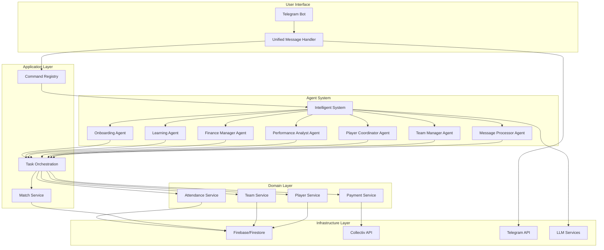
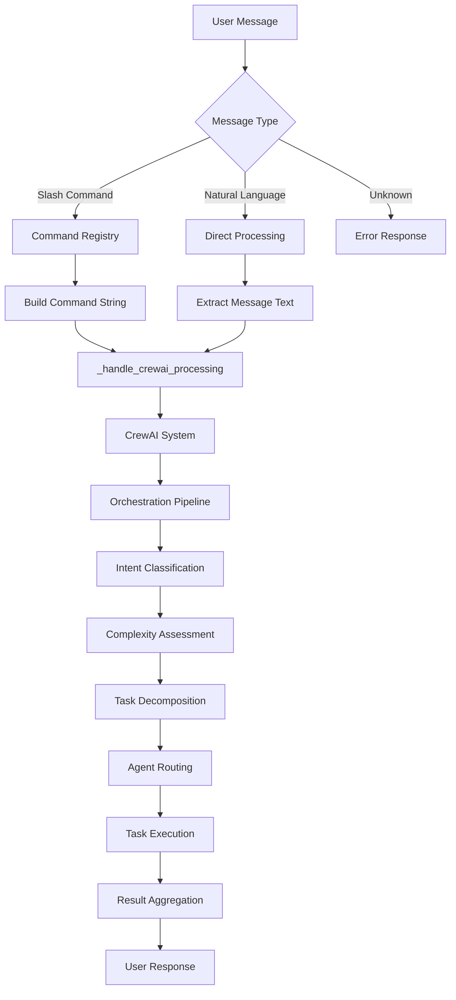
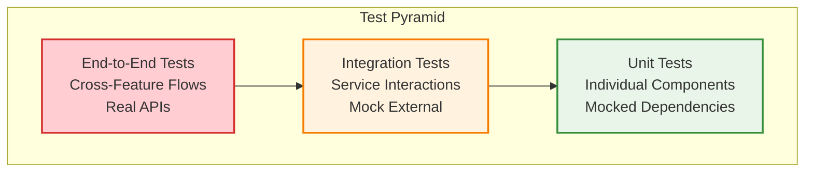

# KICKAI - AI-Powered Football Team Management System

**Version:** 3.0  
**Status:** Production Ready  
**Last Updated:** December 2024  
**Architecture:** Agentic Clean Architecture with CrewAI

## 🎯 Overview

KICKAI is an AI-powered football team management system that combines advanced AI capabilities with practical team management tools. The system uses a sophisticated 8-agent CrewAI architecture to provide intelligent, context-aware responses to team management needs through an agentic-first approach.

### 🚀 Key Features

- ✅ **8-Agent CrewAI System** for intelligent task processing
- ✅ **Agentic-First Architecture** with no dedicated command handlers
- ✅ **Feature-First Clean Architecture** with clean separation of concerns
- ✅ **Dynamic Command Discovery** from centralized registry
- ✅ **Context-Aware Responses** based on chat type and user permissions
- ✅ **🔒 Comprehensive Security** with permission checking for both slash commands and natural language
- ✅ **Advanced Player Onboarding** with multi-step registration
- ✅ **Multi-team Management** with isolated environments
- ✅ **Payment System Integration** with Collectiv
- ✅ **Role-Based Access Control** for leadership and members
- ✅ **Unified Message Formatting** with centralized service
- ✅ **Intelligent Routing System** with LLM-powered agent selection

## 📚 Documentation

### Core Documentation
- **[Architecture](docs/ARCHITECTURE.md)** - Agentic clean architecture with CrewAI
- **[Command Specifications](docs/COMMAND_SPECIFICATIONS.md)** - Agentic command processing
- **[Message Formatting Framework](docs/MESSAGE_FORMATTING_FRAMEWORK.md)** - Centralized message formatting
- **[Testing Architecture](docs/TESTING_ARCHITECTURE.md)** - Complete testing strategy

### Development & Deployment
- **[Development Environment Setup](docs/DEVELOPMENT_ENVIRONMENT_SETUP.md)** - Local development setup
- **[Railway Deployment Guide](docs/RAILWAY_DEPLOYMENT_GUIDE.md)** - Production deployment
- **[Environment Setup](docs/ENVIRONMENT_SETUP.md)** - Environment configuration
- **[Team Setup Guide](docs/TEAM_SETUP_GUIDE.md)** - Team initialization

### System Features
- **[Health Check Service](docs/HEALTH_CHECK_SERVICE.md)** - System health monitoring
- **[Centralized Permission System](docs/CENTRALIZED_PERMISSION_SYSTEM.md)** - Access control
- **[Command Summary Table](docs/COMMAND_SUMMARY_TABLE.md)** - Available commands
- **[Command Chat Differences](docs/COMMAND_CHAT_DIFFERENCES.md)** - Command availability by chat type

## 🏗️ Architecture

KICKAI follows a **Clean Architecture** with **Agentic-First Design** using CrewAI. The system is built around a **unified processing pipeline** where both slash commands and natural language converge to the same CrewAI orchestration system.

### **Unified Processing Architecture**

**Key Insight**: Both slash commands and natural language use the **exact same processing pipeline**.

#### **Processing Flow**
1. **Input Processing**: Handle both slash commands and natural language
2. **Command Registry**: Auto-discovery and metadata for slash commands  
3. **Unified Processing**: Both paths converge to `_handle_crewai_processing`
4. **CrewAI System**: Single orchestration pipeline for all requests
5. **Intent Classification**: Determine user intent (for both input types)
6. **Complexity Assessment**: Analyze request complexity
7. **Task Decomposition**: Break down into subtasks with agent assignments
8. **Agent Routing**: Route subtasks to appropriate agents
9. **Task Execution**: Execute tasks through specialized agents
10. **Result Aggregation**: Combine results and format response

#### **Benefits of Unified Processing**
- **🔒 Consistent Security**: Same permission checking for both input types
- **🔄 Single Source of Truth**: No code duplication between paths
- **🧪 Unified Testing**: Test once, works for both input methods
- **🛠️ Maintainable**: Single processing pipeline to maintain
- **📈 Scalable**: Easy to add new input methods (voice, buttons, etc.)
- **🎯 Consistent Behavior**: Same agent selection and execution logic

### Agent System



### Agent Responsibilities

#### 1. **HelpAssistantAgent**
- **Primary Commands**: `/help`, help-related natural language
- **Responsibilities**: Context-aware help information, user validation, command discovery

#### 2. **MessageProcessorAgent**
- **Primary Commands**: `/start`, `/version`, general natural language
- **Responsibilities**: Message parsing, intent classification, agent routing

#### 3. **PlayerCoordinatorAgent**
- **Primary Commands**: `/register`, `/myinfo`, `/status`
- **Responsibilities**: Player registration, individual support, status tracking

#### 4. **TeamManagerAgent**
- **Primary Commands**: `/list`, `/add`, `/approve`, `/reject`, `/team`, `/invite`, `/announce`
- **Responsibilities**: Team administration, player management, coordination

#### 5. **SystemInfrastructureAgent**
- **Primary Commands**: `/health`, `/config`
- **Responsibilities**: System health monitoring, configuration management

### Command Processing Flow



## 🧪 Testing Strategy

### Test Pyramid



### Testing Coverage

- **E2E Tests**: Complete user journeys across multiple features
- **Integration Tests**: Service interactions and data consistency
- **Unit Tests**: Individual component testing
- **Agent Tests**: Agent behavior and tool integration
- **Command Tests**: Command registration and processing

### Running Tests

```bash
# Run all tests
pytest tests/

# Run specific test types
pytest tests/unit/          # Unit tests
pytest tests/integration/   # Integration tests
pytest tests/e2e/          # E2E tests

# Run with coverage
pytest tests/ --cov=src --cov-report=html

# Run agent tests
pytest tests/unit/agents/   # Agent-specific tests
```

## 🚀 Quick Start

### Prerequisites

- Python 3.11+
- Firebase project
- Telegram Bot Token
- Collectiv API credentials

### Installation

```bash
# Clone the repository
git clone https://github.com/your-org/KICKAI.git
cd KICKAI

# Create virtual environment
python -m venv venv
source venv/bin/activate  # On Windows: venv\Scripts\activate

# Install dependencies
pip install -r requirements.txt
pip install -r requirements-local.txt

# Set up environment
cp .env.example .env
# Edit .env with your credentials

# Run tests
pytest tests/

# Start the bot locally
python run_bot_local.py

# Or start with safe mode
./start_bot_safe.sh
```

### Environment Setup

```bash
# Required environment variables
TELEGRAM_BOT_TOKEN=your_bot_token
FIREBASE_CREDENTIALS=path_to_firebase_credentials.json
COLLECTIV_API_KEY=your_collectiv_api_key
TEAM_ID=your_team_id
```

## 📁 Project Structure

```
KICKAI/
├── src/                          # Main source code
│   ├── features/                 # Feature-based modules
│   │   ├── player_registration/  # Player onboarding
│   │   ├── team_administration/  # Team management
│   │   ├── match_management/     # Match operations
│   │   ├── attendance_management/ # Attendance tracking
│   │   ├── payment_management/   # Payment processing
│   │   ├── communication/        # Messaging
│   │   ├── health_monitoring/    # System health
│   │   └── system_infrastructure/ # Core services
│   ├── agents/                   # AI Agent System
│   │   ├── crew_agents.py        # Main agent definitions
│   │   ├── configurable_agent.py # Base agent class
│   │   └── behavioral_mixins.py  # Agent behavior patterns
│   ├── core/                     # Core utilities
│   │   ├── command_registry.py   # Command registration
│   │   └── base_tool.py          # Base tool class
│   ├── database/                 # Data layer
│   └── utils/                    # Utilities
├── tests/                        # Test suite
│   ├── unit/                     # Unit tests
│   ├── integration/              # Integration tests
│   ├── e2e/                      # E2E tests
│   └── frameworks/               # Test frameworks
├── docs/                         # Documentation
├── scripts/                      # Utility scripts
└── setup/                        # Setup scripts
```

## 🔧 Development

### Code Quality

```bash
# Run linting
pre-commit install
pre-commit run --all-files

# Run type checking
mypy src/

# Run security checks
bandit -r src/
```

### Adding New Features

1. **Follow Feature-First Architecture**: Create new features in `src/features/`
2. **Implement Clean Architecture**: Follow the layered architecture pattern
3. **Use Agentic Patterns**: Delegate to CrewAI agents for user interactions
4. **Write Comprehensive Tests**: Include unit, integration, and E2E tests
5. **Update Documentation**: Document new features and agent interactions

### Agent Development

When adding new agents or modifying existing ones:

1. **Define Agent Role**: Clear responsibility and primary commands
2. **Implement Tools**: Create domain-specific tools for the agent
3. **Configure Context**: Ensure proper context configuration
4. **Test Agent Behavior**: Verify agent responses and tool usage
5. **Update Registry**: Register agent and tools in appropriate registries

### Command Development

When adding new commands:

1. **Register Command**: Use `@command` decorator in feature module
2. **Delegate to Agent**: No direct implementation - delegate to CrewAI agent
3. **Define Permissions**: Set appropriate permission levels
4. **Add Tests**: Test command registration and agent routing
5. **Update Documentation**: Document command behavior and agent assignment

## 📊 Monitoring & Observability

### Health Checks

```bash
# Run health checks
python scripts/run_health_checks.py

# Monitor system status
python scripts/monitor_system.py
```

### Logging

The system uses structured logging with different levels:
- **INFO**: General operational information
- **WARNING**: Potential issues that don't stop operation
- **ERROR**: Errors that need attention
- **DEBUG**: Detailed debugging information

### Agent Monitoring

- **Agent Performance**: Track agent response times and success rates
- **Tool Usage**: Monitor tool usage patterns and effectiveness
- **Command Routing**: Track command routing accuracy
- **User Engagement**: Monitor user interactions with agents

## 🤝 Contributing

### Development Workflow

1. **Create Feature Branch**: `git checkout -b feature/new-feature`
2. **Implement Feature**: Follow clean architecture and agentic principles
3. **Write Tests**: Include unit, integration, and E2E tests
4. **Test Agent Behavior**: Verify agent interactions and responses
5. **Update Documentation**: Document new features and agent roles
6. **Submit Pull Request**: Include comprehensive description

### Code Review Checklist

- [ ] Follows clean architecture principles
- [ ] Uses agentic patterns for user interactions
- [ ] Includes comprehensive test coverage
- [ ] Agent behavior is properly tested
- [ ] Documentation is updated
- [ ] No breaking changes to existing flows
- [ ] Performance impact is acceptable

## 📈 Roadmap

### Short Term (Next 3 Months)
- [ ] Enhanced agent capabilities and tool integration
- [ ] Advanced natural language processing
- [ ] Performance optimization for agent interactions
- [ ] Advanced analytics dashboard

### Medium Term (3-6 Months)
- [ ] Microservices architecture migration
- [ ] Advanced AI capabilities and learning
- [ ] Multi-language support
- [ ] Advanced reporting features

### Long Term (6+ Months)
- [ ] Machine learning pipeline for agent improvement
- [ ] Predictive analytics and insights
- [ ] Advanced team management features
- [ ] Integration with external systems

## 📞 Support

### Getting Help

- **Documentation**: Check the comprehensive documentation in `docs/`
- **Issues**: Report bugs and feature requests via GitHub Issues
- **Discussions**: Use GitHub Discussions for questions and ideas
- **Agent Testing**: Use agent-specific tests for debugging

### Contact

- **Development Team**: [team@kickai.com](mailto:team@kickai.com)
- **Support**: [support@kickai.com](mailto:support@kickai.com)
- **Documentation**: [docs@kickai.com](mailto:docs@kickai.com)

---

**Last Updated**: December 2024  
**Version**: 3.0  
**Status**: Production Ready  
**Architecture**: Agentic Clean Architecture with CrewAI  
**License**: MIT License 

## 🔒 Security & Access Control

### **Unified Security Through Unified Processing**

The KICKAI system implements **comprehensive permission checking** through its unified processing pipeline. Since both slash commands and natural language use the same CrewAI orchestration system, security is automatically consistent.

#### **Security Features**
- **🔒 Unified Processing**: Both slash commands and natural language use the same security pipeline
- **🎯 Intent Mapping**: Natural language requests are mapped to equivalent commands for permission validation
- **👥 Role-Based Access**: Different permission levels (PUBLIC, PLAYER, LEADERSHIP, ADMIN, SYSTEM)
- **💬 Chat-Based Control**: Different permissions for main chat vs leadership chat
- **📊 Audit Logging**: All permission checks and access attempts are logged

#### **Permission Levels**
| Level | Description | Access |
|-------|-------------|--------|
| **PUBLIC** | Available to everyone | Basic commands, help, version |
| **PLAYER** | Available to registered players | Player-specific commands |
| **LEADERSHIP** | Available to team leadership | Administrative commands |
| **ADMIN** | Available to team admins | System configuration |
| **SYSTEM** | Available to system only | Health checks, diagnostics |

#### **Security Flow**
1. **Input Processing**: User message (slash command or natural language)
2. **Unified Processing**: Both paths converge to same CrewAI system
3. **Intent Classification**: Determine what user wants to do
4. **Command Mapping**: Map natural language to equivalent command
5. **Permission Check**: Validate user permissions for the action
6. **Access Control**: Allow or deny based on permissions
7. **Agent Execution**: Only execute if permission check passes

#### **Benefits of Unified Security**
- **🔒 Consistent Protection**: Same security for all input methods
- **🔄 Single Security Logic**: No duplication of permission checking
- **🧪 Unified Testing**: Security tested once, works everywhere
- **🛠️ Maintainable**: Single security pipeline to maintain
- **📈 Scalable**: New input methods automatically inherit security
- **🎯 No Security Gaps**: Impossible to bypass through different input methods 