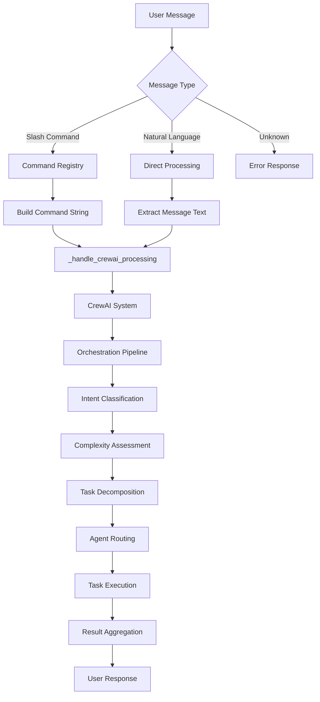
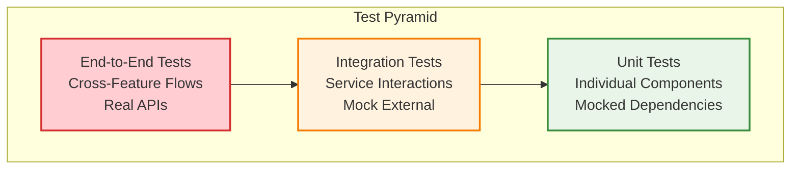

# KICKAI - AI-Powered Football Team Management System

**Version:** 3.1  
**Status:** Production Ready  
**Last Updated:** January 2025  
**Architecture:** 6-Agent CrewAI System with Clean Architecture

## 🎯 Overview

KICKAI is an AI-powered football team management system built with a **6-agent CrewAI architecture** and clean architecture principles. The system processes ALL user interactions through specialized AI agents, ensuring intelligent, context-aware responses.

### 🚀 Key Features

- ✅ **6-Agent CrewAI System** - Specialized AI agents for intelligent task processing
- ✅ **Native Async Tools** - CrewAI integration with async/await patterns
- ✅ **Feature-First Clean Architecture** - Domain-driven design with clear separation
- ✅ **Unified Processing Pipeline** - Same pipeline for commands and natural language
- ✅ **Context-Aware Security** - Permission checking based on chat type and user roles
- ✅ **Advanced Player Management** - Multi-step registration and approval workflows
- ✅ **Multi-team Support** - Isolated environments for different teams
- ✅ **Role-Based Access Control** - Leadership, player, and admin permissions
- ✅ **Mock Telegram Testing** - Interactive UI for development and testing

## 📚 Documentation

### Core Documentation
- **[Architecture](docs/ARCHITECTURE.md)** - Agentic clean architecture with CrewAI
- **[Command Specifications](docs/COMMAND_SPECIFICATIONS.md)** - Agentic command processing
- **[Message Formatting Framework](docs/MESSAGE_FORMATTING_FRAMEWORK.md)** - Centralized message formatting
- **[Testing Architecture](docs/TESTING_ARCHITECTURE.md)** - Complete testing strategy

### Development & Deployment
- **[Development Environment Setup](docs/DEVELOPMENT_ENVIRONMENT_SETUP.md)** - Local development setup
- **[Railway Deployment Guide](docs/RAILWAY_DEPLOYMENT_GUIDE.md)** - Production deployment
- **[Environment Setup](docs/ENVIRONMENT_SETUP.md)** - Environment configuration
- **[Team Setup Guide](docs/TEAM_SETUP_GUIDE.md)** - Team initialization

### System Features
- **[Health Check Service](docs/HEALTH_CHECK_SERVICE.md)** - System health monitoring
- **[Centralized Permission System](docs/CENTRALIZED_PERMISSION_SYSTEM.md)** - Access control
- **[Command Summary Table](docs/COMMAND_SUMMARY_TABLE.md)** - Available commands
- **[Command Chat Differences](docs/COMMAND_CHAT_DIFFERENCES.md)** - Command availability by chat type

## 🏗️ System Architecture

KICKAI uses a **6-agent CrewAI architecture** with clean architecture principles. The system processes all user interactions through specialized AI agents using a unified pipeline.

### **6-Agent CrewAI System**
1. **MessageProcessorAgent** - Primary interface and routing
2. **HelpAssistantAgent** - Help system and guidance  
3. **PlayerCoordinatorAgent** - Player management
4. **TeamAdministrationAgent** - Team member management
5. **SquadSelectorAgent** - Squad selection and availability
6. **NLPProcessorAgent** - Natural language processing and understanding

### **Processing Flow**
```
User Input → AgenticMessageRouter → CrewAI Agent → Tool Execution → Response
```
*Both slash commands and natural language use the same unified pipeline*

### **Key Benefits**
- **🔒 Unified Security**: Same permission checking for all input types
- **🔄 Single Pipeline**: No duplicate logic between commands and natural language
- **🧪 Consistent Testing**: Test once, works for all input methods
- **🛠️ Maintainable**: Single processing pipeline
- **🎯 Native Async**: CrewAI tools with async/await patterns

### **Architecture Layers**

```
User Interface     →  Telegram Bot
Agent System       →  5 Specialized CrewAI Agents
Application Layer  →  Command Registry, Task Orchestration
Domain Layer       →  Services (Player, Team, Match, etc.)
Infrastructure     →  Firebase/Firestore, APIs
```

### Architectural Principles: Embracing CrewAI Native Features

KICKAI is built with a strong commitment to leveraging the native capabilities and design patterns of the CrewAI framework. This approach ensures:

*   **Maintainability:** By adhering to CrewAI's conventions, the codebase remains consistent and easier to understand for anyone familiar with the framework.
*   **Scalability:** Native features are often optimized for performance and scalability, allowing the system to grow efficiently.
*   **Robustness:** Relying on well-tested CrewAI functionalities reduces the risk of introducing bugs or unexpected behavior.
*   **Future-Proofing:** Staying aligned with the framework's evolution makes upgrades and new feature integration smoother.

**Key Principles for CrewAI Usage:**

*   **Task Context (`Task.config`):** All context and parameters required by tools should be passed via the `Task.config` dictionary. Tools should retrieve their necessary inputs from this context.
*   **Native Memory:** Utilize CrewAI's built-in memory management features for persistent context across tasks and agents, rather than implementing custom memory solutions.
*   **Delegation and Orchestration:** Employ CrewAI's inherent delegation mechanisms for agents to collaborate and for complex tasks to be broken down and orchestrated.
*   **Agent and Task Design:** Adhere to CrewAI's recommended patterns for defining agent roles, goals, backstories, and structuring tasks.
*   **Avoid Reinvention:** Do not re-implement functionalities (e.g., task execution, agent communication, tool invocation) that are already provided and optimized by the CrewAI framework.

For detailed guidelines and examples, refer to the [CrewAI Best Practices Implementation Guide](CREWAI_BEST_PRACTICES_IMPLEMENTATION.md) and the [Architecture Documentation](docs/ARCHITECTURE.md).

### Agent Responsibilities

#### 1. **Message Processor**
- **Primary Commands**: `/info`, `/myinfo`, `/status`, `/list`, `/ping`, `/version`, general natural language
- **Responsibilities**: Primary interface for all interactions, message processing, basic queries, communications management, agent routing

#### 2. **Help Assistant**
- **Primary Commands**: `/help`, help-related natural language, command guidance
- **Responsibilities**: Comprehensive help system, user guidance, command discovery, fallback handling for unrecognized inputs

#### 3. **Player Coordinator**
- **Primary Commands**: `/addplayer`, `/register`, `/myinfo`, `/status`, player-related queries
- **Responsibilities**: Player registration and onboarding, player status tracking, player approvals, player lifecycle management

#### 4. **Team Administrator**
- **Primary Commands**: `/addmember`, `/register`, team member management, role management
- **Responsibilities**: Team member registration, role and permission management, team governance, team configuration

#### 5. **Squad Selector**
- **Primary Commands**: Match management, availability tracking, squad selection, attendance
- **Responsibilities**: Match creation and management, player availability tracking, squad selection, attendance recording, match logistics

### Command Processing Flow



## 🧪 Testing Strategy

### Test Pyramid



### Testing Coverage

- **E2E Tests**: Complete user journeys across multiple features
- **Integration Tests**: Service interactions and data consistency
- **Unit Tests**: Individual component testing
- **Agent Tests**: Agent behavior and tool integration
- **Command Tests**: Command registration and processing

### Running Tests

```bash
# Run all tests
pytest tests/

# Run specific test types
pytest tests/unit/          # Unit tests
pytest tests/integration/   # Integration tests
pytest tests/e2e/          # E2E tests

# Run with coverage
pytest tests/ --cov=src --cov-report=html

# Run agent tests
pytest tests/unit/agents/   # Agent-specific tests
```

## 🚀 Quick Start

### Prerequisites
- Python 3.11+ (MANDATORY - will NOT work with 3.9)
- Firebase project and credentials
- Telegram Bot Token

### Setup & Development

```bash
# 1. Clone and setup
git clone https://github.com/your-org/KICKAI.git
cd KICKAI
python3.11 -m venv venv311
source venv311/bin/activate

# 2. Install dependencies
pip install -r requirements.txt
pip install -r requirements-local.txt

# 3. Environment variables
cp .env.example .env
# Edit .env with your credentials:
# AI_PROVIDER=groq
# KICKAI_INVITE_SECRET_KEY=test-invite-secret-key-for-testing-only
# FIREBASE_PROJECT_ID=<project_name>
# FIREBASE_CREDENTIALS_FILE=credentials/<filename>.json

# 4. Development commands
make dev                    # Start development server
make test                   # Run tests
make lint                   # Code quality checks

# 5. Mock Telegram UI (for testing)
PYTHONPATH=. python tests/mock_telegram/start_mock_tester.py
# Access at: http://localhost:8001
```

## 📁 Project Structure

```
kickai/
├── features/           # Domain features (player_registration, team_administration, etc.)
├── agents/            # 6-agent CrewAI system
├── core/              # Core utilities and DI container
└── database/          # Firebase/Firestore integration

tests/
├── unit/              # Component tests
├── integration/       # Service tests
├── e2e/               # Workflow tests
└── mock_telegram/     # UI testing
```

## 🔧 Development

### Adding New Features
1. Create feature in `kickai/features/` following clean architecture
2. Add async tools with `@tool` decorator
3. Register commands with `@command` decorator  
4. Update agent tool assignments in `agents.yaml`
5. Add tests (unit, integration, E2E)

### Tool Development Pattern
```python
from crewai.tools import tool
from kickai.core.dependency_container import get_container
from kickai.core.enums import ResponseStatus
from kickai.utils.tool_helpers import create_json_response

@tool("tool_name", result_as_answer=True)
async def tool_name(telegram_id: int, team_id: str, username: str, chat_type: str, ...) -> str:
    container = get_container()
    service = container.get_service(ServiceClass)
    result = await service.method(...)
    return create_json_response(ResponseStatus.SUCCESS, data=result)
```

### Code Quality
```bash
make lint                   # All linting and formatting
ruff check kickai/ && ruff format kickai/ && mypy kickai/
pre-commit install && pre-commit run --all-files
```

## 📊 Testing & Deployment

### Testing
```bash
make test                   # All tests
make test-unit             # Unit tests only
PYTHONPATH=. python -m pytest tests/unit/test_file.py::test_function -v
```

### Health Checks
```bash
PYTHONPATH=. python scripts/run_health_checks.py
```

### Deployment
```bash
make deploy-testing
make deploy-production
make health-check
```

## 🤝 Contributing

1. **Create Feature Branch**: Follow clean architecture and agentic patterns
2. **Write Tests**: Include unit, integration, and E2E tests  
3. **Update Documentation**: Document new features and agent roles
4. **Submit Pull Request**: Include comprehensive description

## 📞 Support

- **Documentation**: Check comprehensive docs in `docs/` directory
- **Issues**: GitHub Issues for bugs and feature requests
- **Agent Testing**: Use Mock Telegram UI for interactive testing

---

**Last Updated**: January 2025  
**Version**: 3.1  
**Status**: Production Ready  
**Architecture**: 5-Agent CrewAI System with Clean Architecture  
**License**: MIT License 

## 🔒 Security & Access Control

### **Unified Security Through Unified Processing**

The KICKAI system implements **comprehensive permission checking** through its unified processing pipeline. Since both slash commands and natural language use the same CrewAI orchestration system, security is automatically consistent.

#### **Security Features**
- **🔒 Unified Processing**: Both slash commands and natural language use the same security pipeline
- **🎯 Intent Mapping**: Natural language requests are mapped to equivalent commands for permission validation
- **👥 Role-Based Access**: Different permission levels (PUBLIC, PLAYER, LEADERSHIP, ADMIN, SYSTEM)
- **💬 Chat-Based Control**: Different permissions for main chat vs leadership chat
- **📊 Audit Logging**: All permission checks and access attempts are logged

#### **Permission Levels**
| Level | Description | Access |
|-------|-------------|--------|
| **PUBLIC** | Available to everyone | Basic commands, help, version |
| **PLAYER** | Available to registered players | Player-specific commands |
| **LEADERSHIP** | Available to team leadership | Administrative commands |
| **ADMIN** | Available to team admins | System configuration |
| **SYSTEM** | Available to system only | Health checks, diagnostics |

#### **Security Flow**
1. **Input Processing**: User message (slash command or natural language)
2. **Unified Processing**: Both paths converge to same CrewAI system
3. **Intent Classification**: Determine what user wants to do
4. **Command Mapping**: Map natural language to equivalent command
5. **Permission Check**: Validate user permissions for the action
6. **Access Control**: Allow or deny based on permissions
7. **Agent Execution**: Only execute if permission check passes

#### **Benefits of Unified Security**
- **🔒 Consistent Protection**: Same security for all input methods
- **🔄 Single Security Logic**: No duplication of permission checking
- **🧪 Unified Testing**: Security tested once, works everywhere
- **🛠️ Maintainable**: Single security pipeline to maintain
- **📈 Scalable**: New input methods automatically inherit security
- **🎯 No Security Gaps**: Impossible to bypass through different input methods 