# KICKAI - AI-Powered Football Team Management System

**Version:** 2.0  
**Status:** Production Ready  
**Last Updated:** December 2024  
**Architecture:** Feature-First Clean Architecture with 8-Agent CrewAI System

## 🎯 Overview

KICKAI is an AI-powered football team management system that combines advanced AI capabilities with practical team management tools. The system uses a sophisticated 8-agent CrewAI architecture to provide intelligent, context-aware responses to team management needs.

### 🚀 Key Features

- ✅ **8-Agent CrewAI System** for intelligent task processing
- ✅ **Feature-First Architecture** with clean separation of concerns
- ✅ **Cross-Feature Testing** with comprehensive E2E and integration tests
- ✅ **Advanced Player Onboarding** with multi-step registration
- ✅ **Multi-team Management** with isolated environments
- ✅ **Payment System Integration** with Collectiv
- ✅ **Role-based Access Control** for leadership and members
- ✅ **Unified Command System** with permission-based access
- ✅ **Advanced Memory System** with persistent conversation history
- ✅ **Intelligent Routing System** with LLM-powered agent selection

## 📚 Documentation

### Core Documentation
- **[Enhanced Architecture](docs/ARCHITECTURE_ENHANCED.md)** - Comprehensive architecture with diagrams and cross-feature flows
- **[Cross-Feature Flows](docs/CROSS_FEATURE_FLOWS.md)** - Detailed documentation of cross-feature workflows and testing
- **[Testing Architecture](docs/TESTING_ARCHITECTURE.md)** - Complete testing strategy and implementation
- **[Codebase Index](docs/CODEBASE_INDEX_COMPREHENSIVE.md)** - Comprehensive codebase overview

### Architecture & Design
- **[Architecture](docs/ARCHITECTURE.md)** - Clean architecture principles and dependency rules
- **[Architectural Improvements](docs/ARCHITECTURAL_IMPROVEMENTS.md)** - Recent architectural enhancements
- **[Configuration System](docs/CONFIGURATION_SYSTEM.md)** - System configuration management

### Development & Deployment
- **[Development Environment Setup](docs/DEVELOPMENT_ENVIRONMENT_SETUP.md)** - Local development setup
- **[Railway Deployment Guide](docs/RAILWAY_DEPLOYMENT_GUIDE.md)** - Production deployment
- **[Environment Setup](docs/ENVIRONMENT_SETUP.md)** - Environment configuration
- **[Team Setup Guide](docs/TEAM_SETUP_GUIDE.md)** - Team initialization

### System Features
- **[Health Check Service](docs/HEALTH_CHECK_SERVICE.md)** - System health monitoring
- **[Centralized Permission System](docs/CENTRALIZED_PERMISSION_SYSTEM.md)** - Access control
- **[Command Summary Table](docs/COMMAND_SUMMARY_TABLE.md)** - Available commands
- **[Command Chat Differences](docs/COMMAND_CHAT_DIFFERENCES.md)** - Command availability by chat type

## 🏗️ System Architecture

### High-Level Architecture


### Cross-Feature Flows

```mermaid
graph LR
    subgraph "Critical User Journeys"
        CF1[Registration → Match → Payment]
        CF2[Admin → Onboarding → Squad]
        CF3[Payment → Status Updates]
    end
    
    subgraph "Test Coverage"
        E2E[E2E Tests]
        INT[Integration Tests]
        UNIT[Unit Tests]
    end
    
    CF1 --> E2E
    CF2 --> E2E
    CF3 --> E2E
    
    CF1 --> INT
    CF2 --> INT
    CF3 --> INT
```



## 🧪 Testing Strategy

### Test Pyramid


### Cross-Feature Test Coverage

- **E2E Tests**: Complete user journeys across multiple features
- **Integration Tests**: Service interactions and data consistency
- **Unit Tests**: Individual component testing
- **Performance Tests**: Load and stress testing
- **Security Tests**: Authentication and authorization testing

### Running Tests

```bash
# Run all tests
pytest tests/

# Run cross-feature tests
python scripts/run_cross_feature_tests.py

# Run specific test types
pytest tests/unit/          # Unit tests
pytest tests/integration/   # Integration tests
pytest tests/e2e/          # E2E tests

# Run with coverage
pytest tests/ --cov=src --cov-report=html
```

## 🚀 Quick Start

### Prerequisites

- Python 3.11+
- Firebase project
- Telegram Bot Token
- Collectiv API credentials

### Installation

```bash
# Clone the repository
git clone https://github.com/your-org/KICKAI.git
cd KICKAI

# Create virtual environment
python -m venv venv
source venv/bin/activate  # On Windows: venv\Scripts\activate

# Install dependencies
pip install -r requirements.txt
pip install -r requirements-local.txt

# Set up environment
cp .env.example .env
# Edit .env with your credentials

# Run tests
python scripts/run_cross_feature_tests.py

# Start the bot
python src/main.py
```

### Environment Setup

```bash
# Required environment variables
TELEGRAM_BOT_TOKEN=your_bot_token
FIREBASE_CREDENTIALS=path_to_firebase_credentials.json
COLLECTIV_API_KEY=your_collectiv_api_key
TEAM_ID=your_team_id
```

## 📁 Project Structure

```
KICKAI/
├── src/                          # Main source code
│   ├── features/                 # Feature-based modules
│   │   ├── player_registration/  # Player onboarding
│   │   ├── team_administration/  # Team management
│   │   ├── match_management/     # Match operations
│   │   ├── attendance_management/ # Attendance tracking
│   │   ├── payment_management/   # Payment processing
│   │   ├── communication/        # Messaging
│   │   ├── health_monitoring/    # System health
│   │   └── system_infrastructure/ # Core services
│   ├── agents/                   # AI Agent System
│   ├── core/                     # Core utilities
│   ├── database/                 # Data layer
│   └── utils/                    # Utilities
├── tests/                        # Test suite
│   ├── unit/                     # Unit tests
│   ├── integration/              # Integration tests
│   ├── e2e/                      # E2E tests
│   └── frameworks/               # Test frameworks
├── docs/                         # Documentation
├── scripts/                      # Utility scripts
└── setup/                        # Setup scripts
```

## 🔧 Development

### Code Quality

```bash
# Run linting
pre-commit install
pre-commit run --all-files

# Run type checking
mypy src/

# Run security checks
bandit -r src/
```

### Adding New Features

1. **Follow Feature-First Architecture**: Create new features in `src/features/`
2. **Implement Clean Architecture**: Follow the layered architecture pattern
3. **Write Comprehensive Tests**: Include unit, integration, and E2E tests
4. **Update Documentation**: Document new features and cross-feature flows
5. **Run Cross-Feature Tests**: Ensure new features work with existing flows

### Cross-Feature Development

When adding new features that interact with existing ones:

1. **Identify Cross-Feature Dependencies**: Map out interactions with other features
2. **Update Integration Tests**: Add tests for cross-feature interactions
3. **Add E2E Tests**: Test complete user journeys involving the new feature
4. **Validate Data Consistency**: Ensure state consistency across features
5. **Update Documentation**: Document new cross-feature flows

## 📊 Monitoring & Observability

### Health Checks

```bash
# Run health checks
python scripts/health_check.py

# Monitor system status
python scripts/monitor_system.py
```

### Logging

The system uses structured logging with different levels:
- **INFO**: General operational information
- **WARNING**: Potential issues that don't stop operation
- **ERROR**: Errors that need attention
- **DEBUG**: Detailed debugging information

### Metrics

- **Cross-Feature Flow Completion Rate**: Track success of user journeys
- **Response Times**: Monitor system performance
- **Error Rates**: Track system reliability
- **User Engagement**: Monitor feature usage

## 🤝 Contributing

### Development Workflow

1. **Create Feature Branch**: `git checkout -b feature/new-feature`
2. **Implement Feature**: Follow clean architecture principles
3. **Write Tests**: Include unit, integration, and E2E tests
4. **Run Cross-Feature Tests**: Ensure no regressions
5. **Update Documentation**: Document new features and flows
6. **Submit Pull Request**: Include comprehensive description

### Code Review Checklist

- [ ] Follows clean architecture principles
- [ ] Includes comprehensive test coverage
- [ ] Passes all cross-feature tests
- [ ] Documentation is updated
- [ ] No breaking changes to existing flows
- [ ] Performance impact is acceptable

## 📈 Roadmap

### Short Term (Next 3 Months)
- [ ] Enhanced cross-feature testing automation
- [ ] Performance optimization for cross-feature flows
- [ ] Advanced analytics dashboard
- [ ] Mobile app development

### Medium Term (3-6 Months)
- [ ] Microservices architecture migration
- [ ] Advanced AI capabilities
- [ ] Multi-language support
- [ ] Advanced reporting features

### Long Term (6+ Months)
- [ ] Machine learning pipeline
- [ ] Predictive analytics
- [ ] Advanced team management features
- [ ] Integration with external systems

## 📞 Support

### Getting Help

- **Documentation**: Check the comprehensive documentation in `docs/`
- **Issues**: Report bugs and feature requests via GitHub Issues
- **Discussions**: Use GitHub Discussions for questions and ideas
- **Cross-Feature Testing**: Use `python scripts/run_cross_feature_tests.py` for testing

### Contact

- **Development Team**: [team@kickai.com](mailto:team@kickai.com)
- **Support**: [support@kickai.com](mailto:support@kickai.com)
- **Documentation**: [docs@kickai.com](mailto:docs@kickai.com)

---

**Last Updated**: December 2024  
**Version**: 2.0  
**Status**: Production Ready  
**License**: MIT License 