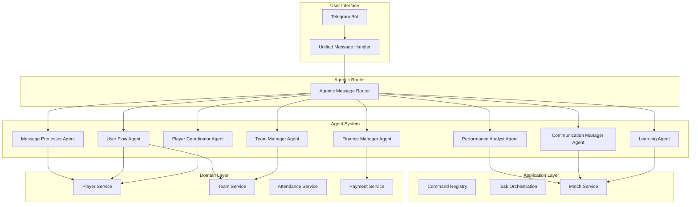
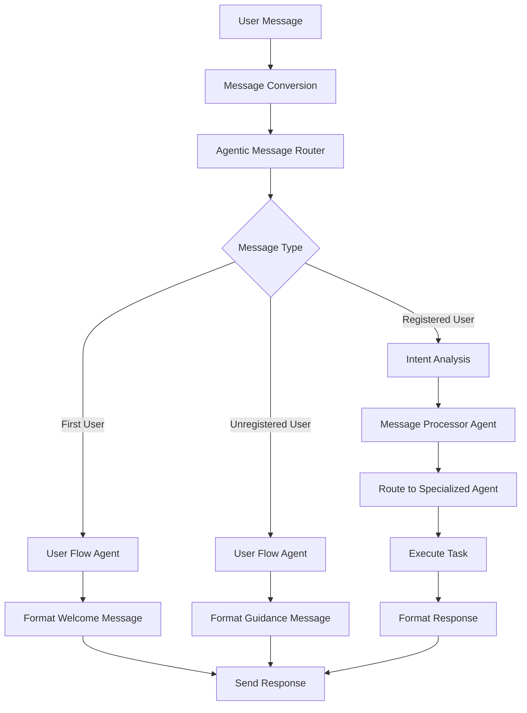
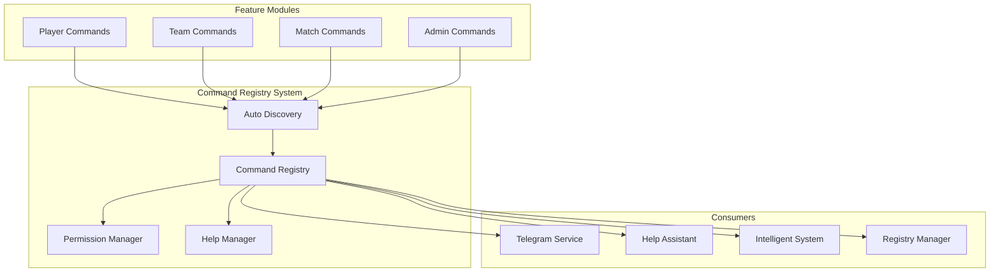
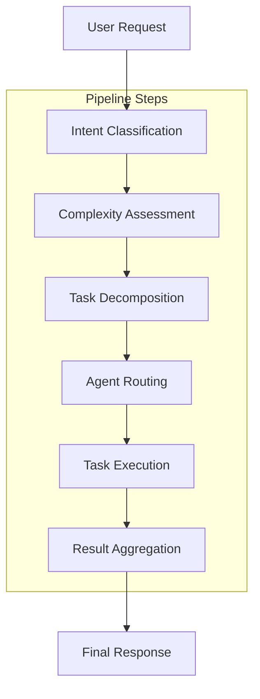
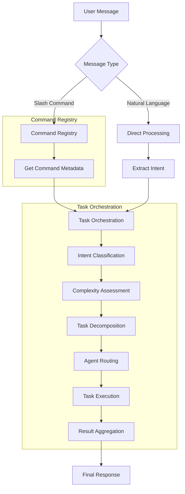
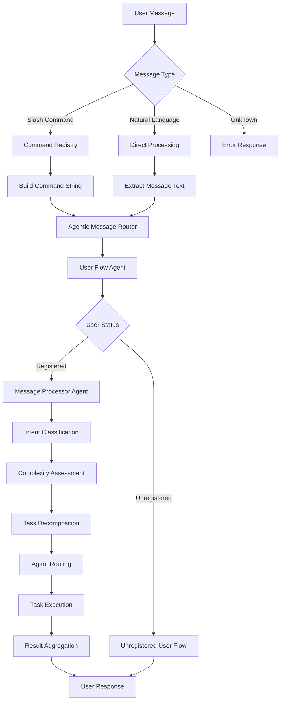
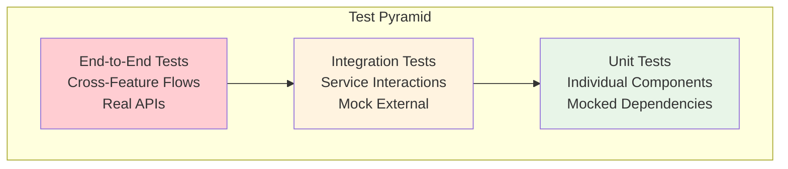

# KICKAI Architecture Documentation

**Version:** 5.0  
**Status:** Production Ready with Plain Text & Emojis  
**Last Updated:** July 2025  
**Architecture:** Agentic Clean Architecture with CrewAI & Plain Text Messaging

## 🎯 Overview

KICKAI is an AI-powered football team management system built with **agentic clean architecture** principles. The system combines advanced AI capabilities with practical team management tools through a sophisticated 8-agent CrewAI architecture, following clean architecture patterns for maintainability and scalability. All messaging uses **plain text with emojis** for maximum reliability and universal compatibility.

## 🏗️ Core Architecture Principles

### 1. **Centralized Constants & Enums Management**
- **Single Source of Truth**: All constants centralized in `src/core/constants.py` and `src/core/firestore_constants.py`
- **Immutable Dataclasses**: Command definitions use `@dataclass(frozen=True)` for type safety
- **Enum Completeness**: All enum values defined before use to prevent runtime errors
- **Import Path Standardization**: Consistent import paths with `PYTHONPATH=src`
- **No Hardcoding**: Zero hardcoded strings in business logic

### 2. **True Agentic-First Design**
- **CrewAI Agents**: ALL user interactions processed through specialized AI agents
- **No Direct Processing**: Infrastructure layer contains NO business logic
- **Agentic Message Router**: Centralized routing through agentic system
- **User Flow Agent**: Dedicated agent for first user and unregistered user flows
- **Single Source of Truth**: Centralized command registry and agent orchestration

### 3. **Clean Architecture Layers**
```
┌─────────────────────────────────────────────────────────────┐
│                    Presentation Layer                        │
│  (Telegram Bot Interface, Message Conversion Only)          │
└─────────────────────────────────────────────────────────────┘
                              │
                              ▼
┌─────────────────────────────────────────────────────────────┐
│                    Application Layer                         │
│  (Agentic Message Router, CrewAI Agents, Task Orchestration) │
└─────────────────────────────────────────────────────────────┘
                              │
                              ▼
┌─────────────────────────────────────────────────────────────┐
│                     Domain Layer                             │
│  (Business Entities, Domain Services, Repository Interfaces) │
└─────────────────────────────────────────────────────────────┘
                              │
                              ▼
┌─────────────────────────────────────────────────────────────┐
│                  Infrastructure Layer                        │
│  (Firebase, External APIs, Third-party Integrations)        │
└─────────────────────────────────────────────────────────────┘
```

### 4. **Feature-First Modular Structure**
```
src/features/
├── player_registration/     # Player onboarding and registration
├── team_administration/     # Team management and settings
├── match_management/        # Match scheduling and operations
├── attendance_management/   # Attendance tracking
├── payment_management/      # Payment processing and financials
├── communication/          # Messaging and notifications
├── health_monitoring/      # System health and monitoring
└── system_infrastructure/  # Core system services
```

### 5. **Dependency Rules**
- **Presentation → Application → Domain → Infrastructure** ✅
- **Infrastructure → Domain** ❌
- **Domain → Application** ❌
- **Application → Presentation** ❌

### 6. **🚨 CrewAI Native Implementation (MANDATORY)**

**All CrewAI implementations MUST use native features exclusively:**

#### **✅ REQUIRED: CrewAI Native Classes**
```python
# ✅ Use CrewAI's native classes
from crewai import Agent, Task, Crew
from crewai.tools import tool

# ✅ Native Agent creation
agent = Agent(
    role="Player Coordinator",
    goal="Manage player registration",
    backstory="Expert in player management",
    tools=[get_my_status, add_player],
    verbose=True
)

# ✅ Native Task creation
task = Task(
    description="Process user request",
    agent=agent,
    config={'team_id': 'TEST', 'user_id': '12345'}  # ✅ Use config for context
)

# ✅ Native Crew orchestration
crew = Crew(agents=[agent], tasks=[task])
result = crew.kickoff()
```

#### **✅ REQUIRED: CrewAI Native Tools**
```python
# ✅ Use @tool decorator from crewai.tools
@tool("get_my_status")
async def get_my_status(team_id: str, user_id: str) -> str:
    """
    Get user status using team_id and user_id from context.
    """
    return f"Status for {user_id} in team {team_id}"
```

#### **❌ FORBIDDEN: Custom Implementations**
- ❌ Custom agent wrappers
- ❌ Custom tool wrappers  
- ❌ Custom task wrappers
- ❌ Custom orchestration logic
- ❌ Custom context passing mechanisms
- ❌ Custom parameter extraction

#### **🎯 CrewAI Native Principles**
1. **Use CrewAI's built-in features first**
2. **Let LLM handle parameter extraction intelligently**
3. **Use Task.config for context passing**
4. **Follow CrewAI's intended design patterns**
5. **Never invent custom solutions when CrewAI provides them**

## 🤖 Agentic Architecture

### 8-Agent CrewAI System (Streamlined)



### Agent Responsibility Matrix

| **Agent** | **Primary Responsibility** | **Key Tools** | **Flow Handling** |
|-----------|---------------------------|---------------|-------------------|
| **Message Processor** | Intent analysis, routing | `analyze_intent`, `route_request` | Entry point only |
| **User Flow Agent** | First user, unregistered flows | `check_user_status`, `format_welcome_message` | All user flows |
| **Player Coordinator** | Player operations | `get_my_status`, `get_all_players`, `register_player` | Player-specific |
| **Team Manager** | Team administration | `manage_team`, `approve_players` | Leadership tasks |
| **Finance Manager** | Financial operations | `track_payments`, `manage_expenses` | Financial tasks |
| **Performance Analyst** | Analytics & insights | `analyze_performance`, `generate_reports` | Analysis tasks |
| **Communication Manager** | Messaging & announcements | `send_message`, `send_announcement` | Communication tasks |
| **Learning Agent** | System improvement | `learn_from_interaction`, `optimize_routing` | Learning tasks |

## 💬 Messaging Architecture

### Plain Text with Emojis Approach

The KICKAI system uses **plain text with emojis** for all messaging to ensure maximum reliability and universal compatibility across all platforms and clients.

#### **Key Principles**
- **No Markdown/HTML**: Eliminates parsing errors and compatibility issues
- **Emojis for Visual Appeal**: Provides engaging visual elements without complexity
- **Universal Compatibility**: Works across all Telegram clients and platforms
- **Simple Implementation**: No complex escaping or format conversion logic

#### **Message Formatting Standards**
```python
# System Status Messages
✅ Success: Operation completed successfully
❌ Error: Something went wrong
ℹ️ Info: Here's some information
⚠️ Warning: Please be careful

# User Interface Messages
👤 User Information
👔 Leadership Commands
🤖 KICKAI Commands
📋 Team Players
👥 Team Members
🎉 Welcome to KICKAI

# Command Categories
🚀 Start Bot
📊 Status Check
🏓 Ping Test
📱 Version Information
⚽ Create Match
📅 List Matches
👥 Select Squad
```

#### **Benefits**
1. **Zero Parsing Errors**: No format compatibility issues
2. **Universal Compatibility**: Works on all platforms and clients
3. **Simple Maintenance**: No format-specific code to maintain
4. **Visual Appeal**: Emojis provide engaging visual elements
5. **Reliable Delivery**: Messages always display correctly

## 🔄 Agentic Message Flow Architecture

### True Agentic Processing



### Agentic Message Router Implementation

```python
class AgenticMessageRouter:
    """Centralized agentic message routing following CrewAI best practices."""
    
    async def route_message(self, message: TelegramMessage) -> AgentResponse:
        """
        Route ALL messages through the agentic system.
        No direct processing bypasses agents.
        """
        # 1. Message Processor: Intent analysis
        intent = await self.message_processor.analyze_intent(message)
        
        # 2. User Flow Agent: Check user status and flow
        user_flow = await self.user_flow_agent.determine_user_flow(message.user_id, message.chat_type)
        
        # 3. Route to appropriate specialized agent
        if user_flow.is_first_user:
            return await self.user_flow_agent.handle_first_user_flow(message)
        elif user_flow.is_unregistered:
            return await self.user_flow_agent.handle_unregistered_user_flow(message)
        else:
            return await self._route_to_specialized_agent(intent, message)
```

### User Flow Agent Implementation

```python
class UserFlowAgent:
    """Dedicated agent for user flow management following CrewAI best practices."""
    
    async def determine_user_flow(self, user_id: str, chat_type: ChatType) -> UserFlowDecision:
        """Determine the appropriate user flow based on user status and context."""
        # Check if first user
        is_first_user = await self._check_if_first_user()
        if is_first_user and chat_type == ChatType.LEADERSHIP:
            return UserFlowDecision.FIRST_USER
        
        # Check if user is registered
        is_registered = await self._check_user_registration(user_id)
        if not is_registered:
            return UserFlowDecision.UNREGISTERED_USER
        
        return UserFlowDecision.REGISTERED_USER
    
    async def handle_first_user_flow(self, message: TelegramMessage) -> str:
        """Handle first user registration flow."""
        return await self._format_first_user_message(message.team_id, message.username)
    
    async def handle_unregistered_user_flow(self, message: TelegramMessage) -> str:
        """Handle unregistered user guidance flow."""
        return await self._format_unregistered_user_message(message.chat_type, message.team_id, message.username)
```

## 🔧 Command Registry & Task Orchestration Architecture

### Overview for Junior Engineers

The **Command Registry** and **Task Orchestration** are the two most important components in the Application Layer. Think of them as the "brain" and "nervous system" of KICKAI:

- **Command Registry**: Like a library catalog that knows about all available commands
- **Task Orchestration**: Like a project manager that breaks down complex tasks and assigns them to the right specialists

### 🗂️ Command Registry Architecture

#### What is the Command Registry?

The Command Registry is a **centralized system** that discovers, registers, and manages all commands across the entire KICKAI system. Think of it as a smart phone book that knows about every command and who can use it.

#### Key Components



#### How Command Registration Works

**Step 1: Auto-Discovery**
```python
# The registry automatically finds commands in feature modules
def auto_discover_commands(self, src_path: str = "src") -> None:
    """Automatically discover and register commands from feature modules."""
    for feature_dir in features_path.iterdir():
        commands_path = feature_dir / "application" / "commands"
        if commands_path.exists():
            self._discover_commands_from_path(commands_path, feature_name)
```

**Step 2: Command Registration**
```python
# Commands are registered using decorators
@command("/help", "Show available commands", feature="shared")
async def handle_help(update, context, **kwargs):
    # This function gets registered automatically
    pass

# Or manually registered
registry.register_command(
    name="/myinfo",
    description="Show my player information",
    handler=handle_myinfo,
    permission_level=PermissionLevel.PLAYER,
    feature="player_registration"
)
```

**Step 3: Command Metadata**
```python
@dataclass
class CommandMetadata:
    name: str                    # "/help", "/myinfo"
    description: str             # "Show available commands"
    command_type: CommandType    # SLASH_COMMAND, NATURAL_LANGUAGE
    permission_level: PermissionLevel  # PUBLIC, PLAYER, LEADERSHIP, ADMIN
    feature: str                 # "shared", "player_registration"
    handler: Callable            # The actual function to execute
    aliases: List[str]           # Alternative command names
    examples: List[str]          # Usage examples
    help_text: Optional[str]     # Detailed help
```

#### Command Registry Consumers

| **Component** | **Location** | **What It Does** | **Example Usage** |
|---------------|--------------|------------------|-------------------|
| **TelegramBotService** | `src/features/communication/infrastructure/telegram_bot_service.py` | **Primary Consumer** - Sets up command handlers | ```python<br/>registry = get_command_registry()<br/>all_commands = registry.list_all_commands()<br/>for cmd in all_commands:<br/>    application.add_handler(cmd.handler)``` |
| **HelpAssistantAgent** | `src/features/shared/domain/tools/help_tools.py` | **Help System** - Gets available commands for help responses | ```python<br/>registry = get_command_registry()<br/>commands = registry.get_commands_by_feature(feature)<br/>help_text = registry.generate_feature_help(feature)``` |
| **IntelligentSystem** | `src/agents/intelligent_system.py` | **Command Validation** - Validates commands and routes requests | ```python<br/>registry = get_command_registry()<br/>command = registry.get_command(command_name)<br/>if command and user_has_permission(command):<br/>    return command.handler``` |
| **RegistryManager** | `src/core/registry_manager.py` | **Management Interface** - Centralized registry management | ```python<br/>registry = get_command_registry()<br/>registry.auto_discover_commands()<br/>registry.validate_all_commands()``` |

#### Permission System

The Command Registry includes a sophisticated permission system:

```python
class PermissionLevel(Enum):
    PUBLIC = "public"           # Anyone can use
    PLAYER = "player"           # Only registered players
    LEADERSHIP = "leadership"   # Only team leadership
    ADMIN = "admin"             # Only system admins
    SYSTEM = "system"           # Only system processes
```

**Permission Checking Example:**
```python
def can_execute_command(user_permission: PermissionLevel, command_permission: PermissionLevel) -> bool:
    """Check if user has permission to execute command."""
    permission_hierarchy = {
        PermissionLevel.PUBLIC: 0,
        PermissionLevel.PLAYER: 1,
        PermissionLevel.LEADERSHIP: 2,
        PermissionLevel.ADMIN: 3,
        PermissionLevel.SYSTEM: 4
    }
    
    user_level = permission_hierarchy.get(user_permission, 0)
    required_level = permission_hierarchy.get(command_permission, 0)
    
    return user_level >= required_level
```

### 🎯 Task Orchestration Architecture

#### What is Task Orchestration?

Task Orchestration is like having a **smart project manager** that:
1. **Analyzes** what the user wants to do
2. **Breaks down** complex tasks into smaller, manageable pieces
3. **Assigns** each piece to the right specialist (agent)
4. **Coordinates** the work between specialists
5. **Combines** all the results into a final answer

#### Orchestration Pipeline



#### Pipeline Components

**1. Intent Classification Step**
```python
class IntentClassificationStep(PipelineStep):
    """Step 1: Understand what the user wants to do."""
    
    async def execute(self, context: Dict[str, Any]) -> Dict[str, Any]:
        task_description = context.get('task_description')
        intent_result = self.intent_classifier.classify(task_description, context)
        
        return {
            **context,
            'intent_result': intent_result,
            'step_results': {
                'intent_classification': {
                    'intent': intent_result.intent,
                    'confidence': intent_result.confidence,
                    'entities': intent_result.entities
                }
            }
        }
```

**2. Complexity Assessment Step**
```python
class ComplexityAssessmentStep(PipelineStep):
    """Step 2: Determine how complex the task is."""
    
    async def execute(self, context: Dict[str, Any]) -> Dict[str, Any]:
        assessment = self.complexity_assessor.assess(
            request=context.get('task_description'),
            intent=context.get('intent_result').intent,
            entities=context.get('intent_result').entities
        )
        
        return {
            **context,
            'complexity_assessment': assessment,
            'step_results': {
                'complexity_assessment': {
                    'level': assessment.complexity_level,
                    'score': assessment.score,
                    'estimated_time': assessment.estimated_processing_time
                }
            }
        }
```

**3. Task Decomposition Step**
```python
class TaskDecompositionStep(PipelineStep):
    """Step 3: Break complex tasks into smaller pieces."""
    
    async def execute(self, context: Dict[str, Any]) -> Dict[str, Any]:
        subtasks = self.task_decomposer.decompose(
            context.get('task_description'),
            context.get('task_context')
        )
        
        return {
            **context,
            'subtasks': subtasks,
            'step_results': {
                'task_decomposition': {
                    'total_subtasks': len(subtasks),
                    'subtask_details': [s.description for s in subtasks]
                }
            }
        }
```

**4. Agent Routing Step**
```python
class AgentRoutingStep(PipelineStep):
    """Step 4: Assign each subtask to the right agent."""
    
    async def execute(self, context: Dict[str, Any]) -> Dict[str, Any]:
        subtasks = context.get('subtasks', [])
        available_agents = context.get('available_agents', {})
        routed_tasks = []
        
        for subtask in subtasks:
            agent_role = subtask.agent_role
            if agent_role in available_agents:
                agent = available_agents[agent_role]
                routed_tasks.append({
                    'subtask': subtask,
                    'agent': agent,
                    'agent_role': agent_role
                })
        
        return {
            **context,
            'routed_tasks': routed_tasks,
            'step_results': {
                'agent_routing': {
                    'total_routed': len(routed_tasks),
                    'routing_details': [t['agent_role'].value for t in routed_tasks]
                }
            }
        }
```

**5. Task Execution Step**
```python
class TaskExecutionStep(PipelineStep):
    """Step 5: Execute each subtask with its assigned agent."""
    
    async def execute(self, context: Dict[str, Any]) -> Dict[str, Any]:
        routed_tasks = context.get('routed_tasks', [])
        execution_results = []
        
        for task_info in routed_tasks:
            subtask = task_info['subtask']
            agent = task_info['agent']
            
            try:
                result = await agent.execute(subtask.description, context.get('execution_context'))
                execution_results.append({
                    'subtask_id': subtask.task_id,
                    'agent_role': task_info['agent_role'].value,
                    'success': True,
                    'result': result
                })
            except Exception as e:
                execution_results.append({
                    'subtask_id': subtask.task_id,
                    'agent_role': task_info['agent_role'].value,
                    'success': False,
                    'error': str(e)
                })
        
        return {
            **context,
            'execution_results': execution_results,
            'step_results': {
                'task_execution': {
                    'total_executed': len(execution_results),
                    'successful': len([r for r in execution_results if r['success']]),
                    'failed': len([r for r in execution_results if not r['success']])
                }
            }
        }
```

**6. Result Aggregation Step**
```python
class ResultAggregationStep(PipelineStep):
    """Step 6: Combine all results into a final response."""
    
    async def execute(self, context: Dict[str, Any]) -> Dict[str, Any]:
        execution_results = context.get('execution_results', [])
        
        # Check if all tasks were successful
        successful_results = [r for r in execution_results if r['success']]
        failed_results = [r for r in execution_results if not r['success']]
        
        if failed_results:
            # Return error message for failed tasks
            error_messages = [f"Task {r['subtask_id']}: {r['error']}" for r in failed_results]
            aggregated_result = f"❌ Some tasks failed:\n" + "\n".join(error_messages)
        else:
            # Combine successful results
            if len(successful_results) == 1:
                aggregated_result = str(successful_results[0]['result'])
            else:
                results = [str(r['result']) for r in successful_results]
                aggregated_result = "\n\n".join(results)
        
        return {
            **context,
            'final_result': aggregated_result,
            'step_results': {
                'result_aggregation': {
                    'total_tasks': len(execution_results),
                    'successful_tasks': len(successful_results),
                    'failed_tasks': len(failed_results)
                }
            }
        }
```

#### Task Orchestration Consumers

| **Component** | **Location** | **What It Does** | **Example Usage** |
|---------------|--------------|------------------|-------------------|
| **TeamManagementSystem** | `src/agents/crew_agents.py` | **Primary Consumer** - Main orchestration execution | ```python<br/>result = await self._orchestration_pipeline.execute_task(<br/>    task_description=task_description,<br/>    available_agents=self.agents,<br/>    execution_context=execution_context<br/>)``` |
| **SimplifiedOrchestrationPipeline** | `src/agents/simplified_orchestration.py` | **Core Implementation** - Pipeline step execution | ```python<br/>for step in self.pipeline_steps:<br/>    step_result = await step.execute(context)<br/>    context.update(step_result)``` |
| **ConfigurableAgent** | `src/agents/configurable_agent.py` | **Agent Interface** - Individual agent task execution | ```python<br/>result = await agent.execute(enhanced_task, execution_context)``` |

#### Task Context and Data Flow

**Task Context Structure:**
```python
@dataclass
class TaskContext:
    """Context for task execution."""
    task_id: str                    # Unique task identifier
    user_id: str                    # User requesting the task
    team_id: str                    # Team context
    parameters: Dict[str, Any]      # Task-specific parameters
    metadata: Dict[str, Any]        # Additional metadata
```

**Data Flow Through Pipeline:**
```python
# Initial context
context = {
    'task_description': "What's my player status?",
    'execution_context': {
        'user_id': '12345',
        'team_id': 'KTI',
        'chat_type': 'main_chat'
    }
}

# After Intent Classification
context = {
    'task_description': "What's my player status?",
    'execution_context': {...},
    'intent_result': IntentResult(intent='get_player_status', confidence=0.95),
    'step_results': {
        'intent_classification': {...}
    }
}

# After Complexity Assessment
context = {
    'task_description': "What's my player status?",
    'execution_context': {...},
    'intent_result': {...},
    'complexity_assessment': ComplexityAssessment(level='SIMPLE', score=0.2),
    'step_results': {
        'intent_classification': {...},
        'complexity_assessment': {...}
    }
}

# After Task Decomposition
context = {
    'task_description': "What's my player status?",
    'execution_context': {...},
    'intent_result': {...},
    'complexity_assessment': {...},
    'subtasks': [Subtask(task_id='task_1', description='Get player status', agent_role=AgentRole.PLAYER_COORDINATOR)],
    'step_results': {
        'intent_classification': {...},
        'complexity_assessment': {...},
        'task_decomposition': {...}
    }
}

# After Agent Routing
context = {
    # ... previous data ...
    'routed_tasks': [{
        'subtask': Subtask(...),
        'agent': PlayerCoordinatorAgent(...),
        'agent_role': AgentRole.PLAYER_COORDINATOR
    }],
    'step_results': {
        # ... previous steps ...
        'agent_routing': {...}
    }
}

# After Task Execution
context = {
    # ... previous data ...
    'execution_results': [{
        'subtask_id': 'task_1',
        'agent_role': 'PLAYER_COORDINATOR',
        'success': True,
        'result': 'Player John Doe: Active, Position: Striker'
    }],
    'step_results': {
        # ... previous steps ...
        'task_execution': {...}
    }
}

# After Result Aggregation
context = {
    # ... previous data ...
    'final_result': 'Player John Doe: Active, Position: Striker',
    'step_results': {
        # ... previous steps ...
        'result_aggregation': {
            'total_tasks': 1,
            'successful_tasks': 1,
            'failed_tasks': 0
        }
    }
}
```

### 🔄 Integration Between Command Registry and Task Orchestration

#### How They Work Together



#### Unified Processing Flow

**Step 1: Command Registry Discovery**
```python
# In TelegramBotService
registry = get_command_registry()
if not registry._discovered:
    registry.auto_discover_commands()

# Get all available commands
all_commands = registry.list_all_commands()
for command in all_commands:
    # Register with Telegram application
    application.add_handler(command.handler)
```

**Step 2: Command Processing**
```python
# When user sends a command
async def _handle_registered_command(self, update: Update, context: ContextTypes.DEFAULT_TYPE, command_name: str):
    # Get command metadata from registry
    command = registry.get_command(command_name)
    
    if command:
        # Check permissions
        if self._user_has_permission(command.permission_level):
            # Convert to task description
            task_description = f"{command_name} {' '.join(args)}"
            
            # Route through task orchestration
            response = await self._orchestration_pipeline.execute_task(
                task_description=task_description,
                available_agents=self.agents,
                execution_context=self._build_execution_context(update)
            )
            
            await self._send_response(update, response)
        else:
            await self._send_permission_denied_message(update, command)
```

**Step 3: Natural Language Processing**
```python
# When user sends natural language
async def _handle_natural_language_message(self, update: Update, context: ContextTypes.DEFAULT_TYPE):
    message_text = update.message.text.strip()
    
    # Route directly through task orchestration
    response = await self._orchestration_pipeline.execute_task(
        task_description=message_text,
        available_agents=self.agents,
        execution_context=self._build_execution_context(update)
    )
    
    await self._send_response(update, response)
```

#### Benefits of This Integration

1. **🔒 Consistent Security**: Both command types use the same permission system
2. **🔄 Single Source of Truth**: Command metadata managed in one place
3. **🧪 Unified Testing**: Test orchestration once, works for both input types
4. **🛠️ Maintainable**: Single processing pipeline to maintain
5. **📈 Scalable**: Easy to add new input methods (voice, buttons, etc.)
6. **🎯 Consistent Behavior**: Same agent selection and execution logic

### 🏗️ Clean Infrastructure Layer

### Infrastructure Layer Responsibilities

The infrastructure layer should contain **NO business logic** and only handle:

1. **Message Conversion**: Convert Telegram updates to domain messages
2. **Response Sending**: Send formatted responses back to Telegram
3. **Error Handling**: Handle infrastructure-level errors
4. **Service Integration**: Connect to external services

### Clean Telegram Service Implementation

```python
class TelegramBotService(TelegramBotServiceInterface):
    """Clean infrastructure layer with NO business logic."""
    
    async def _handle_natural_language_message(self, update: Update, context: ContextTypes.DEFAULT_TYPE):
        """Handle natural language messages through agentic system ONLY."""
        try:
            # Convert to domain message
            message = self._convert_to_domain_message(update)
            
            # Route through agentic system (NO direct processing)
            response = await self.agentic_router.route_message(message)
            
            # Send response
            await self._send_response(update, response)
            
        except Exception as e:
            logger.error(f"Error in agentic message handling: {e}")
            await self._send_error_response(update, "I encountered an error processing your message.")
    
    async def _handle_registered_command(self, update: Update, context: ContextTypes.DEFAULT_TYPE, command_name: str):
        """Handle registered commands through agentic system ONLY."""
        try:
            # Convert to domain message
            message = self._convert_to_domain_message(update, command_name)
            
            # Route through agentic system (NO direct processing)
            response = await self.agentic_router.route_message(message)
            
            # Send response
            await self._send_response(update, response)
            
        except Exception as e:
            logger.error(f"Error in agentic command handling: {e}")
            await self._send_error_response(update, "I encountered an error processing your command.")
```

## 🚨 Critical Architectural Violations (To Be Fixed)

### 1. **Infrastructure Layer Business Logic** ❌
**Current Issue**: `TelegramBotService` contains business logic for user flows
**Solution**: Move all business logic to `UserFlowAgent`

```python
# ❌ CURRENT - Business logic in infrastructure
async def _show_first_user_registration_message(self, update: Update, username: str):
    message = f"🎉 Welcome to KICKAI for {self.team_id}, {username}!"
    # ... business logic here

# ✅ PROPOSED - Business logic in agent
class UserFlowAgent:
    async def handle_first_user_flow(self, message: TelegramMessage) -> str:
        return await self._format_first_user_message(message.team_id, message.username)
```

### 2. **Direct Command Processing Bypass** ❌
**Current Issue**: Direct keyword detection bypasses agentic system
**Solution**: ALL processing goes through `AgenticMessageRouter`

```python
# ❌ CURRENT - Direct processing
if "help" in message_lower:
    await self._handle_crewai_processing(update, message_text, ...)

# ✅ PROPOSED - Agentic routing
response = await self.agentic_router.route_message(message)
```

### 3. **Missing User Flow Agent** ❌
**Current Issue**: No dedicated agent for user flow management
**Solution**: Create `UserFlowAgent` with proper CrewAI configuration

## 🎯 Implementation Roadmap

### Phase 1: Create User Flow Agent (High Priority)
1. Create `UserFlowAgent` with proper CrewAI configuration
2. Move all user flow logic from infrastructure to agent
3. Update agent configuration to include new agent
4. Add user flow tools to tool registry

### Phase 2: Implement Agentic Router (High Priority)
1. Create `AgenticMessageRouter` service
2. Ensure ALL messages go through agents
3. Remove direct keyword detection from infrastructure
4. Add proper agent delegation logic

### Phase 3: Clean Infrastructure (Medium Priority)
1. Remove business logic from `TelegramBotService`
2. Implement proper domain message conversion
3. Add comprehensive error handling
4. Update tests for new architecture

### Phase 4: Optimize Agent Roles (Low Priority)
1. Review and consolidate overlapping agent responsibilities
2. Optimize tool assignments per agent
3. Add performance monitoring
4. Document agent interaction patterns

## 🛠️ CrewAI Best Practices & Lessons Learned

### Critical Implementation Requirements

#### 1. **Tool Independence (MANDATORY)**
- **❌ NEVER**: Tools calling other tools or services
- **✅ ALWAYS**: Tools are simple, independent functions
- **Example**: `get_available_commands` should return static data, not query services

```python
# ❌ WRONG - Tool calling services
@tool("get_available_commands")
def get_available_commands(user_id: str, chat_type: str) -> str:
    service = get_container().get(PlayerService)  # DON'T DO THIS
    return service.get_commands(user_id)

# ✅ CORRECT - Independent tool
@tool("get_available_commands")
def get_available_commands(user_id: str, chat_type: str) -> str:
    if chat_type == "main_chat":
        return "Available commands: /register, /help, /status"
    return "Leadership commands: /approve, /reject, /pending, /addplayer"
```

#### 2. **Absolute Imports with PYTHONPATH**
- **ALWAYS** use absolute imports: `from src.features...`
- **ALWAYS** set `PYTHONPATH=src` when running scripts
- **ALWAYS** activate virtual environment: `source venv/bin/activate`

```bash
# ✅ CORRECT - Always use this pattern
source venv/bin/activate && PYTHONPATH=src python run_bot_local.py
```

#### 3. **Tool Discovery & Registration**
- Tools must be discovered automatically from `src/features/*/domain/tools/`
- Tool registry must use `_register_discovered_tool()` method
- Tools must have proper metadata for agent assignment

```python
# ✅ CORRECT - Tool discovery pattern
def _discover_tools_from_file(self, file_path: Path, feature_name: str) -> int:
    # Set PYTHONPATH for imports
    src_path = file_path.parent.parent.parent.parent
    if str(src_path) not in sys.path:
        sys.path.insert(0, str(src_path))
    
    # Load module and find @tool decorated functions
    for attr_name in dir(module):
        attr = getattr(module, attr_name)
        if hasattr(attr, '_is_tool') and attr._is_tool:
            self._register_discovered_tool(attr_name, attr, feature_name)
```

#### 4. **Agent Tool Assignment**
- Agents get tools based on their role configuration
- Tool registry must provide `get_tools_for_role()` method
- Tools must be callable functions, not metadata objects

```python
# ✅ CORRECT - Agent tool assignment
def _get_tools_for_role(self, role: AgentRole) -> List[Any]:
    tools = []
    for tool_name in self._get_tool_names_for_role(role):
        tool_metadata = self._tools.get(tool_name)
        if tool_metadata and hasattr(tool_metadata, 'tool_function'):
            tools.append(tool_metadata.tool_function)
    return tools
```

### Common Pitfalls & Solutions

#### 1. **"Tool object is not callable" Error**
- **Cause**: Tool registry returning metadata instead of callable functions
- **Solution**: Ensure `_register_discovered_tool()` stores proper metadata structure

#### 2. **"ToolRegistry object has no attribute 'items'" Error**
- **Cause**: Code trying to call `len()` or `items()` on ToolRegistry object
- **Solution**: Use `tool_registry.get_tool_names()` instead of direct object methods

#### 3. **Import Errors in Tool Discovery**
- **Cause**: Relative imports or missing PYTHONPATH
- **Solution**: Always use absolute imports and set PYTHONPATH=src

#### 4. **Tool Dependencies**
- **Cause**: Tools trying to import and use services
- **Solution**: Make tools completely independent with static data or simple logic

### Tool Design Patterns

#### 1. **Information Retrieval Tools**
```python
@tool("get_user_status")
def get_user_status_tool(user_id: str, team_id: str = None) -> str:
    """Get user status - independent tool with simple logic"""
    # Simple logic, no service calls
    if user_id and len(user_id) > 0:
        return f"User {user_id} is registered"
    return "User not found"
```

#### 2. **Command Listing Tools**
```python
@tool("get_available_commands")
def get_available_commands(user_id: str, chat_type: str, team_id: str = None) -> str:
    """Get available commands - static data based on context"""
    if chat_type.lower() == "main_chat":
        return "Main chat commands: /register, /help, /status, /list"
    elif chat_type.lower() == "leadership_chat":
        return "Leadership commands: /approve, /reject, /pending, /addplayer"
    return "General commands: /help"
```

#### 3. **Action Tools**
```python
@tool("send_message")
def send_message_tool(chat_id: str, message: str, team_id: str = None) -> str:
    """Send message - delegates to service but tool itself is simple"""
    try:
        # Simple validation
        if not chat_id or not message:
            return "❌ Missing chat_id or message"
        
        # Delegate to service (this is acceptable for action tools)
        service = get_container().get(MessageService)
        result = service.send_message(chat_id, message)
        return f"✅ Message sent: {result}"
    except Exception as e:
        return f"❌ Failed to send message: {str(e)}"
```

### Testing & Validation

#### 1. **Tool Discovery Test**
```bash
source venv/bin/activate && PYTHONPATH=src python -c "
from src.agents.tool_registry import get_tool_registry
registry = get_tool_registry()
registry.auto_discover_tools()
print('Available tools:', registry.get_tool_names())
"
```

#### 2. **Individual Tool Test**
```bash
source venv/bin/activate && PYTHONPATH=src python -c "
from src.features.shared.domain.tools.help_tools import get_available_commands
result = get_available_commands.func('12345', 'main_chat', 'KTI')
print('Tool result:', result)
"
```

### Performance Considerations

#### 1. **Tool Loading**
- Tools are discovered once at startup
- No runtime tool discovery (performance impact)
- Tool registry cached in memory

#### 2. **Agent Initialization**
- Agents created once per team
- Tool assignment happens during agent creation
- No dynamic tool reassignment

#### 3. **Memory Management**
- Tool functions are lightweight
- No heavy dependencies in tool functions
- Services injected only when needed

### Security & Error Handling

#### 1. **Input Validation**
- All tool inputs validated before processing
- Sanitize user inputs to prevent injection
- Return clear error messages

#### 2. **Exception Handling**
- Tools must handle exceptions gracefully
- Return meaningful error messages
- Log errors for debugging

#### 3. **Access Control**
- Tools respect user permissions
- Chat type determines available commands
- Team context for multi-tenant isolation

## 🔧 Command Architecture

### Unified Command System



### Command Registration Pattern

```python
@command("/help", "Show available commands", feature="shared")
async def handle_help(update, context, **kwargs):
    # Command is registered but delegates to CrewAI agent
    # No direct implementation - handled by HelpAssistantAgent
    pass
```

### Command Processing Flow

1. **Input Processing**: Handle both slash commands and natural language
2. **Command Registry**: Auto-discovery and metadata for slash commands
3. **Unified Processing**: Both paths converge to `AgenticMessageRouter`
4. **User Flow Agent**: Determine user status and appropriate flow
5. **Agentic Routing**: Route to appropriate specialized agent
6. **Intent Classification**: Determine user intent (for registered users)
7. **Complexity Assessment**: Analyze request complexity
8. **Task Decomposition**: Break down into subtasks with agent assignments
9. **Task Execution**: Execute tasks through specialized agents
10. **Result Aggregation**: Combine results and format response

### Unified Processing Architecture

**Key Insight**: Both slash commands and natural language converge to the **exact same processing pipeline**.

#### **Slash Command Path**
```python
# 1. Command Registry Discovery
registry = get_command_registry()
all_commands = registry.list_all_commands()

# 2. Build Command String
message_text = f"{command_name} {' '.join(args)}".strip()
# Example: "/help" or "/myinfo"

# 3. Unified Processing
response = await self.agentic_router.route_message(message)
```

#### **Natural Language Path**
```python
# 1. Direct Processing
message_text = update.message.text.strip()
# Example: "help me" or "what's my info"

# 2. Unified Processing
response = await self.agentic_router.route_message(message)
```

#### **Convergence Point**
```python
async def route_message(self, message: TelegramMessage) -> AgentResponse:
    # Create execution context
    execution_context = {
        'user_id': message.user_id,
        'team_id': message.team_id,
        'chat_id': message.chat_id,
        'is_leadership_chat': message.chat_type == ChatType.LEADERSHIP,
        'username': message.username,
        'message_text': message.text  # ← Only difference!
    }
    
    # Execute with appropriate agent ← UNIFIED PROCESSING
    return await self._execute_with_appropriate_agent(execution_context)
```

### Benefits of Unified Processing

1. **🔒 Consistent Security**: Same permission checking for both input types
2. **🔄 Single Source of Truth**: No code duplication between paths
3. **🧪 Unified Testing**: Test once, works for both input methods
4. **🛠️ Maintainable**: Single processing pipeline to maintain
5. **📈 Scalable**: Easy to add new input methods (voice, buttons, etc.)
6. **🎯 Consistent Behavior**: Same agent selection and execution logic

### Natural Language Security

**Critical Security Feature**: Natural language processing includes the same permission checks as slash commands:

1. **Intent Classification**: Determine user intent from natural language
2. **Command Mapping**: Map intent to equivalent command for permission checking
3. **Permission Validation**: Apply same permission logic as registered commands
4. **Access Control**: Deny access if user lacks required permissions
5. **Agent Routing**: Only route to agent if permission check passes

## 🏛️ Feature Architecture

### Feature Structure

Each feature follows this structure:

```
features/
├── feature_name/
│   ├── application/
│   │   ├── commands/          # Command registrations (decorators only)
│   │   └── handlers/          # Business logic handlers
│   ├── domain/
│   │   ├── entities/          # Business entities
│   │   ├── repositories/      # Repository interfaces
│   │   ├── services/          # Business services
│   │   ├── interfaces/        # Service interfaces
│   │   └── tools/             # CrewAI tools
│   ├── infrastructure/
│   │   └── firebase_*_repository.py  # Concrete implementations
│   └── tests/
│       ├── unit/
│       ├── integration/
│       └── e2e/
```

### Cross-Feature Communication

#### 1. **Service-to-Service Communication**
- Services communicate through interfaces
- Factory pattern ensures proper dependency injection
- No direct imports between feature implementations

#### 2. **Event-Driven Communication**
- Domain events for loose coupling
- Event handlers in application layer
- Asynchronous processing where appropriate

#### 3. **Shared Domain Models**
- Common entities in `features/shared/`
- Adapters for cross-feature data transformation
- Consistent data models across features

## 🗄️ Database Architecture

### Firebase/Firestore Structure

```
teams/{team_id}/
├── players/
│   ├── {player_id}/
│   │   ├── name: string
│   │   ├── phone: string
│   │   ├── position: string
│   │   ├── status: string
│   │   └── registration_date: timestamp
├── matches/
│   ├── {match_id}/
│   │   ├── name: string
│   │   ├── date: timestamp
│   │   ├── location: string
│   │   └── squad: array
├── payments/
│   ├── {payment_id}/
│   │   ├── player_id: string
│   │   ├── match_id: string
│   │   ├── amount: number
│   │   └── status: string
├── attendance/
│   ├── {attendance_id}/
│   │   ├── player_id: string
│   │   ├── match_id: string
│   │   └── status: string
└── settings/
    ├── team_name: string
    ├── chat_ids: object
    └── configuration: object
```

### Repository Pattern

- Interface defined in domain layer
- Implementation in infrastructure layer
- Factory creates concrete implementations

## 🧪 Testing Strategy

### Test Pyramid



### Testing Architecture

#### 1. **Unit Tests**
- Test individual services and components
- Mock dependencies using interfaces
- Fast execution, high coverage

#### 2. **Integration Tests**
- Test service interactions
- Use in-memory database for speed
- Verify business logic flows

#### 3. **E2E Tests**
- Test complete user journeys
- Use real Firebase Testing environment
- Validate cross-feature flows

## 🔒 Security & Access Control

### 1. **Team-Based Isolation**
- All data scoped to team_id
- Multi-tenant architecture
- Secure data boundaries

### 2. **Role-Based Access**
- Player vs Admin roles
- Feature-specific permissions
- Audit logging for sensitive operations

### 3. **Chat-Based Access Control**
- Main chat: Read-only commands
- Leadership chat: All commands
- Private messages: Limited command set

## ⚡ Performance Considerations

### 1. **Async/Await Pattern**
- I/O operations are asynchronous
- Non-blocking service calls
- Efficient resource utilization

### 2. **Agent Optimization**
- Lazy agent creation
- Tool caching and reuse
- Intelligent agent selection

### 3. **Database Optimization**
- Indexed queries on team_id
- Efficient data structures
- Connection pooling

## 🚀 Deployment Architecture

### 1. **Multi-Environment Support**
- Local development with .env
- Testing with .env.test
- Production with Railway environment variables

### 2. **Multi-Bot Support**
- One bot per team
- Isolated bot sessions
- Centralized bot management

### 3. **LLM Integration**
- Local: Ollama for development
- Production: Google Gemini
- Railway: Google Gemini

## 📊 Monitoring & Observability

### 1. **Health Monitoring**
- Service health checks
- Database connectivity monitoring
- Bot status monitoring

### 2. **Logging Strategy**
- Structured logging with loguru
- Error tracking
- Performance metrics

### 3. **Agent Performance**
- Agent execution metrics
- Tool usage statistics
- Response time monitoring

## 🔄 Migration Strategy

### 1. **Feature Migrations**
- Gradual migration to new architecture
- Backward compatibility during transition
- Feature flags for gradual rollout

### 2. **Data Migrations**
- Schema evolution support
- Data transformation utilities
- Rollback capabilities

## 📚 Best Practices

### 1. **Code Organization**
- Follow feature-first structure
- Use agentic patterns for user interactions
- Maintain clean dependency hierarchy

### 2. **Error Handling**
- Comprehensive exception handling
- Graceful degradation
- User-friendly error messages

### 3. **Documentation**
- Keep architecture docs updated
- Document cross-feature flows
- Maintain API documentation

### 4. **Agent Development**
- Single responsibility for each agent
- Clear tool definitions
- Consistent communication patterns

## 🔮 Future Considerations

### 1. **Scalability**
- Horizontal scaling support
- Load balancing capabilities
- Database sharding strategies

### 2. **Extensibility**
- Plugin architecture for new features
- API versioning strategy
- Backward compatibility

### 3. **Performance**
- Caching strategies
- Database optimization
- Async processing improvements

### 4. **AI Enhancement**
- Advanced agent capabilities
- Machine learning integration
- Predictive analytics 

## 🛠️ Development Workflow & Critical Rules

### **1. Bot Startup Sequence**
```bash
# ✅ CORRECT - Always use PYTHONPATH
source venv/bin/activate
PYTHONPATH=src python run_bot_local.py

# ❌ WRONG - Missing PYTHONPATH causes import errors
source venv/bin/activate && python run_bot_local.py
```

### **2. Constants & Enums Usage**
```python
# ✅ CORRECT - Use centralized constants
from core.constants import BOT_VERSION, get_command_by_name
from core.firestore_constants import get_team_members_collection

# ❌ WRONG - Never hardcode
BOT_VERSION = "2.0.0"  # Hardcoded
team_collection = "kickai_team_members"  # Hardcoded
```

### **3. Import Path Standards**
```python
# ✅ CORRECT - Within src directory
from core.constants import BOT_VERSION
from agents.behavioral_mixins import get_mixin_for_role

# ❌ WRONG - Don't use src prefix within src
from src.core.constants import BOT_VERSION
```

### **4. Enum Completeness**
```python
# ✅ CORRECT - Use defined enum values
command_type=CommandType.SLASH_COMMAND
chat_type=ChatType.LEADERSHIP

# ❌ WRONG - Don't use undefined enum values
command_type=CommandType.UNDEFINED_VALUE
```

### **5. Troubleshooting Commands**
```bash
# Clear Python cache when import issues occur
find . -name "*.pyc" -delete && find . -name "__pycache__" -type d -exec rm -rf {} + 2>/dev/null || true

# Test critical imports individually
source venv/bin/activate && PYTHONPATH=src python -c "from core.constants import BOT_VERSION"

# Check bot process status
ps aux | grep python | grep run_bot_local

# Debug startup issues
source venv/bin/activate && PYTHONPATH=src python run_bot_local.py 2>&1 | head -50
```

### **6. Emergency Procedures**
1. **Bot Crashes**: `pkill -f run_bot_local.py && source venv/bin/activate && PYTHONPATH=src python run_bot_local.py`
2. **Import Issues**: Clear cache and restart
3. **Database Issues**: Check Firebase credentials and connectivity
4. **Telegram Issues**: Verify bot token and chat IDs

## 📚 References

- [CrewAI Documentation](https://docs.crewai.com/)
- [CrewAI Tool Best Practices](https://docs.crewai.com/how-to/use-tools/)
- [Python Import System](https://docs.python.org/3/reference/import.html)
- [Clean Architecture Principles](https://blog.cleancoder.com/uncle-bob/2012/08/13/the-clean-architecture.html)
- [Lessons Learned: Import Fixes](docs/LESSONS_LEARNED_IMPORT_FIXES.md) 