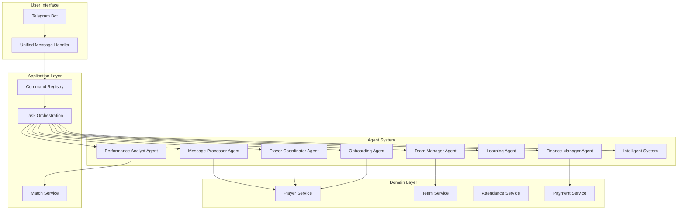
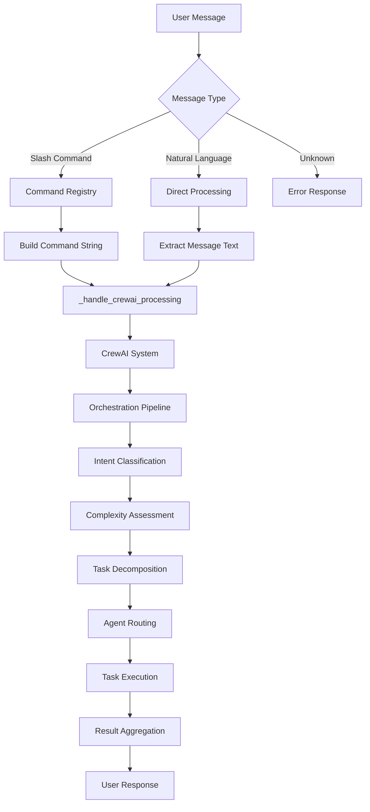
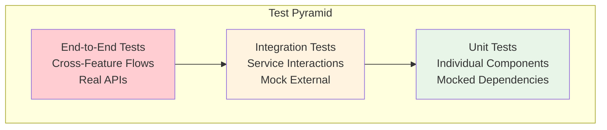

# KICKAI Architecture Documentation

**Version:** 3.0  
**Status:** Production Ready  
**Last Updated:** December 2024  
**Architecture:** Agentic Clean Architecture with CrewAI

## 🎯 Overview

KICKAI is an AI-powered football team management system built with **agentic clean architecture** principles. The system combines advanced AI capabilities with practical team management tools through a sophisticated 8-agent CrewAI architecture, following clean architecture patterns for maintainability and scalability.

## 🏗️ Core Architecture Principles

### 1. **Agentic-First Design**
- **CrewAI Agents**: All user interactions processed through specialized AI agents
- **No Dedicated Command Handlers**: Commands are registered but delegate to CrewAI agents
- **Intelligent Routing**: Context-aware agent selection and task decomposition
- **Single Source of Truth**: Centralized command registry and agent orchestration

### 2. **Clean Architecture Layers**
```
┌─────────────────────────────────────────────────────────────┐
│                    Presentation Layer                        │
│  (Telegram Bot Interface, Unified Message Handler)          │
└─────────────────────────────────────────────────────────────┘
                              │
                              ▼
┌─────────────────────────────────────────────────────────────┐
│                    Application Layer                         │
│  (CrewAI Agents, Command Registry, Task Orchestration)      │
└─────────────────────────────────────────────────────────────┘
                              │
                              ▼
┌─────────────────────────────────────────────────────────────┐
│                     Domain Layer                             │
│  (Business Entities, Domain Services, Repository Interfaces) │
└─────────────────────────────────────────────────────────────┘
                              │
                              ▼
┌─────────────────────────────────────────────────────────────┐
│                  Infrastructure Layer                        │
│  (Firebase, External APIs, Third-party Integrations)        │
└─────────────────────────────────────────────────────────────┘
```

### 3. **Feature-First Modular Structure**
```
src/features/
├── player_registration/     # Player onboarding and registration
├── team_administration/     # Team management and settings
├── match_management/        # Match scheduling and operations
├── attendance_management/   # Attendance tracking
├── payment_management/      # Payment processing and financials
├── communication/          # Messaging and notifications
├── health_monitoring/      # System health and monitoring
└── system_infrastructure/  # Core system services
```

### 4. **Dependency Rules**
- **Presentation → Application → Domain → Infrastructure** ✅
- **Infrastructure → Domain** ❌
- **Domain → Application** ❌
- **Application → Presentation** ❌

## 🤖 Agentic Architecture

### 8-Agent CrewAI System



## 🛠️ CrewAI Best Practices & Lessons Learned

### Critical Implementation Requirements

#### 1. **Tool Independence (MANDATORY)**
- **❌ NEVER**: Tools calling other tools or services
- **✅ ALWAYS**: Tools are simple, independent functions
- **Example**: `get_available_commands` should return static data, not query services

```python
# ❌ WRONG - Tool calling services
@tool("get_available_commands")
def get_available_commands(user_id: str, chat_type: str) -> str:
    service = get_container().get(PlayerService)  # DON'T DO THIS
    return service.get_commands(user_id)

# ✅ CORRECT - Independent tool
@tool("get_available_commands")
def get_available_commands(user_id: str, chat_type: str) -> str:
    if chat_type == "main_chat":
        return "Available commands: /register, /help, /status"
    return "Leadership commands: /approve, /reject, /list"
```

#### 2. **Absolute Imports with PYTHONPATH**
- **ALWAYS** use absolute imports: `from src.features...`
- **ALWAYS** set `PYTHONPATH=src` when running scripts
- **ALWAYS** activate virtual environment: `source venv/bin/activate`

```bash
# ✅ CORRECT - Always use this pattern
source venv/bin/activate && PYTHONPATH=src python run_bot_local.py
```

#### 3. **Tool Discovery & Registration**
- Tools must be discovered automatically from `src/features/*/domain/tools/`
- Tool registry must use `_register_discovered_tool()` method
- Tools must have proper metadata for agent assignment

```python
# ✅ CORRECT - Tool discovery pattern
def _discover_tools_from_file(self, file_path: Path, feature_name: str) -> int:
    # Set PYTHONPATH for imports
    src_path = file_path.parent.parent.parent.parent
    if str(src_path) not in sys.path:
        sys.path.insert(0, str(src_path))
    
    # Load module and find @tool decorated functions
    for attr_name in dir(module):
        attr = getattr(module, attr_name)
        if hasattr(attr, '_is_tool') and attr._is_tool:
            self._register_discovered_tool(attr_name, attr, feature_name)
```

#### 4. **Agent Tool Assignment**
- Agents get tools based on their role configuration
- Tool registry must provide `get_tools_for_role()` method
- Tools must be callable functions, not metadata objects

```python
# ✅ CORRECT - Agent tool assignment
def _get_tools_for_role(self, role: AgentRole) -> List[Any]:
    tools = []
    for tool_name in self._get_tool_names_for_role(role):
        tool_metadata = self._tools.get(tool_name)
        if tool_metadata and hasattr(tool_metadata, 'tool_function'):
            tools.append(tool_metadata.tool_function)
    return tools
```

### Common Pitfalls & Solutions

#### 1. **"Tool object is not callable" Error**
- **Cause**: Tool registry returning metadata instead of callable functions
- **Solution**: Ensure `_register_discovered_tool()` stores proper metadata structure

#### 2. **"ToolRegistry object has no attribute 'items'" Error**
- **Cause**: Code trying to call `len()` or `items()` on ToolRegistry object
- **Solution**: Use `tool_registry.get_tool_names()` instead of direct object methods

#### 3. **Import Errors in Tool Discovery**
- **Cause**: Relative imports or missing PYTHONPATH
- **Solution**: Always use absolute imports and set PYTHONPATH=src

#### 4. **Tool Dependencies**
- **Cause**: Tools trying to import and use services
- **Solution**: Make tools completely independent with static data or simple logic

### Tool Design Patterns

#### 1. **Information Retrieval Tools**
```python
@tool("get_user_status")
def get_user_status_tool(user_id: str, team_id: str = None) -> str:
    """Get user status - independent tool with simple logic"""
    # Simple logic, no service calls
    if user_id and len(user_id) > 0:
        return f"User {user_id} is registered"
    return "User not found"
```

#### 2. **Command Listing Tools**
```python
@tool("get_available_commands")
def get_available_commands(user_id: str, chat_type: str, team_id: str = None) -> str:
    """Get available commands - static data based on context"""
    if chat_type.lower() == "main_chat":
        return "Main chat commands: /register, /help, /status, /list"
    elif chat_type.lower() == "leadership_chat":
        return "Leadership commands: /approve, /reject, /pending, /addplayer"
    return "General commands: /help"
```

#### 3. **Action Tools**
```python
@tool("send_message")
def send_message_tool(chat_id: str, message: str, team_id: str = None) -> str:
    """Send message - delegates to service but tool itself is simple"""
    try:
        # Simple validation
        if not chat_id or not message:
            return "❌ Missing chat_id or message"
        
        # Delegate to service (this is acceptable for action tools)
        service = get_container().get(MessageService)
        result = service.send_message(chat_id, message)
        return f"✅ Message sent: {result}"
    except Exception as e:
        return f"❌ Failed to send message: {str(e)}"
```

### Testing & Validation

#### 1. **Tool Discovery Test**
```bash
source venv/bin/activate && PYTHONPATH=src python -c "
from src.agents.tool_registry import get_tool_registry
registry = get_tool_registry()
registry.auto_discover_tools()
print('Available tools:', registry.get_tool_names())
"
```

#### 2. **Individual Tool Test**
```bash
source venv/bin/activate && PYTHONPATH=src python -c "
from src.features.shared.domain.tools.help_tools import get_available_commands
result = get_available_commands.func('12345', 'main_chat', 'KTI')
print('Tool result:', result)
"
```

### Performance Considerations

#### 1. **Tool Loading**
- Tools are discovered once at startup
- No runtime tool discovery (performance impact)
- Tool registry cached in memory

#### 2. **Agent Initialization**
- Agents created once per team
- Tool assignment happens during agent creation
- No dynamic tool reassignment

#### 3. **Memory Management**
- Tool functions are lightweight
- No heavy dependencies in tool functions
- Services injected only when needed

### Security & Error Handling

#### 1. **Input Validation**
- All tool inputs validated before processing
- Sanitize user inputs to prevent injection
- Return clear error messages

#### 2. **Exception Handling**
- Tools must handle exceptions gracefully
- Return meaningful error messages
- Log errors for debugging

#### 3. **Access Control**
- Tools respect user permissions
- Chat type determines available commands
- Team context for multi-tenant isolation

## 🔧 Command Architecture

### Unified Command System



### Command Registration Pattern

```python
@command("/help", "Show available commands", feature="shared")
async def handle_help(update, context, **kwargs):
    # Command is registered but delegates to CrewAI agent
    # No direct implementation - handled by HelpAssistantAgent
    pass
```

### Command Processing Flow

1. **Input Processing**: Handle both slash commands and natural language
2. **Command Registry**: Auto-discovery and metadata for slash commands
3. **Unified Processing**: Both paths converge to `_handle_crewai_processing`
4. **CrewAI System**: Single orchestration pipeline for all requests
5. **Intent Classification**: Determine user intent (for both input types)
6. **Complexity Assessment**: Analyze request complexity
7. **Task Decomposition**: Break down into subtasks with agent assignments
8. **Agent Routing**: Route subtasks to appropriate agents
9. **Task Execution**: Execute tasks through specialized agents
10. **Result Aggregation**: Combine results and format response

### Unified Processing Architecture

**Key Insight**: Both slash commands and natural language converge to the **exact same processing pipeline**.

#### **Slash Command Path**
```python
# 1. Command Registry Discovery
registry = get_command_registry()
all_commands = registry.list_all_commands()

# 2. Build Command String
message_text = f"{command_name} {' '.join(args)}".strip()
# Example: "/help" or "/myinfo"

# 3. Unified Processing
await self._handle_crewai_processing(update, message_text, user_id, chat_id, chat_type, username)
```

#### **Natural Language Path**
```python
# 1. Direct Processing
message_text = update.message.text.strip()
# Example: "help me" or "what's my info"

# 2. Unified Processing
await self._handle_crewai_processing(update, message_text, user_id, chat_id, chat_type, username)
```

#### **Convergence Point**
```python
async def _handle_crewai_processing(self, update, message_text, user_id, chat_id, chat_type, username):
    # Create execution context
    execution_context = {
        'user_id': user_id,
        'team_id': self.team_id,
        'chat_id': chat_id,
        'is_leadership_chat': chat_type == ChatType.LEADERSHIP,
        'username': username,
        'message_text': message_text  # ← Only difference!
    }
    
    # Execute with CrewAI ← UNIFIED PROCESSING
    result = await self.crewai_system.execute_task(message_text, execution_context)
```

### Benefits of Unified Processing

1. **🔒 Consistent Security**: Same permission checking for both input types
2. **🔄 Single Source of Truth**: No code duplication between paths
3. **🧪 Unified Testing**: Test once, works for both input methods
4. **🛠️ Maintainable**: Single processing pipeline to maintain
5. **📈 Scalable**: Easy to add new input methods (voice, buttons, etc.)
6. **🎯 Consistent Behavior**: Same agent selection and execution logic

### Natural Language Security

**Critical Security Feature**: Natural language processing includes the same permission checks as slash commands:

1. **Intent Classification**: Determine user intent from natural language
2. **Command Mapping**: Map intent to equivalent command for permission checking
3. **Permission Validation**: Apply same permission logic as registered commands
4. **Access Control**: Deny access if user lacks required permissions
5. **Agent Routing**: Only route to agent if permission check passes

## 🏛️ Feature Architecture

### Feature Structure

Each feature follows this structure:

```
features/
├── feature_name/
│   ├── application/
│   │   ├── commands/          # Command registrations (decorators only)
│   │   └── handlers/          # Business logic handlers
│   ├── domain/
│   │   ├── entities/          # Business entities
│   │   ├── repositories/      # Repository interfaces
│   │   ├── services/          # Business services
│   │   ├── interfaces/        # Service interfaces
│   │   └── tools/             # CrewAI tools
│   ├── infrastructure/
│   │   └── firebase_*_repository.py  # Concrete implementations
│   └── tests/
│       ├── unit/
│       ├── integration/
│       └── e2e/
```

### Cross-Feature Communication

#### 1. **Service-to-Service Communication**
- Services communicate through interfaces
- Factory pattern ensures proper dependency injection
- No direct imports between feature implementations

#### 2. **Event-Driven Communication**
- Domain events for loose coupling
- Event handlers in application layer
- Asynchronous processing where appropriate

#### 3. **Shared Domain Models**
- Common entities in `features/shared/`
- Adapters for cross-feature data transformation
- Consistent data models across features

## 🗄️ Database Architecture

### Firebase/Firestore Structure

```
teams/{team_id}/
├── players/
│   ├── {player_id}/
│   │   ├── name: string
│   │   ├── phone: string
│   │   ├── position: string
│   │   ├── status: string
│   │   └── registration_date: timestamp
├── matches/
│   ├── {match_id}/
│   │   ├── name: string
│   │   ├── date: timestamp
│   │   ├── location: string
│   │   └── squad: array
├── payments/
│   ├── {payment_id}/
│   │   ├── player_id: string
│   │   ├── match_id: string
│   │   ├── amount: number
│   │   └── status: string
├── attendance/
│   ├── {attendance_id}/
│   │   ├── player_id: string
│   │   ├── match_id: string
│   │   └── status: string
└── settings/
    ├── team_name: string
    ├── chat_ids: object
    └── configuration: object
```

### Repository Pattern

- Interface defined in domain layer
- Implementation in infrastructure layer
- Factory creates concrete implementations

## 🧪 Testing Strategy

### Test Pyramid



### Testing Architecture

#### 1. **Unit Tests**
- Test individual services and components
- Mock dependencies using interfaces
- Fast execution, high coverage

#### 2. **Integration Tests**
- Test service interactions
- Use in-memory database for speed
- Verify business logic flows

#### 3. **E2E Tests**
- Test complete user journeys
- Use real Firebase Testing environment
- Validate cross-feature flows

## 🔒 Security & Access Control

### 1. **Team-Based Isolation**
- All data scoped to team_id
- Multi-tenant architecture
- Secure data boundaries

### 2. **Role-Based Access**
- Player vs Admin roles
- Feature-specific permissions
- Audit logging for sensitive operations

### 3. **Chat-Based Access Control**
- Main chat: Read-only commands
- Leadership chat: All commands
- Private messages: Limited command set

## ⚡ Performance Considerations

### 1. **Async/Await Pattern**
- I/O operations are asynchronous
- Non-blocking service calls
- Efficient resource utilization

### 2. **Agent Optimization**
- Lazy agent creation
- Tool caching and reuse
- Intelligent agent selection

### 3. **Database Optimization**
- Indexed queries on team_id
- Efficient data structures
- Connection pooling

## 🚀 Deployment Architecture

### 1. **Multi-Environment Support**
- Local development with .env
- Testing with .env.test
- Production with Railway environment variables

### 2. **Multi-Bot Support**
- One bot per team
- Isolated bot sessions
- Centralized bot management

### 3. **LLM Integration**
- Local: Ollama for development
- Production: Google Gemini
- Railway: Google Gemini

## 📊 Monitoring & Observability

### 1. **Health Monitoring**
- Service health checks
- Database connectivity monitoring
- Bot status monitoring

### 2. **Logging Strategy**
- Structured logging with loguru
- Error tracking
- Performance metrics

### 3. **Agent Performance**
- Agent execution metrics
- Tool usage statistics
- Response time monitoring

## 🔄 Migration Strategy

### 1. **Feature Migrations**
- Gradual migration to new architecture
- Backward compatibility during transition
- Feature flags for gradual rollout

### 2. **Data Migrations**
- Schema evolution support
- Data transformation utilities
- Rollback capabilities

## 📚 Best Practices

### 1. **Code Organization**
- Follow feature-first structure
- Use agentic patterns for user interactions
- Maintain clean dependency hierarchy

### 2. **Error Handling**
- Comprehensive exception handling
- Graceful degradation
- User-friendly error messages

### 3. **Documentation**
- Keep architecture docs updated
- Document cross-feature flows
- Maintain API documentation

### 4. **Agent Development**
- Single responsibility for each agent
- Clear tool definitions
- Consistent communication patterns

## 🔮 Future Considerations

### 1. **Scalability**
- Horizontal scaling support
- Load balancing capabilities
- Database sharding strategies

### 2. **Extensibility**
- Plugin architecture for new features
- API versioning strategy
- Backward compatibility

### 3. **Performance**
- Caching strategies
- Database optimization
- Async processing improvements

### 4. **AI Enhancement**
- Advanced agent capabilities
- Machine learning integration
- Predictive analytics 

## 📚 References

- [CrewAI Documentation](https://docs.crewai.com/)
- [CrewAI Tool Best Practices](https://docs.crewai.com/how-to/use-tools/)
- [Python Import System](https://docs.python.org/3/reference/import.html)
- [Clean Architecture Principles](https://blog.cleancoder.com/uncle-bob/2012/08/13/the-clean-architecture.html) 