# KICKAI Enhanced Architecture Documentation

**Version:** 2.0  
**Status:** Production Ready  
**Last Updated:** December 2024  
**Architecture:** Feature-First Clean Architecture with 8-Agent CrewAI System

## 📋 Table of Contents

1. [System Overview](#system-overview)
2. [Architectural Principles](#architectural-principles)
3. [High-Level Architecture](#high-level-architecture)
4. [Feature-Based Modular Architecture](#feature-based-modular-architecture)
5. [Cross-Feature Flows](#cross-feature-flows)
6. [Testing Architecture](#testing-architecture)
7. [Deployment Architecture](#deployment-architecture)
8. [Data Flow Diagrams](#data-flow-diagrams)
9. [Component Interactions](#component-interactions)
10. [Security Architecture](#security-architecture)

---

## 🎯 System Overview

KICKAI is an AI-powered football team management system built with a **feature-first, clean architecture** approach. The system combines advanced AI capabilities with practical team management tools through a sophisticated 8-agent CrewAI architecture.

### Core Technology Stack
- **AI Engine**: CrewAI with Google Gemini/OpenAI/Ollama support
- **Database**: Firebase Firestore with real-time synchronization
- **Bot Platform**: Telegram Bot API
- **Payment Processing**: Collectiv API integration
- **Deployment**: Railway with Docker
- **Testing**: pytest with comprehensive cross-feature test coverage
- **Architecture**: Feature-First Clean Architecture with dependency injection

---

## 🏗️ Architectural Principles

### 1. **Feature-First Organization**
```
src/features/
├── player_registration/     # Player onboarding and registration
├── team_administration/     # Team management and settings
├── match_management/        # Match scheduling and operations
├── attendance_management/   # Attendance tracking
├── payment_management/      # Payment processing and financials
├── communication/          # Messaging and notifications
├── health_monitoring/      # System health and monitoring
└── system_infrastructure/  # Core system services
```

### 2. **Clean Architecture Layers**
Each feature follows the clean architecture pattern:

```
┌─────────────────────────────────────────────────────────────┐
│                    Presentation Layer                        │
│  (Telegram Bot Interface, Command Handlers, Message Routing) │
└─────────────────────────────────────────────────────────────┘
                              │
                              ▼
┌─────────────────────────────────────────────────────────────┐
│                    Application Layer                         │
│  (Use Cases, State Management, Agent Orchestration)         │
└─────────────────────────────────────────────────────────────┘
                              │
                              ▼
┌─────────────────────────────────────────────────────────────┐
│                     Domain Layer                             │
│  (Business Entities, Domain Services, Repository Interfaces) │
└─────────────────────────────────────────────────────────────┘
                              │
                              ▼
┌─────────────────────────────────────────────────────────────┐
│                  Infrastructure Layer                        │
│  (Database, External APIs, Third-party Integrations)        │
└─────────────────────────────────────────────────────────────┘
```

### 3. **Dependency Rules**
- **Presentation → Application → Domain → Infrastructure** ✅
- **Infrastructure → Domain** ❌
- **Domain → Application** ❌
- **Application → Presentation** ❌

---

## 🏛️ High-Level Architecture

### System Architecture Diagram

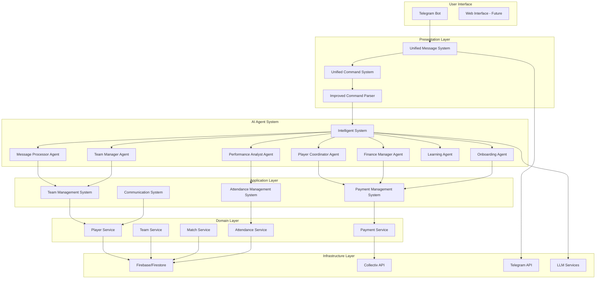

### Feature Interaction Architecture

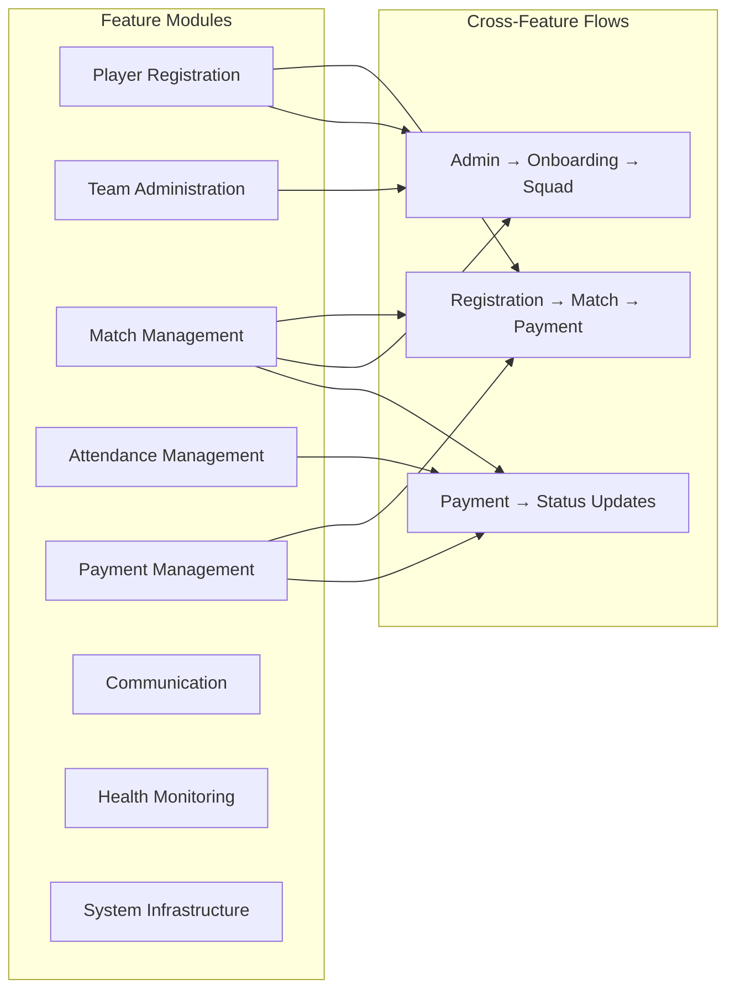

---

## 🔄 Cross-Feature Flows

### 1. **Player Registration to Match to Payment Flow**

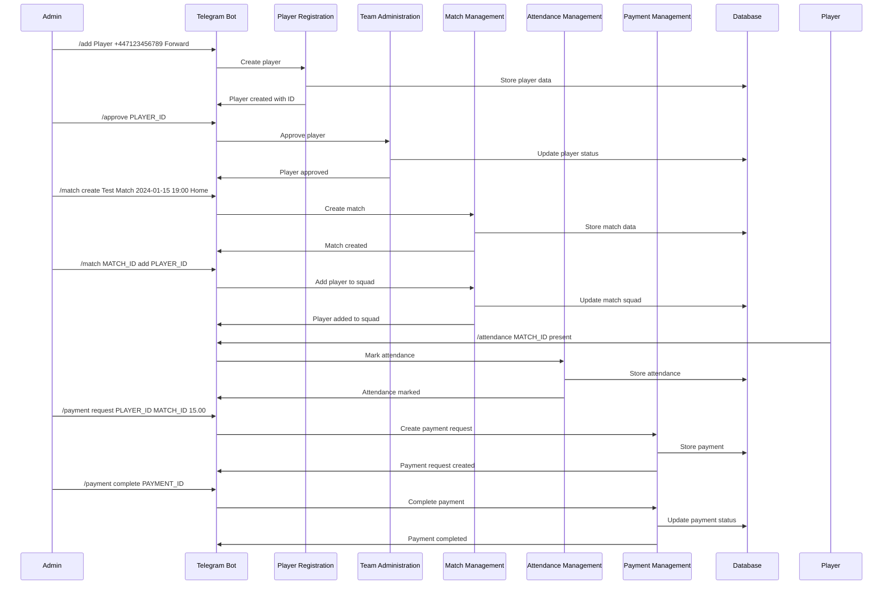

### 2. **Admin Workflow: Player Addition to Squad**

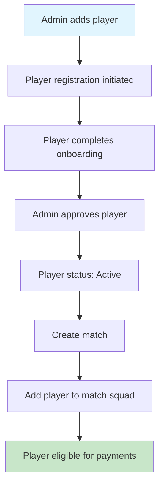

### 3. **Payment Completion Status Propagation**

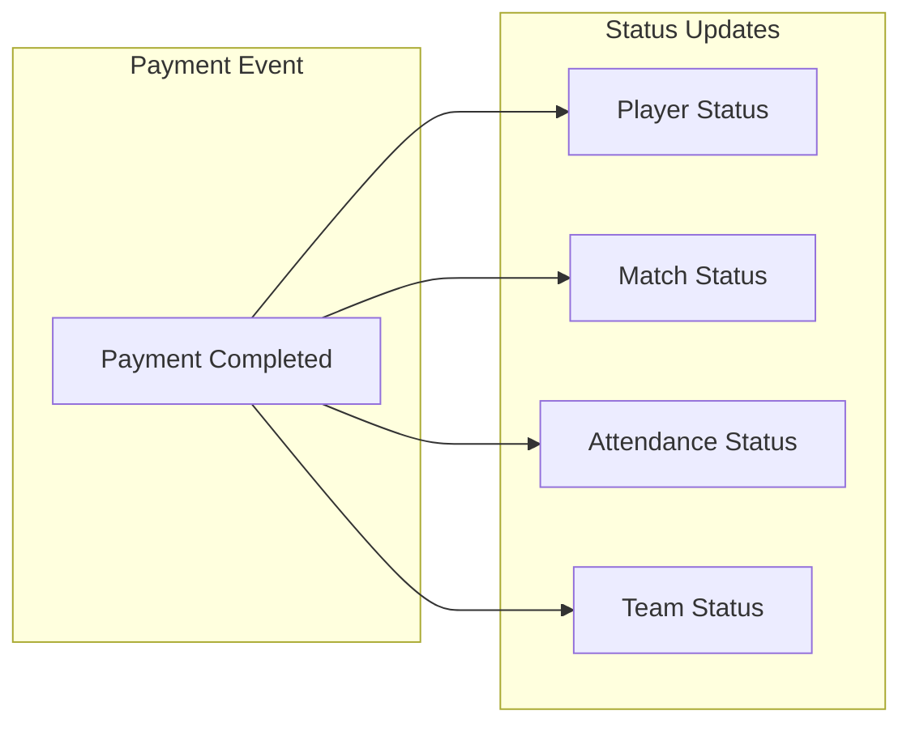

---

## 🧪 Testing Architecture

### Test Pyramid

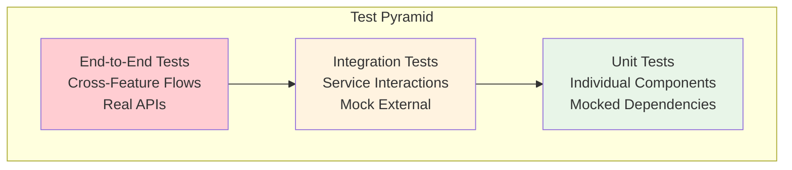

### Cross-Feature Test Coverage

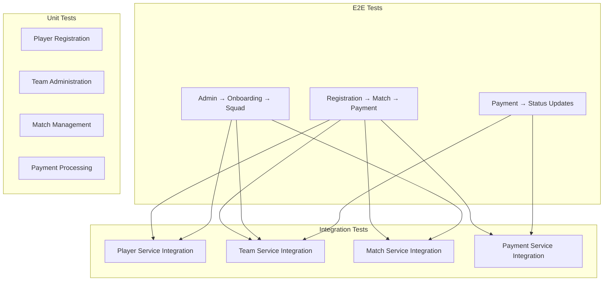

### Test Execution Flow

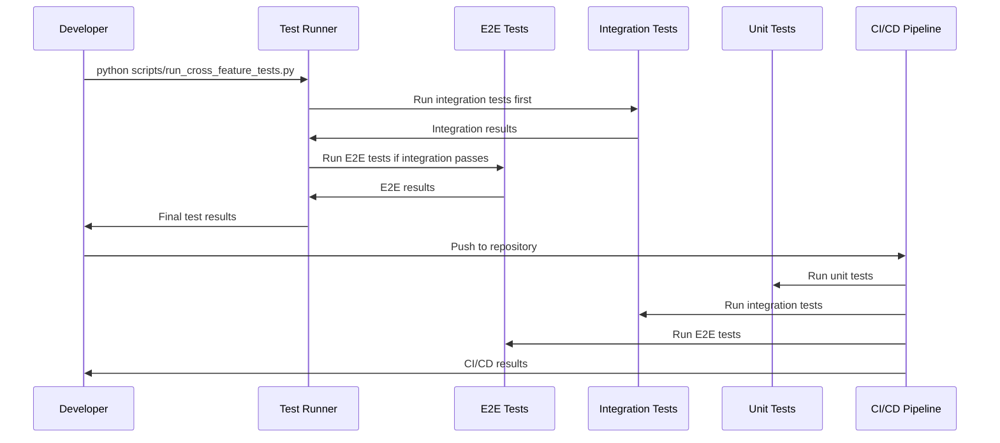

---

## 🚀 Deployment Architecture

### Environment Architecture

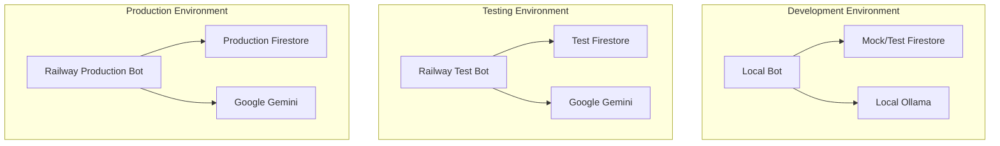

### Deployment Pipeline

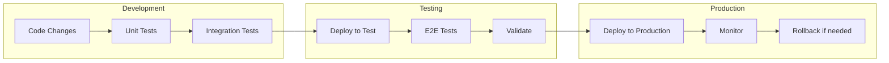

---

## 📊 Data Flow Diagrams

### Message Processing Flow

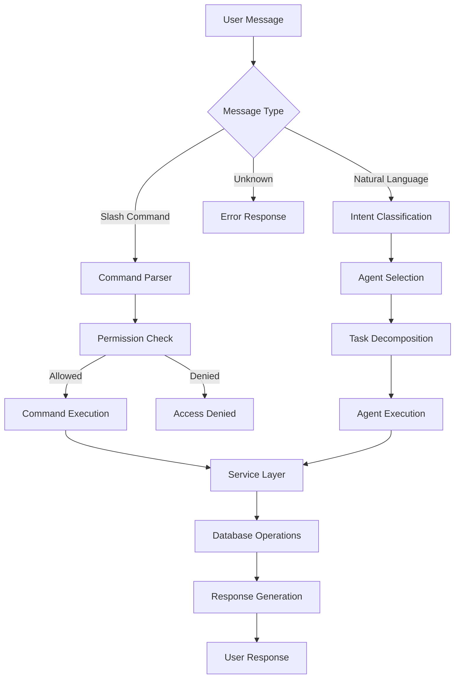

### Cross-Feature Data Consistency

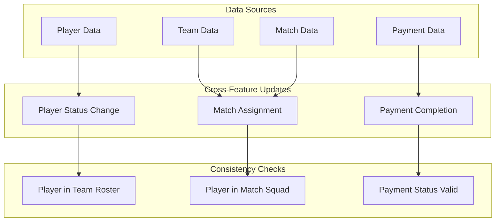

---

## 🔧 Component Interactions

### Service Layer Interactions

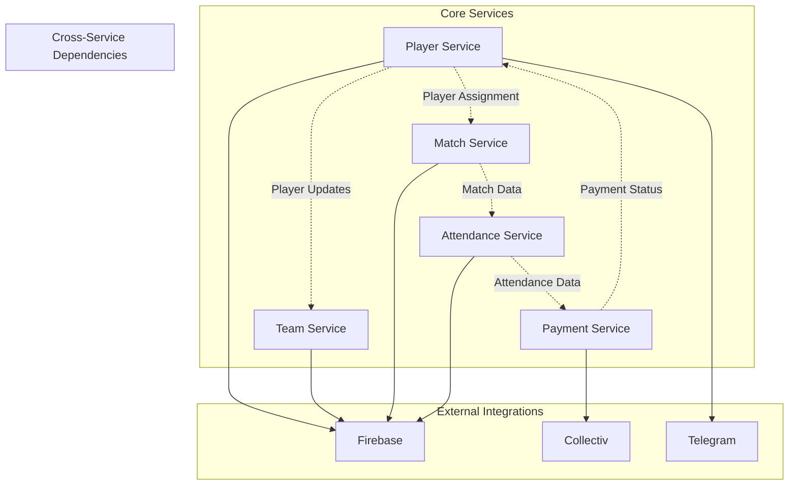

### Agent System Interactions

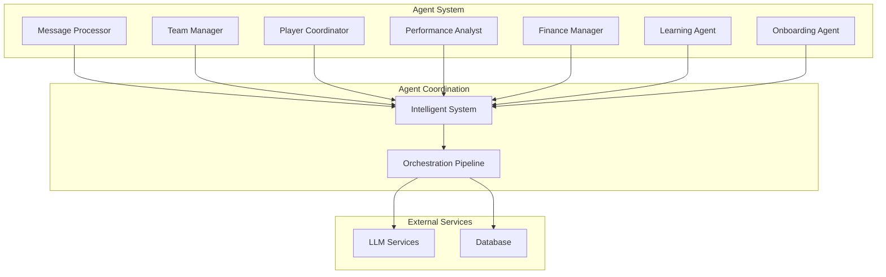

---

## 🔒 Security Architecture

### Access Control Architecture

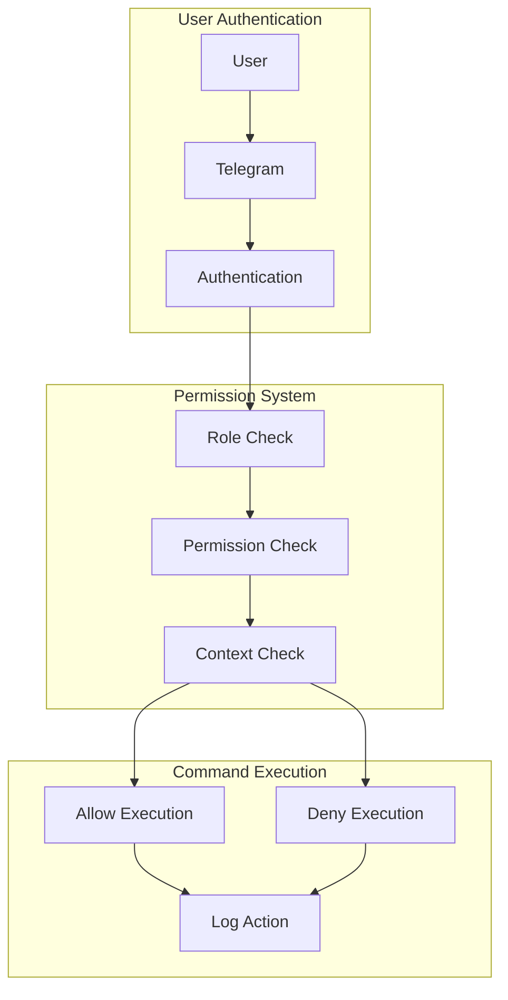

### Data Security Flow

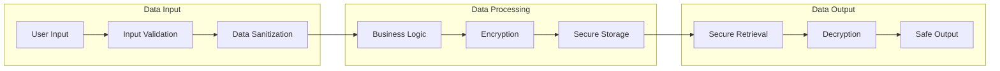

---

## 📈 Performance Architecture

### Scalability Considerations

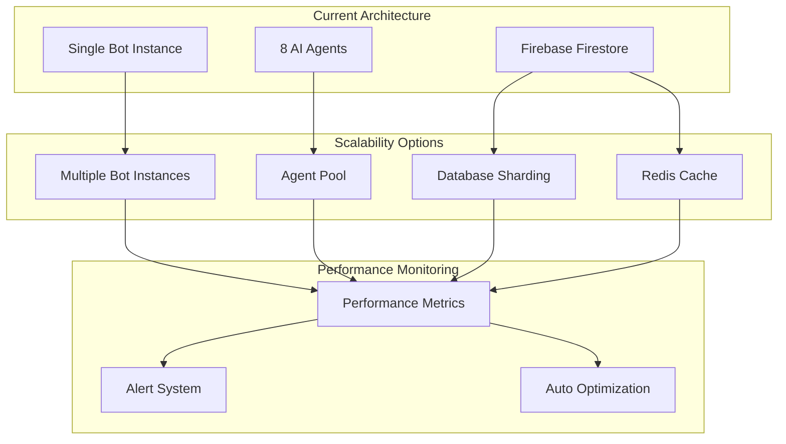

---

## 🔄 Migration and Evolution

### Architecture Evolution Path

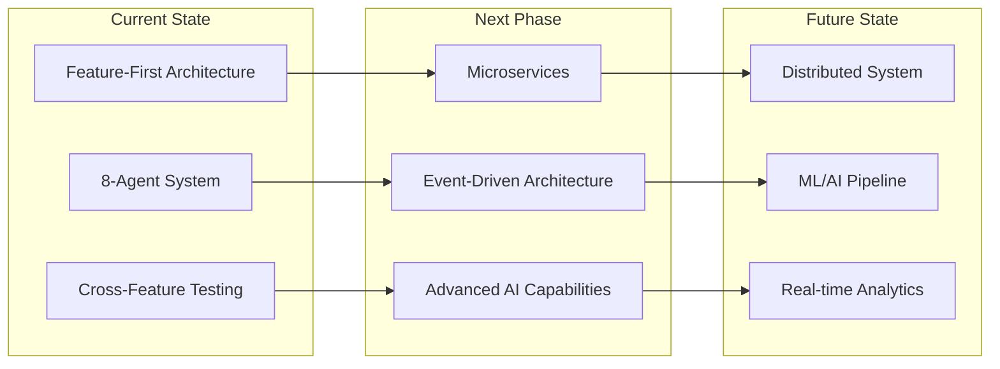

---

## 📚 Best Practices

### 1. **Feature Development**
- Follow feature-first organization
- Implement clean architecture within each feature
- Use dependency injection for flexibility
- Write comprehensive tests for each feature

### 2. **Cross-Feature Integration**
- Use events for loose coupling
- Implement interface-based communication
- Maintain data consistency across features
- Test cross-feature flows thoroughly

### 3. **Testing Strategy**
- Maintain test pyramid balance
- Focus on cross-feature E2E tests
- Use integration tests for service interactions
- Keep unit tests fast and focused

### 4. **Deployment**
- Use environment-specific configurations
- Implement blue-green deployments
- Monitor system health continuously
- Have rollback strategies ready

---

**Last Updated**: December 2024  
**Version**: 2.0  
**Status**: Production Ready 