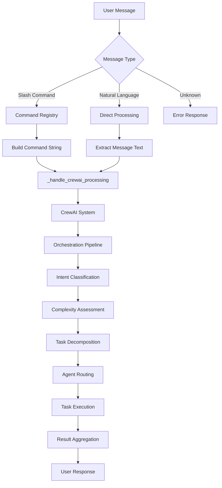
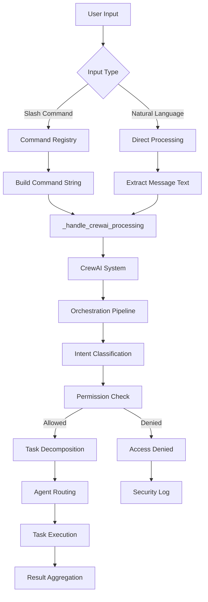
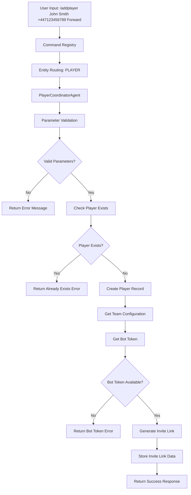

# KICKAI Command Specifications

**Version:** 4.0  
**Status:** Production Ready  
**Last Updated:** July 2025  
**Architecture:** Plain Text with Emojis - Simple and Reliable

This document defines the expected behavior for all KICKAI bot commands across different scenarios, chat types, and user states, using the latest agentic architecture.

## Table of Contents
- [Command Overview](#command-overview)
- [Agentic Architecture](#agentic-architecture)
- [Chat Types](#chat-types)
- [User States](#user-states)
- [Command Specifications](#command-specifications)
- [Command Processing Flow](#command-processing-flow)
- [Testing Scenarios](#testing-scenarios)

## Command Overview

### Core Commands
| Command | Description | Main Chat | Leadership Chat | Permission Level | Agent |
|---------|-------------|-----------|-----------------|------------------|-------|
| `/help` | Show available commands | ✅ | ✅ | PUBLIC | HelpAssistantAgent |
| `/start` | Initialize bot interaction | ✅ | ✅ | PUBLIC | MessageProcessorAgent |
| `/register` | Register as a new player | ✅ | ❌ | PUBLIC | PlayerCoordinatorAgent |
| `/myinfo` | Show personal information | ✅ | ✅ | PUBLIC | PlayerCoordinatorAgent |
| `/status` | Check player/team member status | ✅ | ✅ | PUBLIC | PlayerCoordinatorAgent |
| `/list` | List players/team members | ✅ | ✅ | PUBLIC | TeamManagerAgent |

### Player Management Commands
| Command | Description | Main Chat | Leadership Chat | Permission Level | Agent |
|---------|-------------|-----------|-----------------|------------------|-------|
| `/addplayer` | Add a new player | ❌ | ✅ | LEADERSHIP | PlayerCoordinatorAgent |
| `/approve` | Approve player registration | ❌ | ✅ | LEADERSHIP | TeamManagerAgent |
| `/reject` | Reject player registration | ❌ | ✅ | LEADERSHIP | TeamManagerAgent |
| `/pending` | Show pending registrations | ❌ | ✅ | LEADERSHIP | TeamManagerAgent |

### Team Management Commands
| Command | Description | Main Chat | Leadership Chat | Permission Level | Agent |
|---------|-------------|-----------|-----------------|------------------|-------|
| `/team` | Team information | ✅ | ✅ | PUBLIC | TeamManagerAgent |
| `/invite` | Generate invitation link | ❌ | ✅ | LEADERSHIP | TeamManagerAgent |
| `/announce` | Make team announcement | ❌ | ✅ | LEADERSHIP | TeamManagerAgent |

### System Commands
| Command | Description | Main Chat | Leadership Chat | Permission Level | Agent |
|---------|-------------|-----------|-----------------|------------------|-------|
| `/health` | System health check | ❌ | ✅ | SYSTEM | SystemInfrastructureAgent |
| `/version` | Bot version info | ✅ | ✅ | PUBLIC | MessageProcessorAgent |
| `/config` | Configuration info | ❌ | ✅ | SYSTEM | SystemInfrastructureAgent |

## Agentic Architecture

### Command Processing Overview

The KICKAI system uses an **agentic-first approach** where all commands are processed through specialized CrewAI agents rather than dedicated command handlers.



### Agent Responsibilities

#### 1. **HelpAssistantAgent**
- **Primary Commands**: `/help`, help-related natural language
- **Responsibilities**:
  - Context-aware help information
  - User status validation
  - Command availability checking
  - Registration flow guidance
- **Tools**: `get_user_status`, `get_available_commands`, `format_help_message`

#### 2. **MessageProcessorAgent**
- **Primary Commands**: `/start`, `/version`, general natural language
- **Responsibilities**:
  - Message parsing and intent classification
  - Context extraction
  - Simple query responses
  - Agent routing for complex requests
- **Tools**: Intent analysis, context extraction, message routing

#### 3. **PlayerCoordinatorAgent**
- **Primary Commands**: `/register`, `/myinfo`, `/status`, `/addplayer`
- **Responsibilities**:
  - Player registration and onboarding
  - Individual player support
  - Player status tracking
  - Personal information management
  - Player addition and invite link generation
- **Tools**: Player management, registration, status tracking, add_player

#### 4. **TeamManagerAgent**
- **Primary Commands**: `/list`, `/approve`, `/reject`, `/team`, `/invite`, `/announce`
- **Responsibilities**:
  - Team administration
  - Player management
  - Team coordination
  - Administrative oversight
- **Tools**: Team management, player administration, team coordination

#### 5. **SystemInfrastructureAgent**
- **Primary Commands**: `/health`, `/config`
- **Responsibilities**:
  - System health monitoring
  - Configuration management
  - System diagnostics
  - Infrastructure oversight
- **Tools**: Health monitoring, configuration management, system diagnostics

### Command Registration Pattern

Commands are registered using decorators but delegate to CrewAI agents:

```python
@command("/help", "Show available commands", feature="shared")
async def handle_help(update, context, **kwargs):
    # Command is registered but delegates to HelpAssistantAgent
    # No direct implementation - handled by CrewAI agent
    pass
```

### Natural Language Processing

All natural language queries are processed through the **unified CrewAI pipeline** - the same system that handles slash commands.

#### **Unified Processing Flow**

```python
# Both slash commands and natural language converge here:
async def _handle_crewai_processing(self, update, message_text, user_id, chat_id, chat_type, username):
    # Create execution context
    execution_context = {
        'user_id': user_id,
        'team_id': self.team_id,
        'chat_id': chat_id,
        'is_leadership_chat': chat_type == ChatType.LEADERSHIP,
        'username': username,
        'message_text': message_text  # ← Only difference between input types!
    }
    
    # Execute with CrewAI ← UNIFIED PROCESSING
    result = await self.crewai_system.execute_task(message_text, execution_context)
```

#### **Input Processing Examples**

**Slash Command Path:**
```python
# User types: /help
message_text = "/help"

# User types: /myinfo
message_text = "/myinfo"
```

**Natural Language Path:**
```python
# User types: "help me"
message_text = "help me"

# User types: "what's my info"
message_text = "what's my info"
```

**Both paths converge to the same processing pipeline!**

### Natural Language Security Implementation

Since both paths use the same processing pipeline, **security is automatically consistent**:

#### **1. Intent Classification**
```python
async def _classify_intent(self, message_text: str, user_id: str, chat_type: str) -> Dict[str, Any]:
    """Classify user intent from natural language."""
    # Use LLM to determine what the user wants to do
    # Return structured intent with action, parameters, and confidence
```

#### **2. Command Mapping**
```python
def _map_intent_to_command(self, intent: Dict[str, Any]) -> Optional[str]:
    """Map natural language intent to equivalent command for permission checking."""
    intent_action = intent.get('action', '').lower()
    
    # Map common natural language patterns to commands
    mappings = {
        'help': '/help',
        'show commands': '/help',
        'what can you do': '/help',
        'my info': '/myinfo',
        'my information': '/myinfo',
        'player status': '/status',
        'list players': '/list',
        'team info': '/team',
        'add player': '/addplayer',
        'approve player': '/approve',
        'system health': '/health',
        'bot version': '/version'
    }
    
    return mappings.get(intent_action)
```

#### **3. Permission Validation**
```python
async def _check_permission(self, command: str, user_id: str, chat_type: str) -> bool:
    """Check if user has permission to execute the equivalent command."""
    # Use the same permission logic as slash commands
    registry = get_command_registry()
    command_metadata = registry.get_command(command)
    
    if not command_metadata:
        return False
    
    # Apply same permission checking logic
    user_permission = await self._get_user_permission_level(user_id, chat_type)
    return user_permission >= command_metadata.permission_level.value
```

#### **4. Access Control**
```python
async def _send_access_denied_message(self, update, command: str):
    """Send access denied message for natural language requests."""
    chat_type = self._determine_chat_type(str(update.effective_chat.id))
    
    if chat_type == ChatType.MAIN:
        message = f"""❌ Access Denied

🔒 The action you requested requires leadership access.
💡 Please use the leadership chat for this function."""
    else:
        message = f"""❌ Access Denied

🔒 You don't have permission to perform this action.
💡 Contact your team admin for access."""
    
    await update.message.reply_text(message)
```

## 🔒 Security & Access Control

### **Unified Security Through Unified Processing**

The KICKAI system implements **comprehensive permission checking** through its unified processing pipeline. Since both slash commands and natural language use the same CrewAI orchestration system, security is automatically consistent.

#### **Security Flow**



#### **Permission Levels**

| Level | Description | Access |
|-------|-------------|--------|
| **PUBLIC** | Available to everyone | Basic commands, help, version |
| **PLAYER** | Available to registered players | Player-specific commands |
| **LEADERSHIP** | Available to team leadership | Administrative commands |
| **ADMIN** | Available to team admins | System configuration |
| **SYSTEM** | Available to system only | Health checks, diagnostics |

#### **Security Implementation**

**1. Unified Processing Pipeline**
- Both slash commands and natural language use the same CrewAI system
- Same permission logic applied to both input types
- No bypass of permission system through natural language

**2. Intent-to-Command Mapping**
- Natural language requests are mapped to equivalent commands
- Same permission logic applied to both input types
- No bypass of permission system through natural language

**3. Context-Aware Validation**
- Chat type validation (main vs leadership)
- User role validation (player vs team member vs admin)
- Team-based isolation (team_id scoping)

**4. Comprehensive Logging**
- All permission checks logged for audit
- Failed attempts tracked for security monitoring
- User actions traced for accountability

#### **Security Examples**

**Example 1: Unauthorized Leadership Request**
```
User (in main chat): "Add a new player to the team"
System: Maps to /addplayer command
Permission Check: LEADERSHIP required, user has PLAYER level
Result: ❌ Access Denied - "This action requires leadership access"
```

**Example 2: Authorized Player Request**
```
User (in main chat): "Show me my player information"
System: Maps to /myinfo command
Permission Check: PUBLIC level, user has PLAYER level
Result: ✅ Access Granted - Player information displayed
```

**Example 3: Leadership Command in Leadership Chat**
```
User (in leadership chat): "Approve player registration"
System: Maps to /approve command
Permission Check: LEADERSHIP required, user has LEADERSHIP level
Result: ✅ Access Granted - Player approval processed
```

### **Benefits of Unified Security**

1. **🔒 Consistent Protection**: Same security for all input methods
2. **🔄 Single Security Logic**: No duplication of permission checking
3. **🧪 Unified Testing**: Security tested once, works everywhere
4. **🛠️ Maintainable**: Single security pipeline to maintain
5. **📈 Scalable**: New input methods automatically inherit security
6. **🎯 No Security Gaps**: Impossible to bypass through different input methods

## Chat Types

### Main Chat (`{team_config.main_chat_id}`)
**Purpose**: General team communication  
**Users**: All registered players and team members  
**Commands**: Public commands, player-focused features  
**Context**: `is_leadership_chat: false`

### Leadership Chat (`{team_config.leadership_chat_id}`)
**Purpose**: Administrative and management functions  
**Users**: Team leaders, administrators, coaches  
**Commands**: All commands including administrative functions  
**Context**: `is_leadership_chat: true`

## User States

### Unregistered User
**Status**: User not registered in the system  
**Access**: Limited access - can only use `/register` command  
**Data**: No record in Firestore  
**Registration**: Must register to gain access

**Note**: Users who are not registered in the system can only use the `/register` command. All other commands will show a message asking them to contact an admin to be registered.

#### **Unregistered User Flow Processing**

**Trigger**: Any command typed by an unregistered user (except `/register`)

**Behavior**: 
- Show message explaining they need to be registered
- Block all commands except `/register`
- Guide them to contact an admin

#### **Implementation Flow**
```python
# 1. User types any command
# 2. System checks if user is registered
is_registered = await self._check_user_registration(user_id)

# 3. If not registered and NOT /register command, show message and block processing
if not is_registered and command != "/register":
    await self._show_unregistered_user_message(update, username, chat_type)
    return  # Block normal command processing

# 4. If not registered and IS /register command, allow normal processing
# 5. After registration, user gains appropriate access based on chat type
```

#### **Unregistered User Response Message**

**Main Chat:**
```
👋 Welcome to KICKAI for {team_id}, {username}!

🤖 KICKAI v{BOT_VERSION} - Your AI-powered football team assistant

🎯 To join the team as a player:

📞 Contact Team Leadership
You need to be added as a player by someone in the team's leadership.

💬 What to do:
1. Reach out to someone in the team's leadership chat
2. Ask them to add you as a player using the `/addplayer` command
3. They'll send you an invite link to join the main chat
4. Once added, you can register with your full details

❓ Got here by mistake?
If you're not interested in joining the team, you can leave this chat.

🤖 Need help?
Use /help to see available commands or ask me questions!
```

**Leadership Chat:**
```
👋 Welcome to KICKAI Leadership for {team_id}, {username}!

🤖 KICKAI v{BOT_VERSION} - Your AI-powered football team assistant

🤔 I don't see you registered as a team member yet.

📝 Please provide your details so I can add you to the team members collection.

💡 You can use:
/register [name] [phone] [role]

Example:
/register John Smith +1234567890 Assistant Coach

🎯 Your role can be:
• Team Manager, Coach, Assistant Coach
• Club Administrator, Treasurer
• Volunteer Coordinator, etc.

🚀 Once registered, you can:
• Add other team members and players
• Generate invite links for chats
• Manage the team system

Ready to get started? Use the /register command above!
```

### Registered Player
**Status**: Active player in the system  
**Access**: Main chat commands, limited leadership chat access  
**Data**: Player record in Firestore

**Design Principle**: Commands have distinct implementations for different chat contexts to maintain clean, predictable behavior.

#### **Command Context Design**
- **Main Chat Commands**: Implemented specifically for player interactions
- **Leadership Chat Commands**: Implemented specifically for administrative functions
- **Same Command Names**: Can exist in both contexts but with different implementations
- **Clean Architecture**: No conditional logic based on chat context

#### **Example: `/list` Command**
```python
# Main Chat Implementation
@command(name="/list", description="List active players", chat_type="main")
async def list_players_main(update, context):
    """List only active players in main chat."""
    players = await get_active_players()
    return format_player_list(players, show_status=False)

# Leadership Chat Implementation  
@command(name="/list", description="List all players with status", chat_type="leadership")
async def list_players_leadership(update, context):
    """List all players with detailed status in leadership chat."""
    players = await get_all_players()
    return format_player_list(players, show_status=True, show_details=True)
```

#### **Benefits of This Approach**
- **🎯 Predictable Behavior**: Same command always behaves the same way in same context
- **🧹 Clean Code**: No complex conditional logic
- **📋 Clear Intent**: Each implementation has a single, clear purpose
- **🛠️ Maintainable**: Easy to modify behavior for specific contexts
- **🧪 Testable**: Each implementation can be tested independently

### Registered Team Member
**Status**: Member of the leadership chat with team management responsibilities  
**Access**: All commands in leadership chat, admin commands based on role  
**Data**: Team member record in Firestore  
**Registration**: Must register to provide their details

#### **Dual Role Capability**
- **Team Member**: Core role as a member of the leadership chat
- **Player**: Can also be a registered player if added to main chat and completed registration
- **Role-Based Permissions**: Admin commands only available with admin role

#### **Registration Process**
```python
# Team member registration flow
async def register_team_member(update, context):
    """Register a new team member with their details."""
    # Collect team member information
    # Store in team_members collection
    # Assign appropriate roles and permissions
    # Grant access to leadership chat commands
```

#### **Role-Based Access Control**
```python
# Example role checking for admin commands
@command(name="/approve", description="Approve player registration", chat_type="leadership")
async def approve_player(update, context):
    """Approve a player registration (admin only)."""
    user_roles = await get_user_roles(update.effective_user.id)
    
    if "admin" not in user_roles:
        return "❌ Access Denied: Admin role required for this command."
    
    # Proceed with approval logic
    return await process_player_approval(update, context)
```

#### **Available Commands**
- **All Leadership Commands**: Can run any command available in leadership chat
- **Admin Commands**: Only if they have admin role
- **Player Commands**: If also registered as a player in main chat
- **Team Management**: Access to team oversight and coordination features

#### **Example Team Member Response**
```
👔 KICKAI Leadership Commands

👤 {telegram_name} (ID: {member_id})
Role: {role} | Player: {is_player}

Team Management:
• /register - Register new player with name, phone, position
• /addplayer - Add new player to team roster
• /list - List all players with their status
• /status - Check player status by phone number
• /myinfo - Check your team member information

Admin Commands (Admin role required):
• /approve - Approve player registration
• /reject - Reject player registration
• /pending - List pending registrations
• /announce - Send team announcement

Natural Language:
You can also ask me questions in natural language!
```

### 4. Pending Registration
- **Status**: Registration submitted, awaiting approval
- **Access**: Limited main chat access
- **Data**: Pending player record in Firestore

### Unregistered User
**Status**: No record in system  
**Access**: Basic commands only  
**Data**: No Firestore record  
**Guidance**: Users are asked to contact a member of the leadership team to be added as a player, or they can leave the chat if they got here by mistake.

## Command Specifications

### `/start` Command

#### Agentic Implementation Overview

The `/start` command is implemented using the **MessageProcessorAgent** that handles welcome messages and user initialization.

**Key Components:**
- **MessageProcessorAgent**: Specialized agent for start command processing
- **User Flow Detection**: Unregistered user detection
- **Welcome Message Service**: Handles context-aware welcome messages
- **User Session Setup**: Initializes user session and context

#### Expected Behavior by Chat Type and User Status

**Main Chat - Unregistered User (`/start` command):**
```
👋 Welcome to KICKAI for {team_id}, {username}!

🤖 KICKAI v{BOT_VERSION} - Your AI-powered football team assistant

🎯 To join the team as a player:

📞 Contact Team Leadership
You need to be added as a player by someone in the team's leadership.

💬 What to do:
1. Reach out to someone in the team's leadership chat
2. Ask them to add you as a player using the `/addplayer` command
3. They'll send you an invite link to join the main chat
4. Once added, you can register with your full details

❓ Got here by mistake?
If you're not interested in joining the team, you can leave this chat.

🤖 Need help?
Use /help to see available commands or ask me questions!
```

**Main Chat - Registered User (`/start` command):**
```
👋 Welcome back to KICKAI for {team_id}, {username}!

🤖 KICKAI v{BOT_VERSION} - Your AI-powered football team assistant

✅ You are already registered as a player in the team.

📋 Your Information:
• User ID: {user_id}
• Username: {username}
• Status: Active Player

💡 Need to update your information?
Contact the team leadership to make any changes.

🎯 What you can do:
• Use /myinfo to check your details
• Use /list to see team members
• Use /status to check your availability
• Ask me questions in natural language!
```

**Leadership Chat - Unregistered User (`/start` command):**
```
👋 Welcome to KICKAI Leadership for {team_id}, {username}!

🤖 KICKAI v{BOT_VERSION} - Your AI-powered football team assistant

🤔 I don't see you registered as a team member yet.

📝 Please provide your details so I can add you to the team members collection.

💡 You can use:
/register [name] [phone] [role]

Example:
/register John Smith +1234567890 Assistant Coach

🎯 Your role can be:
• Team Manager, Coach, Assistant Coach
• Club Administrator, Treasurer
• Volunteer Coordinator, etc.

🚀 Once registered, you can:
• Add other team members and players
• Generate invite links for chats
• Manage the team system

Ready to get started? Use the /register command above!
```

**Leadership Chat - Registered User (`/start` command):**
```
👋 Welcome back to KICKAI Leadership for {team_id}, {username}!

🤖 KICKAI v{BOT_VERSION} - Your AI-powered football team assistant

✅ You are already registered as a team member.

📋 Your Information:
• User ID: {user_id}
• Username: {username}
• Role: {role}
• Status: Active Team Member

💡 Need to update your information?
Contact the team administrator to make any changes.

🎯 What you can do:
• Use /myinfo to check your details
• Use /list to see all team members and players
• Use /addplayer to add new players
• Use /approve to approve registrations
• Ask me questions in natural language!
```

### `/addplayer` Command

#### Agentic Implementation Overview

The `/addplayer` command is implemented using the **PlayerCoordinatorAgent** that handles player addition and invite link generation.

**Key Components:**
- **PlayerCoordinatorAgent**: Specialized agent for player management
- **Player Registration Service**: Handles player record creation
- **Invite Link Service**: Generates unique Telegram invite links
- **Team Context**: Requires team_id for proper routing

#### Invite Link Creation Strategy

**Required Information for Invite Link Creation:**
1. **Team ID**: Obtained from the current chat context (team_id)
2. **Player Name**: Provided in the command parameters
3. **Player Phone**: Provided in the command parameters  
4. **Player Position**: Provided in the command parameters
5. **Main Chat ID**: Obtained from team configuration in Firestore
6. **Bot Token**: Obtained from team configuration in Firestore

**Information Sources:**
- **Command Parameters**: `name`, `phone`, `position` (user input)
- **Team Configuration**: `team_id`, `main_chat_id`, `bot_token` (from Firestore)
- **Chat Context**: Current team context (from message routing)

**Invite Link Creation Flow:**
```python
async def create_player_invite_link(self, team_id: str, player_name: str, 
                                  player_phone: str, player_position: str, 
                                  main_chat_id: str) -> dict[str, Any]:
    """
    Create a unique invite link for a player to join the main chat.
    
    Args:
        team_id: Team ID (from team configuration)
        player_name: Player's name (from command parameters)
        player_phone: Player's phone number (from command parameters)
        player_position: Player's position (from command parameters)
        main_chat_id: Main chat ID (from team configuration)
        
    Returns:
        Dict containing invite link details
    """
    # 1. Generate unique invite link ID
    invite_id = str(uuid.uuid4())
    
    # 2. Create Telegram invite link using bot token
    invite_link = await self._create_telegram_invite_link(main_chat_id, invite_id)
    
    # 3. Store invite link metadata in Firestore
    invite_data = {
        "invite_id": invite_id,
        "team_id": team_id,
        "chat_id": main_chat_id,
        "chat_type": "main",
        "invite_link": invite_link,
        "player_name": player_name,
        "player_phone": player_phone,
        "player_position": player_position,
        "status": "active",
        "created_at": datetime.now().isoformat(),
        "expires_at": (datetime.now() + timedelta(days=7)).isoformat(),
        "used_at": None,
        "used_by": None
    }
    
    # 4. Store in Firestore for tracking and validation
    await self.database.create_document(self.collection_name, invite_data, invite_id)
    
    return {
        "invite_id": invite_id,
        "invite_link": invite_link,
        "player_name": player_name,
        "expires_at": invite_data["expires_at"]
    }
```

**Bot Token Configuration Strategy:**
The `InviteLinkService` requires a bot token to create Telegram invite links. The bot token is obtained from:

1. **Team Configuration**: Primary source - stored in team document in Firestore
2. **Environment Variables**: Fallback source - `TELEGRAM_BOT_TOKEN` environment variable
3. **Service Update**: The bot token is set on the service after bot configurations are loaded

**Bot Token Update Flow:**
```python
# In MultiBotManager.start_all_bots()
for team in self.bot_configs:
    bot_token = getattr(team, 'bot_token', None)
    if not bot_token:
        bot_token = os.getenv('TELEGRAM_BOT_TOKEN')
    
    # Update InviteLinkService with bot token
    invite_service = get_service(InviteLinkService)
    invite_service.set_bot_token(bot_token)
```

#### Expected Behavior

**Leadership Chat - Registered Team Member (`/addplayer` command):**

**Input:** `/addplayer John Smith +447123456789 Forward`

**Process:**
1. **Parameter Validation**: Validate name, phone, and position format
2. **Player Creation**: Create player record in Firestore with status "pending"
3. **Invite Link Generation**: Generate unique Telegram invite link
4. **Response**: Return success message with invite link

**Success Response:**
```
✅ Player Added Successfully!

👤 Player Details:
• Name: John Smith
• Phone: +447123456789
• Position: Forward
• Status: Pending Approval

🔗 Invite Link Generated:
https://t.me/joinchat/ABC123DEF456

📋 Next Steps:
1. Share this invite link with John Smith
2. They can join the main chat using the link
3. Once they join, they can register with /register
4. Use /approve to approve their registration

🔒 Security:
• Link expires in 7 days
• One-time use only
• Automatically tracked in system

💡 Tip: The player will need to register with /register after joining the chat.
```

**Error Responses:**

**Invalid Parameters:**
```
❌ Invalid Parameters

Please provide all required information:
/addplayer [name] [phone] [position]

Example:
/addplayer John Smith +447123456789 Forward

💡 Phone should be in international format (e.g., +447123456789)
```

**Bot Token Missing:**
```
❌ System Configuration Error

Unable to generate invite link: Bot token not configured.

🔧 Please contact the system administrator to configure the bot token.
```

**Player Already Exists:**
```
❌ Player Already Exists

A player with phone number +447123456789 is already registered.

💡 Use /status +447123456789 to check their current status.
```

**Database Error:**
```
❌ Database Error

Unable to add player due to a system error.

🔧 Please try again or contact support if the problem persists.
```

#### Command Processing Flow



### `/register` Command

#### Agentic Implementation Overview

The `/register` command is implemented using the **PlayerCoordinatorAgent** that handles player and team member registration.

**Key Components:**
- **PlayerCoordinatorAgent**: Specialized agent for registration processing
- **User Flow Detection**: Unregistered user detection
- **Registration Service**: Handles both player and team member registration
- **Role Assignment**: Standard role assignment based on registration type

#### Special Command Handling

**Unregistered User Scenario**: When an unregistered user uses the `/register` command, it should be allowed to proceed normally, bypassing the standard unregistered user blocking logic.

**Implementation Logic:**
```python
# In user flow detection
async def determine_user_flow(self, user_id: str, chat_type: str, command: str) -> UserFlow:
    # Check if user is registered
    is_registered = await self._check_user_registration(user_id)
    if not is_registered:
        # Special case: Allow /register command for unregistered users
        if command == "/register":
            return UserFlow.REGISTERED_USER  # Allow registration to proceed
        else:
            return UserFlow.UNREGISTERED_USER  # Show registration guidance
    
    # Regular user flow detection
    return UserFlow.REGISTERED_USER
```

#### Expected Behavior by Chat Type and User Status

**Main Chat - Unregistered User (`/register` command):**
```
✅ Command processed normally
📝 Registration proceeds for player registration
👤 User added as player with specified position
🎯 Example: /register John Smith +447123456789 Forward
💡 Note: This command bypasses the unregistered user flow and proceeds directly to registration
```

**Leadership Chat - Unregistered User (other commands):**
```
👋 Welcome to KICKAI Leadership for {team_id}, {username}!
🤔 I don't see you registered as a team member yet.
📝 Please provide your details so I can add you to the team members collection.
💡 Use: /register [name] [phone] [role]
```

**Leadership Chat - Unregistered User (`/register` command):**
```
✅ Command processed normally
📝 Registration proceeds for team member registration
👤 User added as team member with specified role
🎯 Example: /register John Smith +447123456789 Manager
💡 Note: This command bypasses the unregistered user flow and proceeds directly to registration
```

### `/help` Command

#### Agentic Implementation Overview

The `/help` command is implemented using the **HelpAssistantAgent** that provides context-aware help information with proper user validation and registration flows.

**Key Components:**
- **HelpAssistantAgent**: Specialized agent for help processing
- **MessageFormattingService**: Centralized message formatting
- **Command Registry**: Dynamic command discovery
- **User Context**: Complete user context with permissions

#### Agent Implementation

**HelpAssistantAgent** (`src/features/shared/domain/agents/help_assistant_agent.py`):
```python
class HelpAssistantAgent:
    """Help Assistant Agent for processing help requests."""
    
    async def process_help_request(self, user_id: str, team_id: str, chat_type: str, 
                                 username: str, name: str) -> str:
        # 1. Get user status
        user_status = get_user_status_tool(user_id, team_id, chat_type)
        
        # 2. Get available commands
        commands_info = get_available_commands_tool(chat_type, user_id, team_id)
        
        # 3. Format response using centralized service
        formatter = get_message_formatting_service()
        context = MessageContext(...)
        return formatter.format_help_message(context, commands_info)
```

#### Context-Aware Behavior Design

The `/help` command provides **context-aware** information based on:

1. **Chat Type**: Main chat vs Leadership chat
2. **User Status**: Registered vs Unregistered
3. **Chat Context Rules**: 
   - **Main Chat**: Treat everyone as players (even if they're also team members)
   - **Leadership Chat**: Treat everyone as team members (even if they're also players)
4. **Registration Flow**: Proper guidance for unregistered users

#### Expected Behavior by Chat Type and User Status

**Main Chat - Unregistered User:**
```
👋 Welcome to KICKAI, {telegram_name}!

🤔 I don't see you registered as a player yet.

📞 Please contact a member of the leadership team to add you as a player to this team.

💡 Once you're registered, you'll be able to use all player commands!
```

**Main Chat - Registered User (Treated as Player):**
```
🤖 KICKAI Commands

👤 {telegram_name} (Player)

Player Management:
• /register - Register as a new player
• /list - List all team players
• /status - Check player status by phone number
• /myinfo - Check your player information

General Commands:
• /help - Show this help message
• /start - Start the bot

Natural Language:
You can also ask me questions in natural language!
```

**Leadership Chat - Unregistered User:**
```
👋 Welcome to KICKAI Leadership, {telegram_name}!

🤔 I don't see you registered as a team member yet.

📝 Please provide your details so I can add you to the team members collection.

💡 You can use: /register [name] [phone] [role]
```

**Leadership Chat - Unregistered User (Not First):**
```
👋 Welcome to KICKAI Leadership, {telegram_name}!

🤔 I don't see you registered as a team member yet.

📝 Please provide your details so I can add you to the team members collection.

💡 You can use: /register [name] [phone] [role]
```

**Leadership Chat - Registered User (Treated as Team Member):**
```
🤖 KICKAI Commands

👤 {telegram_name} (Team Member)

Leadership Commands:
• /addplayer - Add a new player
• /approve - Approve player registration
• /reject - Reject player registration
• /pending - Show pending registrations
• /announce - Make team announcement

General Commands:
• /help - Show available commands
• /myinfo - Show your team member information
• /status - Check your team member status
• /list - List active players
• /team - Team information

Natural Language:
You can also ask me questions in natural language!
```

## 🏗️ Clean Design Principles

### **Command Context Architecture**

The KICKAI system follows clean software engineering principles to avoid conditional logic and maintain predictable behavior across different chat contexts.

#### **1. Context-Specific Implementations**
Instead of using conditional logic within a single command handler, the system uses separate implementations for different contexts:

```python
# ❌ Avoid: Conditional logic in single handler
@command("/list")
async def handle_list(update, context):
    chat_type = get_chat_type(update.effective_chat.id)
    
    if chat_type == "main":
        # Main chat logic
        players = await get_active_players()
        return format_simple_list(players)
    elif chat_type == "leadership":
        # Leadership chat logic
        players = await get_all_players()
        return format_detailed_list(players)
    else:
        # Error handling
        return "Invalid chat type"
```

```python
# ✅ Prefer: Separate implementations for each context
@command(name="/list", description="List active players", chat_type="main")
async def list_players_main(update, context):
    """List only active players in main chat."""
    players = await get_active_players()
    return format_player_list(players, show_status=False)

@command(name="/list", description="List all players with status", chat_type="leadership")
async def list_players_leadership(update, context):
    """List all players with detailed status in leadership chat."""
    players = await get_all_players()
    return format_player_list(players, show_status=True, show_details=True)
```

#### **2. Command Registration with Context**
Commands are registered with explicit context information:

```python
# Command registry supports context-aware registration
registry.register_command(
    name="/list",
    description="List players",
    handler=list_players_main,
    chat_type="main",
    permission_level=PermissionLevel.PLAYER
)

registry.register_command(
    name="/list", 
    description="List all players with status",
    handler=list_players_leadership,
    chat_type="leadership",
    permission_level=PermissionLevel.LEADERSHIP
)
```

#### **3. Context-Aware Routing**
The system routes commands to the appropriate implementation based on context:

```python
async def route_command(self, command_name: str, chat_type: str, update, context):
    """Route command to context-specific implementation."""
    # Find the appropriate handler for this command and context
    handler = self.registry.get_command_handler(command_name, chat_type)
    
    if handler:
        return await handler(update, context)
    else:
        return await self.fallback_handler(update, context)
```

#### **4. Benefits of This Approach**

**🎯 Predictable Behavior**
- Same command always behaves the same way in the same context
- No hidden conditional logic that could change behavior unexpectedly

**🧹 Clean Code**
- Each implementation has a single responsibility
- Easy to understand and maintain
- No complex if/else chains

**📋 Clear Intent**
- Each implementation clearly states its purpose
- Self-documenting code through function names and docstrings

**🛠️ Maintainable**
- Easy to modify behavior for specific contexts
- Changes to one context don't affect others
- Clear separation of concerns

**🧪 Testable**
- Each implementation can be tested independently
- No need to test complex conditional logic
- Clear test scenarios for each context

**📈 Scalable**
- Easy to add new contexts (e.g., private chat, group chat)
- New commands can follow the same pattern
- Consistent architecture across the system

#### **5. Implementation Examples**

**Example: `/help` Command**
```python
@command(name="/help", description="Show help", chat_type="main")
async def help_main(update, context):
    """Show player-focused help in main chat."""
    return format_help_message(
        context=context,
        show_player_commands=True,
        show_admin_commands=False,
        show_registration_help=True
    )

@command(name="/help", description="Show admin help", chat_type="leadership")
async def help_leadership(update, context):
    """Show admin-focused help in leadership chat."""
    return format_help_message(
        context=context,
        show_player_commands=True,
        show_admin_commands=True,
        show_registration_help=False
    )
```

**Example: `/status` Command**
```python
@command(name="/status", description="Check player status", chat_type="main")
async def status_main(update, context):
    """Check own status in main chat."""
    user_id = update.effective_user.id
    player = await get_player_by_user_id(user_id)
    return format_player_status(player, show_details=False)

@command(name="/status", description="Check any player status", chat_type="leadership")
async def status_leadership(update, context):
    """Check any player's status in leadership chat."""
    phone = context.args[0] if context.args else None
    player = await get_player_by_phone(phone)
    return format_player_status(player, show_details=True)
```

This clean design approach ensures the system is maintainable, testable, and follows software engineering best practices! 🚀