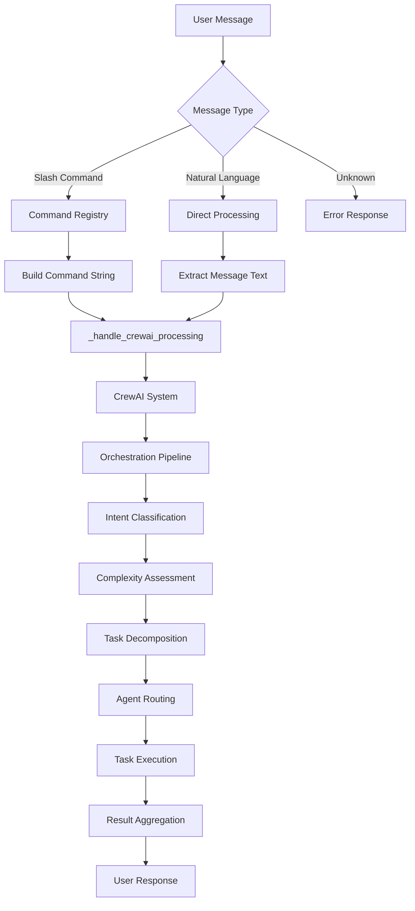

# KICKAI Command Specifications

**Version:** 4.3  
**Status:** Production Ready  
**Last Updated:** July 2025  
**Architecture:** 12-Agent CrewAI System with Unified Processing

**New in v4.3:** Updated to reflect current 12-agent system and actual implementation status

This document defines the expected behavior for all KICKAI bot commands across different scenarios, chat types, and user states, using the latest 12-agent CrewAI architecture.

## Table of Contents
- [Command Overview](#command-overview)
- [Agentic Architecture](#agentic-architecture)
- [Chat Types](#chat-types)
- [User States](#user-states)
- [Command Specifications](#command-specifications)
  - [/start Command](#start-command)
  - [/help Command](#help-command)
  - [/info Command](#info-command)
  - [/myinfo Command](#myinfo-command)
  - [/list Command](#list-command)
  - [/status Command](#status-command)
  - [/ping Command](#ping-command)
  - [/version Command](#version-command)
- [Command Processing Flow](#command-processing-flow)
- [Implementation Status](#implementation-status)
- [Testing Scenarios](#testing-scenarios)

## Command Overview

### Core Commands (✅ Implemented)
| Command | Description | Main Chat | Leadership Chat | Permission Level | Agent | Status |
|---------|-------------|-----------|-----------------|------------------|-------|--------|
| `/help` | Show available commands | ✅ | ✅ | PUBLIC | HelpAssistantAgent | ✅ Implemented |
| `/start` | Initialize bot interaction | ✅ | ✅ | PUBLIC | MessageProcessorAgent | ✅ Implemented |
| `/info` | Show personal information | ✅ | ✅ | PUBLIC | PlayerCoordinatorAgent | ✅ Implemented |
| `/myinfo` | Show personal information (alias) | ✅ | ✅ | PUBLIC | PlayerCoordinatorAgent | ✅ Implemented |
| `/list` | List players/team members | ✅ | ✅ | PUBLIC | MessageProcessorAgent | ✅ Implemented |
| `/status` | Check player/team member status | ✅ | ✅ | PUBLIC | PlayerCoordinatorAgent | ✅ Implemented |
| `/ping` | Test bot connectivity | ✅ | ✅ | PUBLIC | MessageProcessorAgent | ✅ Implemented |
| `/version` | Show bot version info | ✅ | ✅ | PUBLIC | MessageProcessorAgent | ✅ Implemented |

### Player Management Commands (🔄 In Progress)
| Command | Description | Main Chat | Leadership Chat | Permission Level | Agent | Status |
|---------|-------------|-----------|-----------------|------------------|-------|--------|
| `/register` | Register as a new player | ❌ | ✅ | PUBLIC | PlayerCoordinatorAgent | 🔄 In Progress |
| `/addplayer` | Add a new player | ❌ | ✅ | LEADERSHIP | PlayerCoordinatorAgent | 🔄 In Progress |
| `/approve` | Approve and activate player | ❌ | ✅ | LEADERSHIP | TeamAdministratorAgent | 🔄 In Progress |
| `/reject` | Reject player registration | ❌ | ✅ | LEADERSHIP | TeamAdministratorAgent | 🔄 In Progress |
| `/pending` | Show pending registrations | ❌ | ✅ | LEADERSHIP | TeamAdministratorAgent | 🔄 In Progress |

### Team Management Commands (📋 Planned)
| Command | Description | Main Chat | Leadership Chat | Permission Level | Agent | Status |
|---------|-------------|-----------|-----------------|------------------|-------|--------|
| `/team` | Team information | ✅ | ✅ | PUBLIC | TeamAdministratorAgent | 📋 Planned |
| `/invite` | Generate invitation link | ❌ | ✅ | LEADERSHIP | TeamAdministratorAgent | 📋 Planned |
| `/announce` | Make team announcement | ❌ | ✅ | LEADERSHIP | CommunicationManagerAgent | 📋 Planned |

### System Commands (✅ Implemented)
| Command | Description | Main Chat | Leadership Chat | Permission Level | Agent | Status |
|---------|-------------|-----------|-----------------|------------------|-------|--------|
| `/health` | System health check | ❌ | ✅ | SYSTEM | SystemInfrastructureAgent | ✅ Implemented |
| `/config` | Configuration info | ❌ | ✅ | SYSTEM | SystemInfrastructureAgent | ✅ Implemented |

## Agentic Architecture

### Command Processing Overview

The KICKAI system uses an **agentic-first approach** where all commands are processed through specialized CrewAI agents rather than dedicated command handlers.



### 12-Agent System Responsibilities

#### 1. **IntelligentSystemAgent** (Central Orchestrator)
- **Primary Role**: Central orchestrator for task decomposition and routing
- **Responsibilities**:
  - Task decomposition for complex requests
  - Agent selection and routing
  - Result aggregation from multiple agents
  - System-wide coordination
- **Tools**: Task decomposition, agent routing, result aggregation

#### 2. **MessageProcessorAgent**
- **Primary Commands**: `/start`, `/ping`, `/version`, general natural language
- **Responsibilities**:
  - Message parsing and intent classification
  - Context extraction
  - Simple query responses
  - Agent routing for complex requests
- **Tools**: Intent analysis, context extraction, message routing

#### 3. **PlayerCoordinatorAgent**
- **Primary Commands**: `/info`, `/myinfo`, `/status`, `/register`, `/addplayer`
- **Responsibilities**:
  - Player registration and onboarding
  - Individual player support
  - Player status tracking
  - Personal information management
- **Tools**: Player management, registration, status tracking

#### 4. **TeamAdministratorAgent**
- **Primary Commands**: `/list`, `/approve`, `/reject`, `/team`, `/invite`
- **Responsibilities**:
  - Team administration
  - Player management
  - Team coordination
  - Administrative oversight
- **Tools**: Team management, player administration, team coordination

#### 5. **HelpAssistantAgent**
- **Primary Commands**: `/help`, help-related natural language
- **Responsibilities**:
  - Context-aware help information
  - User status validation
  - Command availability checking
  - Registration flow guidance
- **Tools**: `get_user_status`, `get_available_commands`, `format_help_message`

#### 6. **OnboardingAgent**
- **Primary Commands**: `/register`, onboarding-related queries
- **Responsibilities**:
  - New user registration guidance
  - Onboarding process management
  - User flow coordination
- **Tools**: Registration guidance, user flow management

#### 7. **SquadSelectorAgent**
- **Primary Commands**: Squad selection and match preparation
- **Responsibilities**:
  - Match squad selection
  - Player availability analysis
  - Tactical considerations
- **Tools**: Squad selection, availability analysis

#### 8. **AvailabilityManagerAgent**
- **Primary Commands**: Availability tracking and management
- **Responsibilities**:
  - Player availability tracking
  - Match preparation coordination
  - Availability updates
- **Tools**: Availability tracking, match coordination

#### 9. **CommunicationManagerAgent**
- **Primary Commands**: `/announce`, communication management
- **Responsibilities**:
  - Team communications
  - Announcements and notifications
  - Information flow management
- **Tools**: Message sending, announcement management

#### 10. **AnalyticsAgent**
- **Primary Commands**: Analytics and reporting
- **Responsibilities**:
  - Performance analytics
  - Usage reporting
  - Data insights
- **Tools**: Analytics, reporting, data analysis

#### 11. **SystemInfrastructureAgent**
- **Primary Commands**: `/health`, `/config`, system management
- **Responsibilities**:
  - System health monitoring
  - Configuration management
  - System diagnostics
- **Tools**: Health monitoring, configuration management

#### 12. **CommandFallbackAgent**
- **Primary Commands**: Unhandled requests and fallbacks
- **Responsibilities**:
  - Handling unhandled requests
  - Error recovery
  - Fallback responses
- **Tools**: Error handling, fallback responses

## Implementation Status

### **✅ Fully Implemented Commands**
- `/start` - Bot initialization and welcome
- `/help` - Context-aware help system
- `/info` - Personal information display
- `/myinfo` - Personal information alias
- `/list` - Team member listing (context-aware)
- `/status` - Player status checking
- `/ping` - Connectivity testing
- `/version` - Version information
- `/health` - System health monitoring
- `/config` - Configuration information

### **🔄 In Progress Commands**
- `/register` - Player registration system
- `/addplayer` - Player addition (leadership)
- `/approve` - Player approval system
- `/reject` - Player rejection system
- `/pending` - Pending registrations list

### **📋 Planned Commands**
- `/team` - Team information display
- `/invite` - Invitation link generation
- `/announce` - Team announcements
- `/update` - Information updates

## Command Processing Flow

### **Unified Processing Architecture**

**Key Insight**: Both slash commands and natural language use the **exact same processing pipeline**.

#### **Processing Flow**
1. **Input Processing**: Handle both slash commands and natural language
2. **Command Registry**: Auto-discovery and metadata for slash commands  
3. **Unified Processing**: Both paths converge to `_handle_crewai_processing`
4. **CrewAI System**: Single orchestration pipeline for all requests
5. **Intent Classification**: Determine user intent (for both input types)
6. **Complexity Assessment**: Analyze request complexity
7. **Task Decomposition**: Break down into subtasks with agent assignments
8. **Agent Routing**: Route subtasks to appropriate agents
9. **Task Execution**: Execute tasks through specialized agents
10. **Result Aggregation**: Combine results and format response

#### **Benefits of Unified Processing**
- **🔒 Consistent Security**: Same permission checking for both input types
- **🔄 Single Source of Truth**: No code duplication between paths
- **🧪 Unified Testing**: Test once, works for both input methods
- **🛠️ Maintainable**: Single processing pipeline to maintain
- **📈 Scalable**: Easy to add new input methods (voice, buttons, etc.)
- **🎯 Consistent Behavior**: Same agent selection and execution logic

### **Natural Language Security Implementation**

Since both paths use the same processing pipeline, **security is automatically consistent**:

#### **1. Intent Classification**
- **Input**: "What's my status?"
- **Intent**: `PLAYER_STATUS_CHECK`
- **Permission Check**: Same as `/status` command
- **Agent**: PlayerCoordinatorAgent

#### **2. Context-Aware Routing**
- **Main Chat**: Limited information, active players only
- **Leadership Chat**: Full information, all players with status
- **Permission Enforcement**: Automatic based on chat type

#### **3. Agent Selection**
- **Simple Queries**: Direct agent assignment
- **Complex Queries**: IntelligentSystemAgent for decomposition
- **Fallback**: CommandFallbackAgent for unhandled requests

## Testing Scenarios

### **Core Command Testing**

#### **1. Basic Commands**
```bash
# Test basic connectivity
/start
/ping
/version

# Test help system
/help
/help start
/help list
```

#### **2. Information Commands**
```bash
# Test personal information
/info
/myinfo
/status

# Test team listing
/list
/list players
/list members
```

#### **3. System Commands**
```bash
# Test system health (leadership only)
/health
/config
```

### **Natural Language Testing**

#### **1. Status Queries**
```
"What's my status?"
"Show me my info"
"Am I registered?"
```

#### **2. Help Queries**
```
"Help me"
"What can I do?"
"How do I register?"
```

#### **3. List Queries**
```
"Show me the team"
"Who's available?"
"List all players"
```

### **Permission Testing**

#### **1. Main Chat Restrictions**
- `/list` should show only active players
- Limited administrative commands
- Basic user information only

#### **2. Leadership Chat Access**
- `/list` should show all players with status
- Full administrative commands
- Complete team information

#### **3. Cross-Chat Validation**
- Commands should respect chat type
- Permission enforcement should be consistent
- Error messages should be appropriate

## Error Handling

### **Command Not Found**
- **Response**: "❌ Command not found. Use `/help` to see available commands."
- **Action**: Log error and suggest help

### **Permission Denied**
- **Response**: "❌ Access denied. This command requires leadership permissions."
- **Action**: Log access attempt and notify user

### **System Error**
- **Response**: "❌ System error. Please try again later."
- **Action**: Log error and notify administrators

### **Invalid Parameters**
- **Response**: "❌ Invalid parameters. Use `/help [command]` for usage information."
- **Action**: Provide specific guidance

## Performance Considerations

### **Response Time Targets**
- **Simple Commands**: < 1 second
- **Complex Queries**: < 3 seconds
- **Agent Routing**: < 500ms
- **Database Operations**: < 1 second

### **Caching Strategy**
- **User Status**: Cache for 5 minutes
- **Team Information**: Cache for 2 minutes
- **Command Help**: Cache for 1 hour
- **System Health**: Cache for 30 seconds

### **Optimization Techniques**
- **Agent Pooling**: Reuse agent instances
- **Async Processing**: Non-blocking operations
- **Database Optimization**: Efficient queries
- **Memory Management**: Proper cleanup

---

**Note**: This document reflects the current implementation status as of July 2025. Commands marked as "Implemented" are fully functional, while those marked as "In Progress" or "Planned" are under development or planned for future implementation.