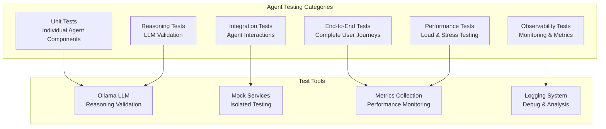

# CrewAI Agents Test Specification

## 📋 **Overview**

This document provides a comprehensive testing specification for CrewAI agents in the KICKAI system. The specification covers agent behavior validation, reasoning validation using Ollama LLM, operational testing, and performance evaluation.

## 🎯 **Test Objectives**

### Primary Goals
- **Agent Behavior Validation**: Ensure agents respond correctly to various inputs
- **Reasoning Validation**: Validate agent reasoning using Ollama LLM
- **Tool Integration Testing**: Verify agent tool usage and effectiveness
- **Performance Evaluation**: Measure agent response times and accuracy
- **Operational Testing**: Test agent lifecycle and resource management

### Secondary Goals
- **Memory Management**: Test agent memory and context retention
- **Error Handling**: Validate agent error responses and recovery
- **Scalability Testing**: Test agent performance under load
- **Integration Testing**: Test agent interactions with external systems

## 🏗️ **Test Architecture**

### Test Categories



## 🧪 **Test Categories**

### 1. **Unit Tests**

#### Agent Component Testing
- **Agent Initialization**: Test agent creation and configuration
- **Tool Registration**: Test tool addition and removal
- **Context Management**: Test context handling and validation
- **Task Execution**: Test individual task processing
- **Error Handling**: Test agent error responses

#### Test Examples
```python
def test_agent_initialization():
    """Test agent creation with proper configuration."""
    agent = ConfigurableAgent(
        role=AgentRole.PLAYER_COORDINATOR,
        context=AgentContext(team_id="test_team")
    )
    assert agent.context.role == AgentRole.PLAYER_COORDINATOR
    assert agent.context.team_id == "test_team"

def test_tool_registration():
    """Test tool registration and availability."""
    agent = create_test_agent()
    tool = MockTool()
    agent.add_tool(tool)
    assert tool in agent.get_tools()

def test_task_execution():
    """Test basic task execution."""
    agent = create_test_agent()
    result = await agent.execute("Test task")
    assert result is not None
    assert isinstance(result, str)
```

### 2. **Integration Tests**

#### Agent Interaction Testing
- **Multi-Agent Coordination**: Test agent collaboration
- **Tool Chain Execution**: Test sequential tool usage
- **Context Propagation**: Test context sharing between agents
- **Error Propagation**: Test error handling across agents

#### Test Examples
```python
def test_multi_agent_coordination():
    """Test coordination between multiple agents."""
    coordinator = create_player_coordinator_agent()
    manager = create_team_manager_agent()
    
    # Test agent collaboration
    result = await coordinator.execute(
        "Register player John Doe",
        context={"team_id": "test_team"}
    )
    
    # Verify manager was involved
    assert "player registered" in result.lower()

def test_tool_chain_execution():
    """Test sequential tool usage across agents."""
    agent = create_test_agent()
    
    # Execute task requiring multiple tools
    result = await agent.execute(
        "Get player status and update their information",
        context={"player_id": "test_player"}
    )
    
    # Verify multiple tools were used
    assert "status retrieved" in result
    assert "information updated" in result
```

### 3. **Reasoning Validation Tests**

#### Ollama LLM Integration
- **Reasoning Quality**: Validate agent reasoning using Ollama
- **Response Consistency**: Test response consistency across runs
- **Context Understanding**: Test agent context comprehension
- **Decision Making**: Test agent decision quality

#### Test Examples
```python
def test_reasoning_validation_with_ollama():
    """Test agent reasoning using Ollama LLM."""
    agent = create_test_agent()
    
    # Test complex reasoning task
    task = """
    A player wants to register but doesn't have a phone number.
    The team policy requires phone numbers for registration.
    What should the agent do?
    """
    
    result = await agent.execute(task)
    
    # Validate reasoning with Ollama
    ollama_client = get_ollama_client()
    reasoning_validation = await ollama_client.validate_reasoning(
        task=task,
        agent_response=result,
        expected_reasoning_patterns=[
            "policy compliance",
            "user guidance",
            "alternative solutions"
        ]
    )
    
    assert reasoning_validation.score >= 0.8
    assert reasoning_validation.reasoning_quality == "high"

def test_response_consistency():
    """Test response consistency across multiple runs."""
    agent = create_test_agent()
    task = "What are the available commands for players?"
    
    responses = []
    for _ in range(5):
        response = await agent.execute(task)
        responses.append(response)
    
    # Check consistency using Ollama
    ollama_client = get_ollama_client()
    consistency_score = await ollama_client.evaluate_consistency(responses)
    
    assert consistency_score >= 0.9
```

### 4. **End-to-End Tests**

#### Complete User Journeys
- **Player Registration Flow**: Test complete registration process
- **Team Management Flow**: Test team administration workflows
- **Help System Flow**: Test help and guidance systems
- **Error Recovery Flow**: Test error handling and recovery

#### Test Examples
```python
def test_player_registration_flow():
    """Test complete player registration journey."""
    # Initialize test environment
    test_team = create_test_team()
    test_user = create_test_user()
    
    # Execute registration flow
    coordinator = create_player_coordinator_agent()
    
    # Step 1: Initial registration request
    result1 = await coordinator.execute(
        "I want to register as a player",
        context={"user_id": test_user.id, "team_id": test_team.id}
    )
    
    # Step 2: Provide contact information
    result2 = await coordinator.execute(
        "My phone number is +1234567890",
        context={"user_id": test_user.id, "team_id": test_team.id}
    )
    
    # Step 3: Complete registration
    result3 = await coordinator.execute(
        "My position is Forward",
        context={"user_id": test_user.id, "team_id": test_team.id}
    )
    
    # Validate complete flow
    assert "registration complete" in result3.lower()
    assert test_user.is_registered()
```

### 5. **Performance Tests**

#### Load and Stress Testing
- **Concurrent Requests**: Test agent performance under load
- **Response Time**: Measure agent response times
- **Memory Usage**: Monitor agent memory consumption
- **Resource Utilization**: Test resource efficiency

#### Test Examples
```python
def test_concurrent_agent_requests():
    """Test agent performance under concurrent load."""
    import asyncio
    import time
    
    agent = create_test_agent()
    num_requests = 50
    
    async def make_request():
        start_time = time.time()
        result = await agent.execute("Test request")
        response_time = time.time() - start_time
        return response_time
    
    # Execute concurrent requests
    tasks = [make_request() for _ in range(num_requests)]
    response_times = await asyncio.gather(*tasks)
    
    # Analyze performance
    avg_response_time = sum(response_times) / len(response_times)
    max_response_time = max(response_times)
    
    assert avg_response_time < 5.0  # Average under 5 seconds
    assert max_response_time < 10.0  # Max under 10 seconds

def test_memory_usage():
    """Test agent memory consumption."""
    import psutil
    import os
    
    process = psutil.Process(os.getpid())
    initial_memory = process.memory_info().rss
    
    agent = create_test_agent()
    
    # Execute multiple tasks
    for i in range(100):
        await agent.execute(f"Test task {i}")
    
    final_memory = process.memory_info().rss
    memory_increase = final_memory - initial_memory
    
    # Memory increase should be reasonable (less than 100MB)
    assert memory_increase < 100 * 1024 * 1024
```

### 6. **Observability Tests**

#### Monitoring and Metrics
- **Agent Health**: Test agent health monitoring
- **Metrics Collection**: Test metrics gathering
- **Logging**: Test comprehensive logging
- **Alerting**: Test alert generation

#### Test Examples
```python
def test_agent_health_monitoring():
    """Test agent health monitoring system."""
    agent = create_test_agent()
    
    # Get health status
    health_status = agent.get_health_status()
    
    assert health_status["status"] == "healthy"
    assert "last_activity" in health_status
    assert "memory_usage" in health_status
    assert "tool_count" in health_status

def test_metrics_collection():
    """Test metrics collection and reporting."""
    agent = create_test_agent()
    
    # Execute some tasks
    for i in range(10):
        await agent.execute(f"Test task {i}")
    
    # Get metrics
    metrics = agent.get_metrics()
    
    assert metrics["total_requests"] == 10
    assert metrics["successful_requests"] == 10
    assert "average_response_time" in metrics
    assert "error_rate" in metrics
```

## 🔧 **Test Infrastructure**

### Test Environment Setup

#### Required Components
```python
# Test environment configuration
TEST_CONFIG = {
    "ollama_base_url": "http://macmini1.local:11434",
    "ollama_model": "llama3.1:8b",  # Update this to match installed model on macmini1.local
    "test_team_id": "test_team_alpha",
    "test_user_id": "test_user_123",
    "mock_services": True,
    "isolated_database": True
}

# Test data setup
TEST_DATA = {
    "teams": [
        {"id": "test_team_alpha", "name": "Test Team Alpha"},
        {"id": "test_team_beta", "name": "Test Team Beta"}
    ],
    "users": [
        {"id": "test_user_123", "name": "Test User", "phone": "+1234567890"},
        {"id": "test_user_456", "name": "Another User", "phone": "+0987654321"}
    ],
    "players": [
        {"id": "player_001", "name": "John Doe", "position": "Forward"},
        {"id": "player_002", "name": "Jane Smith", "position": "Midfielder"}
    ]
}
```

### Mock Services

#### Mock Telegram Service
```python
class MockTelegramService:
    """Mock Telegram service for isolated testing."""
    
    def __init__(self):
        self.sent_messages = []
        self.received_messages = []
    
    async def send_message(self, chat_id: str, text: str):
        self.sent_messages.append({"chat_id": chat_id, "text": text})
        return {"message_id": len(self.sent_messages)}
    
    async def get_updates(self):
        return self.received_messages
```

#### Mock Database Service
```python
class MockDatabaseService:
    """Mock database service for isolated testing."""
    
    def __init__(self):
        self.data = {}
    
    async def get_player(self, player_id: str):
        return self.data.get(f"player_{player_id}")
    
    async def save_player(self, player_data: dict):
        player_id = player_data.get("id")
        self.data[f"player_{player_id}"] = player_data
        return player_data
```

### Ollama Integration

#### Reasoning Validation
```python
class OllamaReasoningValidator:
    """Validate agent reasoning using Ollama LLM."""
    
    def __init__(self, base_url: str, model: str):
        self.client = OllamaClient(base_url=base_url, model=model)
    
    async def validate_reasoning(self, task: str, agent_response: str, 
                               expected_patterns: list[str]) -> ReasoningValidation:
        """Validate agent reasoning quality."""
        
        prompt = f"""
        Task: {task}
        Agent Response: {agent_response}
        Expected Reasoning Patterns: {expected_patterns}
        
        Evaluate the agent's reasoning quality on a scale of 0-1:
        1. Does the response address the task appropriately?
        2. Is the reasoning logical and coherent?
        3. Does it follow expected patterns?
        4. Is the response helpful and actionable?
        
        Provide a score and detailed analysis.
        """
        
        response = await self.client.generate(prompt)
        
        # Parse response for score and analysis
        score = self._extract_score(response)
        analysis = self._extract_analysis(response)
        
        return ReasoningValidation(
            score=score,
            analysis=analysis,
            reasoning_quality=self._determine_quality(score)
        )
    
    async def evaluate_consistency(self, responses: list[str]) -> float:
        """Evaluate consistency across multiple responses."""
        
        prompt = f"""
        Evaluate the consistency of these responses:
        {responses}
        
        Rate consistency from 0-1, where 1 is perfectly consistent.
        """
        
        response = await self.client.generate(prompt)
        return self._extract_score(response)
```

## 📊 **Test Execution Strategy**

### Test Execution Phases

#### Phase 1: Unit Tests
```bash
# Run unit tests
python -m pytest tests/agents/unit/ -v --cov=kickai.agents

# Run with Ollama validation
python -m pytest tests/agents/unit/ --ollama-validation
```

#### Phase 2: Integration Tests
```bash
# Run integration tests
python -m pytest tests/agents/integration/ -v

# Run with performance monitoring
python -m pytest tests/agents/integration/ --performance-monitoring
```

#### Phase 3: End-to-End Tests
```bash
# Run E2E tests
python -m pytest tests/agents/e2e/ -v

# Run with full observability
python -m pytest tests/agents/e2e/ --observability
```

#### Phase 4: Performance Tests
```bash
# Run performance tests
python -m pytest tests/agents/performance/ -v

# Run stress tests
python -m pytest tests/agents/performance/ --stress-test
```

### Test Reporting

#### Comprehensive Test Report
```python
class AgentTestReport:
    """Comprehensive test report for agent testing."""
    
    def __init__(self):
        self.results = {
            "unit_tests": {},
            "integration_tests": {},
            "e2e_tests": {},
            "performance_tests": {},
            "reasoning_validation": {},
            "observability_tests": {}
        }
    
    def generate_report(self) -> dict:
        """Generate comprehensive test report."""
        return {
            "summary": self._generate_summary(),
            "detailed_results": self.results,
            "recommendations": self._generate_recommendations(),
            "metrics": self._collect_metrics()
        }
    
    def _generate_summary(self) -> dict:
        """Generate test summary."""
        total_tests = sum(len(category) for category in self.results.values())
        passed_tests = sum(
            len([r for r in category.values() if r.get("passed", False)])
            for category in self.results.values()
        )
        
        return {
            "total_tests": total_tests,
            "passed_tests": passed_tests,
            "failed_tests": total_tests - passed_tests,
            "success_rate": passed_tests / total_tests if total_tests > 0 else 0
        }
```

## 🎯 **Success Criteria**

### Minimum Requirements
- **Unit Test Coverage**: ≥ 90% code coverage
- **Integration Test Coverage**: All agent interactions tested
- **E2E Test Coverage**: All user journeys tested
- **Performance Requirements**: Average response time < 5 seconds
- **Reasoning Quality**: Ollama validation score ≥ 0.8
- **Error Handling**: All error scenarios handled gracefully

### Advanced Requirements
- **Load Testing**: Support 100+ concurrent requests
- **Memory Efficiency**: < 100MB memory increase per 100 requests
- **Consistency**: Response consistency score ≥ 0.9
- **Observability**: Complete monitoring and alerting
- **Recovery**: Automatic recovery from failures

## 🔄 **Continuous Testing**

### Automated Test Pipeline
```yaml
# .github/workflows/agent-tests.yml
name: Agent Tests
on: [push, pull_request]
jobs:
  unit-tests:
    runs-on: ubuntu-latest
    steps:
      - uses: actions/checkout@v3
      - name: Setup Python
        uses: actions/setup-python@v4
        with:
          python-version: '3.11'
      - name: Install dependencies
        run: pip install -r requirements-test.txt
      - name: Run unit tests
        run: python -m pytest tests/agents/unit/ --cov=kickai.agents
  
  integration-tests:
    runs-on: ubuntu-latest
    steps:
      - uses: actions/checkout@v3
      - name: Setup Python
        uses: actions/setup-python@v4
        with:
          python-version: '3.11'
      - name: Install dependencies
        run: pip install -r requirements-test.txt
      - name: Configure Ollama connection
        run: |
          echo "OLLAMA_BASE_URL=http://macmini1.local:11434" >> $GITHUB_ENV
          echo "OLLAMA_MODEL=llama3.1:8b" >> $GITHUB_ENV
      - name: Run integration tests
        run: python -m pytest tests/agents/integration/
  
  performance-tests:
    runs-on: ubuntu-latest
    steps:
      - uses: actions/checkout@v3
      - name: Setup Python
        uses: actions/setup-python@v4
        with:
          python-version: '3.11'
      - name: Install dependencies
        run: pip install -r requirements-test.txt
      - name: Run performance tests
        run: python -m pytest tests/agents/performance/
```

## 📈 **Monitoring and Metrics**

### Key Metrics
- **Response Time**: Average and 95th percentile
- **Success Rate**: Percentage of successful requests
- **Error Rate**: Percentage of failed requests
- **Memory Usage**: Memory consumption patterns
- **Tool Usage**: Tool usage frequency and effectiveness
- **Reasoning Quality**: Ollama validation scores

### Alerting Rules
- **High Response Time**: > 10 seconds average
- **High Error Rate**: > 5% error rate
- **Memory Leak**: > 200MB memory increase
- **Low Reasoning Quality**: < 0.7 Ollama score
- **Service Unavailable**: Agent health check fails

## 🚀 **Implementation Plan**

### Phase 1: Foundation (Week 1-2)
- [ ] Set up test infrastructure
- [ ] Implement basic unit tests
- [ ] Configure Ollama integration
- [ ] Create mock services

### Phase 2: Core Testing (Week 3-4)
- [ ] Implement integration tests
- [ ] Add reasoning validation
- [ ] Create E2E test scenarios
- [ ] Set up performance monitoring

### Phase 3: Advanced Testing (Week 5-6)
- [ ] Implement performance tests
- [ ] Add observability tests
- [ ] Create comprehensive reporting
- [ ] Set up CI/CD pipeline

### Phase 4: Optimization (Week 7-8)
- [ ] Optimize test performance
- [ ] Enhance monitoring
- [ ] Fine-tune success criteria
- [ ] Document best practices

## 📚 **References**

### CrewAI Documentation
- [CrewAI Testing Guide](https://docs.crewai.com/en/concepts/testing)
- [CrewAI Observability](https://docs.crewai.com/en/observability/overview)
- [CrewAI Agent Development](https://docs.crewai.com/en/concepts/agents)

### Ollama Documentation
- [Ollama API Reference](https://github.com/ollama/ollama/blob/main/docs/api.md)
- [Ollama Model Management](https://github.com/ollama/ollama/blob/main/docs/modelfile.md)

### Testing Best Practices
- [Python Testing with pytest](https://docs.pytest.org/)
- [Async Testing Patterns](https://docs.pytest.org/en/stable/how-to/asyncio.html)
- [Performance Testing](https://locust.io/)

---

**Document Version**: 1.0  
**Last Updated**: 2024-12-19  
**Maintainer**: KICKAI Development Team 