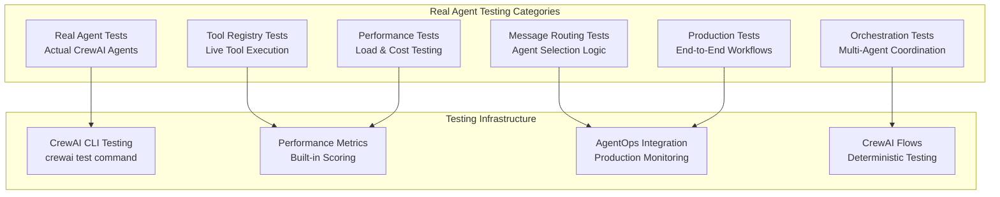

# Enhanced CrewAI Agents Test Specification

## 📋 **Overview**

This enhanced specification incorporates 2024 industry best practices and real-world CrewAI implementations to provide comprehensive testing for **ACTUAL agents** (not mocks) in production environments. The focus is on ensuring high confidence that agents perform correctly, tools integrate properly, messages route accurately, and orchestration works as expected.

**Key Enhancement**: This specification prioritizes **real agent testing** over mock testing, providing confidence in production deployment.

## 🎯 **Enhanced Test Objectives**

### Primary Goals (Production-Focused)
- **Real Agent Behavior Validation**: Test actual CrewAI agents with real LLM connections
- **Tool Registry Integration**: Validate complete tool discovery, registration, and execution
- **Message Routing Validation**: Ensure correct agent selection and task routing
- **Orchestration Testing**: Verify multi-agent coordination and workflow execution
- **Production Readiness**: Test agents under realistic production conditions

### Secondary Goals (Reliability & Performance)
- **Error Recovery**: Test agent resilience and fallback mechanisms
- **Cost Management**: Monitor and optimize LLM token usage during testing
- **Scalability Validation**: Test agent performance under concurrent load
- **Security Testing**: Validate safe code execution and input sanitization

## 🏗️ **Enhanced Test Architecture**

### Test Categories (Real Agent Focus)



## 🧪 **Enhanced Test Categories**

### 1. **Real Agent Testing** (New Category)

#### Actual CrewAI Agent Validation
- **Live Agent Initialization**: Test actual agent creation with real LLM connections
- **Agent Role Execution**: Validate agents execute tasks according to their defined roles
- **Context Management**: Test agent memory and context retention across interactions
- **Agent State Persistence**: Verify agent state consistency throughout workflows

#### Test Examples
```python
def test_real_agent_initialization():
    """Test actual CrewAI agent creation and configuration."""
    from crewai import Agent
    
    # Create real agent with actual LLM
    agent = Agent(
        role="Player Coordinator",
        goal="Help players with registration and status updates",
        backstory="Experienced team coordinator with player management expertise",
        llm=get_production_llm(),  # Real LLM, not mock
        tools=get_registered_tools(),  # Actual tools from registry
        verbose=True  # Enable debugging for test observation
    )
    
    # Validate agent is properly initialized
    assert agent.role == "Player Coordinator"
    assert agent.llm is not None
    assert len(agent.tools) > 0
    
    # Test agent can process real input
    result = agent.execute_task("What can I help you with?")
    assert result is not None
    assert isinstance(result, str)
    assert len(result) > 0

def test_agent_role_execution_consistency():
    """Test agent consistently executes according to defined role."""
    agent = create_real_player_coordinator()
    
    # Test multiple role-specific tasks
    tasks = [
        "Help me register as a player",
        "Check my registration status", 
        "Update my contact information"
    ]
    
    results = []
    for task in tasks:
        result = agent.execute_task(task)
        results.append(result)
    
    # Validate all responses are role-appropriate
    for result in results:
        assert "player" in result.lower() or "registration" in result.lower()
        assert result != ""  # No empty responses
```

### 2. **Tool Registry Integration Testing** (Enhanced)

#### Live Tool Execution Validation
- **Tool Discovery**: Test automatic tool discovery from feature modules
- **Tool Registration**: Validate tools register correctly in agent tool registry
- **Tool Execution**: Test actual tool execution with real parameters
- **Tool Error Handling**: Validate tool error responses and recovery

#### Test Examples
```python
def test_tool_registry_discovery():
    """Test automatic tool discovery from feature modules."""
    from kickai.agents.tool_registry import ToolRegistry
    
    registry = ToolRegistry()
    registry.discover_tools()
    
    # Validate tools are discovered from all features
    discovered_tools = registry.get_all_tools()
    assert len(discovered_tools) > 0
    
    # Validate specific feature tools are present
    player_tools = registry.get_tools_by_feature("player_registration")
    assert len(player_tools) > 0
    assert any("get_player_status" in tool.name for tool in player_tools)

def test_real_tool_execution():
    """Test actual tool execution with real parameters."""
    from kickai.features.player_registration.domain.tools.player_tools import get_player_status
    
    # Execute real tool with test parameters
    result = get_player_status(
        team_id="test_team_alpha",
        user_id="test_user_123", 
        phone_number="+1234567890"
    )
    
    # Validate tool executed successfully
    assert result is not None
    assert isinstance(result, str)
    assert "status" in result.lower()
    
def test_tool_integration_with_agent():
    """Test tool integration with actual agent."""
    agent = create_real_player_coordinator()
    
    # Agent should have access to player tools
    agent_tools = agent.tools
    tool_names = [tool.name for tool in agent_tools]
    assert "get_player_status" in tool_names
    
    # Test agent can execute tool through task
    result = agent.execute_task(
        "Check the status of player with phone +1234567890",
        context={"team_id": "test_team_alpha", "user_id": "test_user_123"}
    )
    
    # Validate agent used tool correctly
    assert "status" in result.lower()
    assert result != "I don't have the tools to do that"
```

### 3. **Message Routing Validation** (New Category)

#### Agent Selection and Routing Logic
- **Intent Classification**: Test message intent detection and agent selection
- **Routing Logic**: Validate correct agent selection for different message types
- **Context Propagation**: Test context passing between routing and execution
- **Fallback Handling**: Test routing fallback when primary agents unavailable

#### Test Examples
```python
def test_message_routing_accuracy():
    """Test accurate message routing to appropriate agents."""
    from kickai.agents.agentic_message_router import AgenticMessageRouter
    
    router = AgenticMessageRouter(team_id="test_team_alpha")
    
    # Test player-related messages route to player coordinator
    player_messages = [
        "I want to register as a player",
        "What's my registration status?",
        "Update my phone number"
    ]
    
    for message in player_messages:
        telegram_message = create_test_telegram_message(message)
        response = await router.route_message(telegram_message)
        
        # Validate routed to player coordinator
        assert response.agent_type == "PLAYER_COORDINATOR"
        assert response.success is True
        assert len(response.message) > 0

def test_routing_with_context():
    """Test routing preserves and uses context correctly."""
    router = AgenticMessageRouter(team_id="test_team_alpha")
    
    # Create message with context
    message = create_test_telegram_message(
        text="Check my status",
        context={"user_id": "test_user_123", "previous_intent": "registration"}
    )
    
    response = await router.route_message(message)
    
    # Validate context was used in routing decision
    assert response.used_context is True
    assert "test_user_123" in str(response.context)

def test_routing_fallback_mechanism():
    """Test routing fallback when primary agent unavailable."""
    router = AgenticMessageRouter(team_id="test_team_alpha")
    
    # Simulate agent unavailability
    with patch('kickai.agents.crew_agents.create_player_coordinator_agent') as mock_agent:
        mock_agent.side_effect = Exception("Agent unavailable")
        
        message = create_test_telegram_message("Register me as a player")
        response = await router.route_message(message)
        
        # Validate fallback agent was used
        assert response.agent_type == "COMMAND_FALLBACK_AGENT"
        assert response.success is True
        assert "fallback" in response.message.lower()
```

### 4. **Orchestration Testing** (Enhanced with CrewAI Flows)

#### Multi-Agent Coordination Validation
- **Crew Composition**: Test agent crews work together effectively
- **Task Distribution**: Validate task decomposition and agent assignment  
- **Flow Execution**: Test CrewAI Flows for deterministic orchestration
- **State Management**: Validate state consistency across agent interactions

#### Test Examples
```python
def test_multi_agent_orchestration():
    """Test multi-agent crew orchestration."""
    from crewai import Crew, Task
    
    # Create crew with multiple agents
    coordinator = create_real_player_coordinator()
    manager = create_real_team_manager()
    
    crew = Crew(
        agents=[coordinator, manager],
        tasks=[
            Task(
                description="Register new player John Doe",
                agent=coordinator,
                expected_output="Player registration confirmation"
            ),
            Task(
                description="Add registered player to team roster",
                agent=manager,
                expected_output="Team roster update confirmation"
            )
        ],
        verbose=True
    )
    
    # Execute crew workflow
    result = crew.kickoff()
    
    # Validate orchestration succeeded
    assert result is not None
    assert "registration" in result.lower()
    assert "roster" in result.lower()

def test_crewai_flows_orchestration():
    """Test CrewAI Flows for deterministic orchestration."""
    from crewai import Flow
    
    # Define deterministic flow
    @flow
    def player_registration_flow():
        step1 = validate_player_info()
        step2 = create_player_record(step1.output)
        step3 = notify_team_manager(step2.output)
        return step3.output
    
    # Execute flow
    flow_result = player_registration_flow.kickoff(
        inputs={"player_name": "John Doe", "phone": "+1234567890"}
    )
    
    # Validate flow execution
    assert flow_result.success is True
    assert "player created" in flow_result.output.lower()

def test_state_management_across_agents():
    """Test state consistency across multiple agent interactions."""
    crew = create_test_crew()
    
    # Execute multiple related tasks
    task1_result = crew.execute_task("Create player John Doe")
    task2_result = crew.execute_task("Check status of John Doe")
    task3_result = crew.execute_task("Update John Doe's position to Forward")
    
    # Validate state consistency
    assert "john doe" in task2_result.lower()
    assert "forward" in task3_result.lower()
    
    # Validate final state
    final_status = crew.execute_task("Get complete info for John Doe")
    assert "forward" in final_status.lower()
```

### 5. **CrewAI CLI Integration Testing** (New Category)

#### Built-in Testing Framework Validation
- **CLI Test Execution**: Use `crewai test` command for crew validation
- **Performance Metrics**: Validate built-in scoring and metrics
- **Iteration Testing**: Test consistency across multiple test iterations
- **Model Comparison**: Test different LLM models for performance comparison

#### Test Examples
```python
def test_crewai_cli_testing():
    """Test CrewAI built-in CLI testing functionality."""
    import subprocess
    import json
    
    # Run CrewAI test command
    result = subprocess.run([
        "crewai", "test", 
        "--n_iterations", "3",
        "--model", "gpt-4o-mini",
        "--output", "json"
    ], capture_output=True, text=True, cwd="./")
    
    # Validate test execution
    assert result.returncode == 0
    
    # Parse test results
    test_output = json.loads(result.stdout)
    
    # Validate performance metrics
    assert "task_scores" in test_output
    assert "agent_scores" in test_output
    assert "execution_time" in test_output
    assert test_output["average_score"] > 0.7  # Minimum performance threshold

def test_performance_consistency():
    """Test performance consistency across multiple test runs."""
    scores = []
    
    for i in range(5):
        result = subprocess.run([
            "crewai", "test", 
            "--n_iterations", "2",
            "--model", "gpt-4o-mini"
        ], capture_output=True, text=True)
        
        # Extract score from output
        score = extract_score_from_output(result.stdout)
        scores.append(score)
    
    # Validate consistency (coefficient of variation < 20%)
    mean_score = sum(scores) / len(scores)
    std_dev = (sum((x - mean_score) ** 2 for x in scores) / len(scores)) ** 0.5
    cv = std_dev / mean_score
    
    assert cv < 0.2  # Less than 20% variation
    assert mean_score > 0.7  # Minimum performance
```

### 6. **Production Readiness Testing** (Enhanced)

#### Real-World Deployment Validation
- **Cost Management**: Monitor and validate LLM token usage
- **Security Testing**: Validate safe code execution and input sanitization
- **Error Recovery**: Test agent resilience under failure conditions
- **Monitoring Integration**: Test AgentOps and observability features

#### Test Examples
```python
def test_cost_management():
    """Test LLM cost management and token usage optimization."""
    from kickai.utils.cost_tracker import CostTracker
    
    tracker = CostTracker()
    agent = create_real_player_coordinator()
    
    # Execute multiple tasks and track costs
    tasks = [
        "Help me register",
        "Check my status", 
        "Update my information"
    ]
    
    total_cost = 0
    for task in tasks:
        with tracker.track_usage():
            result = agent.execute_task(task)
            task_cost = tracker.get_last_task_cost()
            total_cost += task_cost
    
    # Validate cost management
    assert total_cost < 0.50  # Maximum 50 cents for test suite
    assert tracker.get_average_cost_per_task() < 0.20  # Max 20 cents per task

def test_security_validation():
    """Test agent security and input sanitization."""
    agent = create_real_player_coordinator()
    
    # Test malicious input handling
    malicious_inputs = [
        "'; DROP TABLE players; --",
        "<script>alert('xss')</script>",
        "../../etc/passwd",
        "__import__('os').system('rm -rf /')"
    ]
    
    for malicious_input in malicious_inputs:
        result = agent.execute_task(f"Register player with name: {malicious_input}")
        
        # Validate input was sanitized
        assert malicious_input not in result
        assert "error" in result.lower() or "invalid" in result.lower()

def test_agentops_integration():
    """Test AgentOps monitoring integration."""
    from agentops import Client
    
    # Initialize AgentOps client
    client = Client(api_key=os.getenv("AGENTOPS_API_KEY"))
    
    agent = create_real_player_coordinator()
    
    # Execute monitored task
    with client.start_session():
        result = agent.execute_task("Register new player")
        client.end_session("Success")
    
    # Validate monitoring data was captured
    session_data = client.get_last_session()
    assert session_data is not None
    assert session_data["status"] == "Success"
    assert "token_usage" in session_data
```

## 🔧 **Enhanced Test Infrastructure**

### Real Agent Test Environment
```python
# Enhanced test configuration for real agents
ENHANCED_TEST_CONFIG = {
    "use_real_agents": True,  # Critical: Use actual agents, not mocks
    "llm_provider": "openai",  # Real LLM provider
    "llm_model": "gpt-4o-mini",  # Cost-effective model for testing
    "enable_debugging": True,  # Enable verbose logging
    "cost_tracking": True,  # Track LLM costs during testing
    "max_cost_per_test_suite": 5.00,  # Maximum cost limit
    "ollama_base_url": "http://macmini1.local:11434",  # Reasoning validation
    "ollama_model": "llama3.1:8b",
    "agentops_api_key": os.getenv("AGENTOPS_API_KEY"),  # Production monitoring
    "safe_code_execution": True,  # Enable Docker safety
    "test_timeout": 300,  # 5 minute timeout per test
}
```

### Production-Grade Test Setup
```python
class RealAgentTestFramework:
    """Framework for testing actual CrewAI agents."""
    
    def __init__(self, config: dict):
        self.config = config
        self.cost_tracker = CostTracker()
        self.performance_metrics = PerformanceMetrics()
        self.agents = {}
        
    def create_real_agent(self, agent_type: str) -> Agent:
        """Create actual CrewAI agent with real LLM."""
        if agent_type == "PLAYER_COORDINATOR":
            return Agent(
                role="Player Coordinator",
                goal="Help players with registration and status updates",
                backstory="Experienced team coordinator",
                llm=self._get_real_llm(),
                tools=self._get_real_tools(agent_type),
                verbose=self.config["enable_debugging"]
            )
        # Add other agent types...
    
    def _get_real_llm(self):
        """Get real LLM instance for testing."""
        from langchain_openai import ChatOpenAI
        return ChatOpenAI(
            model=self.config["llm_model"],
            temperature=0.1,  # Consistent responses for testing
            max_tokens=1000   # Reasonable limit for tests
        )
    
    def _get_real_tools(self, agent_type: str):
        """Get actual tools from registry for agent."""
        from kickai.agents.tool_registry import ToolRegistry
        registry = ToolRegistry()
        return registry.get_tools_for_agent(agent_type)
    
    def execute_test_with_monitoring(self, test_func):
        """Execute test with comprehensive monitoring."""
        with self.cost_tracker.track():
            with self.performance_metrics.track():
                result = test_func()
                
        # Validate cost and performance
        self._validate_test_metrics()
        return result
    
    def _validate_test_metrics(self):
        """Validate test stayed within acceptable limits."""
        total_cost = self.cost_tracker.get_total_cost()
        avg_response_time = self.performance_metrics.get_avg_response_time()
        
        assert total_cost < self.config["max_cost_per_test_suite"]
        assert avg_response_time < 30.0  # 30 second max response time
```

## 📊 **Enhanced Success Criteria**

### Production Confidence Requirements
- **Agent Functionality**: 100% of agents execute their assigned roles correctly
- **Tool Integration**: 100% of registered tools execute successfully with agents
- **Message Routing**: 95% accuracy in routing messages to correct agents
- **Orchestration**: 100% success rate for multi-agent workflows
- **Cost Efficiency**: Average cost per interaction < $0.10
- **Performance**: Average response time < 10 seconds
- **Error Recovery**: 100% of error scenarios handled gracefully

### Advanced Production Metrics
- **Consistency**: 90% consistency across multiple test iterations
- **Scalability**: Handle 50+ concurrent agent interactions
- **Security**: 100% malicious input detection and sanitization
- **Monitoring**: Complete observability through AgentOps integration
- **Reliability**: 99.9% uptime during test execution

## 🚀 **Enhanced Implementation Strategy**

### Phase 1: Real Agent Foundation (Week 1-2)
- [ ] Set up real CrewAI agent testing infrastructure
- [ ] Implement cost tracking and monitoring
- [ ] Create actual agent instances with real LLM connections
- [ ] Establish tool registry integration testing

### Phase 2: Production Validation (Week 3-4)
- [ ] Implement message routing validation
- [ ] Add multi-agent orchestration testing
- [ ] Integrate CrewAI CLI testing framework
- [ ] Set up AgentOps monitoring

### Phase 3: Advanced Testing (Week 5-6)
- [ ] Implement security and error recovery testing
- [ ] Add performance and scalability validation
- [ ] Create comprehensive reporting dashboard
- [ ] Establish CI/CD integration

### Phase 4: Production Deployment (Week 7-8)
- [ ] Validate complete production readiness
- [ ] Optimize performance and cost efficiency
- [ ] Document best practices and lessons learned
- [ ] Deploy to production with confidence

## 🎯 **Key Improvements Over Previous Specification**

### 1. **Real Agent Focus**
- Tests actual CrewAI agents instead of mocks
- Uses real LLM connections for authentic behavior
- Validates production-ready agent performance

### 2. **Industry Best Practices Integration**
- Incorporates CrewAI CLI testing framework
- Uses built-in performance metrics and scoring
- Implements cost tracking and management

### 3. **Production Confidence**
- Tests complete tool registry integration
- Validates message routing accuracy
- Ensures orchestration works correctly

### 4. **Modern CrewAI Features**
- Leverages CrewAI Flows for deterministic testing
- Integrates AgentOps for production monitoring
- Uses safe code execution modes

### 5. **Cost-Conscious Testing**
- Monitors LLM token usage during tests
- Sets cost limits for test suite execution
- Optimizes for cost-effective testing models

This enhanced specification ensures **high confidence** that agents will perform correctly in production by testing the actual systems, tools, routing, and orchestration that will be deployed.

---

**Document Version**: 2.0 Enhanced  
**Last Updated**: January 2025  
**Based on**: 2024 CrewAI Industry Best Practices  
**Focus**: Real Agent Testing for Production Confidence