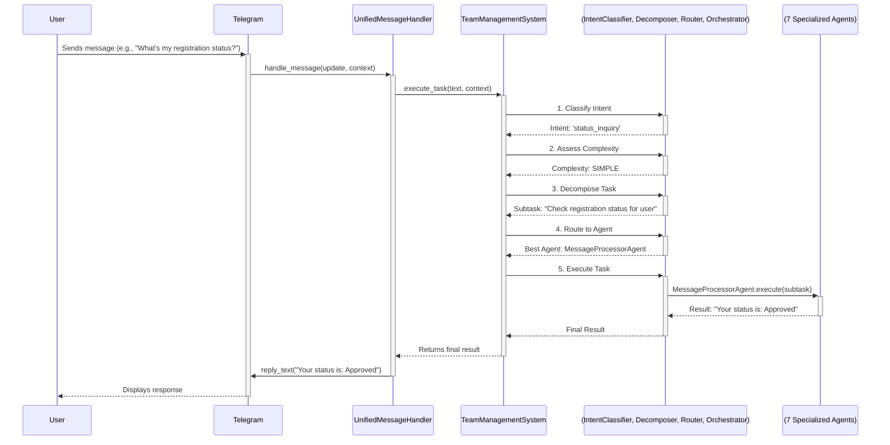
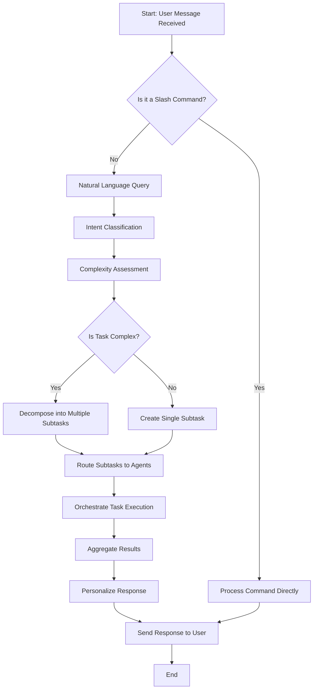

# CrewAI Architecture Documentation

This document provides a comprehensive overview of the sophisticated 8-agent CrewAI architecture implemented in the KICKAI system. This architecture is designed for robustness, maintainability, and intelligent task processing, moving beyond simple command handling to a dynamic, context-aware agentic system.

## 1. High-Level Architecture Overview

The system is built around a central orchestrator, the `TeamManagementSystem`, which manages a crew of 7 specialized agents. All incoming Telegram messages are processed by a `UnifiedMessageHandler`, which acts as a single entry point. This handler passes the user's request to the `TeamManagementSystem`, which then uses its intelligent components to understand, decompose, route, and execute the task.

The core principle is **capability-based routing**. Instead of hardcoding which agent handles which command, the system analyzes the user's intent and the capabilities required to fulfill it, then dynamically routes the task (or subtasks) to the most suitable agent(s).

### Sequence Diagram: From Message to Response

## 2. The Intelligent Orchestration Engine

The "brains" of the system reside in `src/agents/intelligent_system.py`. This module contains several components that work together to process tasks intelligently.

*   **`IntentClassifier`**:
    *   **Purpose:** To understand the user's primary goal.
    *   **Mechanism:** Uses a combination of keyword matching, regex patterns, and (if configured) an LLM to classify the intent (e.g., `player_registration`, `status_inquiry`).

*   **`RequestComplexityAssessor`**:
    *   **Purpose:** To determine how difficult a request is to handle.
    *   **Mechanism:** Analyzes the intent, the entities involved (e.g., player name, phone number), and the context to assign a complexity level (`SIMPLE`, `MODERATE`, `COMPLEX`).

*   **`DynamicTaskDecomposer`**:
    *   **Purpose:** To break down complex requests into smaller, manageable subtasks.
    *   **Mechanism:** For `SIMPLE` tasks, it creates a single subtask. For more complex tasks, it uses an LLM to generate a list of `Subtask` objects, each with a clear description and the capabilities required to complete it.

*   **`CapabilityBasedRouter`**:
    *   **Purpose:** To assign each subtask to the most appropriate agent.
    *   **Mechanism:** This is the core of the intelligent routing. It uses the `AgentCapabilityMatrix` (from `src/agents/capabilities.py`) to score each agent's proficiency for the capabilities required by a subtask. It then selects the agent with the highest score.

*   **`TaskExecutionOrchestrator`**:
    *   **Purpose:** To manage the execution of subtasks, respecting dependencies.
    *   **Mechanism:** It executes tasks in the correct order. For example, if Task B depends on the result of Task A, it will wait for Task A to complete before starting Task B.

## 3. The 8-Agent Crew

The crew consists of 7 specialized agents, each defined in `src/agents/crew_agents.py`. Each agent has a specific role, goal, and a set of tools to help them achieve their goal.

| Agent Role              | Goal                                                                                             | Key Responsibilities                                                                |
| ----------------------- | ------------------------------------------------------------------------------------------------ | ----------------------------------------------------------------------------------- |
| **Message Processor**   | Efficiently understand user intent, ask for clarification, and route tasks to the correct agent. | Primary user interface, command parsing, intent analysis.                           |
| **Team Manager**        | Act as the central command for all team-related administrative tasks.                            | High-level team configuration, operational oversight, strategic coordination.       |
| **Player Coordinator**  | Maintain a perfectly accurate register of all club personnel and assets.                         | Player administration, eligibility, equipment logistics, volunteer tracking.        |
| **Finance Manager**     | Ensure the team's finances are transparent, balanced, and accurately tracked.                    | Tracking payments, managing expenses, flagging financial ineligibility.             |
| **Performance Analyst** | Provide the team manager with actionable, data-driven insights.                                 | Performance analysis, engagement analysis, strategic recommendations.               |
| **Learning Agent**      | Learn from interactions, improve natural language understanding, and optimize system performance. | Continuous learning, pattern analysis, system improvement.                          |
| **Onboarding Agent**    | Ensure smooth and complete player onboarding with an excellent user experience.                  | Guiding new players through registration, collecting and validating information.    |
| **Command Fallback Agent** | Interpret failed command parsing scenarios and understand user intent from natural language. | Handling malformed commands, extracting structured data, providing suggestions. |

## 4. Tool-Agent Mapping

The effectiveness of the agents comes from the tools they are given. The `ToolsManager` class assigns tools to agents based on their roles.

| Tool                  | Agent(s)                                                                                             | Purpose                                                              |
| --------------------- | ---------------------------------------------------------------------------------------------------- | -------------------------------------------------------------------- |
| `GetAllPlayersTool`   | Team Manager, Player Coordinator, Performance Analyst, Learning Agent, Onboarding Agent              | Retrieve a list of all players on the team.                          |
| `GetPlayerByIdTool`   | Team Manager, Player Coordinator, Performance Analyst, Learning Agent, Onboarding Agent              | Get detailed information for a specific player.                      |
| `GetPendingApprovalsTool` | Player Coordinator                                                                                   | Get a list of players awaiting registration approval.                |
| `SendMessageTool`     | All agents                                                                                           | Send a message back to the user via the Telegram bot.                |
| `SendPollTool`        | Player Coordinator                                                                                   | Create and send a poll to a Telegram chat.                           |
| `SendAnnouncementTool`| Team Manager, Performance Analyst                                                                    | Send a formatted announcement to a Telegram chat.                    |
| `LogCommandTool`      | All agents                                                                                           | Log the execution of a command for auditing and debugging.           |
| `LogEventTool`        | All agents                                                                                           | Log a significant event (e.g., player registration, payment).        |

## 5. Task Lifecycle Flowchart

This diagram illustrates the step-by-step process of how a user's request is handled by the system.

