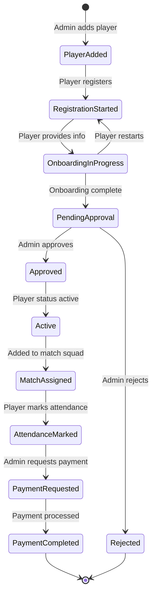
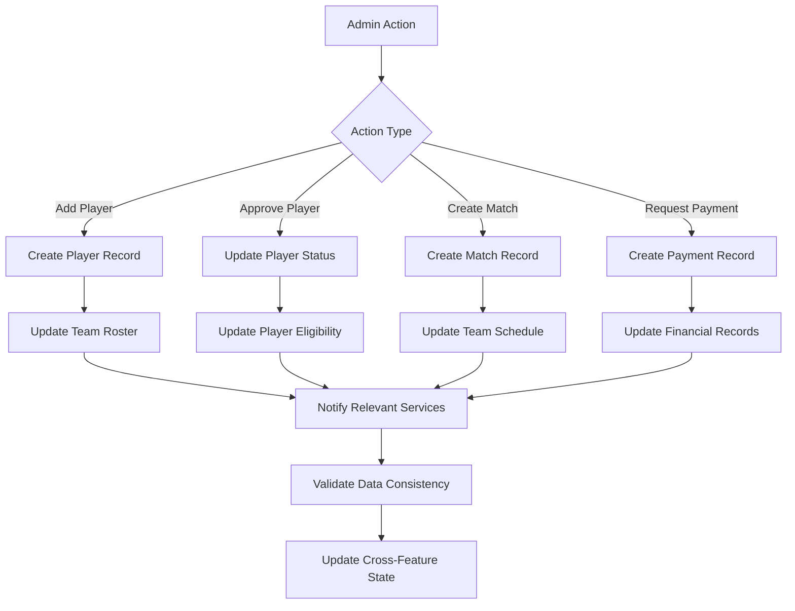
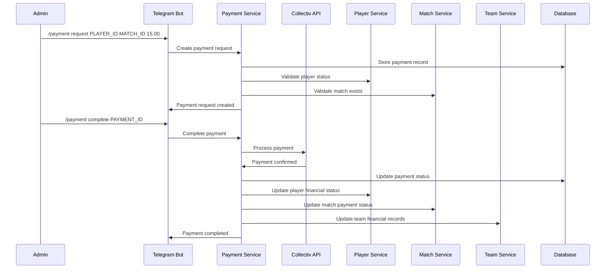
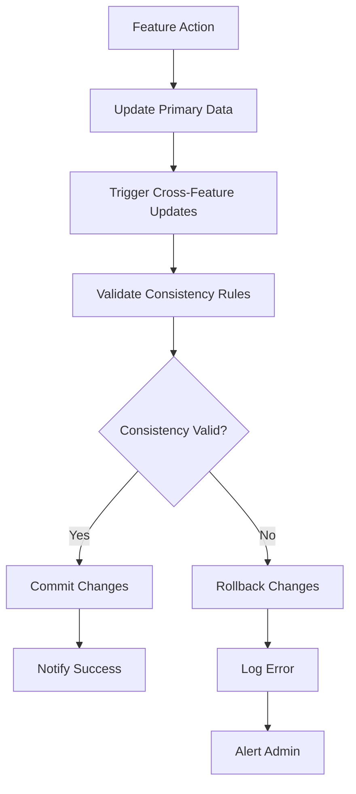
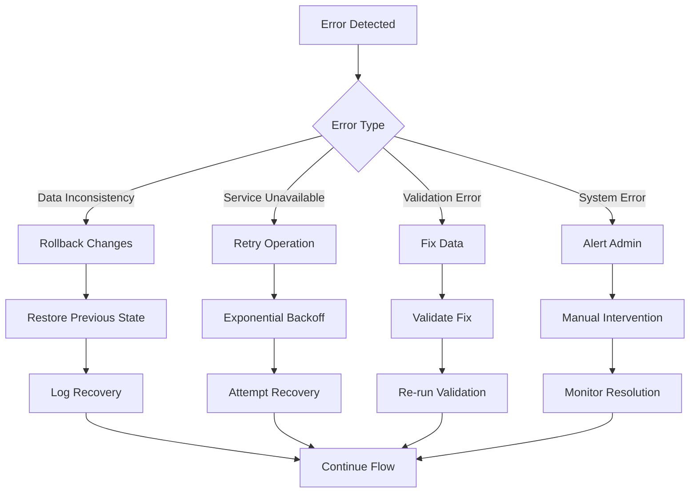
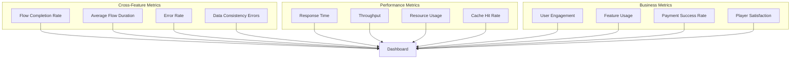

# KICKAI Cross-Feature Flows Documentation

**Version:** 1.0  
**Status:** Production Ready  
**Last Updated:** December 2024  
**Focus:** End-to-End Workflows Across Multiple Features

## 📋 Table of Contents

1. [Overview](#overview)
2. [Cross-Feature Flow Types](#cross-feature-flow-types)
3. [Detailed Flow Diagrams](#detailed-flow-diagrams)
4. [Test Coverage](#test-coverage)
5. [Implementation Details](#implementation-details)
6. [Data Consistency](#data-consistency)
7. [Error Handling](#error-handling)
8. [Performance Considerations](#performance-considerations)
9. [Monitoring and Observability](#monitoring-and-observability)
10. [Best Practices](#best-practices)

---

## 🎯 Overview

Cross-feature flows represent the most critical user journeys in the KICKAI system, where actions in one feature trigger changes across multiple other features. These flows ensure data consistency and provide a seamless user experience across the entire system.

### Key Principles
- **Data Consistency**: Changes in one feature must be reflected across all related features
- **User Experience**: Flows should feel natural and intuitive to users
- **Reliability**: Flows must be robust and handle errors gracefully
- **Testability**: All flows must be thoroughly tested with both E2E and integration tests

---

## 🔄 Cross-Feature Flow Types

### 1. **Player Lifecycle Flow**
**Path**: Registration → Approval → Match Assignment → Attendance → Payment

### 2. **Admin Management Flow**
**Path**: Add Player → Onboarding → Squad Management → Financial Tracking

### 3. **Payment Processing Flow**
**Path**: Payment Request → Processing → Completion → Status Updates

### 4. **Match Management Flow**
**Path**: Match Creation → Squad Selection → Attendance → Results → Payments

---

## 📊 Detailed Flow Diagrams

### 1. Player Lifecycle Flow



### 2. Admin Management Flow



### 3. Payment Processing Flow



---

## 🧪 Test Coverage

### E2E Test Coverage

#### Test 1: `test_registration_to_match_to_payment`

```python
# Test Flow: Registration → Approval → Match → Attendance → Payment
async def test_registration_to_match_to_payment(self):
    # Step 1: Register new player
    admin_add_response = await self.send_admin_message("/add CrossFeature Player +447555555555 Forward")
    player_id = self.extract_player_id(admin_add_response)
    
    # Step 2: Admin approves player
    await self.send_admin_message(f"/approve {player_id}")
    
    # Step 3: Create match and assign player
    match_response = await self.send_admin_message("/match create Test Match 2024-01-15 19:00 Home")
    match_id = self.extract_match_id(match_response)
    await self.send_admin_message(f"/match {match_id} add {player_id}")
    
    # Step 4: Player marks attendance
    await self.send_message(f"/attendance {match_id} present")
    
    # Step 5: Create and complete payment
    payment_response = await self.send_admin_message(f"/payment request {player_id} {match_id} 15.00 Match Fee")
    payment_id = self.extract_payment_id(payment_response)
    await self.send_admin_message(f"/payment complete {payment_id}")
    
    # Step 6: Validate all states
    await self.validate_cross_feature_states(player_id, match_id, payment_id)
```

#### Test 2: `test_admin_adds_player_and_completes_onboarding`

```python
# Test Flow: Admin adds player → Onboarding → Squad → Payment eligibility
async def test_admin_adds_player_and_completes_onboarding(self):
    # Step 1: Admin adds player
    admin_add_response = await self.send_admin_message("/add Onboarding Player +447666666666 Defender")
    player_id = self.extract_player_id(admin_add_response)
    
    # Step 2: Player completes onboarding
    await self.send_message(f"/register {player_id}")
    await self.send_message("My phone number is +447666666666")
    
    # Step 3: Admin approves and adds to squad
    await self.send_admin_message(f"/approve {player_id}")
    match_response = await self.send_admin_message("/match create Onboarding Match 2024-01-20 19:00 Away")
    match_id = self.extract_match_id(match_response)
    await self.send_admin_message(f"/match {match_id} add {player_id}")
    
    # Step 4: Validate payment eligibility
    await self.validate_payment_eligibility(player_id)
```

#### Test 3: `test_payment_completion_updates_status_everywhere`

```python
# Test Flow: Payment completion → Status updates across all features
async def test_payment_completion_updates_status_everywhere(self):
    # Setup: Create player, match, and payment
    player_id, match_id, payment_id = await self.setup_payment_test()
    
    # Step 1: Complete payment
    await self.send_admin_message(f"/payment complete {payment_id}")
    
    # Step 2: Validate status updates everywhere
    await self.validate_payment_status_everywhere(player_id, match_id, payment_id)
```

### Integration Test Coverage

#### Service Layer Integration Tests

```python
# Test: Player registration affects team roster
async def test_player_registration_affects_team_roster(self):
    new_player = Player(player_id="NP001", name="New Player", ...)
    await self.player_service.create_player(new_player)
    
    team_players = await self.team_service.get_team_players("TEST")
    assert "NP001" in [p.player_id for p in team_players]

# Test: Complete cross-feature flow
async def test_complete_cross_feature_flow(self):
    # Step 1: Create player
    new_player = Player(player_id="CF001", name="Cross Feature Player", ...)
    await self.player_service.create_player(new_player)
    
    # Step 2: Create match
    match = Match(match_id="CF001", team_id="TEST", ...)
    await self.match_service.create_match(match)
    
    # Step 3: Add player to squad
    await self.match_service.add_player_to_squad("CF001", "CF001")
    
    # Step 4: Mark attendance
    attendance = Attendance(attendance_id="CF001", match_id="CF001", ...)
    await self.attendance_service.mark_attendance(attendance)
    
    # Step 5: Create and complete payment
    payment = Payment(payment_id="CF001", player_id="CF001", ...)
    await self.payment_service.create_payment(payment)
    await self.payment_service.complete_payment("CF001")
    
    # Step 6: Validate all states
    await self.validate_all_cross_feature_states()
```

---

## 🔧 Implementation Details

### Cross-Feature State Management

```python
class CrossFeatureStateManager:
    """Manages state consistency across features."""
    
    def __init__(self, services: Dict[str, Any]):
        self.player_service = services['player']
        self.team_service = services['team']
        self.match_service = services['match']
        self.payment_service = services['payment']
        self.attendance_service = services['attendance']
    
    async def validate_player_registration_consistency(self, player_id: str):
        """Validate that player registration updates all related features."""
        player = await self.player_service.get_player(player_id)
        team_players = await self.team_service.get_team_players(player.team_id)
        
        # Validate player appears in team roster
        assert player_id in [p.player_id for p in team_players]
        
        # Validate player status is consistent
        assert player.status == PlayerStatus.ACTIVE
    
    async def validate_match_assignment_consistency(self, match_id: str, player_id: str):
        """Validate that match assignment updates all related features."""
        match = await self.match_service.get_match(match_id)
        squad_players = await self.match_service.get_match_squad(match_id)
        
        # Validate player is in match squad
        assert player_id in [p.player_id for p in squad_players]
        
        # Validate player is eligible for match
        player = await self.player_service.get_player(player_id)
        assert player.status == PlayerStatus.ACTIVE
    
    async def validate_payment_completion_consistency(self, payment_id: str):
        """Validate that payment completion updates all related features."""
        payment = await self.payment_service.get_payment(payment_id)
        
        # Validate payment status
        assert payment.status == PaymentStatus.COMPLETED
        
        # Validate player financial status
        player = await self.player_service.get_player(payment.player_id)
        player_payments = await self.payment_service.get_player_payments(payment.player_id)
        assert len([p for p in player_payments if p.status == PaymentStatus.COMPLETED]) > 0
        
        # Validate match payment status
        match_payments = await self.payment_service.get_match_payments(payment.match_id)
        assert len([p for p in match_payments if p.status == PaymentStatus.COMPLETED]) > 0
```

### Event-Driven Cross-Feature Communication

```python
class CrossFeatureEventBus:
    """Event bus for cross-feature communication."""
    
    def __init__(self):
        self.subscribers = defaultdict(list)
    
    def subscribe(self, event_type: str, handler: Callable):
        """Subscribe to an event type."""
        self.subscribers[event_type].append(handler)
    
    async def publish(self, event_type: str, event_data: Dict[str, Any]):
        """Publish an event to all subscribers."""
        for handler in self.subscribers[event_type]:
            await handler(event_data)

# Event handlers for cross-feature updates
class CrossFeatureEventHandlers:
    """Handlers for cross-feature events."""
    
    def __init__(self, services: Dict[str, Any]):
        self.services = services
    
    async def handle_player_approved(self, event_data: Dict[str, Any]):
        """Handle player approval event."""
        player_id = event_data['player_id']
        
        # Update team roster
        await self.services['team'].add_player_to_roster(player_id)
        
        # Update match eligibility
        await self.services['match'].update_player_eligibility(player_id)
        
        # Update payment eligibility
        await self.services['payment'].update_player_eligibility(player_id)
    
    async def handle_payment_completed(self, event_data: Dict[str, Any]):
        """Handle payment completion event."""
        payment_id = event_data['payment_id']
        payment = await self.services['payment'].get_payment(payment_id)
        
        # Update player financial status
        await self.services['player'].update_financial_status(payment.player_id)
        
        # Update match payment status
        await self.services['match'].update_payment_status(payment.match_id)
        
        # Update team financial records
        await self.services['team'].update_financial_records(payment.team_id)
```

---

## 🔄 Data Consistency

### Consistency Rules

```python
class CrossFeatureConsistencyRules:
    """Rules for maintaining data consistency across features."""
    
    @staticmethod
    async def validate_player_team_consistency(player_id: str, team_id: str):
        """Validate player-team relationship consistency."""
        # Player must exist in team roster
        # Player status must be consistent across all features
        # Player permissions must align with team settings
        pass
    
    @staticmethod
    async def validate_match_squad_consistency(match_id: str):
        """Validate match squad consistency."""
        # All squad members must be active players
        # Squad size must be within limits
        # Player positions must be valid
        pass
    
    @staticmethod
    async def validate_payment_consistency(payment_id: str):
        """Validate payment consistency."""
        # Payment amount must match match fee
        # Payment status must be consistent across features
        # Player must be eligible for payment
        pass
```

### Consistency Validation Flow



---

## ⚠️ Error Handling

### Cross-Feature Error Scenarios

```python
class CrossFeatureErrorHandler:
    """Handles errors in cross-feature flows."""
    
    async def handle_player_registration_error(self, error: Exception, player_id: str):
        """Handle errors during player registration flow."""
        # Rollback any partial changes
        await self.rollback_player_registration(player_id)
        
        # Log error for debugging
        logger.error(f"Player registration failed for {player_id}: {error}")
        
        # Notify admin
        await self.notify_admin_of_error("Player Registration", error)
    
    async def handle_payment_processing_error(self, error: Exception, payment_id: str):
        """Handle errors during payment processing flow."""
        # Mark payment as failed
        await self.payment_service.mark_payment_failed(payment_id)
        
        # Revert any status changes
        await self.revert_payment_status_changes(payment_id)
        
        # Log error
        logger.error(f"Payment processing failed for {payment_id}: {error}")
        
        # Notify relevant parties
        await self.notify_payment_failure(payment_id, error)
    
    async def handle_match_assignment_error(self, error: Exception, match_id: str, player_id: str):
        """Handle errors during match assignment flow."""
        # Remove player from squad
        await self.match_service.remove_player_from_squad(match_id, player_id)
        
        # Revert player status if needed
        await self.revert_player_status_changes(player_id)
        
        # Log error
        logger.error(f"Match assignment failed for {match_id}/{player_id}: {error}")
        
        # Notify admin
        await self.notify_admin_of_error("Match Assignment", error)
```

### Error Recovery Strategies



---

## ⚡ Performance Considerations

### Cross-Feature Performance Optimization

```python
class CrossFeaturePerformanceOptimizer:
    """Optimizes performance for cross-feature operations."""
    
    def __init__(self):
        self.cache = {}
        self.batch_operations = []
    
    async def batch_cross_feature_updates(self, updates: List[Dict[str, Any]]):
        """Batch multiple cross-feature updates for better performance."""
        # Group updates by feature
        grouped_updates = self.group_updates_by_feature(updates)
        
        # Execute updates in parallel where possible
        tasks = []
        for feature, feature_updates in grouped_updates.items():
            task = self.execute_feature_updates(feature, feature_updates)
            tasks.append(task)
        
        # Wait for all updates to complete
        await asyncio.gather(*tasks)
    
    async def cache_cross_feature_data(self, key: str, data: Any, ttl: int = 300):
        """Cache frequently accessed cross-feature data."""
        self.cache[key] = {
            'data': data,
            'expires_at': time.time() + ttl
        }
    
    async def get_cached_cross_feature_data(self, key: str) -> Optional[Any]:
        """Retrieve cached cross-feature data."""
        if key in self.cache:
            cached = self.cache[key]
            if time.time() < cached['expires_at']:
                return cached['data']
            else:
                del self.cache[key]
        return None
```

### Performance Monitoring

```python
class CrossFeaturePerformanceMonitor:
    """Monitors performance of cross-feature operations."""
    
    def __init__(self):
        self.metrics = defaultdict(list)
    
    async def track_cross_feature_operation(self, operation_name: str, start_time: float):
        """Track the start of a cross-feature operation."""
        self.metrics[operation_name].append({
            'start_time': start_time,
            'status': 'running'
        })
    
    async def complete_cross_feature_operation(self, operation_name: str, end_time: float):
        """Mark a cross-feature operation as complete."""
        if operation_name in self.metrics:
            for metric in self.metrics[operation_name]:
                if metric['status'] == 'running':
                    metric['end_time'] = end_time
                    metric['duration'] = end_time - metric['start_time']
                    metric['status'] = 'completed'
                    break
    
    async def get_cross_feature_performance_stats(self) -> Dict[str, Any]:
        """Get performance statistics for cross-feature operations."""
        stats = {}
        for operation_name, metrics in self.metrics.items():
            completed_metrics = [m for m in metrics if m['status'] == 'completed']
            if completed_metrics:
                durations = [m['duration'] for m in completed_metrics]
                stats[operation_name] = {
                    'count': len(completed_metrics),
                    'avg_duration': sum(durations) / len(durations),
                    'min_duration': min(durations),
                    'max_duration': max(durations)
                }
        return stats
```

---

## 📊 Monitoring and Observability

### Cross-Feature Metrics

```python
class CrossFeatureMetrics:
    """Metrics for monitoring cross-feature operations."""
    
    def __init__(self):
        self.metrics = {
            'flow_completion_rate': 0.0,
            'average_flow_duration': 0.0,
            'error_rate': 0.0,
            'data_consistency_errors': 0,
            'cross_feature_operations': 0
        }
    
    async def record_flow_completion(self, flow_name: str, duration: float, success: bool):
        """Record completion of a cross-feature flow."""
        self.metrics['cross_feature_operations'] += 1
        
        if success:
            # Update completion rate
            total_flows = self.metrics['cross_feature_operations']
            successful_flows = total_flows - self.metrics['error_rate']
            self.metrics['flow_completion_rate'] = successful_flows / total_flows
            
            # Update average duration
            current_avg = self.metrics['average_flow_duration']
            self.metrics['average_flow_duration'] = (current_avg + duration) / 2
        else:
            self.metrics['error_rate'] += 1
    
    async def record_data_consistency_error(self, feature_name: str, error_details: str):
        """Record a data consistency error."""
        self.metrics['data_consistency_errors'] += 1
        logger.error(f"Data consistency error in {feature_name}: {error_details}")
    
    async def get_metrics_summary(self) -> Dict[str, Any]:
        """Get a summary of cross-feature metrics."""
        return {
            'flow_completion_rate': f"{self.metrics['flow_completion_rate']:.2%}",
            'average_flow_duration': f"{self.metrics['average_flow_duration']:.2f}s",
            'error_rate': f"{self.metrics['error_rate']}",
            'data_consistency_errors': self.metrics['data_consistency_errors'],
            'total_operations': self.metrics['cross_feature_operations']
        }
```

### Observability Dashboard



---

## 📚 Best Practices

### 1. **Design Principles**
- **Single Source of Truth**: Each piece of data should have one authoritative source
- **Event-Driven Updates**: Use events to propagate changes across features
- **Idempotent Operations**: Operations should be safe to retry
- **Graceful Degradation**: System should continue working even if some features fail

### 2. **Testing Strategy**
- **Comprehensive E2E Tests**: Test complete user journeys
- **Integration Tests**: Test service interactions
- **Unit Tests**: Test individual components
- **Performance Tests**: Test under load

### 3. **Error Handling**
- **Fail Fast**: Detect errors early in the flow
- **Rollback Capability**: Ability to revert changes on error
- **Detailed Logging**: Log all cross-feature operations
- **Alert System**: Notify admins of critical errors

### 4. **Performance Optimization**
- **Batch Operations**: Group related updates
- **Caching**: Cache frequently accessed data
- **Async Processing**: Use async/await for I/O operations
- **Connection Pooling**: Reuse database connections

### 5. **Monitoring and Alerting**
- **Real-time Metrics**: Monitor cross-feature operations
- **Error Tracking**: Track and analyze errors
- **Performance Alerts**: Alert on performance degradation
- **Business Metrics**: Track business impact

---

## 🔄 Future Enhancements

### Planned Improvements

1. **Event Sourcing**: Implement event sourcing for better audit trails
2. **CQRS Pattern**: Separate read and write operations for better performance
3. **Saga Pattern**: Implement saga pattern for complex distributed transactions
4. **Real-time Notifications**: Add real-time notifications for cross-feature updates
5. **Advanced Analytics**: Implement advanced analytics for cross-feature insights

### Scalability Considerations

1. **Microservices**: Consider breaking into microservices for better scalability
2. **Message Queues**: Implement message queues for async processing
3. **Distributed Caching**: Use distributed caching for better performance
4. **Database Sharding**: Implement database sharding for large datasets

---

**Last Updated**: December 2024  
**Version**: 1.0  
**Status**: Production Ready 