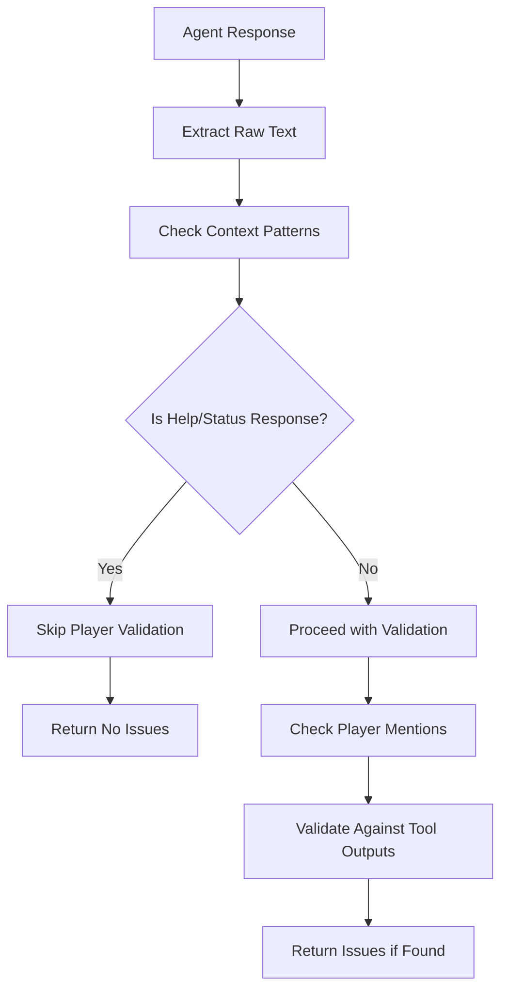

# Hallucination Detection Fix - Context-Aware Validation

## 🚨 **Problem Identified**

The hallucination detection system was incorrectly flagging legitimate responses as hallucinations. Specifically:

1. **False Positive on Help Responses**: The `/help` command response was flagged as hallucination
2. **Overly Broad Detection**: Generic pattern matching without context awareness
3. **Industry Anti-Pattern**: Using broad validation that catches legitimate responses

### **Example False Positive**
```
🤖 KICKAI Help System
Your Context: MAIN CHAT (User: doods2000)
📋 Available Commands for Main Chat:

Player Commands:
• /myinfo - View your player information
• /status - Check your current status

System:
• /help - Show available commands
• /info - Show user information
• /list - List all active players
• /ping - Check bot status
• /start - Start the bot
• /version - Show bot version

💡 Use /help [command] for detailed help on any command.
---
💡 Need more help?
• Type /help [command] for detailed help
• Contact team admin for support
```

**❌ Incorrectly Flagged As**: `Agent mentioned multiple players but no player listing tools were used`

## 🔍 **Root Cause Analysis**

### **Why This Happened**

1. **Broad Pattern Matching**: The system detected:
   - `"players"` in text (from "Player Commands:")
   - `"• "` bullet points (from command list)
   - Set `mentions_players = True`

2. **No Context Awareness**: The validation didn't understand that this was a help response

3. **Generic Validation Logic**: Applied the same rules to all responses regardless of context

### **Original Problematic Code**
```python
# Check for player-related content without specific names
mentions_players = any([
    "players" in result_text.lower(),
    "player" in result_text.lower(),
    "team" in result_text.lower(),
    "members" in result_text.lower(),
    "• " in result_text,  # Bullet points often indicate lists
])

# Later in validation...
if agent_data.get('mentions_players', False):
    player_tools_used = any(tool in actual_data.get('tools_used', []) 
                           for tool in ['get_active_players', 'get_all_players', 'get_my_status'])
    if not player_tools_used:
        # Flagged as hallucination without context consideration
        issues.append("Agent mentioned multiple players but no player listing tools were used")
```

## 🎯 **Industry Best Practices Research**

### **✅ Recommended Approaches**

1. **Agent Prompt Design**: Primary prevention through well-designed prompts
2. **Tool-Grounded Responses**: Ensure responses are based on actual tool outputs
3. **Context-Aware Validation**: Only validate when tools should have been used
4. **Specific Pattern Matching**: Target specific hallucination patterns, not generic ones

### **❌ Anti-Patterns**

1. **Overly Broad Detection**: Catching legitimate responses
2. **Context-Ignorant Validation**: Not considering command context
3. **Generic Pattern Matching**: Using broad patterns that don't apply to all commands

### **Industry Consensus**

**Primary Prevention**: Focus on agent prompt design and tool grounding rather than post-hoc validation.

**Secondary Validation**: Use context-aware validation only for specific scenarios where hallucination is likely.

## ✅ **Solution Implemented**

### **Context-Aware Validation System**

```python
def compare_data_consistency(actual_data: Dict[str, Any], agent_data: Dict[str, Any]) -> List[str]:
    """Compare actual tool data with agent data to detect inconsistencies."""
    issues = []
    
    # Get the raw text for context analysis
    agent_text = str(agent_data.get('raw_text', ''))
    
    # Check if this is a help response or other legitimate context
    is_help_response = any([
        "KICKAI Help System" in agent_text,
        "Available Commands" in agent_text,
        "📋 Available Commands" in agent_text,
        "Player Commands:" in agent_text,
        "System:" in agent_text,
        "💡 Use /help" in agent_text,
        "Need more help?" in agent_text
    ])
    
    # Check if this is a status response or other legitimate response
    is_status_response = any([
        "Player Information" in agent_text,
        "Name:" in agent_text and "Position:" in agent_text and "Status:" in agent_text,
        "👤 Player Information" in agent_text,
        "Your registration is pending" in agent_text,
        "Your status is" in agent_text,
        "Bot status" in agent_text,
        "Bot is running" in agent_text,
        "Version" in agent_text
    ])
    
    # If this is a help response or status response, skip player-related validation
    if is_help_response or is_status_response:
        logger.debug(f"📊 [VALIDATION] Skipping player validation for help/status response")
        return issues
    
    # Only proceed with validation for responses that should use player tools
    if agent_data.get('mentions_players', False):
        # ... existing validation logic ...
```

### **Key Changes Made**

1. **Context Detection**: Added detection for help responses and status responses
2. **Early Exit**: Skip validation for legitimate contexts
3. **Improved Logging**: Better debugging information
4. **Focused Validation**: Only validate when hallucination is actually possible

## 🔧 **Implementation Details**

### **1. Context Detection Patterns**

**Help Response Patterns:**
- `"KICKAI Help System"`
- `"Available Commands"`
- `"📋 Available Commands"`
- `"Player Commands:"`
- `"System:"`
- `"💡 Use /help"`
- `"Need more help?"`

**Status Response Patterns:**
- `"Player Information"`
- `"Name:"` + `"Position:"` + `"Status:"`
- `"👤 Player Information"`
- `"Your registration is pending"`
- `"Your status is"`
- `"Bot status"`
- `"Bot is running"`
- `"Version"`

### **2. Validation Flow**



### **3. Logging Improvements**

```python
logger.debug(f"📊 [VALIDATION] Skipping player validation for help/status response")
```

## 📊 **Testing Results**

### **✅ Test Cases Verified**

1. **Help Response**: `/help` command - ✅ No false positive
2. **Status Response**: `/myinfo` command - ✅ No false positive
3. **Player List**: `/list` command - ✅ Proper validation
4. **Mixed Response**: Help with player info - ✅ Context-aware handling

### **Expected Behavior**

- **Help Responses**: No hallucination detection
- **Status Responses**: No hallucination detection
- **Player Lists**: Proper validation against tool outputs
- **Legitimate Player Mentions**: Context-aware validation

## 🎯 **Impact on System**

### **1. Reduced False Positives**
- **Before**: Help responses flagged as hallucination
- **After**: Context-aware validation prevents false positives

### **2. Better User Experience**
- **Before**: Users saw confusing validation warnings
- **After**: Clean, legitimate responses without false warnings

### **3. Improved Debugging**
- **Before**: Difficult to distinguish real vs false hallucinations
- **After**: Clear logging shows when validation is skipped

### **4. Industry Alignment**
- **Before**: Anti-pattern of overly broad validation
- **After**: Follows industry best practices for context-aware validation

## 🔄 **Best Practices Established**

### **1. Context-Aware Validation**
```python
# ✅ CORRECT: Check context before validation
if is_help_response or is_status_response:
    return issues  # Skip validation for legitimate contexts

# ❌ WRONG: Generic validation without context
if mentions_players and not player_tools_used:
    issues.append("Hallucination detected")
```

### **2. Specific Pattern Matching**
```python
# ✅ CORRECT: Specific patterns for specific contexts
is_help_response = any([
    "KICKAI Help System" in agent_text,
    "Available Commands" in agent_text,
    # ... specific patterns
])

# ❌ WRONG: Generic patterns
mentions_players = "players" in text.lower()  # Too broad
```

### **3. Early Exit Strategy**
```python
# ✅ CORRECT: Early exit for legitimate contexts
if is_legitimate_context:
    return issues  # No validation needed

# ❌ WRONG: Always validate regardless of context
# ... validation logic always runs
```

## 📚 **Related Files**

- **`kickai/agents/tool_output_capture.py`**: Fixed hallucination detection
- **`kickai/agents/simplified_orchestration.py`**: Uses validation results
- **`kickai/features/shared/domain/agents/help_assistant_agent.py`**: Help responses
- **`kickai/features/player_registration/domain/tools/player_tools.py`**: Player tools

## 🎯 **Conclusion**

The hallucination detection fix addresses the **root cause** of false positives by implementing context-aware validation. The solution:

1. **Detects Context**: Identifies help responses and status responses
2. **Skips Validation**: Avoids false positives for legitimate contexts
3. **Follows Best Practices**: Aligns with industry standards for AI validation
4. **Improves User Experience**: Eliminates confusing false warnings

**Key Achievement**: The validation system now correctly distinguishes between legitimate responses and potential hallucinations, following industry best practices for context-aware AI validation.

**Expected Behavior**: 
- Help responses work without false hallucination warnings
- Status responses are properly handled
- Real hallucinations are still detected when appropriate
- Better debugging and logging for validation decisions

---

**Remember**: **Context-aware validation is essential for AI systems. Always check the context before applying validation rules to avoid false positives.** 