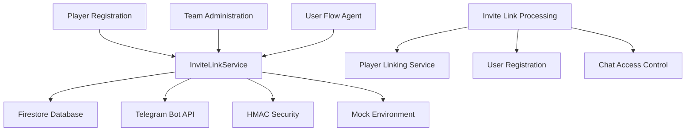
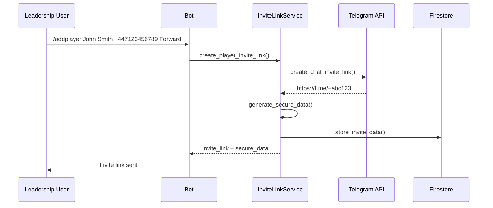
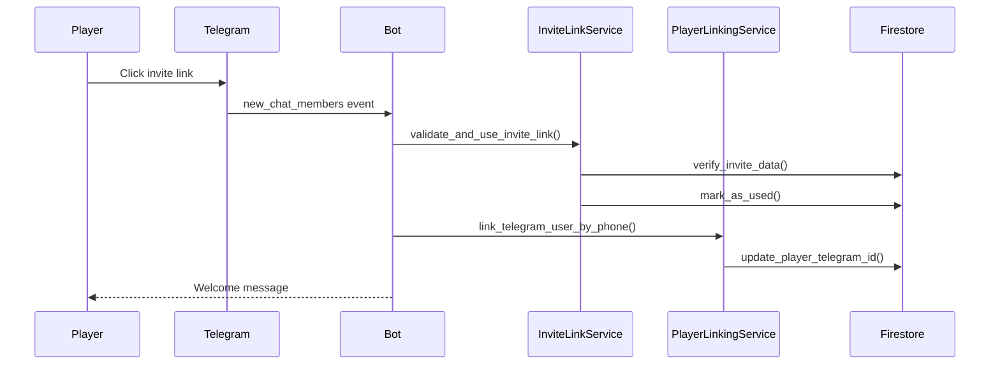
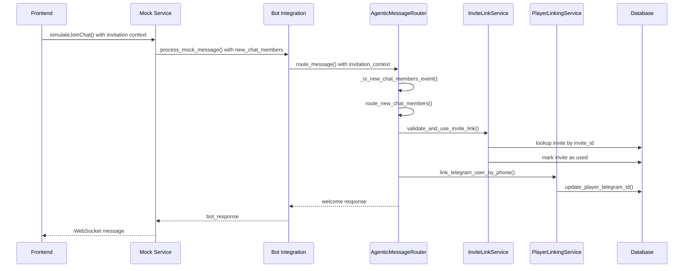

# KICKAI Invite Link System Specification

## Overview

The KICKAI Invite Link System provides secure, time-limited invitation links for players and team members to join Telegram chats. The system supports both production (real Telegram) and mock testing environments.

## Table of Contents

1. [System Architecture](#system-architecture)
2. [Invite Link Types](#invite-link-types)
3. [Security Model](#security-model)
4. [Production Flow](#production-flow)
5. [Mock Testing Flow](#mock-testing-flow)
6. [Data Models](#data-models)
7. [API Specifications](#api-specifications)
8. [Error Handling](#error-handling)
9. [Testing Strategy](#testing-strategy)

## System Architecture

### Core Components



### Key Services

- **InviteLinkService**: Core service for creating and managing invite links
- **PlayerLinkingService**: Links Telegram users to existing player records
- **AgenticMessageRouter**: Routes invite link processing through the agentic system

## Invite Link Types

### 1. Player Invite Links

**Purpose**: Invite players to join the main team chat
**Target**: Main chat (`main_chat_id`)
**Access Level**: Player permissions

**Creation Trigger**: `/addplayer` command in leadership chat
**Usage**: Players join main chat and register their details

### 2. Team Member Invite Links

**Purpose**: Invite team members to join the leadership chat
**Target**: Leadership chat (`leadership_chat_id`)
**Access Level**: Leadership permissions

**Creation Trigger**: `/addmember` command in leadership chat
**Usage**: Team members join leadership chat for administrative functions

## Security Model

### HMAC-Based Security

```python
# Security Components
- KICKAI_INVITE_SECRET_KEY: Environment variable for HMAC signing
- HMAC-SHA256: Cryptographic signing algorithm
- Base64 URL-safe encoding: Safe for URL transmission
- 7-day expiration: Time-limited access
```

### Secure Data Structure

```json
{
  "player_id": "01JS",
  "player_name": "John Smith",
  "player_phone": "+447123456789",
  "team_id": "KTI",
  "invite_id": "uuid-v4",
  "created_at": "2024-01-01T12:00:00Z",
  "expires_at": "2024-01-08T12:00:00Z"
}
```

### Validation Process

1. **HMAC Verification**: Validate cryptographic signature
2. **Expiration Check**: Ensure link hasn't expired
3. **One-time Use**: Mark link as used after first use
4. **Database Validation**: Verify against Firestore records

## Production Flow

### 1. Invite Link Creation



### 2. Invite Link Processing



## Mock Testing Flow

### 1. Mock Environment Detection

```python
def _detect_mock_environment(self) -> bool:
    """Detect if running in mock testing environment."""
    try:
        # Check for mock server running on localhost:8001
        import socket
        sock = socket.socket(socket.AF_INET, socket.SOCK_STREAM)
        sock.settimeout(1)
        result = sock.connect_ex(('localhost', 8001))
        sock.close()
        if result == 0:
            return True
            
        # Check for MOCK_TELEGRAM_BASE_URL environment variable
        if os.getenv("MOCK_TELEGRAM_BASE_URL"):
            return True
            
        # Check for test-specific configuration
        if os.getenv("KICKAI_TEST_MODE") == "true":
            return True
            
        return False
    except Exception:
        return False
```

### 2. Mock Invite Link Format

```
http://localhost:8001/?invite={invite_id}&type=player&chat={chat_id}&team={team_id}
```

**Example**:
```
http://localhost:8001/?invite=abc123-def456&type=player&chat=-4829855674&team=KTI
```

### 3. Mock Processing Flow



## Data Models

### Invite Link Document (Firestore)

```typescript
interface InviteLinkDocument {
  // Core Fields
  invite_id: string;                    // UUID v4
  team_id: string;                      // Team identifier
  chat_id: string;                      // Telegram chat ID
  chat_type: "main" | "leadership";     // Chat type
  
  // Link Information
  invite_link: string;                  // Telegram invite URL
  secure_data: string;                  // HMAC-signed data
  status: "active" | "used" | "revoked"; // Link status
  
  // Player/Member Data
  player_id?: string;                   // Player ID (for player links)
  player_name?: string;                 // Player name
  player_phone?: string;                // Player phone
  player_position?: string;             // Player position
  
  member_id?: string;                   // Member ID (for team member links)
  member_name?: string;                 // Member name
  member_phone?: string;                // Member phone
  member_role?: string;                 // Member role
  
  // Timestamps
  created_at: string;                   // ISO timestamp
  expires_at: string;                   // ISO timestamp
  used_at?: string;                     // ISO timestamp
  used_by?: string;                     // Telegram user ID
  used_by_username?: string;            // Telegram username
  
  // Mock Testing
  is_mock?: boolean;                    // Mock environment flag
}
```

### Secure Data Payload

```typescript
interface SecureInviteData {
  player_id?: string;
  player_name?: string;
  player_phone?: string;
  team_id: string;
  invite_id: string;
  created_at: string;
  expires_at: string;
}
```

## API Specifications

### InviteLinkService Methods

#### `create_player_invite_link()`

```python
async def create_player_invite_link(
    self,
    team_id: str,
    player_name: str,
    player_phone: str,
    player_position: str,
    main_chat_id: str,
    player_id: str = None,
) -> dict[str, Any]:
    """
    Create a secure invite link for a player.
    
    Returns:
        {
            "invite_id": "uuid-v4",
            "invite_link": "https://t.me/+abc123",
            "player_id": "JS_FWD_KTI",
            "player_name": "John Smith",
            "expires_at": "2024-01-08T12:00:00Z",
            "secure_data": "base64-encoded-hmac-data"
        }
    """
```

#### `create_team_member_invite_link()`

```python
async def create_team_member_invite_link(
    self,
    team_id: str,
    member_name: str,
    member_phone: str,
    member_role: str,
    leadership_chat_id: str,
) -> dict[str, Any]:
    """
    Create a secure invite link for a team member.
    
    Returns:
        {
            "invite_id": "uuid-v4",
            "invite_link": "https://t.me/+abc123",
            "member_id": "member_KTI_+447123456789",
            "member_name": "John Smith",
            "expires_at": "2024-01-08T12:00:00Z",
            "secure_data": "base64-encoded-hmac-data"
        }
    """
```

#### `validate_and_use_invite_link()`

```python
async def validate_and_use_invite_link(
    self,
    invite_link: str,
    user_id: str,
    username: str = None,
    secure_data: str = None
) -> dict[str, Any] | None:
    """
    Validate and mark an invite link as used.
    
    Returns:
        InviteLinkDocument if valid, None if invalid
    """
```

### PlayerLinkingService Methods

#### `link_telegram_user_by_phone()`

```python
async def link_telegram_user_by_phone(
    self,
    phone: str,
    telegram_id: str,
    username: str = None
) -> Player | None:
    """
    Link a Telegram user to an existing player record.
    
    Returns:
        Player object if successfully linked, None otherwise
    """
```

#### `get_pending_players_without_telegram_id()`

```python
async def get_pending_players_without_telegram_id(self) -> list[Player]:
    """
    Get all pending players without telegram_id for linking.
    
    Returns:
        List of Player objects
    """
```

## Error Handling

### Common Error Scenarios

#### 1. Invalid Invite Link

```json
{
  "error": "Invalid invite link format",
  "details": "Link must be a valid Telegram invite link",
  "code": "INVALID_LINK_FORMAT"
}
```

#### 2. Expired Invite Link

```json
{
  "error": "Invite link expired",
  "details": "Link was created on 2024-01-01 and expired on 2024-01-08",
  "code": "LINK_EXPIRED"
}
```

#### 3. Already Used Invite Link

```json
{
  "error": "Invite link already used",
  "details": "Link was used by user_id=123456789 on 2024-01-02",
  "code": "LINK_ALREADY_USED"
}
```

#### 4. Player Not Found

```json
{
  "error": "No player record found",
  "details": "No player found with phone +447123456789 in team KTI",
  "code": "PLAYER_NOT_FOUND"
}
```

### Error Response Format

```typescript
interface ErrorResponse {
  success: false;
  error: string;
  details?: string;
  code?: string;
  timestamp: string;
}
```

## Testing Strategy

### 1. Unit Tests

- **InviteLinkService**: Test link creation, validation, and security
- **PlayerLinkingService**: Test phone linking and pending player queries
- **Security**: Test HMAC signing and validation

### 2. Integration Tests

- **End-to-End Flow**: Complete invite link creation and usage
- **Database Integration**: Test Firestore operations
- **Telegram API**: Test real Telegram invite link creation

### 3. Mock Testing

- **Mock Environment**: Test without real Telegram API
- **Frontend Integration**: Test with mock Telegram tester
- **Auto-linking**: Test automatic player linking in mock environment

### 4. Security Testing

- **HMAC Validation**: Test signature verification
- **Expiration**: Test time-based validation
- **One-time Use**: Test link usage tracking

## Environment Configuration

### Production Environment

```bash
# Required Environment Variables
KICKAI_INVITE_SECRET_KEY=your-secret-key-here
TELEGRAM_BOT_TOKEN=your-bot-token-here
```

### Mock Testing Environment

```bash
# Mock Environment Variables
MOCK_TELEGRAM_BASE_URL=http://localhost:8001
KICKAI_INVITE_SECRET_KEY=test-secret-key
```

## Security Considerations

### 1. Secret Key Management

- **Environment Variable**: Store secret key securely
- **Key Rotation**: Implement key rotation strategy
- **Access Control**: Limit access to secret key

### 2. Link Security

- **HMAC Signing**: Cryptographic signature verification
- **Time Limiting**: 7-day expiration by default
- **One-time Use**: Prevent link reuse

### 3. Data Privacy

- **Phone Numbers**: Encrypt sensitive data
- **User Information**: Minimize data exposure
- **Audit Logging**: Track link usage

## Performance Considerations

### 1. Database Optimization

- **Indexing**: Index on invite_id, team_id, status
- **TTL**: Automatic cleanup of expired links
- **Caching**: Cache frequently accessed data

### 2. API Performance

- **Async Operations**: Non-blocking invite link creation
- **Batch Operations**: Bulk link management
- **Rate Limiting**: Prevent abuse

## Monitoring and Logging

### 1. Key Metrics

- **Link Creation Rate**: Number of links created per day
- **Link Usage Rate**: Number of links used per day
- **Error Rate**: Failed link validations
- **Expiration Rate**: Expired links

### 2. Logging Strategy

```python
# Log Levels
logger.info("✅ Created secure player invite link: {invite_id}")
logger.warning("⚠️ Invite link expired: {invite_id}")
logger.error("❌ Invalid invite link signature: {invite_id}")
```

## Implementation Status

### ✅ Completed Features

#### Core Implementation
- **✅ HMAC Security**: Full HMAC-SHA256 signing with secure validation
- **✅ Invite Link Generation**: Both player and team member invite links
- **✅ Database Integration**: Complete Firestore document management
- **✅ One-time Use**: Link usage tracking and enforcement
- **✅ Expiration Handling**: Time-based validation with automatic cleanup

#### Mock Testing Support
- **✅ Mock Environment Detection**: Automatic detection via socket check and environment variables
- **✅ Mock Invite Link Format**: `http://localhost:8001/?invite={id}&type={type}&chat={chat}&team={team}`
- **✅ Mock Link Processing**: Full integration with Mock Telegram Testing System

#### Production Features
- **✅ new_chat_members Handler**: Complete event processing in AgenticMessageRouter
- **✅ Invite ID Extraction**: Support for both real Telegram links and mock links
- **✅ Player Linking**: Automatic phone-based linking via PlayerLinkingService
- **✅ Team Member Support**: Basic team member invite processing

#### Advanced Features
- **✅ Multiple Lookup Methods**: Secure data, mock links, real links, and direct invite_id
- **✅ Comprehensive Validation**: Expiration, usage status, and database consistency
- **✅ Error Handling**: Detailed logging and user-friendly error messages

### 🔄 Production Ready

The invite link system is **production ready** with the following capabilities:

1. **Real Telegram Integration**: Works with real Telegram Bot API for production deployments
2. **Mock Testing Integration**: Seamless testing without real phone numbers or Telegram accounts
3. **Secure Link Processing**: HMAC-signed links with proper validation
4. **Automatic Player Linking**: Direct integration with player registration system
5. **Complete Event Handling**: Proper new_chat_members event processing

## Future Enhancements

### 1. Planned Features

- **Bulk Invite Links**: Create multiple links at once
- **Custom Expiration**: Configurable expiration times
- **Link Analytics**: Track link performance and usage statistics
- **Advanced Team Member Linking**: Full team member service integration
- **Invite Link Revocation API**: Programmatic link management

### 2. Security Improvements

- **Rate Limiting**: Prevent link creation abuse
- **Geographic Restrictions**: Location-based access control
- **Device Fingerprinting**: Additional security validation
- **Automated Cleanup**: Scheduled cleanup of expired links

---

## Appendix

### A. Mock Testing Commands

```bash
# Start mock Telegram tester
cd tests/mock_telegram
python start_mock_tester.py

# Access mock interface
http://localhost:8001

# Test invite link flow
1. Use /addplayer command in leadership chat
2. Copy invite link from response
3. Open invite link in mock interface
4. Verify auto-linking and registration
```

### B. Database Schema

```sql
-- Firestore Collection: kickai_invite_links
-- Document ID: invite_id (UUID v4)
-- Fields: See InviteLinkDocument interface above
```

### C. Security Checklist

- [ ] Secret key properly configured
- [ ] HMAC validation implemented
- [ ] Expiration checking enabled
- [ ] One-time use enforced
- [ ] Error handling comprehensive
- [ ] Logging implemented
- [ ] Mock testing available
- [ ] Documentation complete 