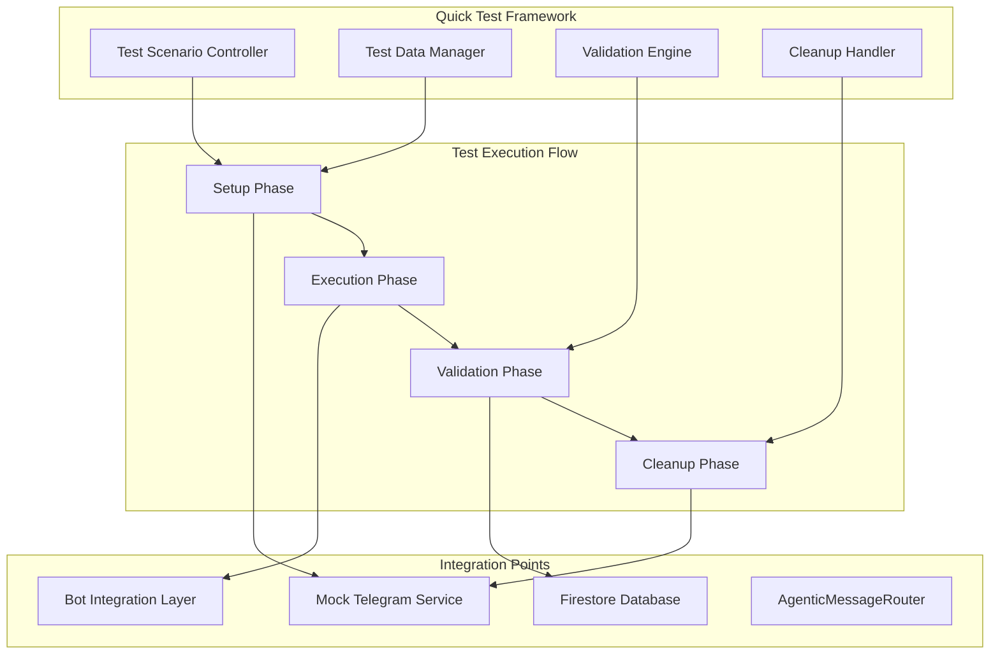
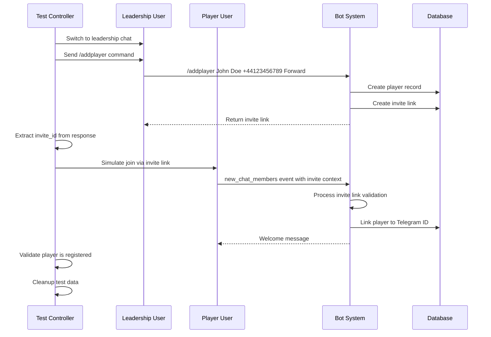
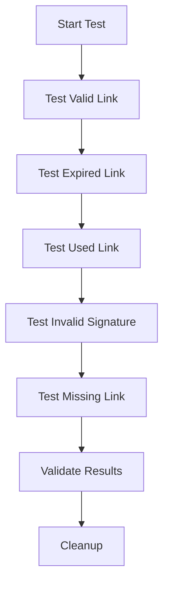
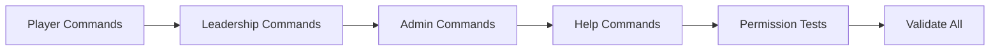
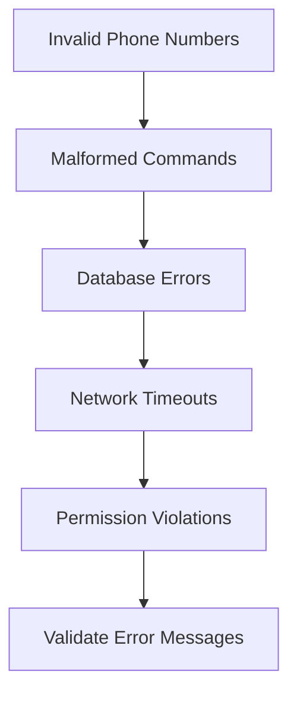
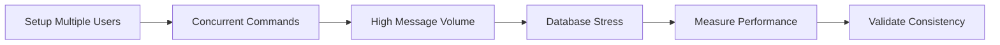

# Mock Telegram Testing System - Quick Test Scenarios

## Document Information

- **Document Title**: Mock Telegram Testing System - Quick Test Scenarios
- **Version**: 1.0.0
- **Date**: August 2024
- **Author**: KICKAI Testing Team
- **Status**: Implementation Ready

---

## Overview

This document defines comprehensive Quick Test Scenarios for the Mock Telegram Testing System. These scenarios provide automated, one-click testing of core KICKAI bot functionality with pre-defined data sets, validation steps, and cleanup procedures.

## Architecture for Quick Tests



---

## Quick Test Scenarios

### 1. 🏃 Player Registration Flow Test

**Objective**: Test complete player onboarding flow from invite link creation to player registration

**Test Duration**: ~60 seconds  
**Data Requirements**: Pre-configured team leadership user, clean database state  
**Success Criteria**: Player successfully registered and linked to Telegram account

#### Test Flow



#### Test Data Set

```json
{
  "leadership_user": {
    "id": 1004,
    "username": "test_leadership",
    "first_name": "Test",
    "last_name": "Leadership",
    "role": "leadership"
  },
  "test_player": {
    "name": "John Doe",
    "phone": "+44123456789",
    "position": "Forward"
  },
  "expected_outcomes": {
    "invite_link_created": true,
    "player_record_created": true,
    "telegram_link_established": true,
    "welcome_message_sent": true
  }
}
```

#### Validation Steps

1. **Invite Link Creation**
   - Verify invite link returned in bot response
   - Validate invite_id exists in database
   - Check invite status is "active"

2. **Player Registration**
   - Confirm player document created in Firestore
   - Validate player status is "pending"
   - Check all required fields populated

3. **Telegram Linking**
   - Verify player.telegram_id is set
   - Confirm invite status changed to "used"
   - Validate player status updated to "active"

4. **Bot Response**
   - Check welcome message contains player name
   - Verify message sent to correct chat
   - Validate response format

#### Cleanup Procedure

```javascript
async function cleanupPlayerRegistrationTest(testData) {
  // Remove test player from database
  await deletePlayer(testData.player_id);
  
  // Clean up invite link record
  await deleteInviteLink(testData.invite_id);
  
  // Clear chat messages
  await clearChatMessages(testData.chat_id);
  
  // Reset user selection in UI
  resetUIState();
}
```

### 2. 🔗 Invite Link Validation Test

**Objective**: Test invite link security, expiration, and edge cases

**Test Duration**: ~45 seconds  
**Data Requirements**: Pre-created invite links in various states  
**Success Criteria**: All validation scenarios behave correctly

#### Test Flow



#### Test Data Set

```json
{
  "test_links": {
    "valid_link": {
      "invite_id": "valid-test-uuid",
      "status": "active",
      "expires_at": "2025-01-01T00:00:00Z",
      "expected_result": "success"
    },
    "expired_link": {
      "invite_id": "expired-test-uuid",
      "status": "active",
      "expires_at": "2020-01-01T00:00:00Z",
      "expected_result": "expired"
    },
    "used_link": {
      "invite_id": "used-test-uuid",
      "status": "used",
      "used_by": "123456",
      "expected_result": "already_used"
    },
    "invalid_link": {
      "invite_id": "invalid-signature",
      "tampered_data": true,
      "expected_result": "invalid_signature"
    }
  }
}
```

### 3. 🎯 Command Testing Suite

**Objective**: Test all major bot commands across different user roles and chat types

**Test Duration**: ~90 seconds  
**Data Requirements**: Users with different roles, various chat contexts  
**Success Criteria**: All commands respond appropriately based on permissions

#### Test Flow



#### Test Data Set

```json
{
  "command_tests": {
    "player_commands": [
      "/myinfo",
      "/status",
      "/help",
      "/list"
    ],
    "leadership_commands": [
      "/addplayer Test Player +44123456789 Forward",
      "/addmember Test Member +44123456790 Coach",
      "/approve PLAYER_ID",
      "/reject PLAYER_ID reason",
      "/pending",
      "/list"
    ],
    "admin_commands": [
      "/update PLAYER_ID field value",
      "/deactivate PLAYER_ID",
      "/activate PLAYER_ID"
    ],
    "permission_tests": {
      "player_tries_leadership_command": {
        "command": "/addplayer",
        "user_role": "player",
        "expected": "permission_denied"
      }
    }
  }
}
```

### 4. 💬 Natural Language Processing Test

**Objective**: Test bot's natural language understanding and response capabilities

**Test Duration**: ~60 seconds  
**Data Requirements**: Variety of natural language inputs  
**Success Criteria**: Bot correctly interprets and responds to natural language

#### Test Data Set

```json
{
  "natural_language_tests": [
    {
      "input": "What's my status?",
      "expected_intent": "status_inquiry",
      "user_role": "player"
    },
    {
      "input": "Can you add a new player John Smith?",
      "expected_intent": "add_player",
      "user_role": "leadership"
    },
    {
      "input": "Show me all players",
      "expected_intent": "list_players",
      "user_role": "player"
    },
    {
      "input": "I need help with the system",
      "expected_intent": "help_request",
      "user_role": "any"
    }
  ]
}
```

### 5. 🚨 Error Handling & Edge Cases Test

**Objective**: Test system resilience and error handling capabilities

**Test Duration**: ~75 seconds  
**Data Requirements**: Invalid inputs, edge case scenarios  
**Success Criteria**: System handles errors gracefully with helpful messages

#### Test Flow



#### Test Data Set

```json
{
  "error_scenarios": {
    "invalid_phone_numbers": [
      "123",
      "not-a-phone",
      "+44invalid",
      ""
    ],
    "malformed_commands": [
      "/addplayer",
      "/addplayer Name",
      "/addplayer Name Phone",
      "/invalid_command test"
    ],
    "permission_violations": [
      {
        "command": "/addplayer Test +44123456789 Forward",
        "user_role": "player",
        "chat_type": "main"
      }
    ],
    "database_scenarios": [
      "duplicate_phone_number",
      "duplicate_telegram_id",
      "missing_team_record"
    ]
  }
}
```

### 6. 📊 Performance & Load Test

**Objective**: Test system performance under concurrent users and high message volume

**Test Duration**: ~120 seconds  
**Data Requirements**: Multiple concurrent users, high message volume  
**Success Criteria**: System maintains responsiveness and data consistency

#### Test Flow



---

## Implementation Plan

### Phase 1: Core Framework Development

#### 1.1 Test Controller Implementation

**Location**: `tests/mock_telegram/quick_tests/test_controller.py`

```python
class QuickTestController:
    """Main controller for executing quick test scenarios"""
    
    def __init__(self, mock_service, bot_integration):
        self.mock_service = mock_service
        self.bot_integration = bot_integration
        self.test_data_manager = TestDataManager()
        self.validation_engine = ValidationEngine()
        self.cleanup_handler = CleanupHandler()
    
    async def run_scenario(self, scenario_name: str) -> TestResult:
        """Execute a specific test scenario"""
        
    async def run_all_scenarios(self) -> List[TestResult]:
        """Execute all quick test scenarios"""
```

#### 1.2 Test Data Manager

**Location**: `tests/mock_telegram/quick_tests/test_data_manager.py`

```python
class TestDataManager:
    """Manages test data sets and fixtures"""
    
    def load_scenario_data(self, scenario_name: str) -> Dict[str, Any]:
        """Load test data for specific scenario"""
        
    def create_test_fixtures(self, scenario: str) -> Dict[str, Any]:
        """Create necessary test fixtures"""
        
    def validate_prerequisites(self, scenario: str) -> bool:
        """Validate test prerequisites are met"""
```

#### 1.3 Validation Engine

**Location**: `tests/mock_telegram/quick_tests/validation_engine.py`

```python
class ValidationEngine:
    """Validates test execution results"""
    
    def validate_scenario_outcome(self, scenario: str, result: Any) -> ValidationResult:
        """Validate specific scenario outcomes"""
        
    def check_database_state(self, expected_state: Dict) -> bool:
        """Validate database state matches expectations"""
        
    def verify_bot_responses(self, responses: List[str]) -> bool:
        """Verify bot responses meet criteria"""
```

### Phase 2: Scenario Implementation

#### 2.1 Player Registration Scenario

**Location**: `tests/mock_telegram/quick_tests/scenarios/player_registration.py`

```python
class PlayerRegistrationScenario(BaseScenario):
    """Implements player registration test scenario"""
    
    async def setup(self) -> Dict[str, Any]:
        """Setup test environment and data"""
        
    async def execute(self) -> TestResult:
        """Execute the test scenario"""
        
    async def validate(self, execution_result: Any) -> ValidationResult:
        """Validate test results"""
        
    async def cleanup(self, test_context: Dict) -> None:
        """Clean up test artifacts"""
```

#### 2.2 Frontend Integration

**Location**: `tests/mock_telegram/frontend/quick_tests.js`

```javascript
class QuickTestRunner {
    constructor() {
        this.testController = new TestController();
        this.uiManager = new UIManager();
    }
    
    async runScenario(scenarioName) {
        // Execute scenario with UI feedback
    }
    
    showTestProgress(scenario, step) {
        // Update UI with test progress
    }
    
    displayResults(results) {
        // Show test results in UI
    }
}
```

### Phase 3: UI Enhancement

#### 3.1 Quick Test Panel

**Enhancement to**: `tests/mock_telegram/frontend/enhanced_index.html`

```html
<!-- Enhanced Quick Test Panel -->
<div class="quick-tests-panel">
    <h3>🚀 Quick Test Scenarios</h3>
    
    <div class="test-scenario" data-scenario="player-registration">
        <div class="scenario-header">
            <span class="scenario-icon">🏃</span>
            <span class="scenario-title">Player Registration Flow</span>
            <span class="scenario-duration">~60s</span>
        </div>
        <div class="scenario-description">
            Test complete player onboarding from invite creation to registration
        </div>
        <div class="scenario-controls">
            <button class="run-test-btn" onclick="runQuickTest('player-registration')">
                Run Test
            </button>
            <div class="test-status" id="status-player-registration">Ready</div>
        </div>
        <div class="test-progress" id="progress-player-registration"></div>
    </div>
    
    <!-- Additional scenarios... -->
</div>
```

#### 3.2 Real-time Test Monitoring

```javascript
class TestMonitor {
    constructor() {
        this.progressTrackers = new Map();
        this.resultDisplays = new Map();
    }
    
    trackTestProgress(scenario, steps) {
        // Real-time progress tracking
    }
    
    displayTestResults(scenario, results) {
        // Show detailed test results
    }
    
    showTestMetrics(scenario, metrics) {
        // Display performance metrics
    }
}
```

### Phase 4: Advanced Features

#### 4.1 Test Configuration

**Location**: `tests/mock_telegram/quick_tests/config/test_config.yaml`

```yaml
test_scenarios:
  player_registration:
    enabled: true
    timeout: 60
    prerequisites:
      - clean_database
      - leadership_user_available
    cleanup_policy: "always"
    
  invite_link_validation:
    enabled: true
    timeout: 45
    prerequisites:
      - test_invite_links_created
    cleanup_policy: "on_success"
```

#### 4.2 Test Reporting

**Location**: `tests/mock_telegram/quick_tests/reporting/test_reporter.py`

```python
class TestReporter:
    """Generates comprehensive test reports"""
    
    def generate_summary_report(self, results: List[TestResult]) -> Report:
        """Generate summary of all test executions"""
        
    def export_detailed_report(self, results: List[TestResult], format: str) -> str:
        """Export detailed test report in specified format"""
        
    def create_performance_metrics(self, results: List[TestResult]) -> Metrics:
        """Create performance metrics from test results"""
```

---

## Implementation Timeline

### Week 1: Foundation
- [ ] Implement core test framework classes
- [ ] Create test data management system
- [ ] Build validation engine

### Week 2: Scenarios
- [ ] Implement player registration scenario
- [ ] Create invite link validation tests
- [ ] Build command testing suite

### Week 3: UI Integration
- [ ] Enhance frontend with quick test panel
- [ ] Add real-time progress monitoring
- [ ] Implement test result visualization

### Week 4: Advanced Features
- [ ] Add configuration management
- [ ] Implement test reporting
- [ ] Create performance monitoring

---

## Risk Mitigation

### Technical Risks

1. **Test Data Isolation**
   - **Risk**: Test data contaminating production environment
   - **Mitigation**: Isolated test database, mandatory cleanup procedures

2. **Concurrent Test Execution**
   - **Risk**: Race conditions between tests
   - **Mitigation**: Test isolation, proper locking mechanisms

3. **Bot System Stability**
   - **Risk**: Tests affecting bot system stability
   - **Mitigation**: Sandboxed test environment, rollback capabilities

### Operational Risks

1. **Test Maintenance**
   - **Risk**: Tests becoming outdated as bot evolves
   - **Mitigation**: Automated test validation, regular review cycles

2. **Performance Impact**
   - **Risk**: Tests consuming excessive resources
   - **Mitigation**: Resource monitoring, test timeout enforcement

---

## Success Metrics

### Functional Metrics
- **Test Coverage**: >95% of core bot functionality
- **Test Reliability**: <1% false positive rate
- **Test Performance**: All scenarios complete within specified time limits

### Business Metrics
- **Development Velocity**: 50% reduction in manual testing time
- **Bug Detection**: 90% of regressions caught by quick tests
- **Team Productivity**: Increased confidence in deployments

---

## Conclusion

The Quick Test Scenarios provide a comprehensive, automated testing framework that enables rapid validation of KICKAI bot functionality. The implementation plan ensures stable, maintainable, and extensible testing capabilities that will accelerate development and improve system reliability.