# KICKAI Testing Architecture Documentation

**Version:** 2.0  
**Status:** Production Ready  
**Last Updated:** December 2024  
**Focus:** Comprehensive Testing Strategy with Cross-Feature Coverage

## 📋 Table of Contents

1. [Testing Philosophy](#testing-philosophy)
2. [Test Pyramid](#test-pyramid)
3. [Test Types and Strategies](#test-types-and-strategies)
4. [Cross-Feature Testing](#cross-feature-testing)
5. [Test Infrastructure](#test-infrastructure)
6. [Test Data Management](#test-data-management)
7. [Continuous Testing](#continuous-testing)
8. [Performance Testing](#performance-testing)
9. [Security Testing](#security-testing)
10. [Test Automation](#test-automation)
11. [Best Practices](#best-practices)

---

## 🎯 Testing Philosophy

KICKAI follows a **comprehensive testing strategy** that ensures reliability, maintainability, and confidence in the system. Our testing philosophy is built on three core principles:

### 1. **Test Pyramid Approach**
- **Foundation**: Extensive unit tests for fast feedback
- **Middle Layer**: Integration tests for component interaction
- **Top Layer**: E2E tests for user journey validation

### 2. **Cross-Feature Coverage**
- **Critical Paths**: All cross-feature flows must be tested
- **Data Consistency**: Ensure state consistency across features
- **User Experience**: Validate complete user journeys

### 3. **Quality Gates**
- **Automated Testing**: All tests run automatically in CI/CD
- **Coverage Requirements**: Maintain high test coverage
- **Performance Benchmarks**: Ensure system performance

---

## 🏗️ Test Pyramid

### Test Pyramid Structure


### Test Distribution Guidelines

| Test Type | Percentage | Execution Time | Scope |
|-----------|------------|----------------|-------|
| **Unit Tests** | 70% | < 1 second | Individual functions/classes |
| **Integration Tests** | 20% | 1-10 seconds | Service interactions |
| **E2E Tests** | 10% | 10+ seconds | Complete user journeys |

### Test Coverage Targets


---

## 🧪 Test Types and Strategies

### 1. **Unit Tests**

#### Purpose and Scope
- **Purpose**: Test individual components in isolation
- **Scope**: Single function, class, or module
- **Dependencies**: Mocked external dependencies
- **Speed**: Fast execution (< 1 second per test)

#### Unit Test Structure

```python
# Example: Player Service Unit Test
class TestPlayerService:
    """Unit tests for PlayerService."""
    
    @pytest.fixture
    def mock_data_store(self):
        """Mock data store for testing."""
        return Mock(spec=DataStoreInterface)
    
    @pytest.fixture
    def player_service(self, mock_data_store):
        """Player service with mocked dependencies."""
        return PlayerService(mock_data_store)
    
    def test_create_player_success(self, player_service, mock_data_store):
        """Test successful player creation."""
        # Arrange
        player_data = {"name": "Test Player", "phone": "+447123456789"}
        mock_data_store.create_player.return_value = "PLAYER_ID"
        
        # Act
        result = player_service.create_player(player_data)
        
        # Assert
        assert result == "PLAYER_ID"
        mock_data_store.create_player.assert_called_once_with(player_data)
    
    def test_create_player_validation_error(self, player_service, mock_data_store):
        """Test player creation with validation error."""
        # Arrange
        invalid_player_data = {"name": "", "phone": "invalid"}
        
        # Act & Assert
        with pytest.raises(ValidationError):
            player_service.create_player(invalid_player_data)
```

#### Unit Test Best Practices
- **AAA Pattern**: Arrange, Act, Assert
- **Single Responsibility**: Test one thing per test
- **Descriptive Names**: Test names explain what is being tested
- **Mock External Dependencies**: Keep tests fast and reliable
- **Test Edge Cases**: Include error conditions and boundary cases

### 2. **Integration Tests**

#### Purpose and Scope
- **Purpose**: Test component interactions
- **Scope**: Multiple components working together
- **Dependencies**: Some real dependencies, some mocked
- **Speed**: Medium execution (1-10 seconds per test)

#### Integration Test Structure

```python
# Example: Service Integration Test
class TestServiceIntegration:
    """Integration tests for service interactions."""
    
    @pytest.fixture
    def services(self):
        """Set up services with real interactions."""
        data_store = MockDataStore()
        player_service = PlayerService(data_store)
        team_service = TeamService(data_store)
        return {
            'player': player_service,
            'team': team_service,
            'data_store': data_store
        }
    
    @pytest.mark.asyncio
    async def test_player_registration_affects_team_roster(self, services):
        """Test that player registration updates team roster."""
        # Arrange
        player_data = {
            "player_id": "TEST001",
            "name": "Test Player",
            "team_id": "TEAM001"
        }
        
        # Act
        await services['player'].create_player(player_data)
        team_players = await services['team'].get_team_players("TEAM001")
        
        # Assert
        assert "TEST001" in [p.player_id for p in team_players]
    
    @pytest.mark.asyncio
    async def test_cross_feature_data_consistency(self, services):
        """Test data consistency across features."""
        # Arrange
        player_id = "TEST002"
        match_id = "MATCH001"
        
        # Act
        await services['player'].create_player({"player_id": player_id})
        await services['team'].add_player_to_match(player_id, match_id)
        
        # Assert
        player = await services['player'].get_player(player_id)
        match_players = await services['team'].get_match_players(match_id)
        
        assert player.player_id in [p.player_id for p in match_players]
```

### 3. **End-to-End Tests**

#### Purpose and Scope
- **Purpose**: Test complete user workflows
- **Scope**: Full system from user input to database
- **Dependencies**: Real Telegram API, real Firestore
- **Speed**: Slow execution (10+ seconds per test)

#### E2E Test Structure

```python
# Example: Cross-Feature E2E Test
class TestCrossFeatureFlows(E2ETestFramework):
    """End-to-end tests for cross-feature flows."""
    
    @pytest.mark.asyncio
    async def test_registration_to_match_to_payment(self):
        """Test complete user journey: registration → match → payment."""
        # Step 1: Register new player
        admin_add_response = await self.send_admin_message(
            "/add CrossFeature Player +447555555555 Forward"
        )
        player_id = self.extract_player_id(admin_add_response)
        
        # Step 2: Admin approves player
        await self.send_admin_message(f"/approve {player_id}")
        
        # Step 3: Create match and assign player
        match_response = await self.send_admin_message(
            "/match create Test Match 2024-01-15 19:00 Home"
        )
        match_id = self.extract_match_id(match_response)
        await self.send_admin_message(f"/match {match_id} add {player_id}")
        
        # Step 4: Player marks attendance
        await self.send_message(f"/attendance {match_id} present")
        
        # Step 5: Create and complete payment
        payment_response = await self.send_admin_message(
            f"/payment request {player_id} {match_id} 15.00 Match Fee"
        )
        payment_id = self.extract_payment_id(payment_response)
        await self.send_admin_message(f"/payment complete {payment_id}")
        
        # Step 6: Validate all states
        await self.validate_cross_feature_states(player_id, match_id, payment_id)
    
    async def validate_cross_feature_states(self, player_id, match_id, payment_id):
        """Validate state consistency across all features."""
        # Validate player status
        player_status = await self.send_message("/status +447555555555")
        self.assert_response_contains(player_status, "Active")
        
        # Validate match attendance
        match_attendance = await self.send_message(f"/match {match_id} attendance")
        self.assert_response_contains(match_attendance, "Present")
        
        # Validate payment status
        payment_status = await self.send_message(f"/payment status {payment_id}")
        self.assert_response_contains(payment_status, "Completed")
```

---

## 🔄 Cross-Feature Testing

### Cross-Feature Test Strategy

```mermaid
graph TB
    subgraph "Cross-Feature Test Coverage"
        CF1[Registration → Match → Payment]
        CF2[Admin → Onboarding → Squad]
        CF3[Payment → Status Updates]
        CF4[Match → Attendance → Financials]
    end
    
    subgraph "Test Types"
        E2E[E2E Tests]
        INT[Integration Tests]
        UNIT[Unit Tests]
    end
    
    subgraph "Validation Points"
        VP1[Data Consistency]
        VP2[State Propagation]
        VP3[Error Handling]
        VP4[Performance Impact]
    end
    
    CF1 --> E2E
    CF2 --> E2E
    CF3 --> E2E
    CF4 --> E2E
    
    CF1 --> INT
    CF2 --> INT
    CF3 --> INT
    CF4 --> INT
    
    E2E --> VP1
    E2E --> VP2
    E2E --> VP3
    E2E --> VP4
    
    INT --> VP1
    INT --> VP2
    INT --> VP3
```



### Cross-Feature Test Implementation

#### Test Runner Script

```python
#!/usr/bin/env python3
"""
Cross-Feature Test Runner

Runs cross-feature tests including both E2E and integration tests.
"""

import argparse
import subprocess
from pathlib import Path

def run_cross_feature_tests(test_type: str = "all", verbose: bool = False):
    """Run cross-feature tests."""
    if test_type == "e2e":
        return run_e2e_cross_feature_tests(verbose)
    elif test_type == "integration":
        return run_integration_cross_feature_tests(verbose)
    elif test_type == "all":
        return run_all_cross_feature_tests(verbose)

def run_e2e_cross_feature_tests(verbose: bool = False):
    """Run E2E cross-feature tests."""
    test_path = "tests/e2e/features/test_cross_feature_flows.py"
    return run_pytest_tests(test_path, verbose=verbose)

def run_integration_cross_feature_tests(verbose: bool = False):
    """Run integration cross-feature tests."""
    test_path = "tests/integration/features/test_cross_feature_integration.py"
    return run_pytest_tests(test_path, verbose=verbose)

def run_all_cross_feature_tests(verbose: bool = False):
    """Run all cross-feature tests."""
    # Run integration tests first (faster)
    integration_success = run_integration_cross_feature_tests(verbose)
    
    if not integration_success:
        print("❌ Integration tests failed, skipping E2E tests")
        return False
    
    # Run E2E tests
    e2e_success = run_e2e_cross_feature_tests(verbose)
    
    return integration_success and e2e_success
```

#### Cross-Feature Test Validation

```python
class CrossFeatureValidator:
    """Validates cross-feature consistency."""
    
    def __init__(self, services: Dict[str, Any]):
        self.services = services
    
    async def validate_player_lifecycle_consistency(self, player_id: str):
        """Validate player lifecycle consistency across features."""
        # Check player exists in all relevant services
        player = await self.services['player'].get_player(player_id)
        team_players = await self.services['team'].get_team_players(player.team_id)
        
        # Validate player appears in team roster
        assert player_id in [p.player_id for p in team_players]
        
        # Validate player status is consistent
        assert player.status == PlayerStatus.ACTIVE
    
    async def validate_match_assignment_consistency(self, match_id: str, player_id: str):
        """Validate match assignment consistency."""
        # Check player is in match squad
        squad_players = await self.services['match'].get_match_squad(match_id)
        assert player_id in [p.player_id for p in squad_players]
        
        # Check player is eligible for match
        player = await self.services['player'].get_player(player_id)
        assert player.status == PlayerStatus.ACTIVE
    
    async def validate_payment_consistency(self, payment_id: str):
        """Validate payment consistency across features."""
        payment = await self.services['payment'].get_payment(payment_id)
        
        # Validate payment status
        assert payment.status == PaymentStatus.COMPLETED
        
        # Validate player financial status
        player = await self.services['player'].get_player(payment.player_id)
        player_payments = await self.services['payment'].get_player_payments(payment.player_id)
        assert len([p for p in player_payments if p.status == PaymentStatus.COMPLETED]) > 0
```

---

## 🏗️ Test Infrastructure

### Test Environment Setup


### Test Configuration

```python
# pytest.ini
[tool:pytest]
testpaths = tests
python_files = test_*.py
python_classes = Test*
python_functions = test_*
addopts = 
    --strict-markers
    --strict-config
    --tb=short
    --cov=src
    --cov-report=html
    --cov-report=term-missing
markers =
    unit: Unit tests
    integration: Integration tests
    e2e: End-to-end tests
    slow: Slow running tests
    cross_feature: Cross-feature tests
```

### Test Framework Structure

```python
# tests/frameworks/e2e_framework.py
class E2ETestFramework:
    """Base class for E2E tests."""
    
    def __init__(self):
        self.telegram_client = None
        self.data_store = None
        self.test_data = {}
    
    async def setup_test_environment(self):
        """Set up test environment."""
        # Initialize Telegram client
        self.telegram_client = await self.create_telegram_client()
        
        # Initialize data store
        self.data_store = await self.create_test_data_store()
        
        # Load test data
        await self.load_test_data()
    
    async def teardown_test_environment(self):
        """Clean up test environment."""
        # Clean up test data
        await self.cleanup_test_data()
        
        # Close connections
        if self.telegram_client:
            await self.telegram_client.disconnect()
    
    async def send_message(self, message: str) -> str:
        """Send message to bot and return response."""
        # Implementation for sending messages
        pass
    
    async def send_admin_message(self, message: str) -> str:
        """Send admin message to bot and return response."""
        # Implementation for sending admin messages
        pass
    
    def assert_response_contains(self, response: str, expected: str):
        """Assert that response contains expected text."""
        assert expected in response, f"Expected '{expected}' in response: '{response}'"
```

---

## 📊 Test Data Management

### Test Data Strategy


### Test Data Factories

```python
# tests/fixtures/data_factories.py
class PlayerFactory:
    """Factory for creating test player data."""
    
    @staticmethod
    def create_player(
        name: str = "Test Player",
        phone: str = "+447123456789",
        position: PlayerPosition = PlayerPosition.MIDFIELDER,
        team_id: str = "TEST_TEAM"
    ) -> Dict[str, Any]:
        """Create test player data."""
        return {
            "player_id": f"TEST_{name.upper().replace(' ', '_')}",
            "name": name,
            "phone_number": phone,
            "position": position,
            "team_id": team_id,
            "status": PlayerStatus.ACTIVE
        }
    
    @staticmethod
    def create_pending_player(**kwargs) -> Dict[str, Any]:
        """Create pending player data."""
        player_data = PlayerFactory.create_player(**kwargs)
        player_data["status"] = PlayerStatus.PENDING_APPROVAL
        return player_data

class MatchFactory:
    """Factory for creating test match data."""
    
    @staticmethod
    def create_match(
        opponent: str = "Test Opponent",
        date: str = "2024-01-15",
        time: str = "19:00",
        venue: str = "Home"
    ) -> Dict[str, Any]:
        """Create test match data."""
        return {
            "match_id": f"MATCH_{date}_{time.replace(':', '')}",
            "opponent": opponent,
            "date": date,
            "time": time,
            "venue": venue,
            "status": MatchStatus.SCHEDULED
        }

class PaymentFactory:
    """Factory for creating test payment data."""
    
    @staticmethod
    def create_payment(
        player_id: str = "TEST_PLAYER",
        match_id: str = "TEST_MATCH",
        amount: float = 15.00,
        description: str = "Match Fee"
    ) -> Dict[str, Any]:
        """Create test payment data."""
        return {
            "payment_id": f"PAY_{player_id}_{match_id}",
            "player_id": player_id,
            "match_id": match_id,
            "amount": amount,
            "description": description,
            "status": PaymentStatus.PENDING
        }
```

### Test Data Cleanup

```python
class TestDataCleanup:
    """Manages test data cleanup."""
    
    def __init__(self, data_store):
        self.data_store = data_store
        self.created_entities = []
    
    async def track_created_entity(self, entity_type: str, entity_id: str):
        """Track created entity for cleanup."""
        self.created_entities.append({
            "type": entity_type,
            "id": entity_id,
            "created_at": datetime.now()
        })
    
    async def cleanup_all_test_data(self):
        """Clean up all test data."""
        for entity in reversed(self.created_entities):
            await self.delete_entity(entity["type"], entity["id"])
        
        self.created_entities.clear()
    
    async def delete_entity(self, entity_type: str, entity_id: str):
        """Delete specific entity."""
        try:
            if entity_type == "player":
                await self.data_store.delete_player(entity_id)
            elif entity_type == "match":
                await self.data_store.delete_match(entity_id)
            elif entity_type == "payment":
                await self.data_store.delete_payment(entity_id)
            elif entity_type == "team":
                await self.data_store.delete_team(entity_id)
        except Exception as e:
            logger.warning(f"Failed to delete {entity_type} {entity_id}: {e}")
```

---

## 🔄 Continuous Testing

### CI/CD Pipeline


### GitHub Actions Workflow

```yaml
# .github/workflows/test.yml
name: Test Suite

on:
  push:
    branches: [ main, development ]
  pull_request:
    branches: [ main ]

jobs:
  test:
    runs-on: ubuntu-latest
    
    steps:
    - uses: actions/checkout@v3
    
    - name: Set up Python
      uses: actions/setup-python@v4
      with:
        python-version: '3.11'
    
    - name: Install dependencies
      run: |
        python -m pip install --upgrade pip
        pip install -r requirements.txt
        pip install -r requirements-local.txt
    
    - name: Run unit tests
      run: |
        pytest tests/unit/ --cov=src --cov-report=xml
    
    - name: Run integration tests
      run: |
        pytest tests/integration/ --cov=src --cov-report=xml
    
    - name: Run E2E tests
      run: |
        pytest tests/e2e/ --cov=src --cov-report=xml
      env:
        TELEGRAM_BOT_TOKEN: ${{ secrets.TELEGRAM_BOT_TOKEN }}
        FIREBASE_CREDENTIALS: ${{ secrets.FIREBASE_CREDENTIALS }}
    
    - name: Upload coverage
      uses: codecov/codecov-action@v3
      with:
        file: ./coverage.xml
```

---

## ⚡ Performance Testing

### Performance Test Strategy


### Performance Test Implementation

```python
# tests/performance/test_cross_feature_performance.py
import asyncio
import time
from typing import List, Dict, Any

class CrossFeaturePerformanceTest:
    """Performance tests for cross-feature operations."""
    
    def __init__(self, test_client):
        self.test_client = test_client
        self.results = []
    
    async def test_player_registration_flow_performance(self, iterations: int = 100):
        """Test performance of player registration flow."""
        start_time = time.time()
        
        for i in range(iterations):
            iteration_start = time.time()
            
            # Execute player registration flow
            await self.execute_player_registration_flow(f"Player_{i}")
            
            iteration_end = time.time()
            self.results.append({
                "iteration": i,
                "duration": iteration_end - iteration_start,
                "flow": "player_registration"
            })
        
        total_time = time.time() - start_time
        avg_time = total_time / iterations
        
        return {
            "total_time": total_time,
            "average_time": avg_time,
            "iterations": iterations,
            "throughput": iterations / total_time
        }
    
    async def execute_player_registration_flow(self, player_name: str):
        """Execute complete player registration flow."""
        # Step 1: Add player
        await self.test_client.send_admin_message(f"/add {player_name} +447123456789 Forward")
        
        # Step 2: Register player
        await self.test_client.send_message(f"/register {player_name}")
        
        # Step 3: Approve player
        await self.test_client.send_admin_message(f"/approve {player_name}")
        
        # Step 4: Create match
        await self.test_client.send_admin_message("/match create Test Match 2024-01-15 19:00 Home")
        
        # Step 5: Add to squad
        await self.test_client.send_admin_message(f"/match MATCH001 add {player_name}")
    
    def analyze_performance_results(self) -> Dict[str, Any]:
        """Analyze performance test results."""
        durations = [r["duration"] for r in self.results]
        
        return {
            "min_duration": min(durations),
            "max_duration": max(durations),
            "avg_duration": sum(durations) / len(durations),
            "p95_duration": sorted(durations)[int(len(durations) * 0.95)],
            "p99_duration": sorted(durations)[int(len(durations) * 0.99)]
        }
```

---

## 🔒 Security Testing

### Security Test Strategy


### Security Test Implementation

```python
# tests/security/test_security.py
class SecurityTest:
    """Security tests for the application."""
    
    def __init__(self, test_client):
        self.test_client = test_client
    
    async def test_authentication_bypass(self):
        """Test for authentication bypass vulnerabilities."""
        # Test accessing admin commands without authentication
        response = await self.test_client.send_message("/admin list")
        assert "Access Denied" in response or "Unauthorized" in response
    
    async def test_authorization_bypass(self):
        """Test for authorization bypass vulnerabilities."""
        # Test accessing leadership commands in main chat
        response = await self.test_client.send_message("/admin settings")
        assert "Leadership chat only" in response or "Access Denied" in response
    
    async def test_input_validation(self):
        """Test input validation for malicious inputs."""
        # Test SQL injection attempts
        malicious_inputs = [
            "'; DROP TABLE players; --",
            "<script>alert('xss')</script>",
            "../../../etc/passwd",
            "'; INSERT INTO users VALUES ('hacker', 'admin'); --"
        ]
        
        for malicious_input in malicious_inputs:
            response = await self.test_client.send_message(f"/add {malicious_input} +447123456789 Forward")
            # Should not crash or execute malicious code
            assert "error" in response.lower() or "invalid" in response.lower()
    
    async def test_data_protection(self):
        """Test data protection mechanisms."""
        # Test that sensitive data is not exposed
        response = await self.test_client.send_message("/status +447123456789")
        
        # Should not expose internal IDs or sensitive information
        assert "internal_id" not in response
        assert "password" not in response
        assert "token" not in response
```

---

## 🤖 Test Automation

### Test Automation Strategy


### Automated Test Execution

```python
# scripts/run_automated_tests.py
#!/usr/bin/env python3
"""
Automated test execution script.
"""

import asyncio
import argparse
import subprocess
import sys
from pathlib import Path

class AutomatedTestRunner:
    """Automated test runner with comprehensive reporting."""
    
    def __init__(self):
        self.results = {
            "unit": {"passed": 0, "failed": 0, "duration": 0},
            "integration": {"passed": 0, "failed": 0, "duration": 0},
            "e2e": {"passed": 0, "failed": 0, "duration": 0},
            "cross_feature": {"passed": 0, "failed": 0, "duration": 0}
        }
    
    async def run_all_tests(self, parallel: bool = True):
        """Run all test suites."""
        print("🚀 Starting automated test execution...")
        
        if parallel:
            # Run tests in parallel
            tasks = [
                self.run_unit_tests(),
                self.run_integration_tests(),
                self.run_e2e_tests(),
                self.run_cross_feature_tests()
            ]
            await asyncio.gather(*tasks)
        else:
            # Run tests sequentially
            await self.run_unit_tests()
            await self.run_integration_tests()
            await self.run_e2e_tests()
            await self.run_cross_feature_tests()
        
        self.generate_report()
    
    async def run_unit_tests(self):
        """Run unit tests."""
        print("🧪 Running unit tests...")
        start_time = time.time()
        
        result = subprocess.run([
            "python", "-m", "pytest", "tests/unit/",
            "--cov=src", "--cov-report=xml",
            "--junitxml=test-results/unit-tests.xml"
        ], capture_output=True, text=True)
        
        duration = time.time() - start_time
        self.parse_test_results("unit", result, duration)
    
    async def run_integration_tests(self):
        """Run integration tests."""
        print("🔗 Running integration tests...")
        start_time = time.time()
        
        result = subprocess.run([
            "python", "-m", "pytest", "tests/integration/",
            "--cov=src", "--cov-report=xml",
            "--junitxml=test-results/integration-tests.xml"
        ], capture_output=True, text=True)
        
        duration = time.time() - start_time
        self.parse_test_results("integration", result, duration)
    
    async def run_e2e_tests(self):
        """Run E2E tests."""
        print("🌐 Running E2E tests...")
        start_time = time.time()
        
        result = subprocess.run([
            "python", "-m", "pytest", "tests/e2e/",
            "--cov=src", "--cov-report=xml",
            "--junitxml=test-results/e2e-tests.xml"
        ], capture_output=True, text=True)
        
        duration = time.time() - start_time
        self.parse_test_results("e2e", result, duration)
    
    async def run_cross_feature_tests(self):
        """Run cross-feature tests."""
        print("🔄 Running cross-feature tests...")
        start_time = time.time()
        
        result = subprocess.run([
            "python", "scripts/run_cross_feature_tests.py", "--type", "all"
        ], capture_output=True, text=True)
        
        duration = time.time() - start_time
        self.parse_test_results("cross_feature", result, duration)
    
    def parse_test_results(self, test_type: str, result: subprocess.CompletedProcess, duration: float):
        """Parse test results."""
        output = result.stdout + result.stderr
        
        # Count passed and failed tests
        passed = output.count("PASSED")
        failed = output.count("FAILED")
        
        self.results[test_type]["passed"] = passed
        self.results[test_type]["failed"] = failed
        self.results[test_type]["duration"] = duration
    
    def generate_report(self):
        """Generate comprehensive test report."""
        print("\n📊 Test Execution Report")
        print("=" * 50)
        
        total_passed = sum(r["passed"] for r in self.results.values())
        total_failed = sum(r["failed"] for r in self.results.values())
        total_duration = sum(r["duration"] for r in self.results.values())
        
        for test_type, result in self.results.items():
            print(f"\n{test_type.upper()} Tests:")
            print(f"  Passed: {result['passed']}")
            print(f"  Failed: {result['failed']}")
            print(f"  Duration: {result['duration']:.2f}s")
        
        print(f"\nTotal Tests: {total_passed + total_failed}")
        print(f"Pass Rate: {(total_passed / (total_passed + total_failed) * 100):.1f}%")
        print(f"Total Duration: {total_duration:.2f}s")
        
        if total_failed > 0:
            print("\n❌ Some tests failed!")
            sys.exit(1)
        else:
            print("\n✅ All tests passed!")

async def main():
    """Main function."""
    parser = argparse.ArgumentParser(description="Run automated tests")
    parser.add_argument("--parallel", action="store_true", help="Run tests in parallel")
    args = parser.parse_args()
    
    runner = AutomatedTestRunner()
    await runner.run_all_tests(parallel=args.parallel)

if __name__ == "__main__":
    asyncio.run(main())
```

---

## 📚 Best Practices

### 1. **Test Design Principles**
- **Single Responsibility**: Each test should test one thing
- **Independence**: Tests should not depend on each other
- **Repeatability**: Tests should produce the same results every time
- **Fast Execution**: Tests should run quickly for fast feedback

### 2. **Test Organization**
- **Feature-Based**: Organize tests by feature
- **Type-Based**: Separate unit, integration, and E2E tests
- **Clear Naming**: Use descriptive test names
- **Proper Structure**: Follow AAA pattern (Arrange, Act, Assert)

### 3. **Test Data Management**
- **Factory Pattern**: Use factories to create test data
- **Cleanup**: Always clean up test data
- **Isolation**: Tests should not share data
- **Realistic Data**: Use realistic but safe test data

### 4. **Cross-Feature Testing**
- **Critical Paths**: Test all critical cross-feature flows
- **Data Consistency**: Ensure state consistency across features
- **Error Scenarios**: Test error handling in cross-feature flows
- **Performance Impact**: Monitor performance of cross-feature operations

### 5. **Continuous Testing**
- **Automated Execution**: Run tests automatically in CI/CD
- **Fast Feedback**: Provide quick feedback on test results
- **Quality Gates**: Use tests as quality gates
- **Monitoring**: Monitor test performance and reliability

### 6. **Test Maintenance**
- **Regular Updates**: Keep tests up to date with code changes
- **Refactoring**: Refactor tests when needed
- **Documentation**: Document test purpose and setup
- **Review Process**: Review test changes in code reviews

---

## 🔄 Future Enhancements

### Planned Improvements

1. **Test Parallelization**: Run tests in parallel for faster execution
2. **Test Data Management**: Implement advanced test data management
3. **Performance Testing**: Add comprehensive performance testing
4. **Security Testing**: Expand security testing coverage
5. **Visual Testing**: Add visual regression testing
6. **API Testing**: Add comprehensive API testing
7. **Mobile Testing**: Add mobile app testing when available

### Scalability Considerations

1. **Distributed Testing**: Implement distributed test execution
2. **Test Environment Management**: Automate test environment setup
3. **Test Result Analytics**: Implement advanced test analytics
4. **Test Automation Framework**: Build custom test automation framework

---

**Last Updated**: December 2024  
**Version**: 2.0  
**Status**: Production Ready 