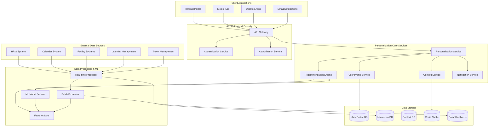
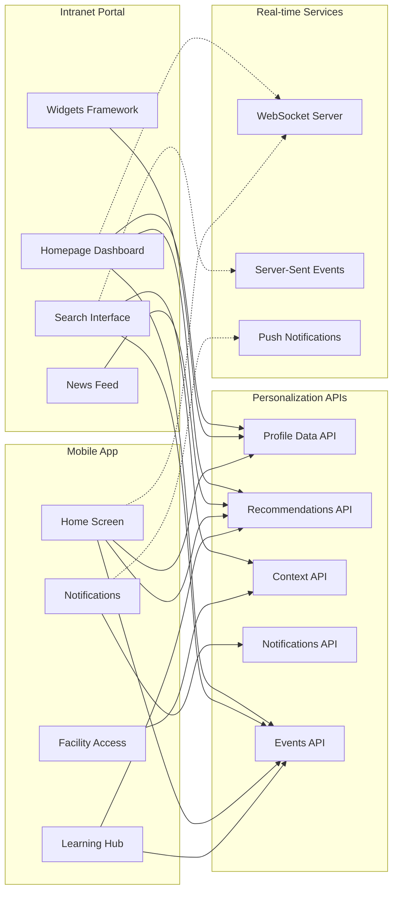
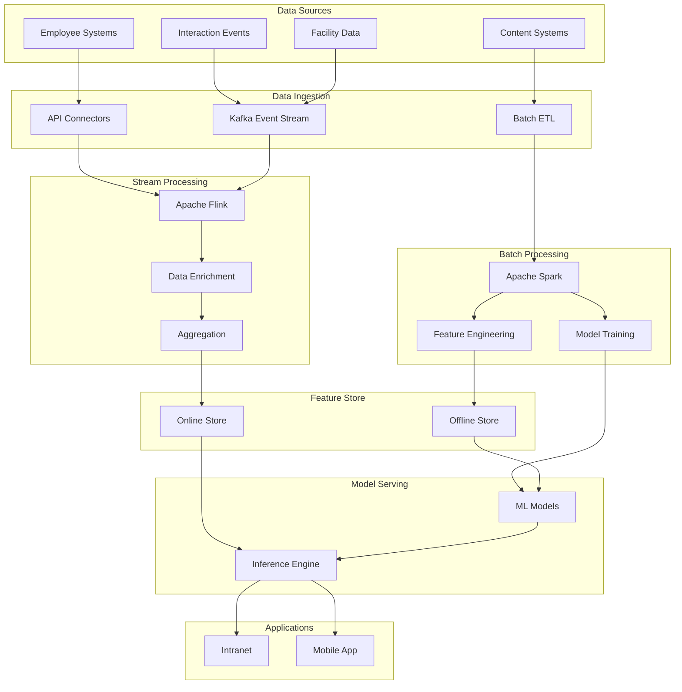
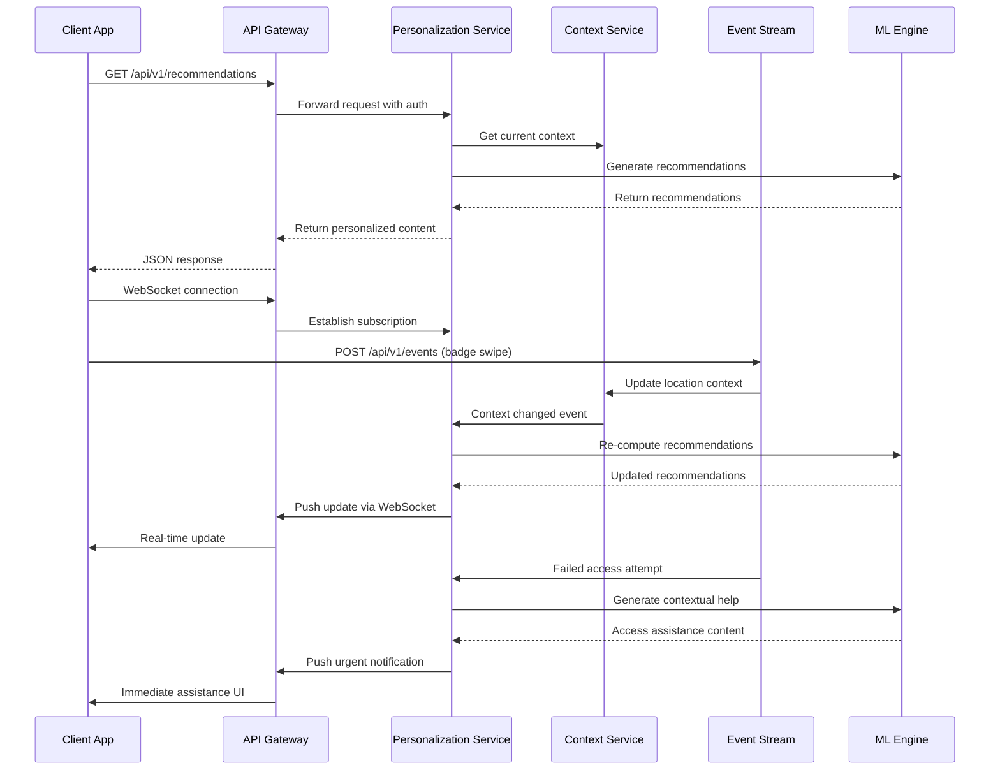
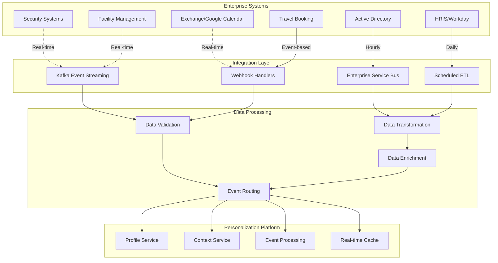
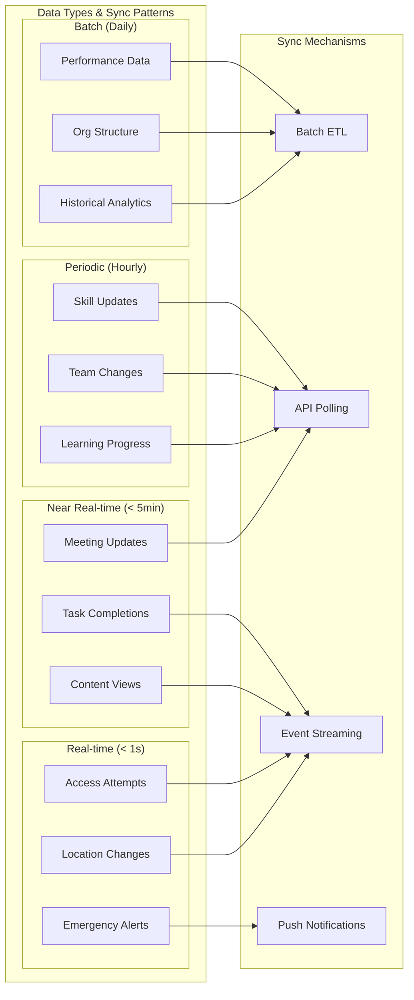
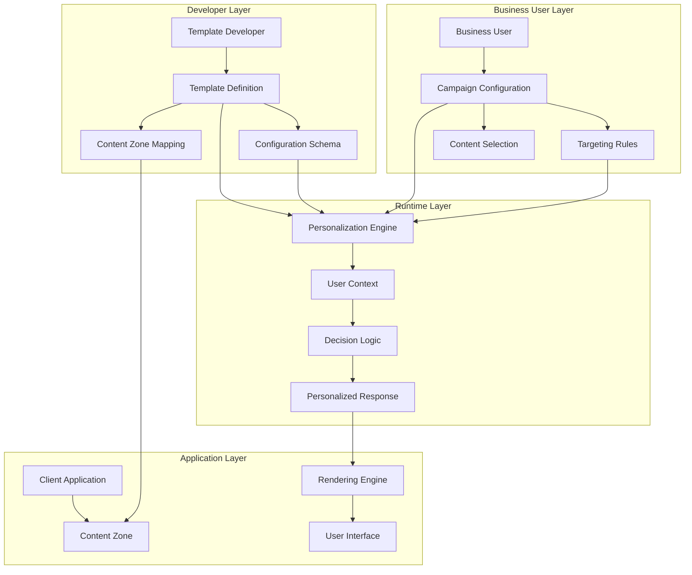

# Enterprise Employee Personalization Systems: Technical Architecture Guide

## Executive Summary

Enterprise employee personalization systems represent a critical evolution in workplace technology, requiring sophisticated architectural patterns that balance real-time responsiveness, scalability, privacy compliance, and operational reliability. This comprehensive guide provides technical leadership with proven architectural patterns, implementation strategies, and operational considerations based on extensive analysis of enterprise implementations.

**Key Business Impact**: Organizations implementing these systems report 18-23% productivity improvements with annual cost savings of $2,000-$5,000 per employee. However, success requires careful attention to architectural scalability, data governance, privacy compliance, and operational excellence.

**Critical Success Factors**: Lambda architecture for hybrid processing, microservices for organizational scale (10,000+ employees), graph databases for relationship modeling, and comprehensive privacy-by-design approaches for regulatory compliance.

## Key Concepts and Industry Terminology

### What is Employee Personalization?

Employee personalization refers to the systematic adaptation of workplace systems, content, and experiences based on individual employee characteristics, behaviors, and contexts. Unlike consumer personalization focused on purchasing behavior, employee personalization aims to optimize productivity, learning, and workplace satisfaction by delivering relevant information, tools, and opportunities at the right time and context.

**Architectural Distinction**: Employee personalization systems differ fundamentally from consumer systems in data sensitivity (employment data requires strict governance), scale characteristics (bounded user populations with complex organizational hierarchies), integration complexity (dozens of enterprise systems), and compliance requirements (GDPR, CCPA, works council regulations).

**Core Industry Terms:**
- **Recommendation Engine**: ML systems that suggest relevant content, people, or actions using collaborative filtering, content-based filtering, or hybrid approaches
- **User Profile**: Comprehensive representation of employee attributes, preferences, and behavioral patterns stored in graph or document databases
- **Context Awareness**: System ability to adapt based on real-time situational factors (temporal, spatial, social, task-based)
- **Content-Based Filtering**: Recommendations based on item characteristics and explicit user preferences, suitable for cold start scenarios
- **Collaborative Filtering**: Recommendations based on similar users' behaviors, requiring sufficient interaction data for effectiveness
- **Cold Start Problem**: Challenge of personalizing for new employees, addressed through demographic modeling, role-based defaults, and progressive profiling
- **Feature Engineering**: Process of transforming raw enterprise data into ML-ready features, critical for model performance
- **Real-time Inference**: Sub-100ms personalization decisions during user interactions, requiring optimized model serving architecture
- **Batch Processing**: Periodic computation of recommendations using complete historical data, typically daily or weekly cycles
- **A/B Testing Framework**: Systematic experimentation infrastructure for measuring personalization effectiveness and business impact

### Personalization Models and Systems

**Machine Learning Model Types:**

**Matrix Factorization Models** (SVD, NMF, ALS) decompose user-item interaction matrices to identify latent factors, enabling prediction of employee engagement with content, training, or tools. These models excel at handling sparse interaction data common in enterprise environments where employees interact with limited subsets of available resources. *Architectural Consideration*: Requires distributed computing frameworks (Spark MLlib) for large employee populations.

**Deep Learning Approaches** include neural collaborative filtering combining user and item embeddings, variational autoencoders for learning complex user representations, and recurrent neural networks (LSTM/GRU) capturing sequential patterns in employee behavior over time. *Scalability Concern*: GPU infrastructure requirements and model serving latency considerations at enterprise scale.

**Ensemble Methods** combine multiple approaches for robust recommendations. Wide & Deep models blend memorization of specific patterns with generalization across feature space, while Deep & Cross networks automatically learn feature interactions without manual engineering. *Implementation Note*: Requires sophisticated MLOps pipelines for model versioning and A/B testing.

**Graph-Based Models** leverage organizational structure and relationships. Random walks on employee-content-skill graphs discover latent connections, while Graph Neural Networks (GraphSAGE, GCN) process complex organizational hierarchies and collaboration patterns. *Technical Requirement*: Graph databases (Neo4j, Amazon Neptune) with ACID compliance for enterprise data consistency.

**Time Series and Sequential Models** capture temporal patterns in employee behavior, work cycles, and seasonal learning preferences. LSTM networks model sequential work patterns, while transformer architectures handle long-range dependencies in career progression and skill development.

**System Architecture Patterns:**

**Lambda Architecture** combines batch and real-time processing streams with immutable data storage for fault tolerance. Batch layers process complete historical data for comprehensive insights, while speed layers handle immediate interactions through Apache Kafka and Apache Flink. Serving layers merge both views for unified experiences. *Critical Implementation*: Requires careful data consistency management between speed and batch layers.

**Microservices Architecture** decomposes functionality into independent, scalable services with clear domain boundaries: user profile management, recommendation generation, content cataloging, interaction tracking, and notification delivery. Each service maintains its own data store and communicates through well-defined APIs. *Operational Complexity*: Requires sophisticated service mesh (Istio, Linkerd) for traffic management, security, and observability.

**Event-Driven Architecture** processes employee interactions as immutable event streams through Apache Kafka or AWS EventBridge, enabling real-time personalization updates and maintaining eventual consistency across distributed systems. *Design Principle*: Event sourcing provides complete audit trails essential for compliance and debugging.

**CQRS (Command Query Responsibility Segregation)** separates read and write operations, optimizing each for specific performance characteristics. Write models handle user interactions and profile updates, while read models serve personalization queries with sub-100ms latency requirements.

### Personalization Features and Dimensions

**Content Personalization Features:**
- **Topic Relevance**: Matching content to employee skills, role requirements, and current projects
- **Format Preferences**: Video vs. text vs. interactive content based on learning styles
- **Complexity Level**: Beginner, intermediate, or advanced content based on expertise
- **Language and Localization**: Content adapted to employee location and language preferences
- **Timing Optimization**: Delivering content when employees are most likely to engage

**Interface Personalization Features:**
- **Dashboard Layout**: Customized widget placement and priority based on role and usage patterns
- **Navigation Paths**: Simplified menus highlighting frequently used functions
- **Notification Preferences**: Channel selection (email, mobile, desktop) and frequency settings
- **Search Results Ranking**: Personalized ordering based on relevance and past interactions
- **Quick Actions**: Prominently displaying most-used functions and shortcuts

**Social and Collaboration Features:**
- **Expert Identification**: Recommending subject matter experts based on skills and availability
- **Team Formation**: Suggesting optimal team composition for projects
- **Mentorship Matching**: Connecting employees with appropriate mentors based on career goals
- **Knowledge Sharing**: Highlighting relevant discussions and communities
- **Peer Learning**: Connecting employees with similar learning objectives

### Employee Data Types and Sources

**Static Demographic Data:**
- **Role Information**: Job title, department, reporting structure, job level/grade
- **Location Data**: Office location, timezone, remote/hybrid status, country/region
- **Skills and Expertise**: Technical skills, certifications, years of experience, education background
- **Personal Attributes**: Language preferences, accessibility needs, working hours preferences
- **Career Information**: Hire date, previous roles, career progression, performance ratings

**Dynamic Behavioral Data:**
- **System Interactions**: Login patterns, application usage, feature adoption rates
- **Content Engagement**: Documents viewed, training completed, time spent on different content types
- **Communication Patterns**: Meeting attendance, email frequency, collaboration tool usage
- **Project Activities**: Tasks completed, project contributions, deadline adherence
- **Learning Behaviors**: Course enrollments, completion rates, knowledge assessments

**Location and Mobility Data:**
- **Travel Planning**: Booked travel dates, destinations, trip purpose, accommodation details
- **Office Presence**: Current building location, floor/zone, desk booking status
- **Access Patterns**: Badge swipes, electronic gate attempts (successful/failed), entry/exit timestamps
- **Remote Work Status**: Home office logins, VPN connections, mobile device locations
- **Desk and Room Utilization**: Hot desk bookings, meeting room reservations, workspace check-ins
- **Cross-Office Visits**: Visiting employee access requests, temporary badge assignments
- **Real-time Location**: GPS coordinates (with consent), WiFi network connections, Bluetooth beacon proximity
- **Transportation Context**: Airport/station proximity, flight delays, commute disruptions

**Contextual Data:**
- **Temporal Context**: Current time, calendar availability, project deadlines, business cycles
- **Task Context**: Active applications, current documents, workflow stage
- **Social Context**: Team composition, stakeholder relationships, organizational changes
- **Environmental Context**: Meeting room occupancy, office presence, technology constraints
- **Physical Context**: Building location, floor/zone, desk assignment, nearby colleagues
- **Mobility Context**: Travel status, commute patterns, device connectivity, access requirements

### Data Collection Mechanisms

**Explicit Data Collection:**
- **Onboarding Surveys**: Initial preference capture during employee setup
- **Preference Centers**: Self-service portals for updating notification and content preferences
- **Feedback Mechanisms**: Rating systems for content and recommendations
- **Profile Management**: Employee-controlled skill and interest updates
- **Goal Setting**: Career objectives and learning preferences

**Implicit Data Collection:**
- **Behavioral Tracking**: Click-through rates, dwell time, navigation patterns
- **Application Analytics**: Feature usage, workflow completion, error patterns
- **Communication Metadata**: Meeting participation (not content), email frequency patterns
- **Document Interactions**: Access patterns, collaboration frequency, sharing behaviors
- **System Logs**: Login times, device usage, location-based access patterns

**Integration-Based Collection:**
- **HRIS Systems**: Automated sync of role changes, location updates, organizational structure
- **Calendar Integration**: Meeting patterns, availability, travel schedules
- **Project Management Tools**: Task assignments, completion rates, collaboration patterns
- **Learning Management Systems**: Course enrollments, assessments, certification status
- **Communication Platforms**: Participation in channels, community engagement (metadata only)
- **Facility Management Systems**: Badge access logs, desk bookings, room reservations
- **Travel Management Platforms**: Trip approvals, itinerary details, expense submissions
- **Building Security Systems**: Access attempt logs, gate entry/exit events, visitor management
- **Network Infrastructure**: WiFi connections, VPN usage, device registrations, IP geolocation

### Static vs. Dynamic Data Management

**Static Data Characteristics:**
- **Low Change Frequency**: Updates monthly, quarterly, or annually
- **High Consistency Requirements**: Must be synchronized across all systems
- **Authoritative Sources**: Single source of truth typically in HRIS or directory systems
- **Examples**: Employee ID, department, job title, office location, direct manager
- **Collection Method**: Batch synchronization from authoritative systems
- **Storage Pattern**: Master data management with change tracking

**Dynamic Data Characteristics:**
- **High Change Frequency**: Updates continuously or in real-time
- **Eventual Consistency Acceptable**: Slight delays don't impact user experience significantly
- **Multiple Sources**: Captured from various interaction points
- **Examples**: Current task, active application, recent document views, notification preferences
- **Collection Method**: Event streaming and real-time capture
- **Storage Pattern**: Time-series databases with windowed aggregations

**Hybrid Data Management:**
- **Skills and Expertise**: Self-reported (static) combined with inferred competencies from activities (dynamic)
- **Preferences**: Explicit settings (static) refined by behavioral patterns (dynamic)
- **Network Relationships**: Organizational chart (static) enhanced by collaboration frequency (dynamic)
- **Project Assignments**: Formal assignments (static) with actual participation levels (dynamic)

**Data Freshness Requirements:**
- **Real-time (sub-second)**: Current location, active application, immediate availability, access gate events
- **Near real-time (minutes)**: Recent document access, meeting completion, task updates, desk check-ins
- **Hourly**: Communication patterns, daily productivity metrics, learning progress, building occupancy
- **Daily**: Skill development trends, team collaboration metrics, goal progress, travel itineraries
- **Weekly/Monthly**: Performance indicators, career development progress, organizational changes

### Technical Architecture Considerations

**Scalability Planning:**
- **Horizontal Scaling**: Design for elastic scaling across availability zones with auto-scaling groups
- **Data Partitioning**: Partition user data by organizational units or geographic regions for performance isolation
- **Caching Strategy**: Multi-tier caching (L1: Application cache, L2: Redis cluster, L3: CDN) with cache invalidation patterns
- **Database Scaling**: Read replicas, connection pooling, and query optimization for enterprise-scale concurrent users

**Performance Requirements:**
- **API Response Time**: 95th percentile < 200ms for personalization APIs, 99th percentile < 500ms
- **Recommendation Latency**: Sub-100ms for real-time recommendations, batch processing within 24-hour SLA
- **System Availability**: 99.9% uptime (8.77 hours downtime per year) with graceful degradation patterns
- **Throughput**: Support peak loads of 10,000+ concurrent users during business hours

**Data Architecture Patterns:**
- **Master Data Management**: Single source of truth for employee profiles with change data capture
- **Data Lake Architecture**: Structured, semi-structured, and unstructured data storage with data governance
- **Feature Store**: Centralized feature repository with online/offline serving for ML models
- **Data Lineage**: Complete traceability of data transformations for compliance and debugging

### Location-Based Personalization Use Cases

**Real-Time Access Management:**
When an employee's badge fails at an electronic gate, the system immediately surfaces relevant information: temporary access codes, alternative entrances, security contact details, and visitor escort procedures. Failed access attempts trigger notifications to security and facility teams while providing the employee with immediate next steps.

**Smart Workspace Recommendations:**
Based on calendar data showing meetings in specific buildings, the system proactively suggests available desks near meeting rooms, identifies nearby colleagues for impromptu collaboration, and reserves parking spaces. Integration with room booking systems enables automatic workspace recommendations that optimize travel time between meetings.

**Travel-Aware Content Delivery:**
When travel booking data indicates an employee visiting another office, the system surfaces location-specific information: local IT support contacts, building maps and access procedures, nearby amenities, cultural guidelines for international locations, and relevant local team introductions. This contextualization reduces friction for traveling employees.

**Hybrid Work Optimization:**
The system detects remote work patterns through VPN connections and home office logins, automatically adjusting notification timing for different time zones, surfacing asynchronous collaboration tools, and highlighting home-office-appropriate tasks. When employees return to office, the system emphasizes in-person collaboration opportunities and face-to-face meeting suggestions.

**Emergency and Safety Personalization:**
Real-time location data enables targeted emergency communications, with building-specific evacuation procedures, floor-based safety instructions, and location-aware emergency contacts. During business continuity events, the system can identify which employees are affected and provide relevant alternative workspace options.

## System Architecture Overview

### High-Level Architecture

The enterprise employee personalization system follows a modern microservices architecture with clear separation between data ingestion, processing, serving, and consumption layers. This design enables scalability, maintainability, and flexibility while supporting both real-time and batch personalization scenarios.



### Application Integration Architecture

This diagram shows how client applications integrate with the personalization system through standardized APIs and real-time connections.



### Data Flow Architecture

This diagram illustrates how data flows through the system from collection to personalized delivery.



### Advanced System Architecture Patterns

**Distributed System Considerations:**

The architecture typically consists of three layers working in concert with careful attention to distributed system challenges. The batch layer processes complete historical employee data—performance reviews, career progressions, skill development trends—generating comprehensive insights updated daily or weekly using Apache Spark with optimized Parquet storage formats. The speed layer handles real-time interactions like current project assignments, immediate learning recommendations, and instant notifications through Apache Kafka event streams achieving sub-100ms latency with proper partitioning strategies. The serving layer merges these views, presenting unified experiences to employees through APIs that abstract the underlying complexity while maintaining data consistency guarantees.

**Critical Architectural Decisions:**

**Consistency vs Availability Trade-offs**: Following CAP theorem principles, choose consistency over availability for critical employee data (profile, permissions) and availability over consistency for behavioral data (interaction tracking, preferences).

**Data Sovereignty**: Implement data residency controls for multinational organizations, ensuring employee data remains within required geographic boundaries with encryption in transit and at rest.

**Disaster Recovery**: Multi-region deployment with RTO (Recovery Time Objective) < 4 hours and RPO (Recovery Point Objective) < 1 hour for business continuity.

**Service Mesh Architecture**: Implement Istio or Linkerd for secure service-to-service communication, traffic management, and observability. This provides automatic TLS encryption, circuit breaker patterns, and distributed tracing essential for debugging complex personalization flows.

**Data Consistency Patterns**: Implement eventual consistency with compensation patterns for distributed transactions. Use saga patterns for long-running business processes that span multiple services (e.g., employee onboarding personalization setup).

Microservices architecture proves essential for organizations exceeding 10,000 employees, enabling independent scaling and development across teams. Target's implementation showcases this approach with Python microservices using gRPC for communication, allowing data scientists to deploy personalization models without engineering assistance. The service decomposition typically includes:

- **User Profile Service**: Manages employee demographics, preferences, and skills with event sourcing for audit trails
- **Recommendation Engine**: ML-driven suggestions with model versioning and A/B testing capabilities  
- **Activity Tracking Service**: Captures real-time interactions with batch and stream processing pipelines
- **Notification Service**: Personalized alerts with delivery optimization and preference management
- **Analytics Service**: Performance monitoring, business metrics, and continuous improvement insights
- **Configuration Service**: Feature flags, A/B test management, and template configuration with canary deployments

**Graph Database Architecture**: Graph databases, particularly Neo4j, have become indispensable for modeling organizational relationships with ACID compliance requirements. EY's implementation manages organizational hierarchies for 100,000+ employee mergers with real-time visualization and impact analysis, while NASA uses graph traversals for expertise mapping and competency-based team assembly. These systems achieve constant-time relationship traversal compared to expensive SQL joins, providing natural representation of complex employee networks and efficient "who knows what" queries essential for knowledge management.

**Critical Implementation Patterns:**
- **Multi-tenancy**: Logical data isolation for different business units or subsidiaries
- **API Versioning**: Semantic versioning with backward compatibility guarantees
- **Rate Limiting**: Adaptive rate limiting with circuit breaker patterns to prevent cascade failures
- **Security**: OAuth 2.0/OIDC with JWT tokens, API gateway security policies, and zero-trust network architecture

## Intelligent Module and Notification Surfacing

Companies determine what to surface to employees through sophisticated multi-stage ranking systems that balance relevance, urgency, and context. Microsoft's approach through the Graph API exemplifies industry best practices, using communication patterns, organizational structure, and recent interactions to order contacts by relevance while the Insights API surfaces documents based on advanced analytics throughout the workday.

The decision pipeline typically implements candidate generation through broad filtering from large content corpora, followed by feature engineering extracting signals like recency, relevance, and relationships. **Scoring models using machine learning predict likelihood of engagement**, with final ranking personalized based on individual preferences. Priority scoring incorporates urgency indicators including deadlines and stakeholder importance, relevance scores from topic matching and skill alignment, social signals from endorsements and collaboration history, and temporal patterns based on time-of-day preferences and workload cycles.

Real-time context processing handles multiple dimensions simultaneously. Time context considers meeting schedules, project deadlines, and business cycles. Location context adapts for office versus remote work and timezone considerations. Task context analyzes current applications, document types, and workflow stages. Social context factors in team composition and stakeholder relationships. Google Cloud AI demonstrates this with sub-100ms response times, event-driven updates based on calendar and application usage, and cross-platform context synchronization.

## Jobs-to-be-Done Frameworks Revolutionizing Employee Productivity

Organizations are successfully adapting Jobs-to-be-Done methodologies from consumer contexts to understand employee needs systematically. Salesforce's DesignOps team pioneered this approach internally, treating employees as customers who "hire" organizational services to accomplish specific jobs. **The framework identifies six universal job themes for knowledge workers**: accessing domain knowledge, collaborating effectively, delivering quality outcomes, learning and developing skills, staying informed about organizational changes, and managing workload efficiently.

This approach fundamentally shifts personalization from demographic-based assumptions to understanding situational needs. Employee job statements follow the format "When [situation], I want to [motivation], so I can [expected outcome]," enabling precise targeting of information and tools. For instance, "When preparing for a client presentation, I need quick access to relevant case studies and success metrics, so I can build compelling recommendations" drives specific personalization decisions about content surfacing and timing.

The distinction between task-based and role-based personalization proves critical. Task-based approaches focus on specific workflows and micro-moments of need, with contextual triggers based on current activities providing real-time content surfacing. Role-based approaches offer broader personalization aligned with job functions, supporting long-term learning paths and skill development recommendations tailored to career levels and departments.

## Data Sources and Enterprise Integration Patterns

Employee personalization systems integrate diverse data sources through sophisticated pipelines managing both real-time and batch synchronization. **HRIS systems like Workday provide foundational employee data** through REST and SOAP APIs, supporting OAuth 2.0 authentication with bulk operations processing up to 10,000 records per operation. These systems deliver core employee profiles, compensation data, performance reviews, skills matrices, and organizational hierarchies essential for personalization.

Microsoft Graph has become the de facto standard for Office 365 integration, providing unified access to calendar data, document libraries, and employee directories through a single endpoint. The API supports real-time calendar notifications via webhooks, enabling immediate adaptation to schedule changes and meeting contexts. Similarly, Google Workspace Calendar API provides OAuth 2.0 authenticated access to meeting schedules, attendee information, and video conferencing context.

Project management integrations reveal collaboration patterns critical for personalization. Atlassian's Jira REST API v3 provides issue tracking and project assignments with webhook support for real-time updates. Asana's API delivers project membership data, task completion rates, and team organization structures. These systems typically implement rate limiting between 100-1,000 requests per minute, requiring sophisticated bulk synchronization strategies including batch processing, delta synchronization for incremental updates, and intelligent caching to reduce redundant calls.

**Communication platform integration through Slack and Microsoft Teams APIs captures collaboration patterns essential for understanding employee networks**. Slack's Events API enables real-time activity monitoring while maintaining privacy through metadata analysis rather than content inspection. Microsoft Teams integration through Graph API provides channel membership, meeting attendance, and collaboration metrics integrated with the broader Microsoft ecosystem.

## Technical Approaches: Real-time versus Batch Personalization

The choice between real-time and batch processing significantly impacts system architecture and user experience. Real-time processing excels for immediate needs: employee login events triggering dashboard updates, project assignments updating skill recommendations, and training completions suggesting new learning paths. **Apache Kafka has become the standard for event streaming**, with Apache Flink or Spark Streaming handling complex event processing achieving sub-100ms latency for critical interactions.

Batch processing remains essential for computationally intensive operations including career development pathway analysis, organizational network analysis for team formation, performance prediction models, and comprehensive skill gap analysis. Apache Spark processes large-scale employee data through scheduled jobs, computing features for complex organizational metrics and integrating with data warehouses for historical analysis.

Most successful implementations adopt hybrid approaches. Feature stores like Tecton provide dual-database architectures with offline stores using columnar storage for historical computation and online stores using Redis or DynamoDB for real-time serving. This enables consistent feature computation across training and serving, supporting both batch and streaming feature generation while maintaining sub-100ms serving latency for personalization decisions.

Caching strategies prove critical for performance at scale. Multi-layer architectures implement browser caching for static assets, CDN distribution for global content delivery, API gateway caching for organizational data, application-level caching for session data, and database query result caching. **Well-designed caching achieves 90%+ hit rates for employee profile data** with sub-10ms response times for cached interactions, reducing database load by 70-80%.

## Privacy and Compliance: Navigating the Regulatory Landscape

Employee data personalization faces unique privacy challenges distinct from consumer contexts. **Under GDPR, employee consent is generally invalid due to power imbalances**, forcing organizations to rely on legitimate interest as their legal basis. This requires documented balancing tests between employer needs and employee privacy rights, with Data Protection Impact Assessments mandatory due to systematic monitoring implications.

European works councils present additional complexity, with requirements varying by country. Netherlands and Germany require explicit works council consent for any technology with surveillance potential, even if monitoring isn't the intended purpose. Invalid implementations without proper involvement risk injunctions and compensation claims. Successful approaches involve early engagement during design phases, transparent communication about data use, and regular review processes with employee representatives.

CCPA/CPRA adds California-specific requirements, with employee exemptions expiring in 2023. Employees now have rights to know data categories collected, delete personal information with exceptions, correct inaccuracies, opt-out from data sales, and limit sensitive information use. Organizations must implement granular consent mechanisms, provide easy withdrawal options, and maintain comprehensive audit trails demonstrating compliance.

Cross-border data transfers require careful consideration of adequacy decisions, Standard Contractual Clauses for non-adequate countries, and Transfer Impact Assessments. **The EU-US Data Privacy Framework provides some relief**, but organizations must still implement additional safeguards and navigate state-level privacy laws creating a patchwork of requirements.

## Case Studies: Learning from Enterprise Leaders

**Microsoft Viva represents the most comprehensive employee experience platform**, leveraging Microsoft 365 infrastructure to deliver personalized experiences across five core modules. Viva Connections provides role-based dashboards with AI-curated news feeds, while Viva Insights offers individual productivity recommendations based on work patterns. The platform processes collaboration data from Teams, SharePoint, and Outlook, achieving top-three usage among Microsoft Teams applications. Organizations like Cricket Australia report improved work-life balance metrics, while Domino's achieved significant performance improvements deploying Viva Goals across 100,000 employees.

Google's Moma internal system embodies engineering-focused design, prioritizing functionality and transparency. The platform provides iGoogle-style customizable homepages, comprehensive employee search with skills-based expert location, and experimental NEXT features using behavioral learning algorithms. **Complete visibility into company performance and individual contributions drives continuous improvement**, though this transparency requires careful cultural adaptation and privacy balance considerations.

Amazon's A to Z app demonstrates mobile-first design for frontline workers, serving 1.6 million employees across 50+ countries. The app provides personalized schedule displays, role-based dashboards distinguishing hourly from salaried employees, and targeted communications based on location and department. With 95% of hourly associates logging in daily and 98% accuracy for time tracking, the implementation showcases how basic personalization can deliver significant impact at scale.

IBM's Watson cognitive enterprise initiatives leverage AI to augment human expertise through personalized job matching, cognitive search connecting employees with relevant knowledge, and intelligent workflow automation. Healthcare applications at Manipal Hospital improved cancer treatment personalization for 200,000+ patients annually, while banking implementations reduced foreign trade inquiry response times from days to seconds, demonstrating the transformative potential of AI-driven personalization.

## Machine Learning Approaches for Workplace Relevance

Modern employee personalization systems employ sophisticated ML architectures combining multiple approaches for optimal results. **Deep learning recommendation models like Facebook's DLRM handle large-scale personalization**, while two-tower architectures separate user and item encoders for efficient similarity computation. Wide & deep models combine memorization of specific patterns with generalization across the feature space, enabling both precise and serendipitous recommendations.

Natural language processing pipelines process documents through transformer models like BERT for semantic understanding, enabling multilingual support and domain adaptation for technical content. Microsoft's implementation demonstrates query understanding with intent classification and personalized search ranking based on user history, achieving high relevance scores for internal content discovery.

Graph neural networks unlock organizational insights through talent identification based on network centrality, knowledge flow analysis understanding information propagation, and optimal team formation recommendations. **GraphSAGE architectures enable scalable sampling and aggregation for organizations with hundreds of thousands of employees**, while privacy-preserving techniques maintain individual confidentiality during analysis.

Time series analysis supports workload prediction through LSTM networks modeling sequential work patterns, seasonal decomposition identifying cyclical business patterns, and anomaly detection flagging unusual workload distributions. These models enable capacity planning, peak load prediction, and critically, employee burnout prevention through early stress indicator identification.

Reinforcement learning drives adaptive interfaces through multi-armed bandits for simple optimization, deep Q-networks for complex state-action spaces, and policy gradient methods for direct interface optimization. Challenges include balancing exploration of new features with exploitation of proven approaches, designing meaningful reward signals for employee satisfaction, and handling cold start problems for new employees through progressive profiling and similarity transfer from comparable users.

## Integration Patterns with Enterprise Systems

Successful personalization requires seamless integration with existing enterprise infrastructure through well-designed patterns. **Hub-and-spoke architectures using platforms like MuleSoft or Azure Integration Services reduce point-to-point connections**, centralizing data transformation and routing while simplifying maintenance and governance.

Event-driven architectures enable real-time synchronization through Apache Kafka or AWS EventBridge, supporting microservices communication patterns and webhook-based integration for SaaS applications. This approach proves particularly effective for capturing employee interactions and system changes as they occur, enabling immediate personalization updates.

API gateway patterns centralize authentication, rate limiting, and monitoring while providing versioning and backward compatibility essential for enterprise stability. Kong, AWS API Gateway, and Azure API Management lead this category, offering comprehensive solutions for managing complex API ecosystems connecting dozens of internal and external systems.

Data pipeline architectures vary based on requirements. ETL processes suit structured data with well-defined transformations, while ELT leverages cloud-native capabilities for flexible processing. **Change Data Capture achieves near real-time synchronization with minimal source system impact**, critical for maintaining performance in production HRIS and communication platforms.

## Metrics and ROI: Measuring Personalization Success

Organizations implementing employee personalization systems report productivity improvements of 18-23% with annual cost savings of $2,000-$5,000 per employee. **Leading indicators focus on adoption and engagement**, including Employee Net Promoter Scores exceeding 50 for high-performing implementations, participation rates above 80% for voluntary programs, and feature utilization tracking specific capability adoption.

Efficiency metrics demonstrate tangible improvements: 20-50% reduction in information search time, 15-30% improvement in task completion rates, and 25-40% increase in self-service success rates. Support ticket reductions of 20-40% translate directly to cost savings, while faster technology adoption reduces training requirements and accelerates digital transformation initiatives.

Business impact measurements encompass revenue per employee improvements, goal achievement rate increases, quality metric enhancements including reduced error rates, and innovation indicators such as idea generation and process improvement suggestions. ROI calculations must account for both direct benefits like productivity gains and indirect benefits including improved retention and faster decision-making.

Technical metrics ensure system reliability with 99.9%+ availability targets, sub-2 second response times for personalized content delivery, and comprehensive data quality monitoring. Privacy compliance metrics track consent compliance percentages, data subject request response times, and audit findings, ensuring regulatory adherence while maintaining system performance.

## Future Outlook and Recommendations

The evolution of enterprise employee personalization systems points toward increasing sophistication in AI integration, with generative AI for content creation and decision support becoming standard. **Predictive analytics will enable proactive experience optimization**, anticipating employee needs before they arise. Unified platforms are replacing point solutions, offering comprehensive employee experience management from onboarding through career development.

Organizations beginning this journey should adopt a phased approach. Foundation building in months 1-3 focuses on basic analytics, simple content-based recommendations, and establishing measurement frameworks. Enhancement phases add collaborative filtering, real-time personalization, and advanced ML models. Optimization phases introduce reinforcement learning, multi-objective optimization, and sophisticated explainability features.

Success requires balancing technical excellence with organizational readiness. Early engagement with privacy officers, works councils, and employee representatives prevents implementation roadblocks. Investment in change management and user adoption programs proves as critical as technical architecture. Organizations must also plan for long-term sustainability, including model maintenance, continuous privacy compliance, and adaptation to evolving employee expectations.

The convergence of advanced ML capabilities, comprehensive data integration, and privacy-preserving techniques creates unprecedented opportunities for enhancing employee experience and productivity. Organizations that successfully navigate technical, regulatory, and cultural challenges while maintaining focus on genuine employee value creation will achieve sustainable competitive advantages through their workforce personalization initiatives.

### Enterprise-Grade API Design and Data Exchange

**Advanced API Patterns:**

**GraphQL Federation**: For complex enterprise integrations, implement GraphQL federation to provide unified data access across multiple microservices while maintaining service autonomy. This enables clients to request exactly the data they need in a single query.

**Async API Patterns**: Implement WebSocket connections with proper connection management, heartbeat monitoring, and graceful degradation. Use Server-Sent Events (SSE) for unidirectional real-time updates with automatic reconnection logic.

**API Gateway Capabilities**:
- **Authentication/Authorization**: Integrate with enterprise identity providers (SAML, OIDC)
- **Request/Response Transformation**: Format translation between legacy and modern systems
- **Analytics and Monitoring**: Request tracking, performance metrics, and business analytics
- **Rate Limiting and Throttling**: Protect backend services from overload with adaptive algorithms

**Core Personalization APIs:**

**1. Enhanced User Profile API**
```http
GET /api/v2/profile/{userId}?include=preferences,skills,context,permissions
```

**Response with Enhanced Security and Compliance:**
```json
{
  "userId": "emp123456",
  "profile": {
    "demographics": {
      "department": "Engineering",
      "role": "Senior Developer", 
      "location": "London Office",
      "timezone": "Europe/London",
      "managerId": "emp789012",
      "costCenter": "CC-ENG-001"
    },
    "preferences": {
      "contentFormat": "video",
      "notificationChannels": ["email", "mobile"],
      "workingHours": "09:00-17:00",
      "language": "en-GB",
      "accessibility": {
        "screenReader": false,
        "colorBlind": false,
        "fontSize": "medium"
      }
    },
    "skills": [
      {
        "skill": "JavaScript",
        "level": "expert", 
        "verified": true,
        "lastUpdated": "2024-01-10T00:00:00Z",
        "verifiedBy": "emp456789"
      }
    ],
    "context": {
      "currentLocation": "home",
      "lastLogin": "2024-01-15T09:30:00Z",
      "activeProjects": ["project-alpha", "project-beta"],
      "currentDevice": "desktop",
      "securityClearance": "standard"
    },
    "permissions": {
      "dataProcessing": "legitimate_interest",
      "profileSharing": false,
      "analyticsTracking": true,
      "consentTimestamp": "2024-01-01T00:00:00Z"
    }
  },
  "metadata": {
    "version": "2.1.0",
    "lastModified": "2024-01-14T15:30:00Z",
    "dataRetentionDate": "2026-01-15T00:00:00Z"
  }
}
```

**2. Advanced Recommendations API with Explainability**
```http
POST /api/v2/recommendations
Content-Type: application/json
Authorization: Bearer <jwt_token>
```

**Request with Enhanced Context:**
```json
{
  "userId": "emp123456",
  "context": {
    "location": {
      "building": "london-office",
      "floor": "3",
      "zone": "west-wing",
      "coordinates": {"lat": 51.5074, "lng": -0.1278}
    },
    "temporal": {
      "currentTime": "2024-01-15T14:30:00Z",
      "timeZone": "Europe/London",
      "businessHours": true,
      "quarterPeriod": "Q1"
    },
    "device": {
      "type": "mobile",
      "os": "iOS",
      "version": "17.2",
      "capabilities": ["push_notifications", "camera", "location"]
    },
    "session": {
      "duration": 1800,
      "pageViews": 5,
      "lastInteraction": "content_view",
      "referrer": "email_campaign"
    }
  },
  "requestTypes": ["content", "actions", "people", "learning"],
  "options": {
    "maxResults": 10,
    "includeExplanations": true,
    "diversityBoost": 0.3,
    "experimentVariant": "homepage_test_v2"
  }
}
```

**Response with Explainability and Confidence Scores:**
```json
{
  "recommendations": {
    "content": [
      {
        "id": "content-789",
        "type": "article",
        "title": "New JavaScript Features in 2024",
        "score": 0.92,
        "confidence": 0.87,
        "explanation": {
          "primary_reason": "matches_expertise",
          "factors": [
            {"factor": "skill_javascript", "weight": 0.4},
            {"factor": "recent_activity", "weight": 0.3},
            {"factor": "peer_engagement", "weight": 0.2}
          ]
        },
        "metadata": {
          "contentType": "technical_article",
          "readTime": "8 minutes",
          "difficulty": "intermediate",
          "publishDate": "2024-01-10T00:00:00Z"
        }
      }
    ],
    "actions": [
      {
        "id": "book-desk-london-3f",
        "type": "facility_booking",
        "title": "Book desk for tomorrow (3F West)",
        "score": 0.88,
        "urgency": "medium",
        "explanation": {
          "primary_reason": "calendar_analysis",
          "factors": [
            {"factor": "upcoming_meetings", "weight": 0.5},
            {"factor": "preferred_location", "weight": 0.3},
            {"factor": "desk_availability", "weight": 0.2}
          ]
        },
        "actionData": {
          "deskId": "3F-W-042",
          "availableTime": "08:00-18:00",
          "amenities": ["monitor", "docking_station", "whiteboard"]
        }
      }
    ]
  },
  "metadata": {
    "requestId": "req-abc123",
    "modelVersion": "v3.2.1",
    "responseTime": "87ms",
    "experimentId": "homepage_test_v2",
    "cacheable": true,
    "cacheExpiry": "2024-01-15T15:00:00Z"
  }
}
```

**3. Batch Personalization API for High-Volume Operations**
```http
POST /api/v2/recommendations/batch
```

**Request for Multiple Users:**
```json
{
  "requests": [
    {
      "userId": "emp123456",
      "context": {...},
      "requestTypes": ["content", "actions"]
    },
    {
      "userId": "emp789012", 
      "context": {...},
      "requestTypes": ["learning"]
    }
  ],
  "options": {
    "async": true,
    "callbackUrl": "https://client.example.com/personalization/callback",
    "priority": "normal"
  }
}
```

**4. A/B Testing and Feature Flag API**
```http
GET /api/v2/experiments/{userId}?context=homepage
```

**Response:**
```json
{
  "experiments": [
    {
      "experimentId": "homepage_layout_v3",
      "variant": "treatment_b",
      "features": {
        "newDashboardLayout": true,
        "enhancedSearchUI": false,
        "recommendationCarousel": true
      },
      "metadata": {
        "startDate": "2024-01-01T00:00:00Z",
        "endDate": "2024-02-01T00:00:00Z",
        "confidence": 0.95
      }
    }
  ]
}
```

**5. Privacy and Consent Management API**
```http
PUT /api/v2/privacy/{userId}/consent
```

**Request:**
```json
{
  "consents": {
    "dataProcessing": "granted",
    "profileSharing": "denied", 
    "analyticsTracking": "granted",
    "marketingCommunications": "denied"
  },
  "legalBasis": "legitimate_interest",
  "timestamp": "2024-01-15T14:30:00Z",
  "ipAddress": "192.168.1.100",
  "userAgent": "Mozilla/5.0..."
}
```

### Real-Time Communication Architecture

For immediate personalization updates, the system supports multiple real-time communication patterns:



### Integration Patterns for Enterprise Systems

The personalization system integrates with existing enterprise infrastructure through multiple patterns optimized for different data types and update frequencies:



### Application-Specific Integration Examples

**Intranet Portal Integration:**

The intranet portal integrates through a JavaScript SDK that handles authentication, context tracking, and real-time updates:

```javascript
// Initialize personalization SDK
const personalizer = new PersonalizationSDK({
  apiEndpoint: 'https://api.company.com/personalization',
  websocketEndpoint: 'wss://api.company.com/personalization/ws',
  userId: getCurrentUser().id,
  context: {
    application: 'intranet',
    page: 'homepage'
  }
});

// Load personalized dashboard widgets
async function loadDashboard() {
  const widgets = await personalizer.getWidgets({
    context: {
      device: detectDevice(),
      location: await getCurrentLocation(),
      timeOfDay: new Date().getHours()
    }
  });
  
  renderWidgets(widgets);
}

// Track user interactions
function trackInteraction(element, action) {
  personalizer.trackEvent({
    eventType: 'ui_interaction',
    elementId: element.id,
    action: action,
    timestamp: new Date().toISOString()
  });
}

// Handle real-time updates
personalizer.onUpdate((update) => {
  switch(update.type) {
    case 'urgent_notification':
      showUrgentAlert(update.data);
      break;
    case 'widget_refresh':
      refreshWidget(update.widgetId, update.data);
      break;
    case 'context_change':
      updateUIForContext(update.context);
      break;
  }
});
```

**Mobile App Integration:**

The mobile app uses a native SDK optimized for mobile constraints and offline scenarios:

```swift
// Swift iOS implementation
class PersonalizationManager {
    private let apiClient: PersonalizationAPIClient
    private let localCache: CoreDataCache
    
    func loadHomeScreen() async throws -> HomeScreenConfig {
        let context = await buildContext()
        
        // Try network first, fallback to cache
        do {
            let config = try await apiClient.getHomeScreenConfig(
                userId: UserManager.shared.currentUserId,
                context: context
            )
            await localCache.store(config)
            return config
        } catch {
            return await localCache.getLastKnownConfig()
        }
    }
    
    private func buildContext() async -> PersonalizationContext {
        return PersonalizationContext(
            location: await LocationManager.shared.currentLocation,
            connectivity: NetworkMonitor.shared.connectionType,
            battery: UIDevice.current.batteryLevel,
            timeOfDay: Date(),
            lastAppUsage: AppUsageTracker.shared.getLastUsage()
        )
    }
    
    func trackFacilityAccess(success: Bool, location: String) {
        apiClient.trackEvent(
            event: FacilityAccessEvent(
                success: success,
                location: location,
                timestamp: Date(),
                deviceId: UIDevice.current.identifierForVendor?.uuidString
            )
        )
    }
}
```

### Data Synchronization Strategy

The system handles different data synchronization requirements based on criticality and update frequency:



This architecture ensures that applications can deliver personalized experiences with appropriate latency guarantees while maintaining system scalability and reliability. The API design supports both simple request-response patterns and complex real-time scenarios, enabling rich personalization across web, mobile, and desktop applications.

## Salesforce Personalization Architecture Patterns

### Key Concepts from Salesforce Marketing Cloud Personalization

Salesforce's approach to personalization provides valuable insights into how enterprise systems can structure developer-business user collaboration and template-driven personalization. Their architecture demonstrates several key patterns that are particularly relevant for employee personalization systems.

**Core Salesforce Concepts:**

**Templates and Campaigns**: Salesforce separates the technical implementation (templates) from business configuration (campaigns). Templates define what personalization options are available, while campaigns allow business users to configure specific targeting rules, content variations, and A/B testing scenarios without requiring developer intervention.

**Content Zones**: Applications define specific "content zones" where personalization can appear. Templates can target specific content zones, ensuring that personalization appears in appropriate locations and contexts within applications.

**Event-Driven Architecture**: The Event API processes real-time user interactions and returns personalized campaigns. Applications send behavioral data through events, and the personalization engine responds with contextually relevant content and recommendations.

**Server-Side vs Client-Side Rendering**: Salesforce supports both web templates (client-side rendering) and server-side templates (JSON payload delivery). This enables applications to choose the most appropriate rendering approach based on technical constraints and performance requirements.

### Template-Driven Configuration Architecture

Salesforce's template system demonstrates how to balance developer control with business user flexibility:



### Developer-Defined Personalization Options

Following Salesforce's pattern, developers define templates that specify exactly what business users can configure:

**Template Configuration Schema Example:**
```typescript
// Server-side template configuration
export interface EmployeeWidgetTemplate {
  // Developer-controlled: Available widget types
  widgetTypes: "quick-actions" | "learning-recommendations" | "team-updates";
  
  // Business user configurable: Content filtering
  contentFilters: {
    department?: string[];
    role?: string[];
    skillLevel?: "beginner" | "intermediate" | "advanced";
    maxItems: number; // Developer can set min/max bounds
  };
  
  // Developer-controlled: Available content zones
  contentZone: "homepage-primary" | "sidebar" | "dashboard-footer";
  
  // Business user configurable: Targeting rules
  targetingRules: {
    location?: string[];
    workingHours?: boolean;
    deviceType?: "desktop" | "mobile" | "any";
    userSegments?: string[];
  };
  
  // Developer-controlled: Template behavior
  refreshInterval: number;
  fallbackContent: string;
  analyticsTracking: boolean;
}
```

**Recommendations Configuration** (following Salesforce RecommendationsConfig pattern):
```typescript
import { RecommendationsConfig, recommend } from "personalization-engine";

export class LearningRecommendationsTemplate {
  // Developer defines available recommendation types
  @RecommendationsConfig({
    itemTypes: ["course", "article", "video", "certification"],
    maxItems: { min: 1, max: 10, default: 5 },
    algorithms: ["collaborative", "content-based", "skills-gap"]
  })
  public recommendations: RecommendationSettings;
  
  // Business users can configure within developer-defined constraints
  public async getRecommendations(context: EmployeeContext) {
    return await recommend({
      userId: context.employeeId,
      itemType: this.recommendations.selectedItemType,
      maxItems: this.recommendations.maxItems,
      algorithm: this.recommendations.algorithm,
      filters: {
        skillLevel: context.currentSkillLevel,
        department: context.department,
        careerGoals: context.careerGoals
      }
    });
  }
}
```

### Application Integration Pattern

Applications integrate with the personalization system through a structured request-response pattern:

**Event Submission and Campaign Response:**
```javascript
// Application sends contextual event
const eventData = {
  userId: "emp123456",
  contentZones: ["homepage-hero", "sidebar-recommendations"],
  context: {
    location: "London-Office-3F",
    currentApp: "intranet",
    timeOfDay: "morning",
    meetingSchedule: "busy",
    currentProjects: ["project-alpha", "project-beta"]
  },
  interaction: {
    type: "page_view",
    page: "employee-portal-home",
    timestamp: new Date().toISOString()
  }
};

// Personalization engine response
const response = {
  campaigns: [
    {
      contentZone: "homepage-hero",
      templateId: "quick-actions-template",
      payload: {
        title: "Good Morning! Ready for your day?",
        actions: [
          {
            id: "book-meeting-room",
            title: "Book meeting room for 2pm",
            priority: 1,
            reason: "Based on your calendar"
          },
          {
            id: "complete-timesheet",
            title: "Submit weekly timesheet",
            priority: 2,
            reason: "Due today"
          }
        ],
        theme: "morning-productive"
      }
    },
    {
      contentZone: "sidebar-recommendations",
      templateId: "learning-recommendations",
      payload: {
        courses: [
          {
            id: "advanced-javascript-patterns",
            title: "Advanced JavaScript Patterns",
            progress: 0,
            estimatedTime: "2 hours",
            relevanceScore: 0.92
          }
        ],
        reason: "Based on your current project technology stack"
      }
    }
  ],
  metadata: {
    requestId: "req-abc123",
    processingTime: "45ms",
    experimentsActive: ["homepage-layout-test-v2"]
  }
};
```

### Business User Campaign Configuration

Business users configure campaigns through a UI that reflects the developer-defined template constraints:

**Campaign Configuration Interface:**
```json
{
  "campaignId": "morning-productivity-boost",
  "templateId": "quick-actions-template",
  "configuration": {
    "targeting": {
      "timeOfDay": ["morning"],
      "location": ["office"],
      "workload": ["busy", "moderate"],
      "roles": ["developer", "designer", "product-manager"]
    },
    "content": {
      "maxActions": 3,
      "priorityRules": [
        {
          "condition": "hasUpcomingMeeting",
          "action": "room-booking",
          "priority": 1
        },
        {
          "condition": "timesheetDue",
          "action": "timesheet-reminder",
          "priority": 2
        }
      ],
      "theme": "professional"
    },
    "schedule": {
      "active": true,
      "startDate": "2024-01-15",
      "endDate": "2024-03-15",
      "timeWindows": ["08:00-10:00"]
    }
  },
  "abTesting": {
    "enabled": true,
    "variants": [
      {
        "name": "control",
        "weight": 50,
        "theme": "standard"
      },
      {
        "name": "treatment",
        "weight": 50,
        "theme": "morning-productive"
      }
    ]
  }
}
```

This approach ensures that developers maintain technical control over what personalization is possible and how it integrates with applications, while empowering business users to configure targeting, content selection, and optimization strategies without requiring technical expertise. The template system provides a clear contract between technical implementation and business configuration, enabling rapid iteration and testing of personalization strategies.

### Operational Excellence and Monitoring

**Comprehensive Observability Stack:**

**Application Performance Monitoring (APM)**: Implement distributed tracing with OpenTelemetry or Datadog APM to track request flows across microservices. Monitor key metrics including p95/p99 latency, error rates, and throughput.

**Business Metrics Dashboard**: Track personalization effectiveness metrics:
- **Click-through Rates**: Measure engagement with personalized recommendations
- **Conversion Rates**: Track completion of suggested actions (e.g., training enrollment, facility booking)
- **User Satisfaction**: Net Promoter Score (NPS) and satisfaction surveys
- **Productivity Metrics**: Time saved on information discovery, task completion rates

**ML Model Monitoring**: Implement MLOps practices for model performance tracking:
- **Model Drift Detection**: Monitor input data distribution changes over time
- **Prediction Quality**: Track recommendation precision, recall, and relevance scores
- **A/B Testing Framework**: Statistical significance testing for model improvements
- **Feature Importance Tracking**: Monitor which features drive personalization decisions

**Alert Management**: Configure intelligent alerting with escalation policies:
- **Performance Degradation**: Response time > 500ms, error rate > 1%
- **Data Quality Issues**: Missing critical employee data, stale recommendations
- **Security Incidents**: Unusual access patterns, failed authentication attempts
- **Business Impact**: Significant drops in user engagement or satisfaction

**Capacity Planning**: Implement predictive scaling based on usage patterns:
- **Seasonal Patterns**: Higher usage during onboarding periods, quarterly reviews
- **Geographic Scaling**: Follow-the-sun deployment patterns for global organizations
- **Event-Driven Scaling**: Scale up during company-wide announcements or emergency communications

### Security Architecture

**Zero Trust Security Model**: Implement comprehensive security controls:

**Identity and Access Management**:
- **Multi-Factor Authentication**: Required for all administrative access
- **Role-Based Access Control (RBAC)**: Granular permissions based on job functions
- **Attribute-Based Access Control (ABAC)**: Context-aware access decisions
- **Privileged Access Management**: Secure access to production systems with session recording

**Data Protection**:
- **Encryption at Rest**: AES-256 encryption for all stored data
- **Encryption in Transit**: TLS 1.3 for all network communications
- **Key Management**: Hardware Security Modules (HSM) or cloud key management services
- **Data Loss Prevention**: Monitor and prevent unauthorized data exfiltration

**Network Security**:
- **Service Mesh Security**: Mutual TLS between all microservices
- **Network Segmentation**: Isolated subnets for different security zones
- **Web Application Firewall**: Protection against OWASP Top 10 vulnerabilities
- **DDoS Protection**: Cloud-based mitigation for volumetric attacks

**Compliance and Auditing**:
- **Audit Logging**: Immutable audit trails for all data access and modifications
- **Compliance Automation**: Automated checks for GDPR, SOX, HIPAA requirements
- **Data Retention Policies**: Automated data lifecycle management
- **Regular Security Assessments**: Penetration testing and vulnerability scanning

### Implementation Roadmap

**Phase 1: Foundation (Months 1-3)**
- Core infrastructure setup with basic personalization capabilities
- Essential integrations (HRIS, calendar, basic content systems)
- MVP recommendation engine with simple algorithms
- Basic privacy controls and consent management

**Phase 2: Enhanced Capabilities (Months 4-6)**
- Advanced ML models with real-time inference
- Complete enterprise system integrations
- Mobile app personalization
- Comprehensive analytics and A/B testing framework

**Phase 3: Advanced Features (Months 7-12)**
- Graph-based relationship modeling
- Cross-channel personalization
- Advanced location-based services
- Predictive analytics and proactive recommendations

**Phase 4: Optimization and Scale (Months 12+)**
- Multi-region deployment
- Advanced ML techniques (deep learning, reinforcement learning)
- Federated learning for privacy-preserving personalization
- AI-driven business insights and recommendations

### Risk Management and Mitigation

**Technical Risks**:
- **Vendor Lock-in**: Use cloud-agnostic technologies and maintain multi-cloud capabilities
- **Data Quality**: Implement comprehensive data validation and cleansing pipelines
-